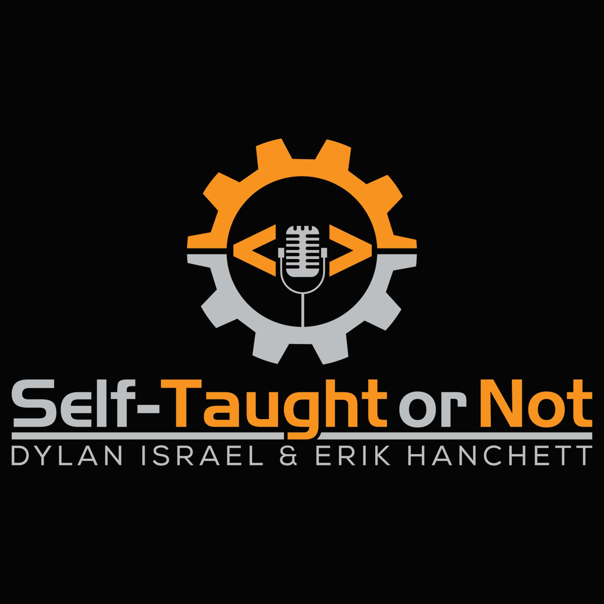

Did you ever wonder if it was possible to teach yourself how to code and then land a six-figure job?

Dylan Israel accomplished this within five years.

When I first considered learning how to code, I did not personally know any web developers. Also, no one else that I knew was interested in learning how to become one. So I started a self-taught coding journey on my own.

I researched colleges, boot camps, and online coding schools. For me, the most viable option was an online course.

After deciding on what learning direction to take, I looked into the certifications offered online. However, I wasn't sure if a web developer certification was worth attaining.

Then, I came across this video. It inspired me to start learning and to earn the [Free Code Camp](https://freecodecamp.org) Responsive Web Design  certification.

[Is FreeCodeCamp Worth It? Ask A Dev. Episode 40](https://www.youtube.com/watch?v=O-h4i1ErDD4)

<iframe width="853" height="480" src="https://www.youtube.com/embed/O-h4i1ErDD4" frameborder="0" allow="accelerometer; autoplay; clipboard-write; encrypted-media; gyroscope; picture-in-picture" allowfullscreen></iframe>

#

 Since then, I've been following Dylan's YouTube channel [Coding Tutorials 360](https://www.youtube.com/user/pizzapokerguy87). I find it to be educating, informative, and entertaining.

 ---

#
### Self-Taught or Not Podcast

Dylan is also a host, along with [Erik Hanchett](https://www.youtube.com/c/programwitherik), on a podcast titled [Self-Taught or Not](https://www.selftaughtornot.com).

I've learned so much about the programming industry from the Self-Taught or Not podcast. 

Since I am a self-taught programmer and currently not employed as a developer, this program gives me great insight into the industry. 

It is great to hear the perspective of both a self-taught developer and a traditionally trained developer on a broad range of topics covered in the podcast.

I've listened to both seasons that they released, and I am looking forward to the upcoming third season.

---

Recently, Amazon hired Dylan, offering him a six-figure salary. It is awe-inspiring. 

Since Dylan is self-taught, it shows what is possible for other aspiring self-taught developers.

Dylan has courses available on Scrimba, Thinkster, SkillShare, & Udemy.

---

#

Dylan's latest course is a festive one, and there is still time to get in on the fun! 

Check out Dylan's latest course, "[24 days if JavaScriptmas](https://scrimba.com/learn/adventcalendar)" available now on [Scrimba](https://scrimba.com/). 

### See the details below:
####*24 days of #JavaScriptmas*

*Level up your JavaScript skills with a daily coding challenge from December 1st to 24th, 2020. Every day, we'll pick a winner who gets Scrimba Pro for a year (worth $150). On Christmas Eve, a winner gets $1,000!*

---

### Conclusion
Dylan is an excellent teacher. You can learn a lot from him, and he continues to be an inspiration for myself and many other aspiring web developers.

**Dylan's Website:** [http://dylanisrael.com](http://dylanisrael.com)