## With Scrimba, you don't just learn how to code. You also become part of a community.

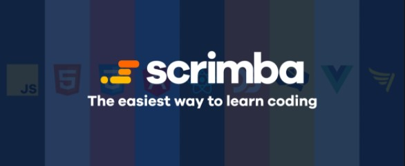

### What is Scrimba?  
Scrimba is an online coding school that offers free courses as well as paid. 

I've been a member for quite some time now, so I was one of the first members to enroll for their new "[Front-End Developer Carrer Path](https://scrimba.com/learn/frontend)." 

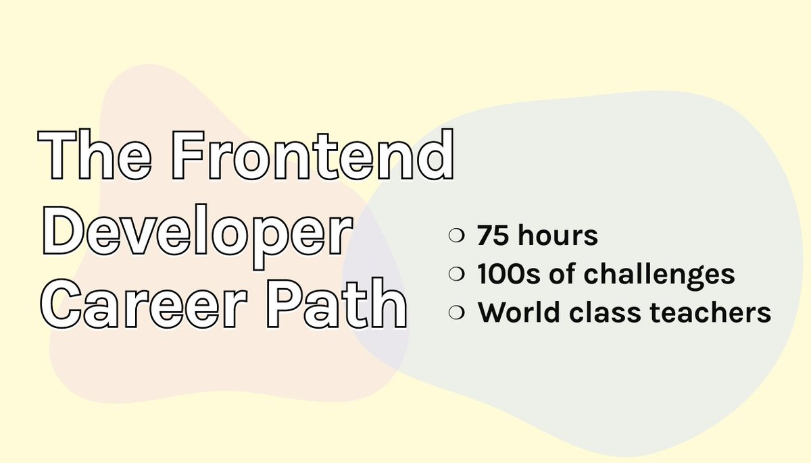

Scrimba awards Students with a certificate and a graduate badge upon completing the Front-End Developer Carrer Path. I am looking forward to showcasing them in my portfolio.

I am currently halfway through this career path, and I have already completed many of their courses.

---
### Scrimba has a unique and engaging learning platform.
Scrimba has an exclusive and unique platform for online learning. They call them "scrims."

A "scrim" is an instructional coding video that can be paused and edited by a user. The user can then save the edited code they created for use later and then continue the screencast.
<!-- [Scrimba Screen cast](https://scrimba.com/scrim/cJpvbMUB) -->

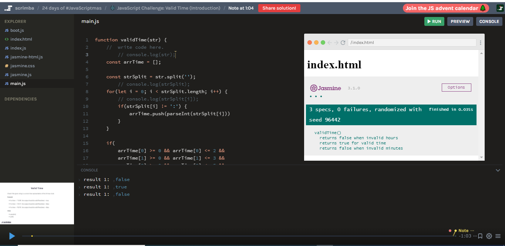

[Scrimba's screencasts](https://scrimba.com/scrim/cJpvbMUB) are remarkable. It truly is, as they advertise, a next-generation platform for learning how to code. 

While I'm learning on other coding platforms, I find myself frequently "clicking" on their coding videos, expecting them to stop so that I can edit the code. Scrimba has spoiled me! 

---

### They have exceptional teachers.
Scrimba has recruited top YouTube content creators to teach their courses. To name a few, you will find talents such as **Gary Simon, Kevin Powell, Ania Kubow, Cassidy Williams, James Quick, Jesse Hall,** and of course, you will find my favorite teacher, **Dylan Israel!**

---

### They have a thriving Discord community.

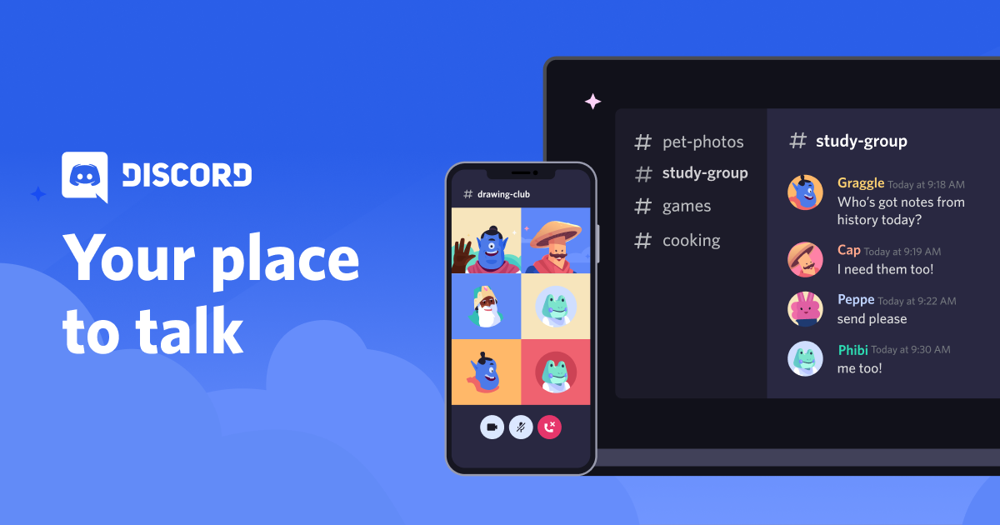

What is [Discord](https://discord.com/)? Discord is an application that provides voice, video, and text for its users to communicate. People use it to chat, hang out, and stay close with their friends and communities.

So far, I'm having an excellent experience with the Scrimba Discord community. 

To encourage student participation on their Discord channel, they award weekly medals to each study group. The more each group gets engaged on their Discord channel by posting, sharing, and helping each other, the higher the rank medal they receive. 

*This week our study group "The Booleans" won our first gold medal!*

---

### They have a friendly and encouraging staff.
Scrimba also has friendly and encouraging staff.

Leanne is on their Discord channel daily, helping and encouraging students. She deserves a raise!

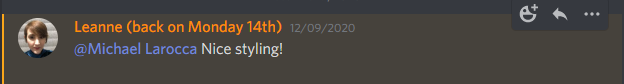

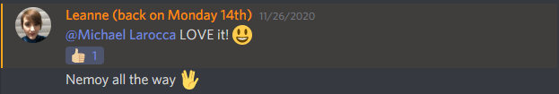

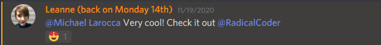

On several occasions, Leanne brought my work to the teachers' attention and the CEO **Per Borgen**! As a result, my projects were reviewed and positively commented on, which is very encouraging!

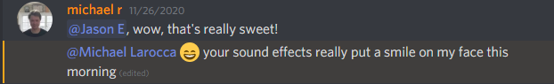

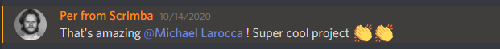

Booker from Scrimba took the time to review my code from one of their challenge projects, provide encouraging feedback, and then directed me to his instructional videos to further study the topics. Per Borgen, you also need to give Booker a raise!

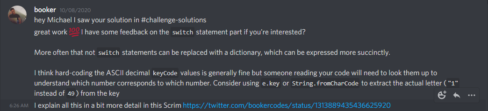

---

### Scrimba's weekly challenges.
You can also sign up for and take part in Scrimba's weekly challenges. When you subscribe to them, they send a weekly coding challenge to your inbox.

| Date: | My submitted weekly coding challenges |
|--------|---------------------------------------|
|11/25/2020|[CSS panels (Star Trek - Theme)](https://twitter.com/MikeJudeLarocca/status/1331819008052645889?s=20)             |
|11/18/2020|[Short Changed (Star Wars - Theme)](https://twitter.com/MikeJudeLarocca/status/1329288013185216517?s=20)             |
|11/11/2020|[Magical Squares](https://twitter.com/MikeJudeLarocca/status/1326715836518850560?s=20)       |
|11/04/2020|[Responsive Content](https://twitter.com/MikeJudeLarocca/status/1324172887041941504?s=20)    |
|10/28/2020|[Logo Editor](https://twitter.com/MikeJudeLarocca/status/1321635633023078406?s=20)           |

I had an incredible experience while taking part in one of the weekly challenges, which I will elaborate on in another post. The result was that my challenge project received over [1,000 views on Twitter](https://twitter.com/MikeJudeLarocca/status/1326715836518850560?s=20)!
 
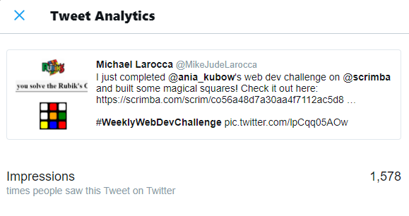

---

### Scrimba offers several free courses.
As well as paid courses, Scrimba also offers several free ones. So If you are not yet a Scrimba student, please consider enrolling today! 

If you are already a member and agree with my review of Scrimba, please share this article to help promote them!

---

### Key Points 
  * Scrimba has a unique and engaging learning platform. 
  * They have exceptional teachers. 
  * They have a thriving Discord community.
  * They have a friendly and encouraging staff.
  * They offer weekly challenges to help reinforce your learning.
  * Scrimba offers several free courses.

---  

### Special Event! 
Scrimba teacher Dylan Israel's latest course is a festive one, and there is still time to get in on the fun! 

Check out his latest course, "[24 days of JavaScriptmas](https://scrimba.com/learn/adventcalendar)," available now on Scrimba.

#### See the details below:
24 days of #JavaScriptmas
Level up your JavaScript skills with a daily coding challenge from December 1st to 24th, 2020. Every day, we'll pick a winner who gets Scrimba Pro for a year (worth $150). In addition to the daily prize, we'll hand out a Grand Prize of $1000 along with a lifetime Pro membership on Scrimba on Christmas Eve!

<!-- | Date     | My JavaScriptmas submissions (I'm adding daily!)|
|:--------:|:-----------------------------------------------:|
|12/01/2020|                                                 |
|12/02/2020|                                                 |
|12/03/2020|                                                 | -->

---

**Get a 20% Discount with This Affiliate Link!**

Use this [affiliate link](https://scrimba.com/?via=MichaelLarocca) for a special 20% discount! (If a higher discount is currently available, that will be applied instead.)
- **Important:** This discount is for new accounts only.
- Click the link to explore the new Scrimba 2.0!
- Create an account, and you can upgrade to pro content, where you should see the 20% discount listed.

**Disclosure**: This article contains affiliate links. I may earn a commission on any purchases made through these links at no extra cost to you. Your support helps me continue producing valuable content. Thank you!

---

### Conclusion
Scrimba has created a unique and inclusive learning environment. Their screencast technology makes learning to code more interactive, and they have a thriving Discord community that provides encouragement, collaboration, and support.

Scrimba also has exceptional staff and teachers, making learning to code with them an enjoyable experience.
