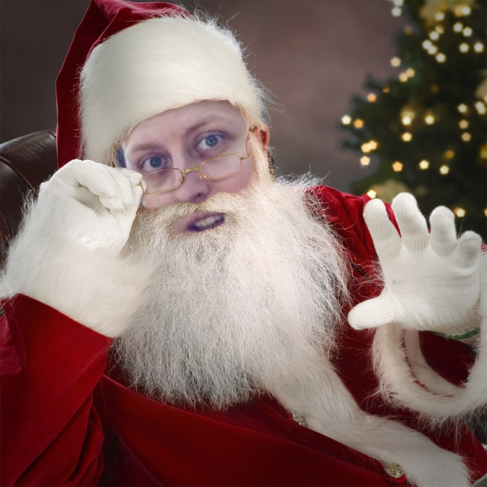

## What is JavaScriptmas? [JavaScriptmas](https://scrimba.com/learn/adventcalendar) is a twenty-four-day coding course created by [Scrimba](https://scrimba.com/).


 
### The JavaScriptmas course is a brilliant idea. I'll explain why I believe so with a few questions and answers.

---

**Question**: Would you like to take part in a twenty-four-day coding challenge that progressively gets more difficult, which will help you become a better web developer?

**Answer**: *No.*

---
**Question**: Would you like to participate in a festive twenty-four-day event, where you can sit down and code with your favorite holiday drink, which will help you become a better web developer?

**Answer**: *Maybe.*

---
**Question**: Did we mention a daily raffle, where participants could win a one-year membership, and a grand prize winner awarded with a $1,000 and lifetime membership to Scrimba?

**Answer**: *YES!!! I want to participate!*

---


<!-- [Twitter Link](https://twitter.com/perborgen/status/1338462544143540227) -->
<!-- 
<blockquote class="twitter-tweet">

<p lang="en" dir="ltr">&quot;While I&#39;m learning on other coding platforms, I find myself frequently &quot;clicking&quot; on their coding videos, expecting them to stop so that I can edit the code. Scrimba has spoiled me!&quot;<br><br>That&#39;s one of the best Scrimba reviews I&#39;ve ever read, <a href="https://twitter.com/MikeJudeLarocca?ref_src=twsrc%5Etfw">@MikeJudeLarocca</a>. Thank you! 🙏 <a href="https://t.co/Mjk5qOfdck">https://t.co/Mjk5qOfdck</a></p>&mdash; Per Harald Borgen (@perborgen) <a href="https://twitter.com/perborgen/status/1338462544143540227?ref_src=twsrc%5Etfw">December 14, 2020</a>

</blockquote>

 <script async src="https://platform.twitter.com/widgets.js" charset="utf-8"></script> -->

 #### **Scrimba has once again impressed and inspired me! You can read my full [Scrimba review](https://selftaughttxg.com/2020/12-20/Review-Scrimba/) on my 12/13/2020 post.**


#### *"That&#39;s one of the best Scrimba reviews I&#39;ve ever read, <a href="https://twitter.com/MikeJudeLarocca?ref_src=twsrc%5Etfw">@MikeJudeLarocca</a>. Thank you! 🙏 "*
###### &mdash; Per Harald Borgen, CEO of Scrimba <a href="https://twitter.com/perborgen/status/1338462544143540227?ref_src=twsrc%5Etfw">December 14, 2020</a></blockquote>
---


### My favorite challenge
***Day 8, The Rolling Dice***


My favorite challenge was The Rolling Dice. In this challenge, we needed to create a working rolling die.

To pass the challenge, we had to program the die to roll every time a user clicked it. When the program runs, a written message displays the rolled number, and the die reflects the new number.

As a bonus challenge, they instructed us to improve the overall style. I was delighted to see that Leanne from Scrimba complimented my styling!


I enjoyed this challenge because I created something that I can incorporate into a JavaScript game!

---


### My hardest challenge
***Day 13, (Extract Each Kth)***

<!-- #### W.T.F. (What, This Function?) -->

I was on a winning streak until I hit "**Lucky 13**". It was a challenge that I was trying to solve by comparing two arrays.

The first array was already provided and had the numbers **1** through **10**. The second array I created, with a formula, contained numbers **3**, **6**, and **9**.
```javascript
	const numberDivide = index /  nums.length * 10;

    for(let i = 0; i < numberDivide; i++) {
        arrayCompare.push(total + numberDivide);
        total += numberDivide;
    }
    // arrayCompare now equals [3,6,9]
```

To solve the challenge, we had to return an array containing the numbers from the first provided array that **excluded** specific numbers; in this case, numbers **3**, **6**, and **9**. The result needed to be:
```javascript
	arrayAnswer = [1,2,4,5,7,8,10]
```

Over and over again! **W.T.F.?** Which in this case represents, "Which, This Function?" I keep trying various functions to solve the problem. 

Eventually, I solved the challenge using the method **includes()**.
```javascript
	let checkForNumbers = arrayCompare.includes(nums[i]);
```

I looped through the length of the first array. I compared **each** item in the first array to **all** of the second array items during the loop. If the includes method returned false, I pushed the item from the first array into the **answer array**.
```javascript
    for(let i = 0; i < nums.length; i++) {

        let checkForNumbers = arrayCompare.includes(nums[i]);

        if(checkForNumbers === false) {
            arrayAnswer.push(nums[i]);
        }
    }
	
```

I passed the challenge by returning the answer array.
```javascript
	 return arrayAnswer;
```

---

### What I learned

At first, I was disappointed that I was struggling so much with some of the JavaScriptmas challenges. Then I realized that this was a good thing because these challenges showed me the areas of study that I need to improve on.

---

### What I enjoyed

I enjoyed sharing code solutions with my gold medal-winning study group, "**The Booleans!**" 


Throughout the JavaScriptmas course, our study group shared their coding solutions on Scrimba's [Discord](https://discord.com/) channel. We explained how our code worked and why we decided to write the program the way we did. 

Sharing and discussing our code made the course an even more educational experience.

We learned together that there are many ways to write a program to solve the same problem. It truly is incredible!

---

<!-- 
###### *Pixabay: Illustration by Mohamed Hassan* -->

### My JavaScriptmas Submissions 

**Below is my list of each day's completed JavaScriptmas challenges.**

*I hope that "**Scrimba Claus**" checks it twice!*

<!-- 

###### *Pixabay: Illustration by Mohamed Hassan* -->


###### *Pixabay: Illustration by Mohamed Hassan*


<!-- ### My JavaScriptmas submissions  -->
| Date          |      Scrim    |
| ------------- | :-----------: |
| 12/01/2020    | [Candies](https://scrimba.com/scrim/co5c04fc7b969ba7c7980ace6)  | 
| 12/02/2020    | [Deposit Profit](https://scrimba.com/scrim/co0c840bb95c4f4b0a79a6a55)  |
| 12/03/2020    | [Chunky Monkey](https://scrimba.com/scrim/co79a40c19e426c30e59ecefd)  |
| 12/04/2020    | [Century From Year](https://scrimba.com/scrim/co69e459aa221dfcac22bf94b)  |
| 12/05/2020    | [Reverse a String](https://scrimba.com/scrim/coe2544909f48ef06a8115b9e)  |
| 12/06/2020    | [Sort By Length](https://scrimba.com/scrim/cofd24b83981281d36e1e8b8d)  |
| 12/07/2020    | [Count Vowel Consonant](https://scrimba.com/scrim/co4c54238bbff17b8c7f50a52)  |
| 12/08/2020    | [The Rolling Dice](https://scrimba.com/scrim/co5984269bac251d71b2119f1)  |
| 12/09/2020    | [Sum Odd Fibonacci Numbers](https://scrimba.com/scrim/co6bd42f1a2530bb0cb2c8f22)  |
| 12/10/2020    | [Adjacent Elements Product](https://scrimba.com/scrim/co02546f3b9d05e111030ccf7) |
| 12/11/2020    | [Avoid Obstacles](https://scrimba.com/scrim/cob334deb9c08b5134be91435) |
| 12/12/2020    | [Valid Time](https://scrimba.com/scrim/co6304bd2ba53d34a83486cee) |
| 12/13/2020    | [Extract Each Kth](https://scrimba.com/scrim/co4454022b526c8e5937130da) |
| 12/14/2020    | [Maximal Adjacent Difference](https://scrimba.com/scrim/codf846e896faf750caf4a0fe) |
| 12/15/2020    | [Carousel](https://scrimba.com/scrim/co852419193ef0a85c6c268d8) |
| 12/16/2020    | [Insert Dashes](https://scrimba.com/scrim/co58b4e879145bac24393182a) |
| 12/17/2020    | [Different Symbols Naive](https://scrimba.com/scrim/coe8245cdab3a72a408c7f148) |
| 12/18/2020    | [Array Previous Left](https://scrimba.com/scrim/coc7f43598212dc2084207286)     |
| 12/19/2020    | [Alphabet Subsequence](https://scrimba.com/scrim/coa03494ea84fe271e576214d) |
| 12/20/2020    | Coming soon!          |
| 12/21/2020    | Coming soon!          |
| 12/22/2020    | Coming soon!          |
| 12/23/2020    | Coming soon!          |
| 12/24/2020    | Coming soon!          |

---

### Coming soon!


---
### Scrimba's Javascriptmas Course

### Special Event! 
Scrimba teacher Dylan Israel's latest course is a festive one, and **there is still time to get in on the fun!**

Check out his latest course, "[24 days of JavaScriptmas](https://scrimba.com/learn/adventcalendar)," available now on Scrimba.

#### See the details below:
24 days of #JavaScriptmas
Level up your JavaScript skills with a daily coding challenge from December 1st to 24th, 2020. Every day, we'll pick a winner who gets Scrimba Pro for a year (worth $150). In addition to the daily prize, we'll hand out a Grand Prize of $1000 along with a lifetime Pro membership on Scrimba on Christmas Eve!

---

###Key Points
 * Scrimba has once again impressed and inspired me

 * I enjoyed The Rolling Dice project because I can incorporate it into a JavaScript game
 * The complex challenges showed me the areas of study that I need to improve on.
 * Sharing and discussing our code in the study group made the course an even more educational experience.

---

### Conclusion

I enjoyed taking part in Scrimba's JavaScriptmas course. It was a fun, festive, and educational activity. It also proved to be an excellent study group experience.

Will I take part in JavaScriptmas again next year? My answer is: ***YES!!! I want to participate!*** 

I wish you all a **"Merry JavaScriptmas!"**