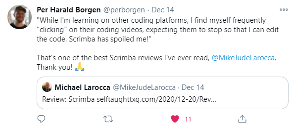

## This article covers Scrimba's monumental 24 days of JavaScriptmas 2020 event! 

---

### The YouTube invitation video that started it all!
<!--  -->
<iframe width="853" height="480" src="https://www.youtube.com/embed/CsoujaMhl4g" frameborder="0" allow="accelerometer; autoplay; clipboard-write; encrypted-media; gyroscope; picture-in-picture" allowfullscreen></iframe>

---

### The hour and a half JavaScriptmas Christmas Eve live stream!

#### **Hosted by**:
* **Per Borgen**: Co-Founder, and CEO of Scrimba
* **Alex Booker**: Scrimba podcast and YouTube host
* **Dylan Israel**: YouTube celebrity and Scrimba teacher

<iframe width="853" height="480" src="https://www.youtube.com/embed/EfhfoU7oVT0" frameborder="0" allow="accelerometer; autoplay; clipboard-write; encrypted-media; gyroscope; picture-in-picture" allowfullscreen></iframe>

---

### Topics covered in the live stream:
* The origin of the JavaScriptmas course
* Upcoming courses
* Straw Poll (Student vote for potential courses)
* JavaScriptmas Stats
* Student Submissions
* Community-generated articles
* Solving the final JavaScriptmas challenge (live!)
* Announcing the "in live chat" daily winner
* Announcing the grand prize winner

---

### The origin of the JavaScriptmas course


The course originated with a question posted on Scrimba's Discord channel, asking the students if they would be interested in an "JavaScript Challenges Advent Calendar."

They received an enthusiastic response from their students and then created the course in just three weeks!
<!-- 
### Students enrolled!

### 7,740 elves are already working on the challenges! -->

--- 

### Upcoming courses
#### (Scrimba's announced 2021 courses in the live stream)

* ### 21 web dev tips for 2021
  * **Why**: Get a flying start on the next year
  * **When**: January 4th, 2021
  * **Who**: Ania Kubow

---  

* ### Build components in HTML, CSS, and JS
  * **Why**: Helps you regardless of which framework you use
  * **When**: January 14, 2021
  * **Who**: Jad Khalili

---  

* ### Build instagram in React 
  * **Why**: Real-world projects are key to grow your skills
  * **When**: January 21st, 2021
  * **Who**: Karl Hadwen

--- 

* ### Styled components in React
  * **Why**: Learn to style your components without stress
  * **When**: February 18th, 2021
  * **Who**: Ania Kubow

---

### New Upcoming course (in progress)
  * ### Intro to unit testing

**Course instructor**: **Dylan Israel**

Dylan elaborates on the course during the live stream, explaining the benefits of learning "**unit testing**" and "**clean code**" principles. Having these skills will help you to stand out from other applicants when applying for jobs.

---

### New Upcoming course (in progress)
  * ### Introduction to clean code

**Course instructor**: **Dylan Israel**

Dylan elaborates on the course during the live stream, explaining that his mentor told him, "**Learn clean code, learn testing and your career will accelerate.**"

Later in the live stream, Per Borgen brought Dylan's six-figure income and self-taught education to the live stream viewers' attention; Dylan hilariously quotes, ***"I learned in the streets. I'm about that code life!"*** referencing "**Thug life**." I want to buy all the merchandise available with that quote, starting with a coffee mug!

---

### Some JavaScriptmas stats
#### (Scrimba's announced stats in the live stream)

  *  7600 + joined
  *  600 - 1200 daily submissions
  *  30 + prizes

---

### Some amazing submissions
* Christmas tweet app (Dmitri Frolov)
* Terminal tweet app (Samy Mohamed Mahomoud)
* Roll the 3-dimensional dice (Dave Alger)


The [***Christmas tweet app***](https://scrimba.com/scrim/co7714bba86a05da955b13c45), created by  **Dmitri Frolov**, was styled very nicely. When you clicked the Tweet button in his program, it made a real tweet!


The [***Terminal tweet app***](https://scrimba.com/scrim/co63c470fb7acea4dd6f836fe), created by **Samy Mohamed Mahomoud**, was also styled very nicely. The project that Samy made looks like an actual command-line terminal. If you look at the details in the interface that he created, he wrote some amusing text. His program also made real tweets!


The [***Roll the 3-dimensional dice***](https://scrimba.com/scrim/co60a4282b9ca0666acef2036), created by **Dave Alger**, was breath-taking. His project received a lot of recognition on Scrimba's JavaScriptmas Discord channel. The die was 3-dimensionally styled, with a red see-through color. When you clicked on the dice, it raises and then spins in 3d! He also created an actual game with it, and when you win, an excellent "Win Screen" that included falling snowflakes is displayed.

A quote from ***Star Wars Episode I*** comes to mind when I hear the name  **Dave Alger**, "We will watch your career with great interest!"

---

### Community-generated article
* Diana Marin on Hash node
* Sekti Wicaksono on Dev.to
* Michael Larocca's personal blogs


**Diana Marin**

Alex Booker sent out an e-mail that included Diana Marin's blog post. He used the blog as an example of how to write one! Diana's blog was the first community written post on "JavaScriptmas" promoted by Scrimba! The article is on Hashnode, and it is receiving a lot of positive feedback.

Diana Marin Wrote an excellent [blog post](https://zerotocode.hashnode.dev/from-zero-to-code-javascriptmas). In the post, Diana quotes, "I feel that my life can begin as many times as I want..." and "My new challenge in life is to walk through the Frontend Developer Path. "

I am excited to see a fellow self-taught X Generation developer. It is very encouraging to know that I'm not alone in starting to learn front end web development at this stage in my life.

---


**Sekti Wicaksono**

Sekti took a different aproch with blogging. Each JavaScriptmas challenge was coved in detail in seperate [posts](https://dev.to/sekti92).

I believe writing separate posts is a brilliant idea. 

Of course, I had to check out Sekti's solution for day 13, "Extract Each Kth." He made the challenge look easy, providing an elegant solution.

```javascript
function extractEachKth(nums, index) {
   return nums.filter(num => num % index != 0);
}
```

Am I the only student that struggled with this challenge? LOL!

---


**Michael Larocca**

For the third community-generated article, they chose mine! What an honor!

While reviewing my blog, they noted that I posted it on a custom named domain. 

To go into more detail, I decided to make my blog into a fun learning project. To create it, I used a community built Gatsby starter blog, created by [Will Ward](https://www.gatsbyjs.com/starters/willjw3/gatsby-starter-developer-diary), in conjunction with GitHub and Netlify. 

I then set the blog up as a subdomain on my website. 
```
blog.michaeljudelarocca.com
```
I then decided to purchase another custom domain name. I decided on "**selftaughttxg.com.**" Since I am a self-taught X Generation programmer, I came up with a "**play on words**" to my favorite Star Trek series, "**Star Trek TNG (The Next Generation)**." It also pays homage to my favorite podcast, "**Self-Taught or Not.**"

Finally, I set up my purchased selftaughttxg.com domain as an alias to my blog.michaeljudelarocca.com.


Scrimba also announced that they recently made me a "**Community Hero**" on their Discord channel! It is a great honor that I appreciated to receive! Thank you, Scrimba!

I was also very appreciative when Dylan gave me a "Shout out" for the [article I wrote on him!](https://selftaughttxg.com/2020/12-20/12-06-2020_TeacherFeature-Dylan_Israel/)

---

### Students were encouraged to create blogs

Why Blog? Alex from Scrimba explains that creating content and sharing what you are learning is the number one way to improve your communication skills and increases your chance of finding a job you love. He also states that blogging proves your dedication to improving your skills. 

To encourage students to start blogging, Scrimba awarded a certificate and a special Discord badge for those who created one and completed all 24 JavaScriptmas challenges! 

What a brilliant idea Scrimba proposed to their students. If Scrimba could only create a similar proposal, encouraging our children to eat their vegetables!

**I believe it is a big personal step to create a blog and to put yourself out there. So in this article, I am showcasing every JavaScriptmas blog post that my classmates made!**

--- 

| Author                     |      Blogs/Articles    |
| -------------              | :-----------: |
| Abhijith Sreekar           | [JS Advent Calendar #javascriptmas](https://dev.to/nasreekar/js-advent-calendar-javascriptmas-4lk8) |
| Angel                       | [24 days of #Javascriptmas solutions]()  |
| Ashim Ghimire              | [Scrimba, JavaScriptmas Challenge](https://aghimire85.hashnode.dev/scrimba-javascriptmas-challenge) |
| Aykut Mayali  | [JS+XMAS #JavaScriptmas](https://aykutmayali.medium.com/js-xmas-javascriptmas-2fb536b483c6) |
| Betul TAS  | [Solutions for 24 Days of #JavaScriptmas 🎄](https://ebetulo.hashnode.dev/solutions-for-24-days-of-javascriptmas) |
| Bishnu Prasad Chowdhury     | [2020 — JAVASCRIPT RAMPUP](https://bishnu1986.medium.com/2020-javascript-rampup-850b37915fa6)  |
| Brad Fabian  | [JavaScriptmas - 24 Days of Javascript Cheer](https://fabiandev.hashnode.dev/javascriptmas-24-days-of-javascript-cheer) |
| Darlene Wong    | [My Kind of Advent Calendar: #Javascriptmas](https://dev.to/darlenew/my-kind-of-advent-calendar-javascriptmas-3me2)    |
| ⊃∧∨∈                       | [24 Days of JavaScriptmas](https://dev.to/davealger/24-days-of-javascriptmas-552l)   |
| Davor Jovanović            |[My journey through 24 Days of #JavaScriptmas 😊](https://hashnode.com/post/my-journey-through-24-days-of-javascriptmas-ckj33mt7k003mvls19b5of2d9) |
| Diana Marín                | [From zero to code: #JavaScriptmas](https://zerotocode.hashnode.dev/from-zero-to-code-javascriptmas) | 
| Dmitriy Sukach  | [JavaScriptmas Challenge by Scrimba](https://sukach.hashnode.dev/javascriptmas-challenge-by-scrimba) |
| Dominic Myers  | [2020 24 days of #JavaScriptmas](https://drmsite.blogspot.com/2020/12/24-days-of-javascriptmas-ongoing.html) |
| Durga Prasad|[Programming: Stop passive learning, Start Scrimba](https://javascriptweb.hashnode.dev/programming-stop-passive-learning-start-scrimba)|
| Ezequiel_Caste  | [JavaScriptmas Solutions](https://dev.to/ezequiel_caste/javascriptmas-solutions-5gc8) |
| Felix Yeung                |[Merry #JavaScriptmas](https://blog.felixyeung.dev/scrimba-javascriptmas-2020) |
| Fernando Armonelli Fiedler |[My very first blog entry (#Javascriptmas)](https://fernandoarfie.hashnode.dev/my-very-first-blog-entry-javascriptmas) |
| Gheorghe Madalina Eleonora  | [My JavaScriptmas Journey 🎄](https://madalinaeleonorag.medium.com/my-javascriptmas-journey-69a29ea5845a) |
| Ginab972                    | [#JavaScriptmas](https://dev.to/ginab972/javascriptmas-fmp) |
| J                          |[My experience of completing "24 Days of #JavaScriptmas" challenge by Scrimba](https://randomness.hashnode.dev/my-experience-of-completing-24-days-of-javascriptmas-challenge-by-scrimba) |
| Joseph Mawa                 | [JavaScriptmas interview type coding challenges](https://dev.to/nibble/interview-type-coding-challenges-3i6i) |
| Kaustubh Damania            | [24 days of Javascriptmas](https://dev.to/kaustubhdamania/24-days-of-javascriptmas-16h4) |
| Kris van der Ven                            | [24 Days of #JavaScriptmas (Completed)](http://krisvanderven.nl/blogs/14)   |
| Matty                            | [24 Days Of JavaScriptmas](https://hashnode.com/post/24-days-of-javascriptmas-ckiywvqsj01nbd4s1frzg7gho) |
|  MartWebb                           | [Scrimba's JavaScriptmas](https://dev.to/martwebb/scrimba-s-javascriptmas-366n)     |
| Melisa Surja  | [Javascriptmas Solutions](https://blog.melisa-surja.me/javascriptmas-solutions)   |
| Michael Jude Larocca | [Scrimba: JavaScriptmas 2020](https://selftaughttxg.com/2020/12-20/Scrimba-JavaScriptmas_2020/) |
| Musa   | [24 days of #JavaScriptmas with Scrimba](https://musabas.medium.com/24-days-of-javascriptmas-with-scrimba-b394e0b46a0a)   |
| Namous Yesmine  | [Scrimba Javascriptmas 24 Challenges](https://dev.to/namousyesmine/scrimba-javascriptmas-24-challenges-nc0)   |
| Narcisa Badea  | [JavaScriptmas - 24 Days of Javascript Fun 🎄](https://dev.to/narcisabadea/javascriptmas-24-days-of-javascript-fun-584g) |
| palak jain | [My 24 days of Javascriptmas!](https://palak.hashnode.dev/my-24-days-of-javascriptmas)   |
| Pr0grammingTeenager                            | [JavaScriptmas!](https://dev.to/dgx37/javascriptmas-2j80) |
| Sekti Wicaksono            | [Listed each challenge in posts](https://dev.to/sekti92) |
| SHEY Louis CHIA             | [My #JavascriptMas 2020](https://medium.com/@shloch2007/my-javascriptmas-2020-227113a9fdde)   |
| Stacy Hung                 | [Decoding the coder: my path to front-end development](https://www.stacyhung.com/blog/javascriptmas.html) |
| Tulkas Astaldo  | [JavaScriptmas Solutions!](https://dev.to/tulkasastaldo9/javascriptmas-solutions-16e4) |
| Valters Melderis | [Journey is not always more important than the destination.](https://valciic.hashnode.dev/destination-not-journey) |

###### ***NOTE: If your blog/article is not in the list or contains errors, please contact me and I will be glad to add it/fix!***

###### **Discord:** Michael Larocca#7221  **or** **Website:** [https://michaeljudelarocca.com/contact.html](https://michaeljudelarocca.com/contact.html)

---

### GitHub: Scrimba Class of 2020

**(During the JavaScriptmas live stream, I invited anyone interested in working on a collaborative GitHub project I created.)**

As I elaborated in course suggestions on Scrimba's Discord channel, I took the initiative and created a GitHub project for student collaborative practice. As it is an open-source group project, everyone is entitled to add this project to their portfolio! https://github.com/MichaelLarocca/Scrimba-Class-of-2020

---

### Solving the final JavaScriptmas challenge (live!)
#### Day 24, Test Your Agility

The last challenge, "Test Your Agility," was solved live by Per, Alex, and Dylan, along with help from the YouTube live stream chat!

---

### Straw Poll (Student vote for potential courses)


#### The winner of the Straw poll was Learn TypeScript, with a 40% vote.

---

### List of the daily JavaScriptmas winners

| Date          |      Daily Winners    |
| ------------- | :-----------: |
| 12/01/2020    | [Khwilo](https://twitter.com/scrimba/status/1334156503792689153) | 
| 12/02/2020    | [samdon](https://twitter.com/scrimba/status/1334518419266342914) |
| 12/03/2020    | [Bryan](https://twitter.com/scrimba/status/1334878594695360512) |
| 12/04/2020    | [Rodrigo Castro](https://twitter.com/scrimba/status/1335286930544726016) |
| 12/05/2020    | [Ajay Immanuel](https://twitter.com/scrimba/status/1335642432273338369) |
| 12/06/2020    | [Sebastian Voráč](https://twitter.com/scrimba/status/1335967690662490112) |
| 12/07/2020    | [Daniel](https://twitter.com/scrimba/status/1336335573678579718) |
| 12/08/2020    | [Eshgin](https://twitter.com/scrimba/status/1336696722794442755) |
| 12/09/2020    | [Joker](https://twitter.com/scrimba/status/1337060707364384769) |
| 12/10/2020    | [Roberto Culiersi](https://twitter.com/scrimba/status/1337458915244642305) |
| 12/11/2020    | [maryam2006](https://twitter.com/scrimba/status/1338521228852801536) |
| 12/12/2020    | [Valters](https://twitter.com/scrimba/status/1338521228852801536) |
| 12/13/2020    | [Aditya Bose](https://twitter.com/scrimba/status/1338521228852801536) |
| 12/14/2020    | [Jimin ssi](https://twitter.com/scrimba/status/1338863502044250127) |
| 12/15/2020    | [Cynthia Teeters](https://twitter.com/scrimba/status/1339231445752176642) |
| 12/16/2020    | [Kuntal Das](https://twitter.com/scrimba/status/1339593171181862914) |
| 12/17/2020    | [Davinderpaal Singh Rehall](https://twitter.com/scrimba/status/1339957635647496192) |
| 12/18/2020    | [Baffour Kusi Frimpong](https://twitter.com/scrimba/status/1341048724785680391) |
| 12/19/2020    | [beckaaa](https://twitter.com/scrimba/status/1341048724785680391) |
| 12/20/2020    | [Russ Perry ](https://twitter.com/scrimba/status/1341048724785680391) |
| 12/21/2020    | [Mohan](https://twitter.com/scrimba/status/1341417035176226817) |
| 12/22/2020    | [Consolidated Braincells Inc](https://twitter.com/scrimba/status/1341765447801319425) |
| 12/23/2020    | Davanovic - Live Stream Chat Winner |
| 12/24/2020    | Gaurav Bhagwanai - Grand Prize Winner! |

--- 

### A special thank you from our study group, "The Booleans."

I want to thank Per Borgen, Alex Booker, Leanne, and the Scrimba teachers and staff. I know that the JavaScriptmas course took a lot of work to put together quickly.

  ***- Michael Larocca***

---

 #### **Scrimba has once again impressed and inspired me! You can read my full [Scrimba review](https://selftaughttxg.com/2020/12-20/Review-Scrimba/) on my 12/13/2020 post.**




#### *"That&#39;s one of the best Scrimba reviews I&#39;ve ever read, <a href="https://twitter.com/MikeJudeLarocca?ref_src=twsrc%5Etfw">@MikeJudeLarocca</a>. Thank you! 🙏 "*
###### &mdash; Per Harald Borgen, CEO of Scrimba <a href="https://twitter.com/perborgen/status/1338462544143540227?ref_src=twsrc%5Etfw">December 14, 2020</a></blockquote>

---

### **Conclusion**

Scrimba's JavaScriptmas was an engaging, collaborative, and educational experience for their students. The course encouraged us to code daily for 24 days, share our code on Discord, and challenged us to get out of our "comfort zones" and start blogging!

A proverb comes to mind, "It takes a village to raise a child." With that wisdom, I would like to add that "It takes a community to teach a programmer."

I want to thank the Scrimba community, my classmates, teachers, and the Scrimba staff, which continually help me become the programmer I aspire to be.
