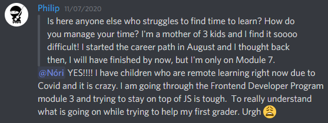
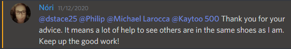

## How do I make progress learning to program? I make a little progress every day, with a little help from my friends.

### A member of my Scrimba study group asked a question that I believe many people have. 

**The overall question is about time management.**

---

### Learn a little every day

There are plenty of days where "everyday life" prevents me from coding. Also, coding all of the time does become tiresome for me. 

So I keep the learning momentum going by "Switching it up" and learning a little every day.

---

### Switch it up

What do I mean by "Switching it up?"

I do not limit my learning to just coding. I also learn programming by watching tutorials, listening to podcasts and audiobooks, researching online, and engaging on Discord.

Since front-end web development has "many moving parts," I will also change my study topics to prevent fatigue.

### Study Topics

  * HTML, CSS, JavaScript, 
  * Bash, Git, GitHub
  * Libraries, Supersets, Frameworks

Right now, I am taking a break from coding by writing this blog post!

---

### Avoid long breaks

Even though I find it productive to "switch it up," I advise against taking long breaks from coding. 

After taking long breaks from coding, I do find it more challenging to come back to it. I will have to start researching syntax, lookup methods to get them to work correctly, and it takes some time to "**get back**" into the overall groove of coding daily.

---

### You are not alone

There is a thriving online community that you can reach out to for help and support. 

**You do not have to limit your questions to just technical issues.** 

**Sometimes all you need is a little encouragement, and the encouragement you receive can give you the endurance to continue your learning journey.** 

**You may find out that there are others in your situation, and you may find comfort in that fact.**

---

**I'm having a wonderful experience with Scrimba's Discord community, and I can highly recommend it! You can read my full [Scrimba review](https://selftaughttxg.com/2020/12-20/Review-Scrimba/) on my 12/13/2020 post.**

#### *"That&#39;s one of the best Scrimba reviews I&#39;ve ever read, <a href="https://twitter.com/MikeJudeLarocca?ref_src=twsrc%5Etfw">@MikeJudeLarocca</a>. Thank you! 🙏 "*
###### &mdash; Per Harald Borgen, CEO of Scrimba <a href="https://twitter.com/perborgen/status/1338462544143540227?ref_src=twsrc%5Etfw">December 14, 2020</a></blockquote>

---

*All right reserved by The Beatles and the Michael Jackson estate (due to being outbid!)*

---

### Key Points

  * Learn a little every day
  * Switch up your study topics
  * Avoid extended breaks from coding
  * Know that you are not alone
	
---

### Conclusion

There is a lot to cover when learning to program. I find it most productive to learn a little daily and to alternate my study topics.

When learning to program, the "**online community**" is a great friend to have! The "**online community**" consists of services like Discord, forums, YouTube, podcasts, and coding schools, to name a few.

So how do I get by, learning to program a little every day? I get by with a little help from my friends!
