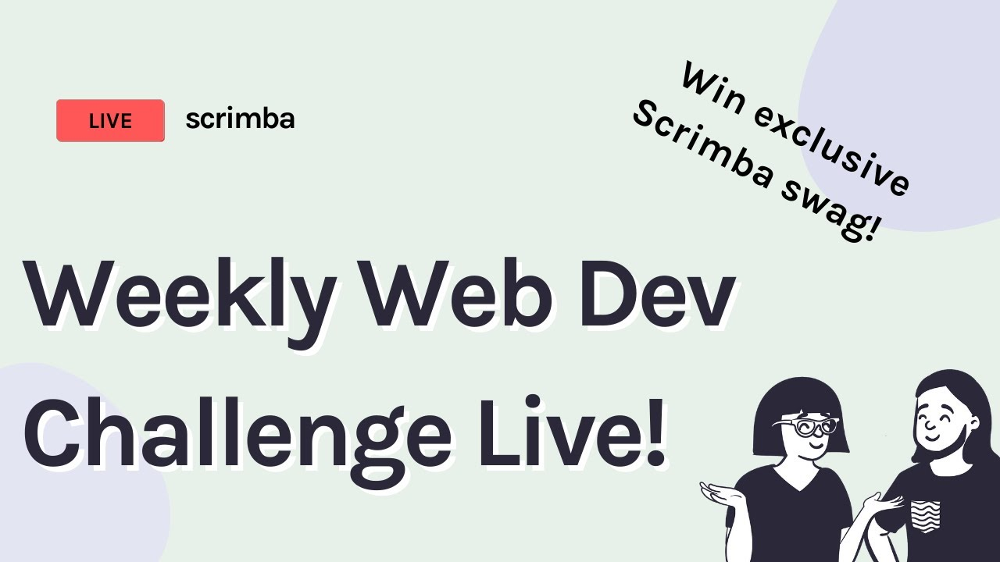

## In my seventh article, (TXG-007), I am reviewing Scrimba's Weekly Web Dev Challenge. 


### Your mission, should you choose to accept it, is to wire up a currency converter and style it in any way you like.

---



### What is Scrimba's Weekly Web Dev Challenge?

The Weekly Web Dev Challenge is a free email course delivered directly to your inbox every Wednesday.

Making commitments to code is a great way to create a steady schedule to practice programming, and taking part in Scrimba's Weekly Web Dev Challenges is a fun way to learn and share your code!

**Here is a list of my previous Weekly Web Dev Challenge submissions**:

| Date: | My submitted weekly coding challenges |
|--------|---------------------------------------|
|11/25/2020|[CSS panels (Star Trek - Theme)](https://twitter.com/MikeJudeLarocca/status/1331819008052645889?s=20)             |
|11/18/2020|[Short Changed (Star Wars - Theme)](https://twitter.com/MikeJudeLarocca/status/1329288013185216517?s=20)             |
|11/11/2020|[Magical Squares](https://twitter.com/MikeJudeLarocca/status/1326715836518850560?s=20)       |
|11/04/2020|[Responsive Content](https://twitter.com/MikeJudeLarocca/status/1324172887041941504?s=20)    |
|10/28/2020|[Logo Editor](https://twitter.com/MikeJudeLarocca/status/1321635633023078406?s=20)       

### This week will be the first time Scrimba's Weekly Web Dev Challenge is a competition!


#### If you complete and submit your challenge solution, you can win some awesome Scrimba swag and a free Scrimba subscription!

---


---

**Mission Currency Converter**: [Accepted](https://scrimba.com/scrim/co73b4276bf76dc547cda4d7f)

**Mission  Agent**: [TXG-007](https://github.com/MichaelLarocca)

**Mission Blog**:

---

### How I Wired it 

To simplify the process, I copied the already created HTML IDs and used them as JavaScript variables.

```javascript
const original_currency_amount = document.getElementById("original-currency-amount").value;
const original_currency_unit = document.getElementById("original-currency-unit").value;
const new_currency_unit = document.getElementById("new-currency-unit").value;
    
const exchange_rate = document.getElementById("exchange-rate").value;   
const output_text = document.getElementById("output-text");
```

I then calculated the exchange rate by multiplying the **currency amount** by the **exchange rate**.

I used JavaScripts "**ToFixed(2)**" method, rounding the number to keep only two decimals. 

```javascript
    const er = original_currency_amount * exchange_rate;
    const erToFixed = er.toFixed(2);
```

I also added default values to the HTML IDs:

```html
<input type="number" id="original-currency-amount" placeholder="1" value="1"></input>
<input type="text" id="original-currency-unit" placeholder="USD" value="USD"></input> 

<input type="text" id="new-currency-unit" placeholder="EURO" value="EURO"></input>
<input type="number" id="exchange-rate" placeholder="0.822219" value="0.822219"></input>
```

I Then created a function called "ER()" to run when the button is clicked.

```html
<button onclick="ER()">Exchange my money now!</button>
```

Finally, I printed the output.

```javascript
output_text.innerHTML = `Your $${original_currency_amount} ${original_currency_unit} will currently buy you $${erToFixed} ${new_currency_unit}`
```

***Writing the program this way makes it flexible for the user to change the inputted variables and get the desired exchange rate conversions.***

---

**Agent Tip:**

*Document your work! Along your code learning journey, you will solve many issues. Properly documenting them will give you a valuable resource to reference*.

---

### How I Styled It

**Background Blend Mode**

In previous projects, I researched and resolved how to "dim/fade" a background image. Using this setting on a background image makes the foreground text clearer and easier to read while providing a nice background.

Here is the code needed to produce this effect:
```css
	background-blend-mode: overlay;
```

When using the "background-blend-mode," the assigned background color is blended with the background image.

For my project, I assigned the background color to black using "rgba(0,0,0,0.5)". I set the "alpha" to "0.5," which, in conjunction with the "background-blend-mode," produced the  "dim/fade" effect I desired.


```css
    background-color: rgba(0,0,0,0.5);
    background-image: url(https://images.pexels.com/photos/534216/pexels-photo-534216.jpeg?auto=compress&cs=tinysrgb&dpr=2&h=650&w=940);
```

---

**Button**

I used the classic "change color/cursor pointer" on hover and focus.
I also added a border and a nice font shadow to make the text more readable.

```css
button:hover,
button:focus {
    border: 3px solid white;
    background-color: orange;
    color: white;
    text-shadow: 1px 1px 1px black;
    cursor: pointer;
}
```

---

**(DTTAH) Don't Try This at Home** 

I imported a Google Font for the project. 

```html
<link href="https://fonts.googleapis.com/css2?family=Bodoni+Moda:wght@400;700&display=swap" rel="stylesheet">
```
To get the font working, I used my makeshift principle of coding I aptly titled "**DTTAH**." I hastily copied and pasted the font code all over the place to quickly complete and submit my project. This method completely disobeys the "**DRY**" principle of coding, which is "Don't Repeat Yourself!"

```css
	font-family: 'Bodoni Moda', serif; 
```

You might ask, "Agent TXG-007, why did you not refactor the code? Over." 

To which I would frantically reply, "Negative! Negative! There is no time to refactor the code! Scrimba's Web Dev competition already took off!"


*Mission Impossible Paramount Pictures All right reserved.*

---

**Scrimba tells us that publicly displaying our work is great for building our personal brand and gives us something to show off in coding interviews in the future.**

**I believe it is a big personal step to create a blog and to put yourself out there. So in this article, I am showcasing every "Amazing Currency Converter" blog post that my classmates made!**


### Agents of Scrimba's "TXG" Team

| Scrimba Agent              | Mission Blog  |
| -------------              | :-----------: |
|Bishnu Prasad Chowdhury|[Weekly Web Dev Challenge : Currency Converter](https://bishnu1986.medium.com/weekly-web-dev-challenge-currency-converter-b061c610b7a)|
|Kuntal Das|[Creating a Currency Converter with pure JS with exchangerate api](https://25ckuntaldas.medium.com/creating-a-currency-converter-with-pure-javascript-with-fetch-api-52622aab7879)|
|palak jain|[How to make a currency converter using vanilla Javascript ?](https://palak.hashnode.dev/how-to-make-a-currency-converter-using-vanilla-javascript)|
|RAJ|[Weekly Web Dev Challenge: currency converter!](https://blogs.verreauxblack.biz/weekly-web-dev-challenge-currency-converter)|
|Sebastian Bains|[Build a Live Currency Converter with plain JS](https://dev.to/dev_london/build-a-live-currency-converter-with-plain-js-42o2)|
|yubaraj singh|[My first Scrimba web weekly challenge: currency exchange](https://dev.to/yubarajsingh/my-first-scrimba-web-weekly-challenge-388p)|

**🕵️ Attention: Mission blogs of Scrimba agents currently undercover may have been missed! If your mission blog is not listed, please contact me, agent TXG-007, provide a link to your blog, and I will add it!**

**Contact:** michaeljudelarocca@gmail.com

---

### GitHub: Scrimba Class of 2020

**(I invited anyone interested in working on a collaborative GitHub project I created.)**


As I elaborated in course suggestions on Scrimba's Discord channel, I took the initiative and created a GitHub project for student collaborative practice. As it is an open-source group project, everyone is entitled to add this project to their portfolio! 

https://github.com/MichaelLarocca/Scrimba-Class-of-2020

---

**I'm having a wonderful experience with Scrimba's Discord community, and I can highly recommend it! You can read my full [Scrimba review](https://selftaughttxg.com/2020/12-20/Review-Scrimba/) on my 12/13/2020 post.**


#### *"That&#39;s one of the best Scrimba reviews I&#39;ve ever read, <a href="https://twitter.com/MikeJudeLarocca?ref_src=twsrc%5Etfw">@MikeJudeLarocca</a>. Thank you! 🙏 "*
###### &mdash; Per Harald Borgen, CEO of Scrimba <a href="https://twitter.com/perborgen/status/1338462544143540227?ref_src=twsrc%5Etfw">December 14, 2020</a></blockquote>

---

### Special Event

***There is still time to get in on the fun! See the details below:***

**Time for the challenge 🤺**
Your task is to wire up a currency converter and style it in any way you like. Click below to go to the challenge and get started on your solution.

**Competition Time**

To be in with a chance of winning those prizes, solve the challenge, share your solution on Twitter, and fill in [this form.](https://click.convertkit-mail.com/qdu09olo98i7hwdm2xul/48hvheh0pqlw7vbx/aHR0cHM6Ly9kb2NzLmdvb2dsZS5jb20vZm9ybXMvZC9lLzFGQUlwUUxTZW1DZ21iVDFIX2lDdWRKS3l2a0hYX29tcWZ3MHBUWktHbXRrbHJUSk9uWFFOZm5RL3ZpZXdmb3Jt) You can find more details in the challenge screencast above.

**Share your learnings** 

In a change from the usual Weekly Web Dev Challenge format, we'd also love for you to solidify your knowledge by learning in public. You can do this by **creating a blog post, live stream or video tutorial** explaining how you solved the challenge. This is great for building your personal brand and gives you something to show off in coding interviews in the future, but it is optional. We'll share some of our favorite public learnings in the live stream next week and in the next Weekly Web Dev Challenge email, which means that your entry could be shared with upwards of 5000 people!
​

**Weekly Web Dev Challenge Live Stream**

We are hosting a live stream on January 20th at 4pm GMT [over on Youtube.](https://click.convertkit-mail.com/qdu09olo98i7hwdm2xul/9qhzhnhg63w4e9i9/aHR0cHM6Ly93d3cueW91dHViZS5jb20vd2F0Y2g_dj16SzRla2p6cDctcyZmZWF0dXJlPXlvdXR1LmJl) In the live stream, we'll look at some of our favorite submissions, talk about some exciting Scrimba news and give away that SCRIMBA SWAG. Hit the image below to be automatically reminded when we go live.

---

### Key Points

* Making a coding schedule and committing to it is beneficial to you.

* Documenting your work provides a valuable resource to reference.

* Publishing your work is great for building your personal brand.

---

### TXG Review Results: 

#### Scrimbs's Weekly Web Dev Challenge 
#### 5 out of 5 Stars! 
#### "⭐ ⭐ ⭐ ⭐ ⭐"

---

### Conclusion

Making commitments to code and sticking to your committed schedule will significantly improve your programming skills. 

Signing up for Scrimba's Weekly Web Dev Challenges provides you with a codding commitment that's easy to keep, that's fun, and that is also engaging. 

So please consider signing up today and join in on the fun!

**🕵️ Your mission, should you choose to accept it, is to complete Scrimba Weekly Web Dev Challenges delivered to your mailbox!**

**[Accept the mission?](https://click.convertkit-mail.com/lmukm7q7mesmhq2mkec6/3oh8pqqvtkhdwpg62wsr/aHR0cHM6Ly9zY3JpbWJhLmNvbS9zY3JpbS9jbzcxZjRiZTdiOGE2N2JjODQ4NjY0YjNlP3V0bV9zb3VyY2U9bmV3c2xldHRlciZ1dG1fbWVkaXVtPWVtYWlsJnV0bV9jYW1wYWlnbj13ZWVrbHl3ZWJkZXZjaGFsbGVuZ2U=)**