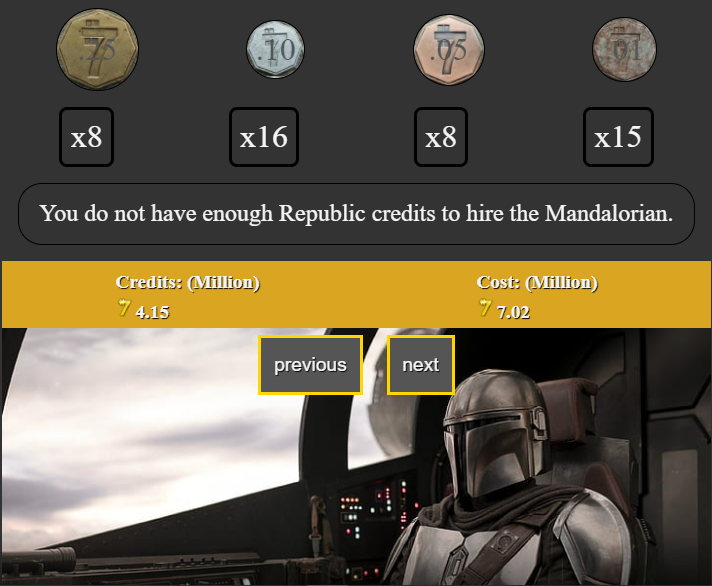
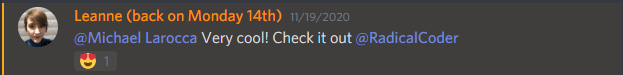
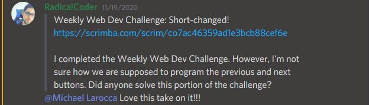
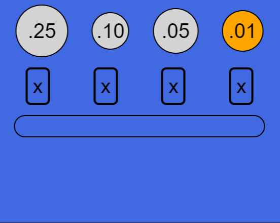
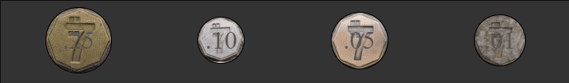
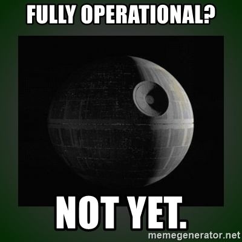
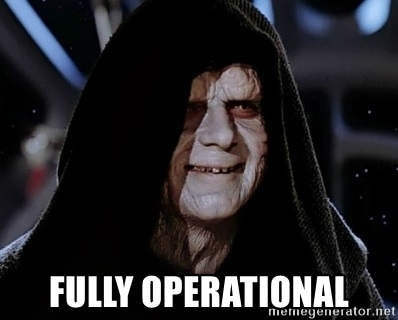
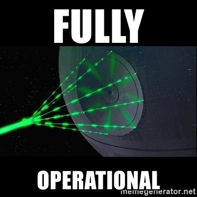
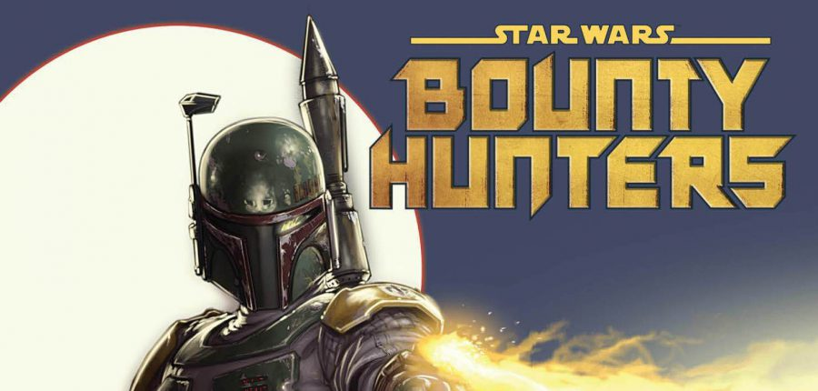

---
<!-- 
### Before I started my blog, I created a Star Wars-themed project, and now it is an excellent opportunity to showcase it. -->

### This week, I'm showcasing a Star Wars-themed project that I'm submitting for Scrimba's Weekly Web Dev Challenge. 

### To get the program "fully operational," I needed help from a fellow Scrimba student.



### This week's Scrimba's Weekly Web Dev Challenge is to create a "Budget Calculator."  

### The budget calculator challenge instructs us to create a program that checks if you have enough currency to make a purchase. We can also style it in any way we like!

---


### What is Scrimba Weekly Challenge? 

The Weekly Web Dev Challenge is a free email course delivered directly to your inbox every Wednesday.

Making commitments to code is a great way to create a steady schedule to practice programming, and taking part in Scrimba's Weekly Web Dev Challenges is a fun way to learn and share your code!

You can read my full [Scrimba Weekly Web Dev Challenge review](https://selftaughttxg.com/2021/01-21/ReviewScrimbaWebDevChallenge/) article on my 01/17/21 post.

---

<!--  -->

**My submission:** [Short-Changed](https://scrimba.com/scrim/co7ac46359ad1e3bcb88cef6e)

I am showcasing the Weekly Web Dev Challenge, "**Short-Changed**," presented to us by [Radical Coder](https://github.com/Radical-Coder). 

I was delighted to see that I received positive feedback on it!





---
### How I styled the project



**Added images to the Scrim**

A great feature that Scrimba supports is creating a folder and then adding images to it.



I searched online for images of Star Wars currency, known as "**Republic Credits**." I cropped each of four images to represent pennies, nickels, dimes, and quarters and then added them to the image folder. 

Then, I adjusted each background image accordingly.

Here is an example of adjusting the background of one out of the four currencies

```css
.nickel {
    height: 2.3rem;
    width: 2.3rem;
    background-image: url(img/Nickel.png);
    background-size: 70px 70px;
}
```

Of course, I showcased "**The Mandalorian**" in the [Razor Crest](https://starwars.fandom.com/wiki/Razor_Crest) as a background image!

--- 


### Transparent PNG

One of my favorite programming styling effects is working with transparent PNG files. 

I used a transparent PNG image of a **Republic Credit** symbol. 

To display the **Republic Credit** symbol next to the project's currency, I used the CSS pseudo "**:: before**," and I appropriately resized the image.

```css
#purchase-amount::before,
#purchase-cost::before {
  content: "";
  display: inline-block;
  height: 20px;
  width: 20px;
  background-size: 20px;
  background-image: url("img/credit.png");
  background-repeat: no-repeat;
}
```

---


### Buttons 

Finally, I created buttons that matched the color scheme of the background image.

```css
button {
    background: #555;
    color: whitesmoke;
    text-shadow: 1px 1px 1px black;
    margin: 10px;
    outline: 3px solid gold;
}
```

---
### How I programed this project 

**The JavaScript function:**

For the JavaScript function, Radical Coder provided us an object representing a coin purse. The program he instructed us to write should return **true/false** depending on whether or not the user has enough change to complete a purchase at the given price.

**I calculated the currency of each item as follows:**

```javascript
const quatersToDollars = sampleTest.quarters / 4;
const dimesToDollars = sampleTest.dimes / 10; 
const nickelsToDollars = sampleTest.nickels / 20;  
const penniesToDollars =  sampleTest.pennies / 100;   
```

**I then created a total amount variable:**

```javascript
const totalChangeToDollars = (quatersToDollars + dimesToDollars + nickelsToDollars + penniesToDollars);  

const totalChange = totalChangeToDollars.toFixed(2);    
```

**I then created true and false messages to return:**

```javascript
const messageTrue = `Congratulations! You just hired the Mandalorian!`;

const messageFalse = `You do not have enough Republic credits to hire the Mandalorian.`; 
```

**Finally, I returned the answer:**

```javascript
totalChange > sampleTest.price ? pc.innerText = messageTrue : pc.innerText = messageFalse;
```

---


### The Previous and Next Buttons:

**Unfortunately, I was unable to solve this part of the challenge on my own.** 

To finish this part of the program, I analyzed one of my brilliant classmate's projects, **Palak Jain's**. 

Here is a link to her "[Short-Changed](https://scrimba.com/scrim/codaf4912af68bc7581b39722)" project that I referenced.

---

After studying **Palak Jain's** code, I understood that I was supposed to utilize the already imported object with five values stored.

```javascript
import { testPurses } from "./shortChangeTests.js"
```

**Now with the knowledge of working with an array of five values, I refactored my code appropriately.**

```javascript
const quatersToDollars = testPurses[i].quarters / 4;
const dimesToDollars = testPurses[i].dimes / 10; 
const nickelsToDollars = testPurses[i].nickels / 20;  
const penniesToDollars = testPurses[i].pennies / 100;   

totalChange > testPurses[i].price ? pc.innerText = messageTrue : pc.innerText = messageFalse;
```

<!--  -->

**Finally, I used Palak Jain's functions to make the next and previous buttons "fully operational."**
 
```javascript
function nCase(){
    if(i<(testPurses.length-1))
    {
        i=i+1;
    }else{
        i=0;
    }
    enoughChange();
}
function prevCase(){
    if(i>0){
        i=i-1;
    }else{
        i=testPurses.length-1;
    }
    enoughChange();
}
```



---

**Pro-tip**

*There will be times when you have to reference others' code to solve issues. When you do, please give them the credit they deserve.*

---

### Scrimba's Live Stream

Along with my "[Review: Scrimba's Weekly Web Dev Challenge
](https://selftaughttxg.com/2021/01-21/ReviewScrimbaWebDevChallenge/)" post, **Palak Jain's** most recent project, "[Amazing Currency Converter](https://scrimba.com/scrim/co15b43758eb9d21938be556c)," was just featured on Scrimba's YouTube live stream!

You can see both of our work featured on Scrimba's [The Weekly Web Dev Challenge - LIVE!](https://www.youtube.com/watch?v=zK4ekjzp7-s&t=771s) YouTube video.

Thank you, Scrimba, for showcasing our work!
#### You can learn more about **Palak Jain** on her [GitHub page](https://github.com/Palak-coder626).

---

<iframe width="853" height="480" src="https://www.youtube.com/embed/zK4ekjzp7-s" frameborder="0" allow="accelerometer; autoplay; clipboard-write; encrypted-media; gyroscope; picture-in-picture" allowfullscreen></iframe>

---

*Time Stamp: 7:50 - Palak Jain*

*Time Stamp: 24:45 - Michael Larocca*

---
### Now it's time to run the program.

#### Please make sure to have enough "Republic Credits" to hire The Mandalorian.

#### Baby Yoda is counting on you!


*All rights reserved by Disney and Lucasfilm.* 

---

**Scrimba tells us that publicly displaying our work is great for building our personal brand and gives us something to show off in coding interviews in the future.**

**I believe it is a big personal step to create a public post and put yourself out there. So in this article, I am showcasing every "Budget Calculator" blog post, live stream, or video tutorial that my classmates made!**




<!-- ### Agents of Scrimba's "TXG" Team -->

### Scrimba Guild Bounty Hunters

| Scrimba Guild Bounty Hunter | Bounty Blog |
| -------------               | :---------: |
| Ambreen Khan  | [Budget Tracker](https://ambreenkhan.dev/codingchallenges/challenge-2)  |
| Himani  | [Weekly Web Dev Challenge: Budgeting Tool](https://himanidave98.medium.com/weekly-web-dev-challenge-budgeting-tool-db019e29673) |
| Tom                         | [Budget Calculator (Video Scrim)](https://scrimba.com/scrim/cpMamJHq)  |

**Attention:Scrimba Guild Bounty Hunters currently on the job; if your mission blog is not listed, please contact me, "Droid TXG-11," and I will add it!**

**Contact:** michaeljudelarocca@gmail.com

---
### Special Event

***There is still time to get in on the fun! See the details below:***

**Time for the challenge 🤺**
Your task is to wire up a budget calculator and style it in any way you like. Click below to go to the challenge and get started on your solution.

**Competition Time**

To be in with a chance of winning those prizes, solve the challenge, share your solution on Twitter, and fill in [this form.](https://docs.google.com/forms/d/e/1FAIpQLScHTEHo5FXB_NPGHJmY6OdsoT-qFgxE9tB5K9gJyHUQBdx-6Q/viewform) You can find more details in the challenge screencast above.

**Share your learnings** 

In a change from the usual Weekly Web Dev Challenge format, we'd also love for you to solidify your knowledge by learning in public. You can do this by **creating a blog post, live stream or video tutorial** explaining how you solved the challenge. This is great for building your personal brand and gives you something to show off in coding interviews in the future, but it is optional. We'll share some of our favorite public learnings in the live stream next week and in the next Weekly Web Dev Challenge email, which means that your entry could be shared with upwards of 5000 people!
​

**Weekly Web Dev Challenge Live Stream**

We are hosting a live stream on **January 27th at 4pm GMT** [over on Youtube.](https://www.youtube.com/watch?v=vu1di3lONFE#) In the live stream, we'll look at some of our favorite submissions, talk about some exciting Scrimba news and give away that SCRIMBA SWAG.

---

**I'm having a wonderful experience with Scrimba, and I can highly recommend it! You can read my full [Scrimba review](https://selftaughttxg.com/2020/12-20/Review-Scrimba/) on my 12/13/2020 post.**


#### *"That&#39;s one of the best Scrimba reviews I&#39;ve ever read, <a href="https://twitter.com/MikeJudeLarocca?ref_src=twsrc%5Etfw">@MikeJudeLarocca</a>. Thank you! 🙏 "*
###### &mdash; Per Harald Borgen, CEO of Scrimba <a href="https://twitter.com/perborgen/status/1338462544143540227?ref_src=twsrc%5Etfw">December 14, 2020</a></blockquote>

---

### Key Points

* Making a coding schedule and committing to it is beneficial to you
* When referencing others' code, please give them the credit they deserve
* Publishing your work is excellent for building your personal brand

---

### Conclusion

When learning to code, there will be times when you need to reference other programmers' work to get your code working. Research is part of the learning process. When you do reference others' code, please make sure to give them the credit they deserve.

Also, making commitments to code and sticking to your committed schedule will significantly improve your programming skills. Signing up for Scrimba's Weekly Web Dev Challenges provides you with a coding commitment that's easy to keep, that's fun, and that is also engaging. 

So please consider signing up today and join in on the fun!


**Your bounty reward is becoming a better programmer by signing up for Scrimba Weekly Web Dev Challenges delivered to your mailbox!**

[Accept the Bounty Contract?](https://click.convertkit-mail.com/lmukm7q7mesmhq2mkec6/3oh8pqqvtkhdwpg62wsr/aHR0cHM6Ly9zY3JpbWJhLmNvbS9zY3JpbS9jbzcxZjRiZTdiOGE2N2JjODQ4NjY0YjNlP3V0bV9zb3VyY2U9bmV3c2xldHRlciZ1dG1fbWVkaXVtPWVtYWlsJnV0bV9jYW1wYWlnbj13ZWVrbHl3ZWJkZXZjaGFsbGVuZ2U=)