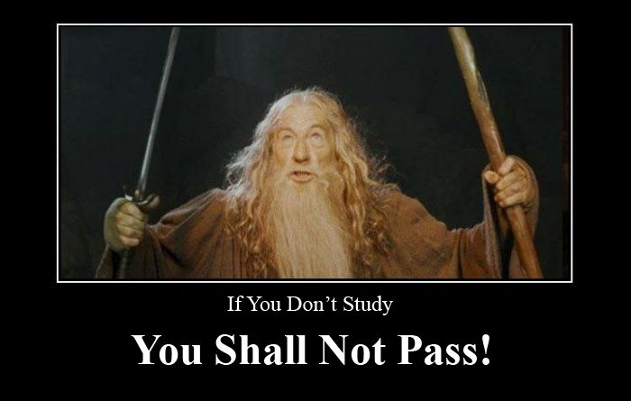

## A self-taught programmer's journey of rushing through learning to code and then having to start again from the beginning.

<!-- *copyright: New Line Cinema (2001)*  -->

### A cautionary tale to share with my "fellowship" of self-taught web developers!
 
*copyright: New Line Cinema (2001)* 
---

This tale begins at the end of 2018. I was researching the best programming languages to learn in the upcoming year. Out of the suggested languages, JavaScript best suited my needs.

I decided to start my JavaScript education at Free Code Camp. On their website, they state the following message: 

#### *- If you are new to coding, we recommend you start at the beginning.*

I thought, "thank you for your recommendation, but I'm going to start with the JavaScript course." I mean, why would I need to learn HTML and CSS if I want to code in JavaScript, right?

---

I began learning to code with the intention of "actually learning" JavaScript. I spent the next several months working hard and pair programming with [Dylan Israel's](https://selftaughttxg.com/2020/12-20/12-06-2020_TeacherFeature-Dylan_Israel/) Coding Tutorials 360 [YouTube channel](https://www.youtube.com/user/pizzapokerguy87). What a great resource!

My learning progress was going quite well, and then I had a thought. "When I complete this JavaScript course, I will earn a certification! I can put my hard-earned JavaScript certification on my resume, and it will accelerate my career! My certification, "my precious!"

<!-- *copyright: New Line Cinema (2003)*  -->

From that point on, I was consumed by the certification, "my precious." I was no longer focusing on "**learning**." Now I was focused on "**earning**."

---

I then gave myself a timetable when I would hold "my precious," I mean my certification. It would be at the end of June, and it would make a wonderful birthday gift for me.

<!-- *copyright: New Line Cinema (2003)* -->

Since there was a lot of studying to complete in my self-appointed timetable, I started to "pick up the pace" and push through the JavaScript course.

Then, my birthday comes and goes without earning my certification, "my precious!"

___

So I then reset my self-appointed timetable. I will earn the JavaScript certification by the end of December. It will be a [JavaScriptmas 2020](https://selftaughttxg.com/2020/12-20/The_Post-JavaScriptmas_2020_Post/) gift for myself! Oh wait, I'm getting ahead of myself. It will be a Christmas 2019 gift for myself! 

Then, Christmas 2019 comes and goes without earning my certification, "my precious!"
 

<!-- *copyright: New Line Cinema (2001)* -->
---

I decided it was time to take a break from learning JavaScript. I went back to the curriculum's beginning and learned HTML and CSS, as they suggested.

<!-- #### ***There and back again...*** -->

While taking this course, I took my time and understood what I was learning before moving forward.

#### When I changed my focus from "earning" to "learning," I started to make real progress.

In five months, I earned my first certification, the "Responsive Web Design Certification."

---

###Key Points
* If there is a suggested order for a course, follow it.
* Do not "pick up the pace" and push through learning.
* Prioritize "**learning**," not "**earning**" (certificates and certifications).

---

###Conclusion

I now make sure to take my time and understand what I am learning before moving forward. Rushing through learning has taught me a valuable lesson of what "not to do."

Even though I'm certified in responsive web design, I continue learning, studying, and practicing the covered topics in that course. 

I was there, and now I am back again studying JavaScript and making good progress. I will be returning to complete the JavaScript certification. When I do, "I shall pass," and I will finally hold "my precious!" 