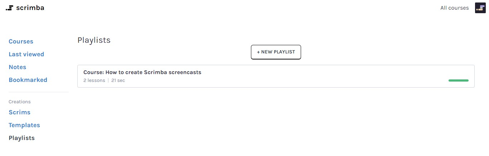
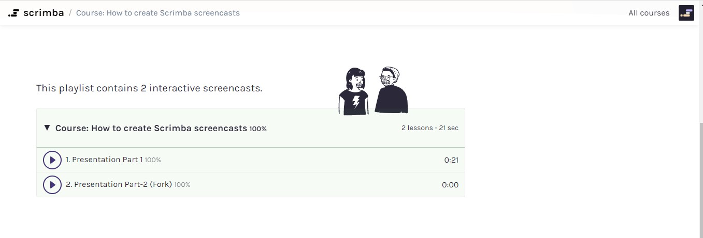
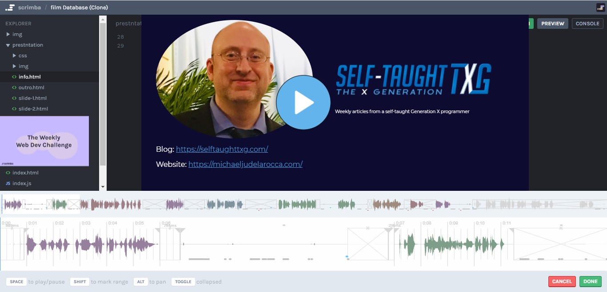

## This week, I'm writing a tutorial article on "how to create and edit" Scrimba screencasts. To demonstrate, I created and edited a screencast of this week's Weekly Web Dev Challenge: Film database!

---

### What is a Scrimba screencast

A Scrimba screencast is an exclusive and unique platform for online learning, called "**scrims**."

A "**scrim**" is an instructional coding video that can be paused and edited by a user. The user can then save the edited code they created for use later and then continue the screencast.

---

**What we will learn in the tutorial**
* Create a screencast
* Create a screencast playlist to make a course
* Fork a screencast
* Learn how to use the screencast editing tools

---

**Why use Scrimba to create a tutorial**

* Scrimba provides everything you need to code.
* Scrimba supports recording and editing.
* They have a "built-in audience."
* Provides a way for your viewers to interact with your code.

---

### Benefits of creating a screencast

Learning to create your own Scrimba screencasts is beneficial to you.

**You do not have to make your Scrimba screencast public.**

As a Scrimba student, you spend a lot of time coding with Scrims, and one of the best ways to reinforce what you are learning is to teach.

Recording yourself "talking through" what you are learning will improve your communication skills. You can also use this footage to view how you come across to others.

This method will also give you valuable insight into what you are doing right and what you need to improve on.

**When you are ready to make your Scrimba screencasts public**

Creating a public screencast will provide you with a showcase of your work and help you build your "online presence."

Your work will also provide a valuable resource for yourself to reference and give instructional guidance to others.

---

**What's needed to make a tutorial**
* Code editor
* Software for recording and editing
* A place to showcase your tutorial	

There is a lot of work that goes into creating a tutorial. 

Scrimba simplifies the process by providing a code editor, recording and editing software, and a platform to showcase your tutorial, all on their website. 

Creating a tutorial on Scrimba will provide you with an audience in the thousands, and their online community is growing. 

Scrimba's screencast technology also makes it possible for your viewers to interact with your screencast code. Your users' ability to edit your code, save their added code, and even the ability to fork the screencast makes it superior to other tutorial creating methods.

---

### Create a screencast

**Steps**
* Log into Scrimba
* Click on your icon (top right of the website)
* Select "New scrim" from the dialog box
* Choose your template (We're working with the "HTML, CSS, JavaScript" template) 
* Click the "Submit" button

---
##### I will be covering two methods of creating a presentation for your screencast:
1. The first method will be creating a slide show with HTML files
2. The second method will be creating a slide show with Google Sheets

---

### Creating a slide show with HTML files

You now created a new scrim. Now you are ready to make a "**presentation**" folder and add the appropriate files to it.

**Let's get organized**

**Create a "Presentation" folder** 


Creating and utilizing a presentation folder will help separate your presentation screencast coding material from your programming code.

**What to create in your "Presentation" folder**
* HTML files
* CSS folder

The presentation HTML files will serve the purpose of slides, similar to a Microsoft Powerpoint presentation. 

The CSS folder will contain the necessary CSS files of the HTML presentation files.

While recording your screencast, you can discretely select the presentation HTML files with a "**left-click**" on your mouse and then run the file using the short cut keyboard command "**ctrl + r**."

The concept is to keep your presentation files organized and straightforward so that you and your viewers can focus on what you are showcasing in your screencast.

---

**Creating the HTML files** 
* Create an Intro HTML file
* Create several slide HTML file
* Create an Outro HTML file 

**Intro HTML file**

The intro HTML file serves as "your business card." You provide your name, contact information, and tell a little about yourself in this file.

**Slide HTML files**

The slide HTML files will contain information about your screencast. As you are verbally discussing your screencast content, you will be displaying these files as an instructional slide show.

**Outro HTML file**

Like the intro HTML file, this will also serve as "your business card" and allow you to provide any additional information at the end of your screencast.

You are now prepared and ready to record your Scrimba screencast

On the bottom right-hand corner, you will see a red circle. This red circle is the record button. When you hover over the red circle, a "tip" message appears "Start recording."

Next to the red record button, you will see a yellow button, the word "**EDITING**," and three dots "..." (**ellipses**).

While "**EDITING**" is displayed, all of your typed code is being saved, not your mouse movements or audio.

Selecting the yellow **ellipses** will provide you with a dialog box.


**dialog box**
* Edit metadata
* Create clone of Scrim
* Fork to new 

**Edit metadata**

Here is where you create a title and a description for your scrim.

You also select a "**Privacy**" setting for your scrim.


**Privacy**
* Private (Only you)
* Secret (Anyone with a link)
* Members (Only logged in users)
* Subscribers(Only Pro members)

For now, select and "**Save**" the privacy setting of your choice, or you can escape by using **left-click** outside of the dialog box to cancel.

When you are ready to create your screencast, start recording by clicking the red record button.

A "Record" dialog box will appear asking you to select your audio source. 


**Additional options**
* Noise Suppression
* Echo Cancellation
* Auto-Gain
* Debug

Click "**CONFIRM**" after you make your selections.

You are now recording a Scrimba screencast. Currently displayed on the bottom left-hand corner is a red "Stop recording" button. You will also see the recording time displayed.

When you are finished recording, click the red "Stop recording" button. You will be prompted with a "Done recording" dialog box giving you the chance to DISMISS or CONFIRM your recording.

After confirming your recording, A new blue "Play" button will appear. Click the "Play" button to watch your newly created Scrimba screencast! Well done!

**Additional notes**

You can add "footage" to your screencast by starting the recording process at the end. 

You can also record over portions of your screencast, pausing on the timestamp and then starting the recording process. Note: you will see a warning message informing you that this can not be undone.

**Tip:** You can make a clone of your screencast to edit and test. This method will prevent any unintended edits to your screencast.

---
### Create a presentation with Google Slides

Leanne from Scrimba brought my attention to an additional way to create a slide show presentation in your screencast. Using this method, you will create a slide show presentation the same way the Scrimba instructors do, with Google Slides.

---
### Google Slides

Google Slides is a presentation program included as part of the free, web-based Google Docs Editors suite offered by Google. 

### How to create a Google slide show

**In Google Slides, start a new blank presentation.**


### Create your slides

I am creating a simple slide show by copying screenshot images of my previously made slides for demonstration purposes.

To create my first slide, I deleted the default "**Click to add title**" and "**Click to add subtitle**." I then dragged and dropped my screenshot images to the slide.


Using this method, I proceeded to create the rest of my slides.

### Publish to the web

After creating your slides, you need to publish your slides to the web.

To publish your slides to the web, select "**File, Publish to the web**." 


**Publish to the web dialog box**


**Click the Publish button.**


**Click ok.**


**Copy the created published link**

---
### In your Scrimba screencast

Click the ellipses next to "**Explorer**."


Select "**Import Google Slides**."


Paste your copied link to "**Link back presentation**."


### Your slides


On the bottom left side of your Scrimba screencast, you will now see your slides.

You cycle through your slides using the "**arrow**" keys.

You are now ready to record your screencast. Proceed with the creating screencast instructions previously provided, present your slides while you are recording by clicking on the slide to "**maximize and minimize**" them, and use the arrow keys to cycle through them.

---

### Resync your slides

You have the flexibility to make changes to your Google Slides.

**After you make changes to your Google Slides, In your Scrimba screencast:**

* Click the ellipses next to "Explorer."
* Select "Resync with Google Slides."


---
### Create a screencast playlist to make a course



**How to create and edit a playlist**

After you have created a Scrimba screencast:

**Steps**
* Click on your icon (top right of the website)
* Select "Dashboard" from the dialog box
* Select "Playlists" (under Creations)
* Click the "NEW PLAYLIST" BUTTON

A window will now appear, allowing you to add a title and a description for the playlist, as well as choosing the privacy settings.


**Privacy**
* Private (Only you)
* Public (Anyone can access)
* Unlisted (Public but not searchable)


**Edit Scrims**

The edit Scrims button will open up a new window where you can add scrims to your playlist and provides you with the opportunity to edit the metadata.

Clicking the "**ADD SCRIMS**" button opens up a selecting box that provides all of your scrims. Click on the scrims that you want to add to your playlist. Click the "**SAVE CHANGES**" button when your playlist is complete.

Congratulations! You just created a Scrimba playlist! Well done! You will now see and access your newly created playlist on your dashboard under "Creations."



You can advertise your Scrimba playlist as a course by simply incorporating the word "Course" in your playlist title.


---

### Fork a screencast

**Fork the Web Dev Challenge**

**Practical use**

You do not have to create a whole course for your Scrimba screencasts to be beneficial. Sometimes one screencast will be sufficient.

For a practical use example, we will create a screencast of solving this week's Scrimba Web Dev Challenge. 

Instead of creating a new scrim, we will fork the Web Dev Challenge.

**How to fork a scrim**

If you subscribe to Scrimba's "The Weekly Web Dev Challenge e-mail," they will send you an e-mail including a link to access current Web Dev Challenge projects every Wednesday.

If you want to access the current Web Dev Challenge, as well as past challenges, click on "**All courses**" on the upper right-hand side of Scrimba's main webpage, and use "**Filter results:**" to search for "The Weekly Web Dev Challenge."

We will be forking the current challenge, Film Database. Here are the provided instructions:

```javascript
// In this challenge, I want you to create a Dashboard for all our films. Each film should be
// displayed in our browser, in a box of its own with an image of the film of your choice, similar // to how it would
// look on Netflix.
// Please solve this using the film array, as this is an array exercise. Do not hardcode the names,
// even though it might be tempting!
```

**Now, please take notice of the controls on the bottom part of the screencast:**


**Controls (beginning from the left)**
* The blue play button
* The blue timeline
* Timestamp
* Ellipses 
* Bookmark
* Control toggle
* Menu (About, Comments, Note)

To fork the scrim, click on the **Ellipses** to reveal the "Fork new scrim" dialog box.


You have now forked the scrim! Notice the titles of your forked scrims leads with "Fork of."

On the bottom of your forked scrim, you will notice the **record** and **editing** buttons discussed previously.


When you **Bookmark** your screencasts, you can view them on your dashboard, under courses.


**The Control toggle menu**
* Download as zip
* Copy contextual link
* Font Size
* Speed
* Volume


**Menu (About, Comments, Note)**


Displays the metadata that you add to your screencast, as well as showing your saved notes.

**Note:** Comments are temporarily disabled. In the meantime, join our discussions on Discord.

---
### My submitted challenge (⭐️Film Database⭐️)


#### *Here is a link to my recorded and edited screencast of solving the "Film Database" challenge.*

**[TXG - Block Buster: The Weekly Web Dev Challenge: Film Database](https://scrimba.com/scrim/cdq886Ak)**

---

### Learn how to use the screencast editing tools

<!-- How to use the editing tools -->

**Edit timeline**

**Edit timeline** is the tool that you will be using to edit your screencast.

After you have created a Scrimba screencast and are ready to edit it, click on the yellow **ellipses** located on your scrim's bottom right to access "**Edit timeline**" from the dialog box.

The **Edit timeline** tool is now displayed at the bottom of your screencast.



The top part displays the entire length of the screencast.

**Note:** You can use the top display to jump to any part of your screencast by using **left-click** on the part you want.

The bottom part displays the screencast that you will be editing. 


**Navigation**
* Space (to play/pause)
* Shift (To mark a range)
* Alt (To pan)
* Toggle (Collapsed)

**Play and pause**
To play the screencast, use the **space bar**.

To pause the screencast, you also use the **space bar**.

**Selecting a range**
To select a range, use the mouse pointer to "**left click**" your starting point. Then, move the cursor pointer to where you want the range to end, and then press "**Shift + left-click**"; use Alt to **pan** if necessary.

**To pan**
Press and hold down the **Alt** key. Then **left-click** and continue to hold down the **left mouse button**. While holding down both the **Alt** key and the **left mouse button**, you can **pan** left and right by moving your mouse left and right.


**Selection options**
* Cut
* Silence
* Speedup
* Loop playback

Using **Cut** removes both the audio and the recorded mouse and key logged entries. You will see a marked region that gets skipped over during playback.

Using **Silence** only removes the audio. The mouse and key logged entries remain. **Tip:** You can clean up your audio by taking the time to use **Silence** between your speech.

Using **Speedup** will quickly replay your selected range. **Tip:** I used **Speedup** during my screencast when I was commenting out all of my CSS borders.

To **Loop playback**, select a range and press the space bar.

When you are ready to publish your screencast


When the edits of your screencast are complete, you are now ready to publish it. There are several privacy options to choose from:

**Privacy**
* Private (Only you)
* Secret (Anyone with a link)
* Members (Only logged in users)
* Subscribers(Only Pro members)

**Note:**
After you publish your screencast, you can no longer edit it. I suggest that you make a clone of the original, then rename and publish the clone. With this method, you will still have an unpublished version of your screencast that you can edit.

When your screencast editing is completed, select the privacy setting of your choice and click "**SAVE AND PUBLISH**."

Congratulations! You have now created and edited your very own Scrimba screencast to share!

---

I want to say a special thank you to **Tom** for bringing this to the Scrimba community's attention.

**Tom** created a screencast of himself solving a Scrimba Weekly Web Dev Challenge, proving it to be a valuable and viable way to share and display your work.

Along with my "[Do you have enough Republic Credits to hire The Mandalorian?](https://selftaughttxg.com/2021/01-21/TheMandalorian/)" article, **Tom's** most recent project, [Budget Calculator](https://scrimba.com/scrim/cpMamJHq) was just featured on Scrimba's YouTube live stream!

You can see both of our work featured on Scrimba's [The Weekly Web Dev Challenge - LIVE!](https://www.youtube.com/watch?v=vu1di3lONFE) YouTube video.


Thank you, Scrimba, for showcasing our work!

#### You can learn more about **Tom** on his [GitHub](https://github.com/DoubleNemesis) page.

---

<iframe width="853" height="480" src="https://www.youtube.com/embed/vu1di3lONFE" frameborder="0" allow="accelerometer; autoplay; clipboard-write; encrypted-media; gyroscope; picture-in-picture" allowfullscreen></iframe>

---

*Time Stamp:  37:00 - Tom* 

*Time Stamp:  44:20 - Michael Larocca*

---

**Pro-Tip**

*You can inspire others by publicly displaying your work.*

---

**I'm having a wonderful experience with Scrimba, and I can highly recommend it! You can read my full [Scrimba review](https://selftaughttxg.com/2020/12-20/Review-Scrimba/) on my 12/13/2020 post.**


#### *"That&#39;s one of the best Scrimba reviews I&#39;ve ever read, <a href="https://twitter.com/MikeJudeLarocca?ref_src=twsrc%5Etfw">@MikeJudeLarocca</a>. Thank you! 🙏 "*
###### &mdash; Per Harald Borgen, CEO of Scrimba <a href="https://twitter.com/perborgen/status/1338462544143540227?ref_src=twsrc%5Etfw">December 14, 2020</a></blockquote>

---

### Conclusion

Creating public screencasts will provide you with a showcase of your work and help you build your "online presence." Your work will also provide a valuable resource for yourself to reference and give instructional guidance to others.

Signing up for Scrimba's Weekly Web Dev Challenges provides you with a weekly opportunity to create screencasts and share them with an ever-growing community.

So please consider signing up today!

**How do I join?**

To join, simply click the link below, and we'll automatically sign you up (no extra action required).
[​Yes, I want to join The Weekly Web Dev Challenge](https://click.convertkit-mail.com/qdu5l53ql9t8uo8ekril/m2h97224t5hoqz0prmtm/aHR0cHM6Ly9zY3JpbWJhLmNvbS9sZWFybi93ZWVrbHljaGFsbGVuZ2U_dXRtX3NvdXJjZT1uZXdzbGV0dGVyJnV0bV9tZWRpdW09ZW1haWwmdXRtX2NhbXBhaWduPXdlZWtseXdlYmRldmNoYWxsZW5nZQ==)