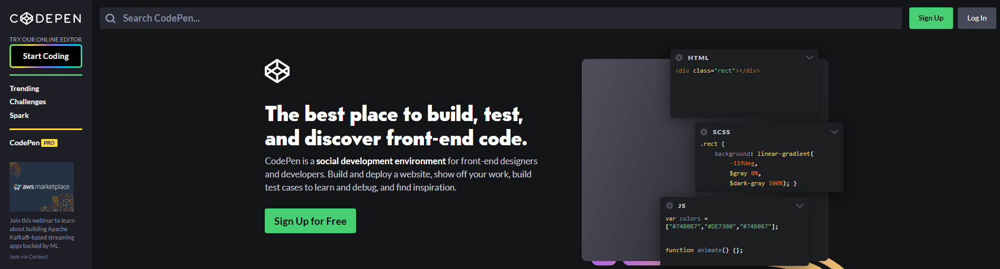
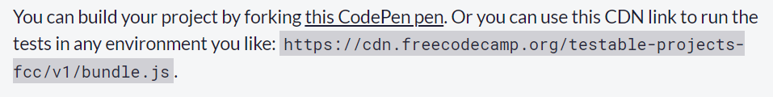
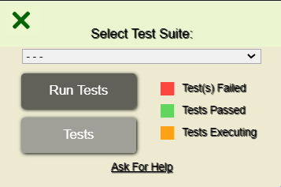
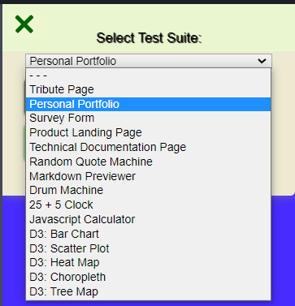
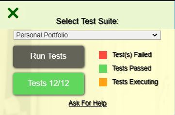
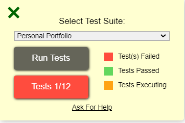
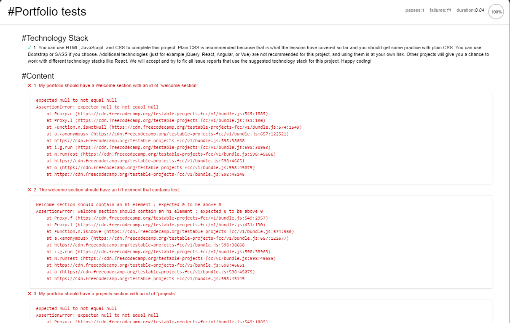
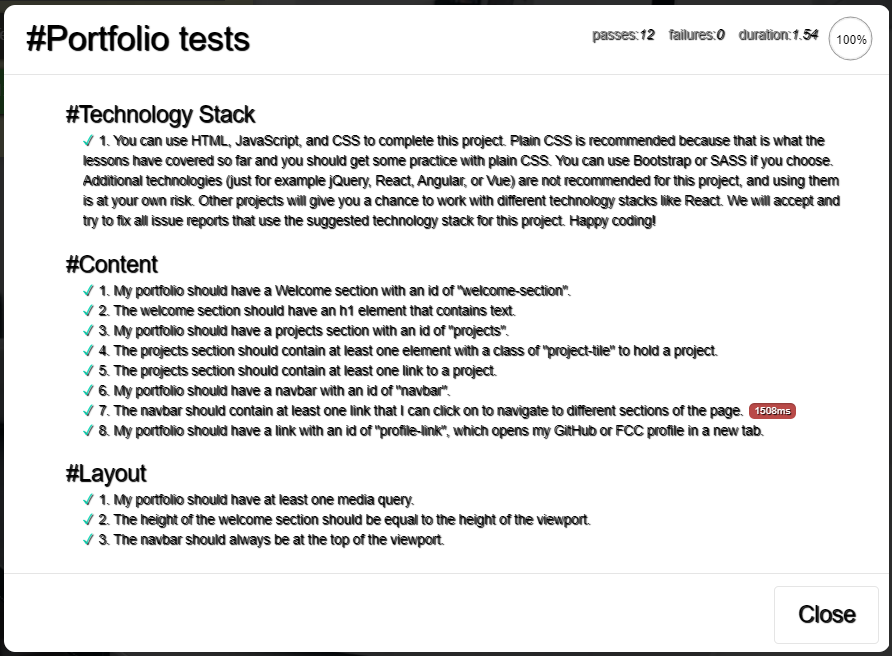
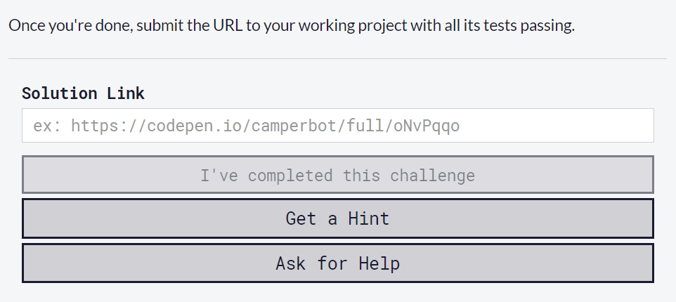
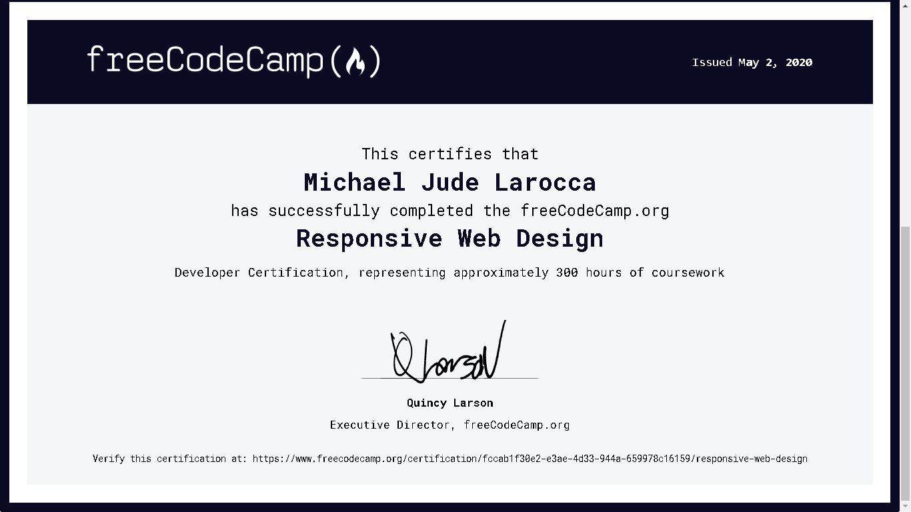

---

### So you decided to become a self-taught programmer. That's great! Now, where do you start?

#### I already went through the "self-taught" learning process, and I wrote this article as a guideline to help you.

#### I created this article with the intention of it being "the article I wish I had read when I first decided to learn front-end web development."

---


### Learn to code and earn a certification for free

For no cost, you can learn how to code online and earn a certification. I highly suggest you approach learning to code this way before making any financial commitments.

After you learn to code for free and earn your first certification, you will know if becoming a programmer is the right choice for you.

---

### Is it worth it to earn a Free Code Camp certification

**There are many benefits to earning a Free Code Camp certification:**

* Provides a goal for you
* Provides you with an accomplishment
* Provides a document for your resume
* You will create portfolio projects
* You will create a portfolio webpage

### How will you benefit from earning a  Free Code Camp certification

Working toward a certification provides an attainable goal and will help to keep you motivated.

When you complete the free course and earn your certification, you will have a sense of accomplishment, and you will have the document to add to your resume and portfolio webpage.

Yes, your portfolio webpage! After completing this course, you will have your very own webpage showcasing your completed Free Code Camp projects.

---

###### I would also like to share with you Dylan Israel's video that inspired me to earn Free Code Camps Responsive Web Design certification.

###### Dylan Israel is a self-taught programmer and currently works at Amazon, earning a six-figure income.

<iframe width="853" height="480" src="https://www.youtube.com/embed/O-h4i1ErDD4" frameborder="0" allow="accelerometer; autoplay; clipboard-write; encrypted-media; gyroscope; picture-in-picture" allowfullscreen></iframe>
---
---

**To learn more about Dylan Israel, you can read my [12/06/2020 post](https://selftaughttxg.com/2020/12-20/12-06-2020_TeacherFeature-Dylan_Israel/).**

---

### Why listen to me

I already completed and earned the Free Code Camp's Responsive Web Design certification.

I am a self-taught programmer that primarily learned how to code for free, watching YouTube tutorials and taking free online courses.

**Without proper guidance, I made mistakes, wasted time, got discouraged, and almost gave up learning to code.**

This article aims to create a guideline for new self-taught developers who are just getting started. **I hope to save you from making my mistakes, wasting time, and the discouragement that I went through.**

---


*© 1982 The Hitchhiker's Guide to the Galaxy, British Broadcasting Corporation (BBC) All Rights Reserved*

---

#### There is a lot to learn, and it is easy to get overwhelmed. Just know that it is attainable. While learning, keep these three steps in mind:

**Steps**

1. Have a clear learning path
2. Don't "push through" what you are learning
3. Only learn new topics when they become necessary

---

### Have a clear learning path

You are going to learn to code and earn your certification online, for free, from [Free Code Camp.](https://www.freecodecamp.org/)


Free Code Camp is an online coding school that is also a non-profit organization. They have a well-structured learning path and offer several certifications.

The time of completion for each course is approximately 300 hours. I completed the Responsive Web Design Certification in four months.

They are beginner-friendly. You do not need to have any prior programming experience to start, and you do not need to download and install the software. All you need is a computer and access to the internet.

To save your progress, sign in with your e-mail, Facebook, Google, or Github account.

Completing this certification gave me the foundation to create my website [michaeljudelarocca.com](https://michaeljudelarocca.com/). It also provided me with four projects to add to my projects page.

---

### Don't "push through" what you are learning

Take your time and understand the topics that you are learning before moving on to new ones. I am talking from experience.

Your goal is to build a strong foundation. When you are comfortable and understand the topics, then proceed with the course.

Don't try to race through the course just to earn the certification. Learning to code is a marathon, not a sprint. The certification will not do you any good if you don't know how to code!

And most importantly, do not be tempted to skip ahead and jump straight into learning JavaScript, as I did. JavaScript is most likely what you want to learn. Trust me on this one. I am talking from experience. I skipped straight to JavaScript, worked hard on it for a year, got discouraged, and nearly gave up learning to program altogether. You can read my article "[There and Back Again](https://selftaughttxg.com/2021/01-21/ThereAndBackAgain/)" for an in-depth description of what I went through.

But I don't have to worry about **you** skipping ahead, right? Good.

### HTML, CSS, and JavaScript

It is worth taking some time to explain why I'm suggesting not to learn JavaScript first.

What I did not know, when I jumped straight into learning JavaScript, is that HTML, CSS, and JavaScript go "hand-in-hand." Even if you learn JavaScript first, if you want to code a website, you will also need to know HTML and CSS.

Besides, HTML and CSS are much more gratifying when you are just starting to learn to program. How so? Your code produces instant results such as displaying text, color, images, and video, to name a few.

So if you are new to coding, please take my advice and learn HTML and CSS first, then learn JavaScript.

---


*© 1977 Star Wars: Episode IV - A New Hope, Lucas Film and Disney All Rights Reserved*

### Only learn new topics when they become necessary

Yes, there is a lot more to coding. However, I encourage you at the beginning of your coding journey to only concentrate on HTML and CSS. Stay on target, and only concern yourself about everything else when the time comes.

**When will you know when the time comes? You will know when the time comes.**

For example, at some point, you may ask yourself, "*what if I don't have access to the internet, and I want to code offline? How do I do that?*" Now the time has come to download and install a code editor. For a code editor, I suggest Microsoft's "free" **[Visual Studio Code](https://code.visualstudio.com/)**.

Another example, you may ask yourself, "*Now that I'm coding offline, how do I save and share my code?*" Now it is time to learn version control; I use **[Git](https://git-scm.com/)**. "*Furthermore, how do I get my website online?*" Now it is time to learn **[GitHub](https://github.com/)** and **[GitHub Pages](https://pages.github.com/)**.

Before you ask the next question, "*How do I make a custom domain name for my website?*" you should see my point on "**staying on target**."

Once again, I will ask you, "I don't have to worry about you skipping ahead, right?" Good.

I want you to just focus on learning HTML and CSS, and you are going to be practicing the topics that you are learning on a "free" online code editor called **[CodePen](https://codepen.io/)**.

With this learning approach, you will stay focused on the topics at hand, preventing you from getting overwhelmed or discouraged.

Earning a certification is attainable, and you can achieve it!

---

### CodePen



To reiterate, you will focus on learning HTML and CSS, and you are going to be practicing the topics that you are learning on [CodePen.](https://codepen.io/)

**What is Codepen?**

*Definition from Wikipedia:*

CodePen is an online community for testing and showcasing user-created HTML, CSS and JavaScript code snippets. It functions as an online code editor and open-source learning environment, where developers can create code snippets, called "pens," and test them.

---

### When you are ready to complete the Free Code Camp projects

When you reach the end of the course, you will need to complete five projects to earn the Responsive Web Design certification.

---

### Information from Free Code Camps website

**Responsive Web Design Projects**

Time to put your newly learned skills to work. By working on these projects, you will get a chance to apply all of the skills, principles, and concepts you have learned so far: HTML, CSS, Visual Design, Accessibility, and more.

Complete the five web programming projects below to earn your Responsive Web Design certification.

---

### Complete and showcase your projects

To help you in simplifying the process, to complete and showcase your projects, you will be developing them on [Codepen's](https://codepen.io/) website.

For each project on Free Code Camp's website, there is a link for you to click that will "fork" the project over to Codepen's website.

---

### How to fork

**What does it mean to "fork" a project**

*Definition from Wikipedia:*

In software engineering, a project fork happens when developers take a copy of source code from one software package and start independent development on it, creating a distinct and separate piece of software.

---

### How to fork the Free Code Camp projects

Free Code Camp provides a link to click for each of their projects. Clicking on the provided link will create a fork of the project on Codpen's website.



After the project is forked on Codpen's website, if you are not already logged into Codpen, log in and save the project.

**Free Code Camp provides you with the following instructions:**

```javascript
/***********
INSTRUCTIONS:
  - Select the project you would 
    like to complete from the dropdown 
    menu.
  - Click the "RUN TESTS" button to
    run the tests against the blank 
    pen.
  - Click the "TESTS" button to see 
    the individual test cases. 
    (should all be failing at first)
  - Start coding! As you fulfill each
    test case, you will see them go   
    from red to green.
  - As you start to build out your 
    project, when tests are failing, 
    you should get helpful errors 
    along the way!
    ************/
```

---

### The test suite

When you have a forked project on Codepen, Free Code Camp provides you with a "Test Suite."



The test suite is in the form of a dialog box. The dialog box has a dropdown menu with all of the projects, a "Run Tests" button, and a "Tests" button.

How the test suite works
Choose the project that you are working on from the dropdown menu.



As you create your project, click the "Run Tests" button to see what requirements pass and what conditions failed.



Clicking on the "Tests" button will tell you what requirements pass and what conditions failed. 





---

###### Note: You can run the tests as many times as you like. You will not fail by running the tests and failing a certain amount of times.

---

### Your project is complete when all of the requirements for the project pass




---

### How to submit your project to Free Code Camp

You are now ready to submit your completed project by copying a link to your project and submitting it on Free Code Camp's website.


After submitting all five "test suite" passing projects, you will earn and receive your Responsive Web Design Certification.



---

### My submitted Free Code Camp projects

Here is a link to my completed Free Code Camp portfolio project, which includes the remaining four projects that I submitted to earn the certification.

[Code Pen: Michael Larocca](https://codepen.io/Michael_Larocca/pen/NWGaKOP)

##### Here is my Responsive Web Design Certification



---

###### Note: If you can financially afford to, please consider a monthly contribution to Free Code Camp. Free Code Camp accepts monthly donations of $5 to help their non-profit organization run.

---

### Conclusion

With a clear learning path, becoming a self-taught web developer is attainable. Make sure to build a strong foundation of the topics you learn before moving onto new ones.

Learning HTML and CSS first will provide you with a more enjoyable learning experience, as you instantly see the results of your code while building a webpage.

Earning a certification will give you a sense of accomplishment, a document to show, and the confidence to continue learning front-end web development.

Put in the time, be consistent, stay determined, and you will succeed!