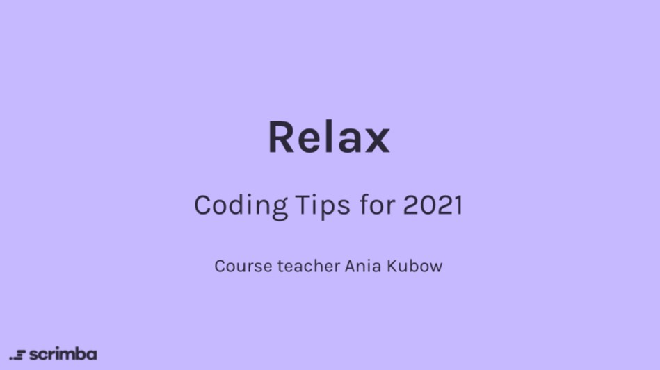

---

### In this Scrimba course, YouTube celebrity Ania Kubow shares 21 Web Dev Tips for 2021. To reinforce what I am learning and to document and share my progress, I wrote this article as I took the course!

---


---

### Course level: Beginner

21 essential tips and tricks for software developers in 2021, including how to make code and tools work for you and improve your wellbeing.

---

##### *Note: You may have to log in to Scrimba to view some of my coding solutions. In this article, I also provided code "snippets" of my code for these solutions.*

---


### Tips: 1 and 2

The course starts by covering "**clean code**" practices:
* Camel case
* Declaring variables
* Consistency in using quotation marks (**" "**) & (**' '**)
* Proper functions naming conventions

Ania advises removing all of the "**console.log()**" in your code when your programs are complete. I am guilty of console logs all over my code!

After Ania covers the "**clean code**" topics, there is a hands-on exercise. 

After you complete the exercise, the screencast resumes, and Ania goes over the solution with you. What an excellent way to learn!

I love that you can pause [Scrimba screencasts](https://selftaughttxg.com/2021/02-21/CreateAScrimbaScreencast/), edit the code, save your changes, and then continue. To learn more about Scrimba screencasts, and how to make your own, you can read my [February 01, 2021 article.](https://selftaughttxg.com/2021/02-21/CreateAScrimbaScreencast/)

---

Next is "**clean code**" practices in React:
* Consistency with semicolons
* JSX is formatted correctly
* Boolean values should start with 'is,' 'has' or 'should.'	
* Destructure your props

Ania states that you can skip this section if you are not familiar with React. Even though I have not yet learned React, I watched the screencast and found it very informative.

The consistency with semicolons and boolean tips is not constrained to React!

---


### Tip 3: Dry Principles 

The term "**Dry**" stands for "**Don't repeat yourself**." Using "**Dry**" principles is an important concept to understand when writing code.

In the exercise, we rewrite the monotonous code provided by using a for loop instead.

**Here is a link to my solution:**
[https://scrimba.com/scrim/co5a845468cd238c632a8bfba](https://scrimba.com/scrim/co5a845468cd238c632a8bfba)


```javascript
const students = ['Andy', 'Helena', 'Jose', 'Ian']

const listContainer = document.getElementById('list')
const listElement = document.createElement('ul')
listContainer.appendChild(listElement)

// Dry Code
for (let i = 0; i < students.length; i++ ) {
    const listItem = document.createElement('li')
    listItem.innerHTML = `${i + 1}. ${students[i]}`
    listElement.appendChild(listItem)
}
```

---

### Tip 4: Test-Driven Programming

Ania explains that before you submit production-level code, it is standard procedure to run unit tests.

In this section, "**Jasmine**" is used to run the unit tests. 

Divide your tests into three sections:
* Arrange
* Act
* Assert

The **arrange** section is where you write the code required for the specific test.

The **act** section is the invocation of the method being tested.

The **Assert** section checks if the test expectations were met.

---

### Tip 5: Test-Driven Programming - continued

In this exercise, a program to reverse a string is provided. We are asked to write the unit test to check if the program is working.

I got to write my first unit test, and it worked on the first try!

***Here is my solution:***
[https://scrimba.com/learn/21tips/tip-5-unit-testing-co76043c68e6fea75662d981f](https://scrimba.com/learn/21tips/tip-5-unit-testing-co76043c68e6fea75662d981f)


```javascript
function reverse(str) {
    // write code here
    let splitString = str.split("")
    let reverseArray = splitString.reverse()
    let joinArray = reverseArray.join("")
    return joinArray
}

/**
* Test Suite 
*/
describe('reverse()', () => {
    it('reverses a word', () => {
        // arrange
        const strTest = `HELLO`
        // act
        const result = reverse(strTest);
        // log
        console.log(`Result: ${result}`);        
        // assert
        expect(result).toBe(`OLLEH`);
    })
})
```

---

### Tip 6: TypeScript

What is TypeScript? TypeScript is an open-source programming language developed by Microsoft. TypeScript is a superset of JavaScript, and it needs to be compiled.

I enjoyed this exercise! With TypeScript, you specify the type of variable.

``` javascript
function sendText (isLate: boolean, name: string, time: number){};
```

---

### Tip 7: TypeScript 2

In this section, Ania gives us an example of using TypeScript with arrays.

Interestingly, the method "**includes**" does not work with an array of strings in TypeScript. So the code in the example had to be refactored to use "**indexOf**."

In this challenge, we have to refactor the given code using TypeScript on a program that checks if movies are available to rent.

**Here is my solution:**
[https://scrimba.com/learn/21tips/tip-72-typescript-challenge-coe1b4d61b4675dbfd3868999](https://scrimba.com/learn/21tips/tip-72-typescript-challenge-coe1b4d61b4675dbfd3868999)


```javascript
// TypeScript mini Challenge

const movies = ['elf', 'bad boys', 'mulan', 'diehard']
const movie = 'elf'

function checkMovies(movies: Array<string>, movie: string) {
  document.getElementById('movie').innerHTML = movies.join();
  
  const resultDisplay = document.getElementById('result')
  
  const result: boolean = movies.indexOf(movie) > -1;
    console.log(result);
  const resultString = result.toString();  
    console.log(resultString);
    
  resultDisplay.innerHTML = resultString;
}

checkMovies(movies, movie)
```

---

### Tip 8: Creating Helpers

Why create **helpers**? Ania explains that helpers make complicated or repetitive tasks more manageable, and it helps to keep your code "**dry**."

In this section, there is a React program that stores monetary transactions. 


The monetary numbers that are being passed through the program have more than two decimal places. Ania writes a function to resolve this issue, using **parseFloat()** and **toFixed(2)**.

However, for the program to fix all of the monetary numbers, the function must be copied to another section of the program. This does not conform to the "**do not repeat yourself**" method.

This is where creating **helpers** come in!

Ania created a new file just for **helpers**, "**helpers.js**." She then moves the function that she made to the new **helpers.js** file and then exported it.

Very cool!  

**Challenge**

Ania creates a new function in **helpers.js** to add up all of the passed prices and return the total.

```javascript
    function getTotal(transactions) {
        if (!transactions) return 0
        return transactions.reduce((total, transaction) => total + transaction, 0)
    }
```

Wow. After watching this section, I now see how to organize code in a program much better! 

---

### Tip 9: Creating Polyfill

What is a **polyfill**? I had to look it up!  A **polyfill** is code that implements a feature on web browsers that do not support the feature.

Ania elaborates, "as a developer, it is our job to make our website accessible to everyone, no matter what browser they are viewing it on."

 Since Internet Explorer does not support the JavaScript **includes()** method, a new function must be created for the "**Price Display**" program to work on that browser.

Ania creates a new file **utils.js** to write the **polyfill** function. A new function is written, exported from **utils.js**, and then imported to **PriceDisplay.js** for use.

---

### Tip 10: Ternary Operations

Ternary Operations allow you to refactor your code into a simple "**one**" line of code.

In this example, a five-line "**if**" statement is rewritten to one line of code.

**Before:**
```javascript
if (isGameOver) {
  textDisplay.innerHTML = 'Oh no! You lost!'
} else {
  textDisplay.innerHTML = 'YAY! You WON!'
}
```

**After:**
```javascript
textDisplay.innerHTML = isGameOver ? 'Oh no! You lost!' : 'YAY! You WON!'
```

**Challenge:**
We get to write a ternary operation to display an emoji, based on the variable "**isGameOver**" true or false results!

**Here is my solution:** [https://scrimba.com/scrim/co1524c48bd68b27f6af9b8e9](https://scrimba.com/scrim/co1524c48bd68b27f6af9b8e9)


```javascript
// Ternary Operations
const textDisplay = document.getElementById('text')
const emoticon = document.getElementById('emoticon');
const isGameOver = false;

emoticon.innerHTML = isGameOver ? '😡' : '😁';
textDisplay.innerHTML = isGameOver ? 'Oh no! You lost!' : 'YAY! You WON!'
```

---

### Tip 11: Optional Function Execution

This section presents a program that displays a happy or sad face based on a variable "**isHappy**" that has a true or false value.

We are asked to create a new variable, "**isFlirty**," that has a true or false value. If the variable "**isHappy**" is true, and the variable "**isFlirty**" is true, we are asked to make an eye wink.

**Here is my solution:**
[https://scrimba.com/scrim/codc041439b0a9956e115bd0e](https://scrimba.com/scrim/codc041439b0a9956e115bd0e)


To solve the challenge, I created a "**wink**" class. 

```css
.wink {
    width: 40px;
    height: 10px;
    border-radius: 1px;
    margin: 30px 20px;
}
```

I then accessed the left eye by writing this code:

```javascript
const eyeLeft = document.getElementsByClassName('eye')[1];
```

Then I created an if statement to add the class to the left eye if the proper conditions were met.

```javascript
if(isHappy && isFlirty) {
    mouth.classList.add('smile');
    eyeLeft.classList.add('wink');
} else {
    mouth.classList.add('smile');
}
```

---


### Tip 12: Free Code Extensions

In this section,  Ania provides us with a list of helpful code extensions.

* [ESLint](https://eslint.org/)

* [Tabnine](https://www.tabnine.com/)	

* [Prettier](https://prettier.io/)

Ania also uses Visual Studio Code.

* [Visual Studio Code](https://code.visualstudio.com/)

**ESLint** is a tool used to look over your ECMAScript/JavaScript code to report errors. Using ESLint helps you to keep your code more consistent and helps you to avoid creating bugs.

**Tabnine** is an IDE plugin that helps you to code faster as it offers code suggestions, similar to autocompletion. As well as its built-in suggestions, Tabnine learns your coding style to serve you better.

**Prettier** is a code formatter. When used, it will format your code to your set specifications, making it more organized, more readable, and prettier!

**Visual Studio Code** is a free code editor designed by Microsoft. I also use this code editor, and I'm using Visual Studio Code right now to create and publish this article!

---

### Tip 13: Top Tools to Use in Development

In this section, Ania shares helpful tools that she uses.

**JSONView**

[JSONView
](https://chrome.google.com/webstore/detail/jsonview/chklaanhfefbnpoihckbnefhakgolnmc?hl=en) is a Google Chrome extension used to format JSON files. Without it, viewing a JSON file is just one continuous line of text.

The formated view adds color to strings and integers, and Ania also states that using the extension makes it easier to work with an API.

**React Developer Tools**

The next tool is also a Google Chrome extension, [React Developer Tools.](https://chrome.google.com/webstore/detail/react-developer-tools/fmkadmapgofadopljbjfkapdkoienihi?hl=en) 

This tool lets you inspect and edit the React components. It also allows you to view the hierarchy of the React components in the Chrome developer tools.

---

### Tip 14: Free to Use REST APIs for Projects

**{JSON} Placeholder**

Free to use fake online REST API for testing and prototyping.
[{JSON} Placeholder
](https://jsonplaceholder.typicode.com/)

Ania explains that the {JSON} Placeholder is great for beginners to use for practice projects. I will definitely get good use out of this!

Next up is the [REST Countries API.](http://restcountries.eu/) This API is easy to work with because you do not need an access token.

Ania states that you can access all of the world's countries, and it provides a lot of details for use in your projects.

Lastly, Ania introduces us to her custom made [Burger API!](https://my-burger-api.herokuapp.com/burgers)

Here is a link to the [burger-api GitHub project.](https://github.com/kubowania/burger-api)

She also created an instructional YouTube Video on it.
[YouTube Video](https://www.youtube.com/watch?v=FLnxgSZ0DG4&feature=youtu.be)

<iframe width="618" height="338" src="https://www.youtube.com/embed/FLnxgSZ0DG4" frameborder="0" allow="accelerometer; autoplay; clipboard-write; encrypted-media; gyroscope; picture-in-picture" allowfullscreen></iframe>

---
---


### Tip 15: Tips for Remote Work

In this section, Ania gives us advice on working remotely. 

She recommends **setting up a designated workspace**. I think that is an excellent idea that might be overlooked. If you do not have a dedicated home office, You can set up an area of a room. 

Next, she recommends that you **be prepared by having all the tech that you need**. Specifically, Ania states that you need to have a secure internet connection.

In addition to the internet, you should have any necessary files, hardware, and software, remote access to your company network, and importantly, knowledge of how to get I.T. support if anything goes wrong.

Another great point that Ania brings up is to **change into work clothes**. Changing your clothes helps you to differentiate between home life from work life.

Next, **set up a to-do list**. It will help you to be organized, and you will feel a sense of completion upon checking the completed tasks off.

Ania also suggests that you **turn on your web camera**. By doing this, you are actively engaging in a better and more productive way. It also helps you to foster better relationships.

She also brings up a good point on communication. She suggests that you "**over-communicate**." Meaning that if you are texting, a lot of visual cues would be missed by your colleagues.

Next up, Ania suggests that you **ask for a mentor** or ask for support when needed. Your manager, your colleagues, and you are part of a team, and you should be supporting each other.

**Set up 1 on 1's** with your manager and your mentor. Set up a meeting weekly or biweekly to spend time going over issues in more depth. Building a strong relationship is beneficial to them and you.

Be sure to **stay in the loop**! Contribute regularly to chats and e-mails, so you don't drop off the radar. Ask what your colleges are working on and show them the work your doing.

Finally, **be kind**! Working remotely, especially when it is forced upon you, can be difficult. Be kind to others as you would like others to be kind to you.

I enjoyed this section, and I noticed that you could easily apply all of Ania's tips to attending "remote school learning."

---

### Tip 16: Tips for Webcam Setup

* Sit up straight
* Make sure the camera is eye height 
* Lighting is key
* Test before going live

Sitting up straight with the camera at eye level keeps your posture correct and projects confidence.

Your light source should point the light source at or above you, not from behind you.

Test with someone before you go live. You want to make sure your audio, video, and internet connection is working correctly.

Knowing that everything is working for your video stream will reduce stress and anxiety.

**How to seed up your connection**

* Close down everything
* Check internet speed
* Older vs. newer machines
 
To speed up your connection, close down any "**not in use**" applications.

Use an application to check your internet speed.

The internet will work better and faster on newer machines. 

The last tip is accurate in my case, as my laptop computer does not support 5G.


**Alternatives to webcams**

* Phone or Tablet
* External Streaming Cameras

I found the tips in this section to be very helpful. In my experience, I always use an ethernet connection, if available, on a device that I am using to secure a fast and stable internet connection.

---

### Tip: 17 My Web Dev Routine

In this section, Ania shares with us her own web dev routine.

**Ania's Typical Day (working remotely)**

* 9:00 am: wake up
* 9:30 am: set and ready for work 
* coding
* 10:15 am: daily stand-up 
* coding
* 12:30 pm: lunch 
* coding
* 5 pm: finish

**Ania's A-Typical Day**

* 9:00 am: wake up
* 9:30 am: set and ready for work 
* 10:15 am: daily stand-up 
* 11: am: refinement
* 12:30 pm: lunch 
* 1:00 pm: show and tell
* 3:00 pm: retro
* 4:00 pm: 1 on 1 with manager
* 5:00 pm: finish

---

**Typical words you will hear as a developer:**
* Daily stand-up
* A sprint
* Refinement
* Retro

A "**daily stand-up**" consists of developers that work in a team, along with their project managers and business analysts, discussing what they did the day before, what they are working on currently, and if they have any blockers.

A "**sprint**" is a way of working in a "**scrum**." That means they have a set amount of tickets to finish in a **sprint**.

"**Refinement**" is a meeting that is held at the end of a **sprint** to ensure that the backlog is ready for the next **sprint**.

A "**retro**" is going over the last **sprint** and discuss what went good, what went bad, and what was enjoyed.

---

**Relax your mind**

* No code after 8 pm
* Eat well
* Slow your brain

**Ania warns:** Burn-out is real. Let's be conscious and overcome it!

---

This is insightful information that Ania shares with us in this section.

While learning to code, we are most likely not concerned or would even think about the "**Typical words you will hear as a developer**" that she introduces to us.

Ania going into detail of daily developer workflow prepares us for what is to come.

---

### Tip 18: YouTubers to Follow

Before I go over this section, it is fair to say that the included YouTubers that Ania lists are deserving of their own individual in-depth articles. 

As a self-taught developer myself, I have spent many hours "**watching and learning**," pun intended,  from these and many other YouTube coding instructors.

**So without further ado, here is Ania's list:**

* [James Quick](https://www.youtube.com/channel/UC-T8W79DN6PBnzomelvqJYw)
* [Gwen Faraday](https://www.youtube.com/channel/UCxA99Yr6P_tZF9_BgtMGAWA)
* [Thomas Weibenfalk](https://www.youtube.com/user/Weibenfalk)
* [Jesse Hall](https://www.youtube.com/channel/UCDCHcqyeQgJ-jVSd6VJkbCw)
* [Gary Simon](https://www.youtube.com/user/DesignCourse)
* [Kevin Powell](https://www.youtube.com/user/KepowOb)
* [Ania Kubow](https://www.youtube.com/channel/UC5DNytAJ6_FISueUfzZCVsw)

**In addition to Ania's list, I would like to add a few other YouTube coding instructors/channels that also inspire me:**

* [Dylan Israel](https://www.youtube.com/user/pizzapokerguy87)
* [Web Dev Simplified](https://www.youtube.com/channel/UCFbNIlppjAuEX4znoulh0Cw)
* [Traversy Media](https://www.youtube.com/user/TechGuyWeb)
* [Simple Programmer](https://www.youtube.com/channel/UCRxWW_Ncs308nW4An23Yeig)
* [Dev Ed](https://www.youtube.com/channel/UClb90NQQcskPUGDIXsQEz5Q)
* [Derek Banas](https://www.youtube.com/channel/UCwRXb5dUK4cvsHbx-rGzSgw)
* [Uncle Bob (Robert Cecil Martin)](https://www.youtube.com/channel/UCfaJt1SFvmSfjL2iKX-ZuBA)
* [Scott Hanselman ](https://www.youtube.com/channel/UCL-fHOdarou-CR2XUmK48Og)
* [Joe Collins](https://www.youtube.com/channel/UCTfabOKD7Yty6sDF4POBVqA)
* [whatsdev](https://www.youtube.com/channel/UC0tRdbXVDbhaRvZPKsRgmxg)
* [The Coding Train](https://www.youtube.com/user/shiffman)

Different instructors can encourage us in different ways, and there are new YouTubers starting channels every day. The important thing to take away from this is to find coding instructors that inspire you, personally. 

Following instructors that inspire you will help to keep you motivated while you are learning. 

---

**Pro-Tip**

*To avoid discouragement, I advise you not to compare your code learning progress to others. Only you know how much time, effort, and sacrifice you make during your learning journey.*

*Know that everyone learns at their own pace. The only person you should compare yourself to is yourself, a week ago, a month ago, and a year ago.*

---

### Tip 19: Scrimba Discord Channels
<!--  -->

Those who know me know that I am a proud advocate for Scrimba's Discord channel. I can not speak highly enough about it. 

Scrimba staff members, including their CEO Per Borgen, are very attentive and regularly engage with their Scrimba Discord members.  

Scrimba Discord channels and groups are thriving with like-minded students eager to learn and help their classmates.

Learning to code with Scrimba's Discord community for me has been life-changing, and if you give them a chance, you may also have an experience that is greatly beneficial to you.

For further reading on my Scrimba Discord experiences, you could read my article ["I Get By With a Little Help from My Friends"](https://selftaughttxg.com/2021/01-21/LittleHelpFromMyFriends/).

With all of that said, here is Ania's recommended Scrimba Discord Channels in this section of the course:

**Scrimba Discord Channels that Ania lists**

* frontend-path
* ui-design
* javascript-help
* i-built-this
* support

**Scrimba Discord User Groups that Ania lists**

Scrimba Discord User Groups are based on geographical location.


Careers & Advice


---

### Tip 20: Stress Management

<!--  -->

Ah yes, stress management. As if learning to code wasn't hard enough. Stress is something that we all have to deal with, and Ania was wise to address it.

**Here are Ania's 5 Stress Busters:**

* Be Active
* Take Control
* Work Smarter
* Avoid Unhealthy Habits
* Help Others

**Be Active**
Exercise won't make your stress disappear, but it will reduce some of the emotional intensity that you're feeling.

**Take Control**
If you remain passive, the problem will persist. Try to be a solutionist.

**Work Smarter**
Working smart and working hard are two different things. Prioritize work by tackling the hardest things first.

**Avoid Unhealthy Habits**
In the long term, these crutches won't solve your problems. They'll just create new ones.

**Help Others**
Helping others helps put things in perspective. It also means you connect and build a community.

Following these tips are not just great for learning to code. They are also great for everyday life.

---

### Tip 21: Relax

<!--  -->

Ania's final tip is to simply relax.

Exploring relaxation can help your mind in the long run. It can help you prevent burnout and to manage stress better.

One of Ania's relaxation tips is drawing. **Drawing** will provide you with a "**non-screen**" activity that will:

* Distract you from worrying thoughts
* Give you an outlet and focus for your emotions
* Simulate your senses

The other relaxation tip Ania has is to "**take a moment in nature**."

Mindfulness is a way of paying attention to the present moment. Ecotherapy has been found to reduce stress, anxiety, and depression.."

---

**I'm having a wonderful experience with Scrimba, and I can highly recommend it! You can read my full [Scrimba review](https://selftaughttxg.com/2020/12-20/Review-Scrimba/) on my 12/13/2020 post.**


#### *"That&#39;s one of the best Scrimba reviews I&#39;ve ever read, <a href="https://twitter.com/MikeJudeLarocca?ref_src=twsrc%5Etfw">@MikeJudeLarocca</a>. Thank you! 🙏 "*
###### &mdash; Per Harald Borgen, CEO of Scrimba <a href="https://twitter.com/perborgen/status/1338462544143540227?ref_src=twsrc%5Etfw">December 14, 2020</a></blockquote>

---

### TXG Review Results:

#### *Ania's 21 Web Dev Tips for 2021 course is one "one-hour" course you don't want to miss!*

[Scrimba course: 21 Web Dev Tips for 2021](https://scrimba.com/learn/21tips)

---

### Conclusion

Documenting and sharing my progress while taking this course helped me to reinforce what I was learning. Having to explain the topics coved in each section helped me with developing my communication skills.

I believe that **you** would also benefit from documenting and sharing your progress while taking courses, even if you decide not to post them publicly.

It did take longer to get through the course with this method. However, I learned from personal experience that what is most important is to "**get**" the lessons, not just "**get through**" them.

I benefited from and enjoyed taking this course, and I believe that you will too!