---

## You love your children, and you love to code. Would you love to spend quality time with your children, encouraging them and teaching them to code? Then let me introduce you to "**Scratch**" programming!

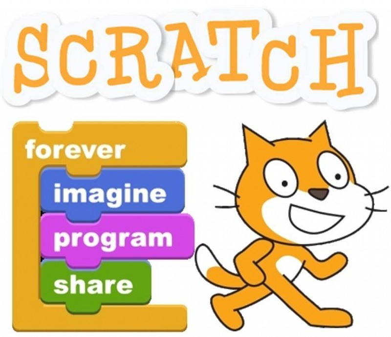

### What is Scratch

Scratch is a programing language designed by software engineers at the Massachusetts Institute of Technology (MIT).

If you are an avid movie watcher like I am, you may have heard MIT mentioned, usually citing a character as a genius.

After learning to program in Scratch and genuinely understanding the implications and potential to instruct and inspire our children that they have accomplished, I can see why!  

---

###### *© 1996 Independence Day - Twentieth Century Fox, All Rights Reserved*

#### “If you're so smart, tell me something, how come you go to M.I.T. for 8 years to become a cable repairman?” - Julius complaining to David.

######  Follow this link to learn more about [MIT in popular culture](https://en.wikipedia.org/wiki/MIT_in_popular_culture)

---

### Mitch Resnick's Ted Talk

The MIT team created Scratch for children to become fluent in new technologies, meaning, to start expressing themselves and their ideas.

Young people today, according to Mitch, are referred to as "**digital natives**." However, he is skeptical of this term.

Mitch then elaborates that children are comfortable and familiar with browsing, chatting, and gaming. However, being comfortable with technology doesn't make you fluent.

Mitch makes an interesting comparison by explaining that children can read but cannot write with new technologies.

Finally, Mitch states that he is interested in helping young people become fluent in writing with new technologies.

---

**Here is Mitch Resnick's outstanding Ted Talk on YouTube.**

<iframe width="853" height="480" src="https://www.youtube.com/embed/Ok6LbV6bqaE" frameborder="0" allow="accelerometer; autoplay; clipboard-write; encrypted-media; gyroscope; picture-in-picture" allowfullscreen></iframe>

---
---

### How the Scratch programing language works

To program in Scratch, you drag and drop "**code blocks**" from the block palette to the script pane.

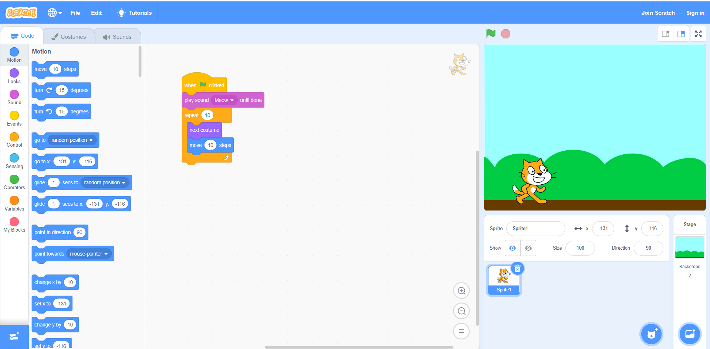

##### By adding one background and just five code blocks, I wrote a program where a sprite meows and then walks across the screen.

### code blocks

* Motion
* Looks
* Sound
* Events
* Control
* Sensing
* Operators
* Variables
* My Blocks

The code block categories are color coordinated, making programming in Scratch organized, easy, and comprehendible.

All of the "**heavy lifting**" of the programing language is taken care of in the background, allowing children to focus on the "**logic**" of programming, not the syntax. 

---
#### Extensions

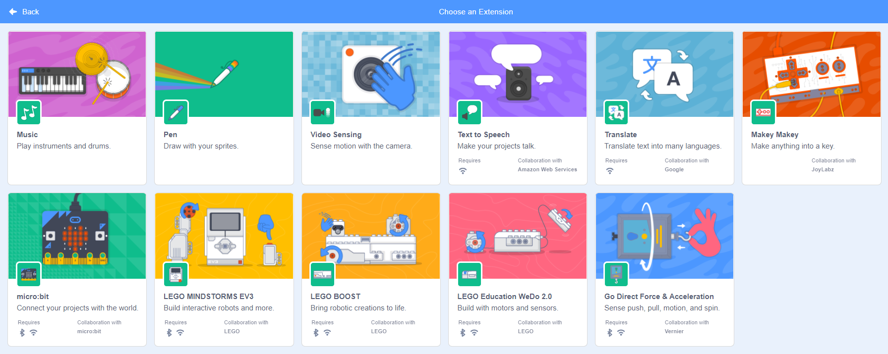

Scratch projects also support video sensing through a webcam, speech through a microphone, and Bluetooth connected devices.

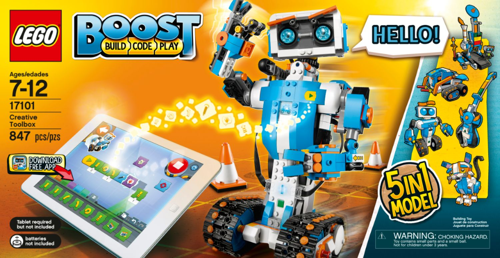

We have a Lego set at home that enabled us to build a remote-controlled car and drive it using a laptop computer!

---

### Scratch Cat

##### Meet Scratch Cat, the mascot of the programing language Scratch!

This cute little fellow is the default sprite when you start a new Scratch project. Scratch provides an assortment of sprites to choose from and gives you the ability to import or create your own!

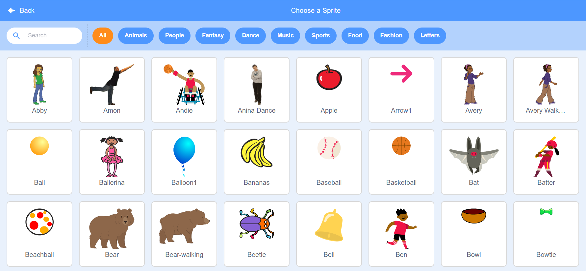

---

### Online tutorials 

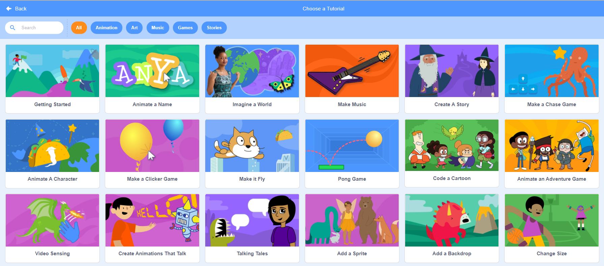

On their website's [ideas page](https://scratch.mit.edu/ideas), they provide free tutorials that teach you how to program in Scratch.

---

### Coding cards

On their website's [ideas page](https://scratch.mit.edu/ideas), they also provide a free pdf download of their entire collection of coding cards!

---
### Scratch's online community

After you create your story, game, or animation, you can share it on the Scratch website!

The Scratch website provides the ability for children to share, collaborate, and comment on projects.

Scratch members can also join or create a "**Studio**." A Scratch **studio** is a place where users can put multiple projects into an accessible group.

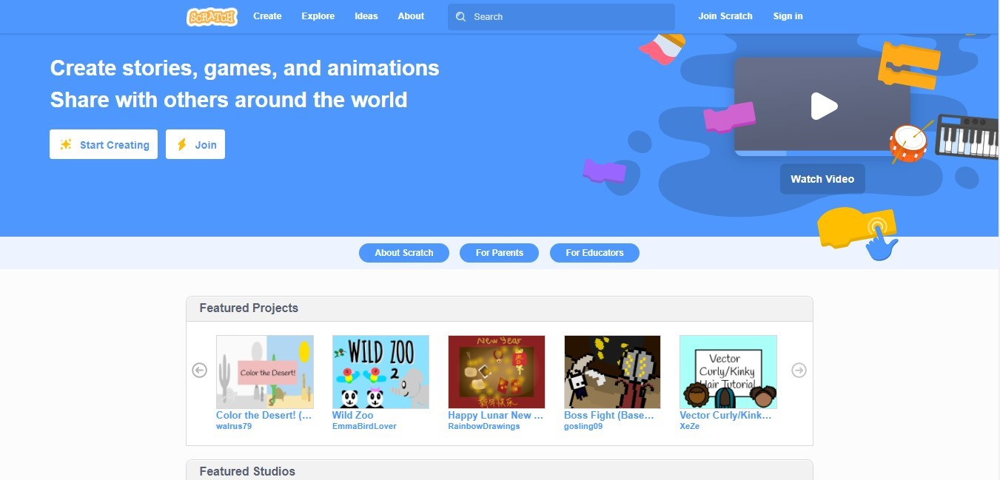

On the main web page of Scratch, you will find "**Featured Projects**," "**Featured Studios**," "**What the Community is Remixing**," and "**What the Community is Loving**."

Giving children the ability to socialize in this manner is an excellent learning opportunity for them!

---

### YouTube channel

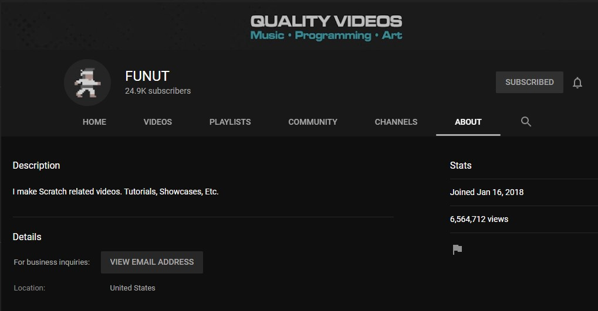

##### To further learn advanced programing in Scratch, I found this insightful YouTube channel, "**FUNUT**." I've spent many hours learning with this channel, and I can highly recommend it!

[Scratch Tutorials Funut](https://www.youtube.com/c/ScratchTutorialsFunut/playlists)

---

### What my daughter and I created with Scratch

In Mitch Resnick's Ted Talk, he presented and demonstrated e-card projects that Scratch students made. He then tells us a personal story about sending his mom several e-cards for Mothers Day. Then, his 83-year-old mother learned how to program an e-card, created one, and sent it to him!

Inspired by Mitch's Ted Talk, my daughter and I decided to program a [Christmas e-card](https://scratch.mit.edu/projects/264093902/) and send it to our family members as gifts!

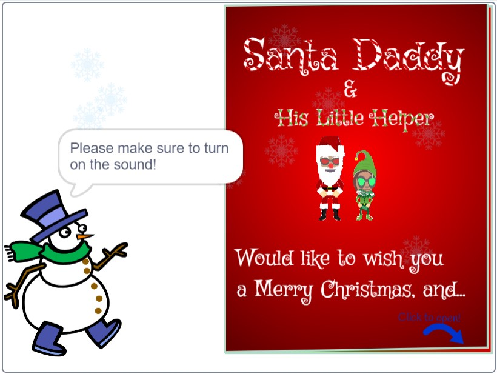

---
### How we created the Christmas e-card

* Forked an e-card project
* Designed the e-card
* Created the game

#### Forked an e-card project

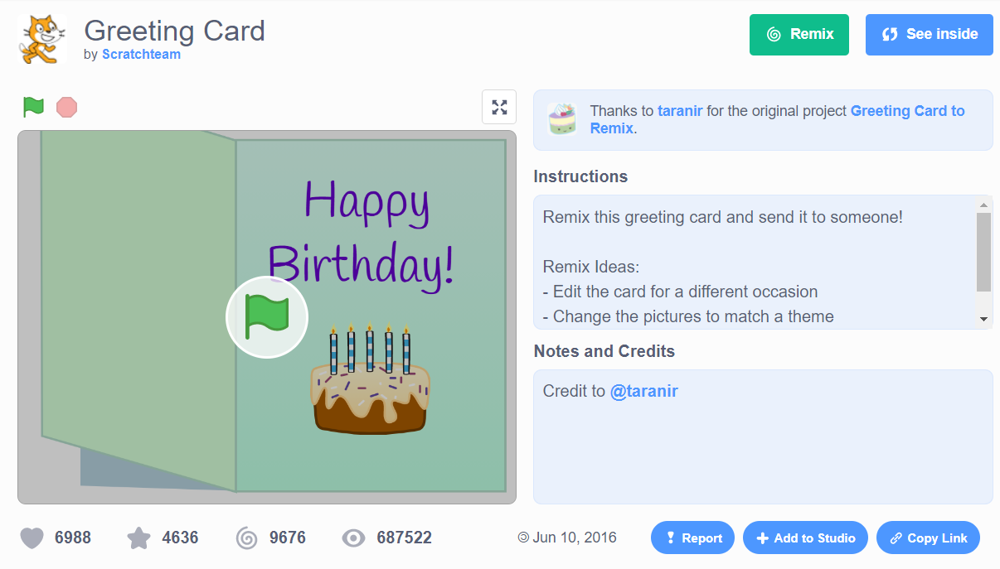

When you write a Scratch program, it is relatively common to start by forking an already created project. In Scratch, they refer to a fork as a "**Remix**."

To start, I "**Remixed**" the Greeting Card project, created by the Scratch team. Interestingly, the Scratch team forked their Greeting Card project from [**taranir**](https://scratch.mit.edu/users/taranir/), an MIT student.

#### Designed the e-card

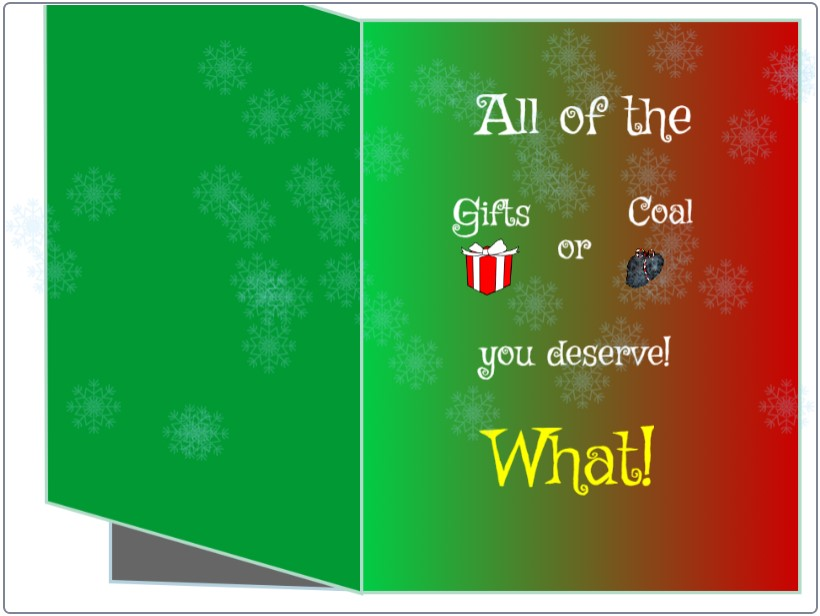

I then redesigned the Greeting Card project with a Christmas theme. My daughter and I then sang and recorded "**We Wish You a Merry Christmas**" with a twist! We changed the lyrics to "**and all the gifts or cole you deserve!**" We changed the lyrics to foreshadow the game we made.

#### Created the game

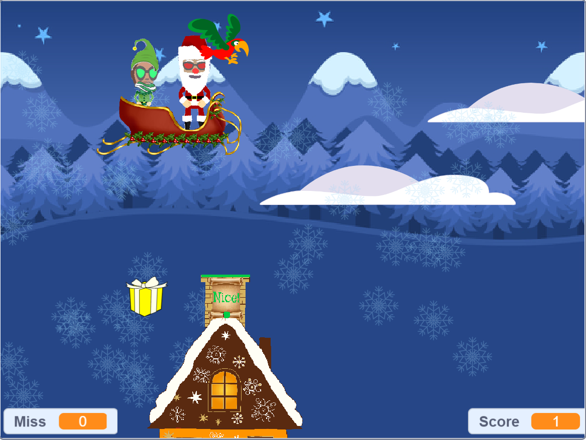

[Play the game: Christmas Card and Game 2018](https://scratch.mit.edu/projects/264093902/)

In the game, you deliver cole or gifts to houses that are marked naughty or nice. You control "**Santa Daddy's**" sleigh while you or a second player control "**Santa Daddy's Little Helper**" to launch cole or gifts.

---

**Game Instructions:**

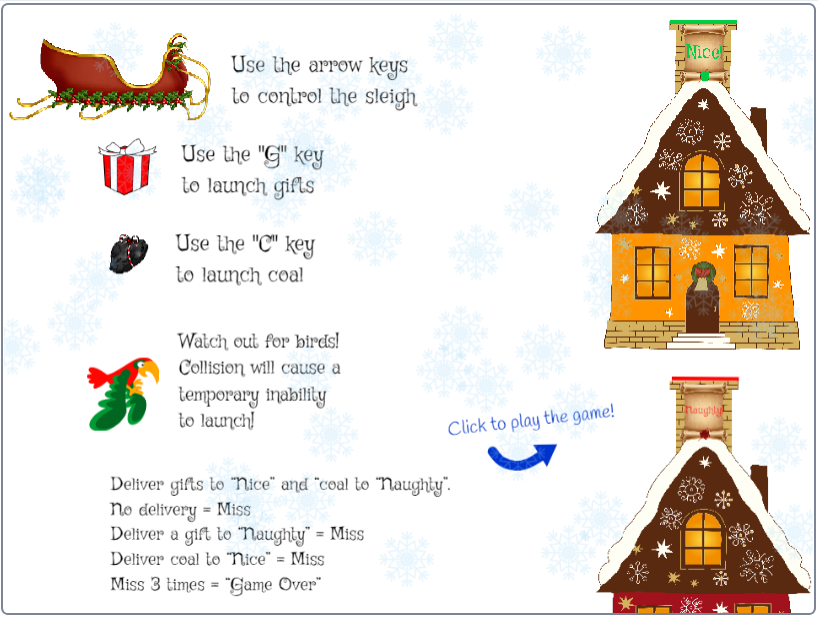

---

#### In-Game Music

Using Scratch's music code blocks, I created music for the game. 

When you deliver cole to a naughty house, the melody of the song "**Nuttin' for Christmas**" is played.

When you deliver gifts to a nice house, the melody of the song "**We Wish You a Merry Christmas**" plays.

The Christmas e-card was a big hit with my family! My aunt even made an audio recording, on her cellphone, of the song we sang in the program!

---

### Letter Invaders!

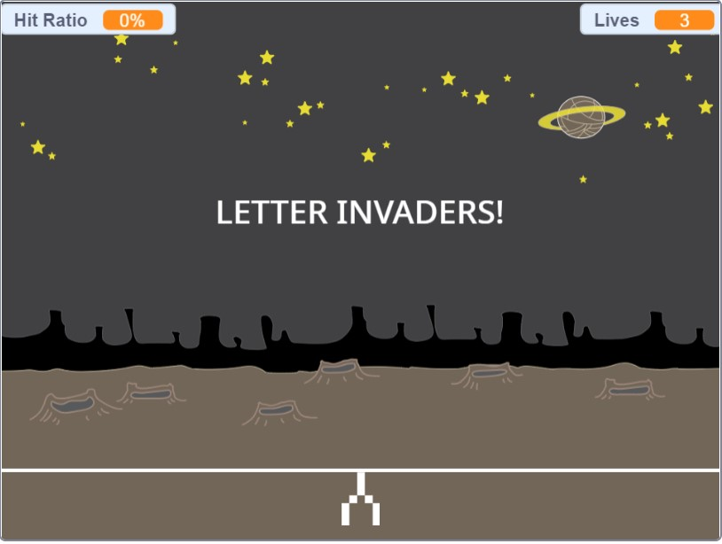

[Play the game: Letter Invaders!](https://scratch.mit.edu/projects/270834003/)

This game I created from Scratch, pun intended!

The inspiration to write this game was to teach my daughter how to "**touch type**" on a keyboard correctly. I based the design of the game on typing tutor games that I use to play.

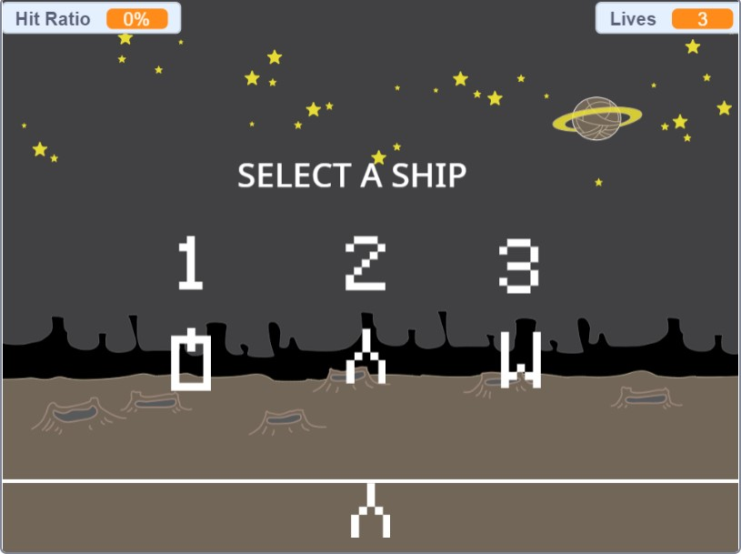

In the game, you start by choosing one of three spacecraft. Each ship has a unique laser shot and sound effects, and the spaceships are actual letters! I decided that this would be a fun way to keep the overall style of the game uniform.

The control style of this game is not similar to a typical "**Space Invaders**" type game. You do not control the ships with the arrow keys or the mouse in the game, nor do you shoot the lasers with the space bar or a mouse click. Instead, you hit the descending letters and numbers by typing the appropriate keys at the proper time.

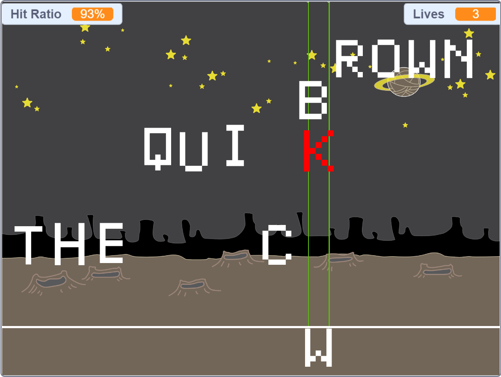

You start the game with three lives. I created a barrier that lies directly above your ship for protection. If a letter or number breaches the barrier, a life is lost.

**The game consists of four waves:**

* The entire alphabet, descending in order
* The sentence "The quick brown fox jumps over the lazy dog"
* Numbers, dropping in order
* Boss battle

The game ends when you lose all of your lives or make it to the end and survive the boss battle!

---

### Dress Baby Yoda!!!

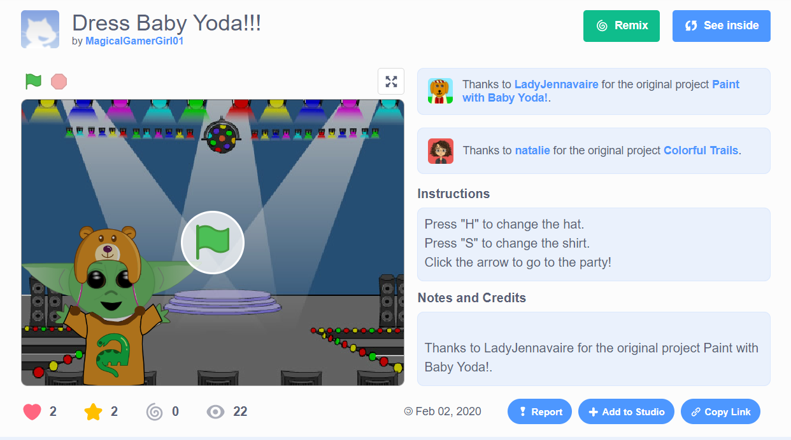

Using what she learned with the Scratch programming cards, my daughter created the game [Dress Baby Yoda!!!](https://scratch.mit.edu/projects/364519174/)

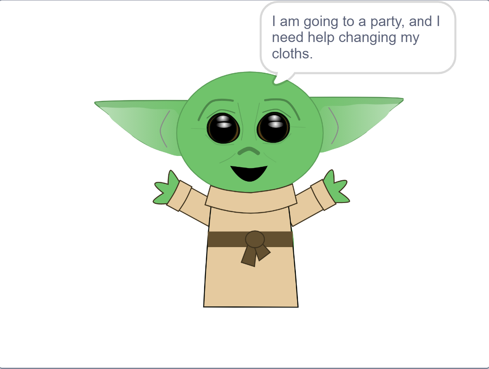

In the game, Baby Yoda is going to a party, and he needs your help to change into a party outfit. 

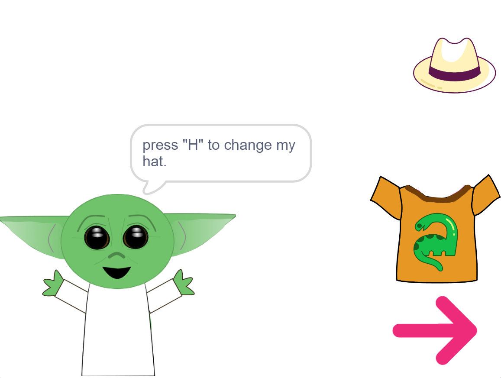

To help Baby Yoda change his outfit, you press the "**H**" key to cycle through a selection of hats and press the "**S**" key to cycle through a selection of shirts.

After making your selection, you drag and drop the hat and shirt onto Baby Yoda.

When Baby Yoda is dressed and ready to go to the party, you click the "**arrow**" sprite.

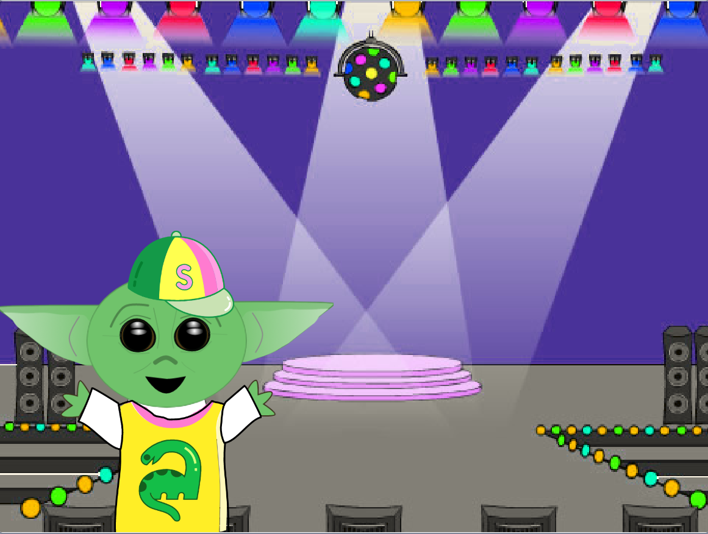

[Play the game: Dress Baby Yoda!!!](https://scratch.mit.edu/projects/364519174/)

My daughter was excited to see her project on the Scratch website getting hearts, stars, and views!

While in her computer class in school, her teacher viewed and complimented her on the project as well!

As you can see, the ability to create and share projects with the Scratch community is very encouraging for our children!

---

### Conclusion

The accomplishment that MIT achieved in creating the Scratch programing language is profound. They made the ability to program intuitive and accessible for all ages.

With Scratch's coding blocks, children can focus on the logic of programming without complicated syntax.

I've spent many "**family time**" hours with my child having a wonderful time creating with Scratch, and I hope you will spend quality time with your children, encouraging them and teaching them to code too!