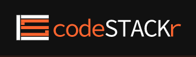

---

### As a self-taught developer, it is sometimes difficult to find direction with so much information out there.

### With the odds stacked against us, in this week's article, Jesse Hall helps us unstack it!

---

### Scrimba teacher

I was introduced to Jesse through Scrimba. I am currently taking Scrimba's [Frontend Developer Career Path](https://scrimba.com/learn/frontend), and Jesse is one of the teachers.

Jesse Hall is a full-stack developer with over 20 years of experience in the tech industry. So as a Scrimba student, I know that I'm in good hands!

To make it in time for this article, I'm skipping ahead to take his API section of the Srimba course! 

---

### Sample from Scrimba's Frontend Developer Career Path:

**Module 7, Working with APIs, Fetch basics and Fetch advanced**

**Local Files - Basic Text**

Right off the bat, I just learned from Jesse that "fetch" can be used to get information from a local text file. Previously, I had thought that fetch was used with external APIs exclusively.

So using what I had just learned, I added a second text file with an iconic Star Wars quote and then used "fetch" and styled it!

---

### My thoughts on Jesse's section of the Scrimba course

Jesse has an articulate and welcoming teaching style. He is an excellent choice for a Scrimba teacher.

---

#### To learn more about Scrimba, you can read my 12/13/2020 [review article](https://selftaughttxg.com/2020/12-20/Review-Scrimba/).

#### *"That&#39;s one of the best Scrimba reviews I&#39;ve ever read, <a href="https://twitter.com/MikeJudeLarocca?ref_src=twsrc%5Etfw">@MikeJudeLarocca</a>. Thank you! 🙏 "*
###### &mdash; Per Harald Borgen, CEO of Scrimba <a href="https://twitter.com/perborgen/status/1338462544143540227?ref_src=twsrc%5Etfw">December 14, 2020</a></blockquote>

---

### Jesse's Battleship project with Ania Kubów and Kyle Cook (Web Dev Simplified)

<iframe width="853" height="480" src="https://www.youtube.com/embed/TpAwggQJPUQ" frameborder="0" allow="accelerometer; autoplay; clipboard-write; encrypted-media; gyroscope; picture-in-picture" allowfullscreen></iframe>

---
---

#### Coming from a competitive music background, I was pleased to see Jesse not competing with other coders, but in fact, collaborating with them!

Together, [Jesse](https://www.youtube.com/channel/UCDCHcqyeQgJ-jVSd6VJkbCw) [Kyle](https://www.youtube.com/channel/UCFbNIlppjAuEX4znoulh0Cw) and [Ania](https://www.youtube.com/channel/UC5DNytAJ6_FISueUfzZCVsw) created an online two-player Battleship game!

---

<!-- [Building BATTLESHIPS Multiplayer Game with Node.js, Express, Socket.io, Heroku | (2/3)
](https://www.youtube.com/watch?v=TpAwggQJPUQ) -->

To learn how to make a multiplayer online game, I watched all three videos. I did not code along this time, but I added [socket.io](https://socket.io/) to my "to-learn" list!

**Here are the links to the three-part YouTube series**

* [Part-1](https://www.youtube.com/watch?v=U64vIhh0TyM)
* [Part-2](https://www.youtube.com/watch?v=TpAwggQJPUQ)
* [Part-3](https://www.youtube.com/watch?v=G6JTM-zt-dQ&t=969s)

**Here is a link to the finished game!**

[Battleship](http://battleship.tech/)

---

### Stackr News

What I love about YouTube is that it provides a platform for talented creators to showcase their work. Niche content that might not ever make it onto a major network can now be viewed by communities of people who greatly appreciate the shows.

Jesse recently started "Stackr News," a weekly YouTube show that he describes as the "top Web Dev videos you NEED to watch!"

Stackr News is a valuable resource for developers at all stages. A weekly news roundup is one of those "why didn't I think of that" ideas, and why has no one else thought to do this?

For a self-taught web developer, YouTube has an ever-growing base of valuable educative content. So the concept of weekly news highlights of web developer curated content is a brilliant idea!

Once again, I would like to point out that Jesse's whole approach to the programming community is not competitive. In fact, he is spending a lot of time finding other talented programmers and highlighting their work!

*So when he sent out a tweet about his new show, I responded:*

##### I'm sure it is a lot of work for Jesse to bring us his weekly Stackr News. Please show him your support, so he will continue to provide this valuable resource to the entire web dev community!

[Stackr News YouTube play list](https://www.youtube.com/playlist?list=PLkwxH9e_vrALgl3pq8qb_PSKVO5201z-D)

---

### Code Stackr Logo

### As a musician, I take notice of and highly value logos. In my opinion, the official "Code Stackr" logo is the best in tech!

**Let's take a closer look and break it down, or more accurately, unstack it!**

* The letters "C" and "S" were combined with simple lines. The "C" is used as an outer container for the "S."

* The letter "S" is created by simple lines that are strategically "stacked" on each other.

* The "C" and "S" part of the logo complements each other with different colors.

* If I'm not mistaken, it looks like the text "codeSTACKr" is written out in a "loosely based" camel case design.

---

**Definition from [techterms](https://techterms.com/definition/camelcase#:~:text=camelCase%20is%20a%20naming%20convention,element%20names%20cannot%20contain%20spaces.)**

*camelCase is a naming convention in which the first letter of each word in a compound word is capitalized, except for the first word. Software developers often use camelCase when writing source code. camelCase is useful in programming since element names cannot contain spaces.*

---

### The "C & S" box and the "codeSTACKr" text combined create a formidable logo!

---

#### They say that "imitation is the highest form of flattery." So naturally, when it came my time to create a logo for "Self-Taught TXG," I provided [Design Desk](https://www.fiverr.com/design_desk/create-3-original-logo-with-vector-source-file?context_referrer=logo_maker_banner&source=gallery-listing&ref_ctx_id=bc5f47b4-4d2f-4fc1-b92a-939ff2d05e95&pckg_id=1&pos=3&context_type=rating&funnel=10f6ae96-c261-468c-ae21-99a3c6a28b9a), through Fiverr, with the Code Stackr Logo to reference!

---

---

### Here is the finalized color version of my logo after submitting the Code Stackr logo as a reference.

---

### Code Stackr Links

### Jesse has created many valuable resources for the web dev community, and I am looking forward to learning a lot more from him.

**Below is a list of links to Jesse's resources:**

[Codestackr website](https://www.codestackr.com/)

[Codestackr YouTube](https://www.youtube.com/c/codeSTACKr/featured)

[freecodecamp articles](https://www.freecodecamp.org/news/author/jesse/)

---

### Conclusion

Jesse Hall is an established professional in the tech field. He is a great teacher with an articulate teaching style, and he can explain complex programming concepts in simple terms to us.

He creates a lot of valuable content for the web dev community, and he also takes the time to highlight and share other programmers' valuable content with us.

Jesse sets an excellent example of being a "team player" by showing us how to work with and treat others. The most valuable lesson Jesse Hall has taught all of us is the true meaning of having "soft skills."