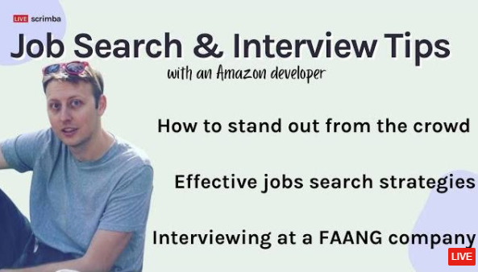

---

## Would anyone else like to learn how to **stand out from the crowd, get job and interview tips**,  and find out **what it takes to land a job at a FAANG company** from an Amazon employee? 

### Let's learn together in this week's article!

### Dylan Israel

If you are not yet familiar with Dylan Israel, you will most likely hear about him soon.

In just under five years, Dylan Israel learned how to code using online resources and worked his way up to a six-figure career at Amazon.

He created the YouTube channel 360 Tutorials during his coding journey, created courses on multiple platforms, co-created the Podcast Self-Taught or Not with [Erik Hanchett](https://www.youtube.com/channel/UCshZ3rdoCLjDYuTR_RBubzw), and became a regular teacher at Scrimba.

Dylan also frequently Livestreams YouTube videos where he answers questions from his viewers' comments.

With all of the premium web dev content that Dylan creates, indeed you will hear about him soon!

---

### Scrimba's Livestream

<iframe width="853" height="480" src="https://www.youtube.com/embed/wmxLmaHQaTo" title="YouTube video player" frameborder="0" allow="accelerometer; autoplay; clipboard-write; encrypted-media; gyroscope; picture-in-picture" allowfullscreen></iframe>

---
---

### How Dylan transitioned into tech

The Livestream starts with Scrimba's host, Leanne, asking Dylan how he transitioned into tech. Dylan is comfortably transparent as he describes putting in a half-effort while attending college for five years until he eventually dropped out and about his job delivering pizza.

**Dylan decided to pursue a career in tech after googling jobs that met the following criteria:**

* What jobs paid well
* What jobs have a lot of availability
* What jobs were going to increase

These three criteria lead him to software development.

 Dylan then elaborates on how he fell in love with learning software development "outside of school" by creating his own personal projects.

---

### How he acquired the needed skills

Leanne then asks Dylan how he acquired the needed skills to break into the tech field.

Dylan's response to Leanne's question is that his job search criteria, previously discussed, created his "syllabus" of what to learn. During his five-year learning journey, he reached many milestones to his current job at Amazon.

---

### Not everyone will be supportive of your coding journey

Dylan informs us that there will be others that are not supportive of your code learning journey. 

**Dylan quotes two types of people:**

* Complete strangers
* Closest confidants

**Negative role models**, Dylan describes, are people that act condescending towards you. As a positive approach to these situations, he uses them as an example of what "not" to be like.

Also, it is often that in good faith, your **closest confidants** will be unsupportive. They might not understand the technical aspects of your achievements, or share in your vision of accomplishing your end goal.

---

### What would have Dylan do differently

Dylan explains, from his humble beginnings, that he was always frugal.

**He utilized free resources to learn:**

* Free Code Camp
* Codecademy
* Scrimba
* Udacity

Dylan believes he could have propelled himself further and faster had he invested in several paid courses.

---

### What was Dylan's biggest struggle?

He dealt with mental stress because he wasn't where he wanted to be at that time in his life.

As a self-taught developer, pursuing a tech job is a task that requires one hundred percent commitment.

Dylan used his uncomfortable situation to motivate himself, which eventually turned into a success!

---

***It took nine months of studying for Dylan to land his first developer job.***

---

---

### How to become a web developer

Dylan explains, to become a web developer, you must be consistent. Code every day until you get a job.

**Also, he warns us people wait way too long to:**

* Interview for Jobs
* Jump Jobs
* Change technologies
* Study new things
* Go and put yourself out there

---

### How do you learn problem-solving skills?

To learn algorithms and data structures, Dylan used [Algoexpert](https://www.algoexpert.io/product) as well as YouTube tutorials.

During the Livestream, Dylan elaborates on **Clément Mihailescu's**, Co-founder, CEO, and Instructor of Algoexpert, creating this very niche course. He speaks highly of the course, stating that it is the best resource that he has come across.

Dylan spent five to six weeks on this course, studying for about two hours a day. To reinforce what he was learning, a study tactic that he used was trying to solve the previous day's challenge again, without the instructions.  

Dylan also created a Udemy course [100 Algorithms Challenge - How to Ace the JavaScript Coding Interview](https://www.udemy.com/course/100-algorithms-challenge/)

---

**Pro-Tip**

*Udemy has sales frequently. Wait for a sale, and you can purchase courses for under $20 each.*

---

### Job search tips

Early in your career, for your first technical job search, Dylan advises filling out many applications.	

**Job search tips:**

* Apply to jobs where there are fewer applicants to complete with
* Be the first to apply to jobs just posted(24hours)
* In time, the jobs will come to you.

Dylan brings up an interesting point: he was up against many other applicants in Los Angeles, over three hundred.

When he applied to jobs in Tampa, Florida, he was only up against a dozen.

He also noticed that he was getting a much higher volume of callbacks and responses from jobs he applied to that were posted within 24 hours.

In time, when you have years of work history, projects, and presence, the jobs will start coming to you. **This is how Dylan landed the job at Amazon. They reached out to him!**   Dylan also has recruiters reaching out to him regularly.

---

**Pro-tip from Dylan**

*Find the "right fit" for a job. Make sure you are happy there.*

---

#### During the Livestream, Dylan shows us the actual Amazon project he worked on! 

**[You can see the page on Amazon](https://www.amazon.com/b?ie=UTF8&node=19424628011), and you can also hear Dylan talk about it in this [Livestream](https://youtu.be/wmxLmaHQaTo?t=1700) starting at timestamp 28:20.**

---

### Dylan's secret to productivity

Dylan explains that the secret to productivity is to mature and to have discipline. It is within your control to prioritize your studies over recreational activities.

You will have to make sacrifices today for the sake of the career that you are working towards for tomorrow.

---

### How to Stand out from other applicants 

**Stand out by knowing:**

* Clean code principles 
* Unit Testing
* Be passionate (side projects)

Dylan states that he believes what helped him out the most to stand out was being passionate.

His side projects, such as his YouTube channel, Podcast, and course creations, clearly show others that he is passionate about the tech field.

It also shows his commitment to work and willingness to continue to learn and grow as a developer.

---

### How much emphasis is placed on college degrees

Dylan makes it clear; when it comes to the developers you will be working with, the developers will be looking at your capability and not focusing on your education.

However, having a college degree does matter with HR. Even now, Dylan can not get specific jobs because he does not have a degree.

---

### Unproven asset

Dylan explains that for your first dev job, you will be an "**unproven asset**." He means that without developer experience, it may be a risk for a company to hire you.

**To combat this, Dylan suggests the following:**

* Certificates
* Projects
* Knowing core technologies
* Gain experience (for free or low paying)
* Work on Communication Skills (soft skills)
* Don't overthink it

Dylan encourages us to "not overthink it." It is a temporary situation that will change. We will only have to worry about being an unproven asset for our first dev job.

---

### It's ok to monetize your projects.

Dylan explains that side projects do not have to be a sacrificial task. When you start earning income from your side projects, it will encourage and motivate you to do more.

---

### Some skills, you will learn in the workforce

**Some skill sets you will acquire when you are in the real work world**

* Agile
* Git

Dylan explains that you can learn agile, but you will not know what it's like to work in agile until you work on an agile team.

Also, Dylan recently ran into a complex Git merge and asked another senior dev for help.

Dylan quotes, "**Don't sweat it. When the time comes, you will learn it**."

---

### The ability to learn

Dylan explains what companies interview for, "**it's not what you know, necessarily, it's what you have the ability to learn**."

---

### Do you have to fulfill all requirements listed on job posts?

There are true requirements, and there are requirements that are nice to have.

As an example, a bachelor's degree is required, but a master's degree is preferred. 

Dylan advises, "**if you meet 50% of the requirements, go ahead and apply**."

---

### Recommend projects for a starter portfolio

* Something that you can monetize
* API projects / asynchronous code
* CRUD application

Using the listed recommendations, Dylan suggests creating a project on a topic that you are passionate about.

---

### learning curve and some sacrifice

To transition into a tech career, you will have to accept the reality that you are going from one world to another.

There will be a learning curve and some sacrifice.

You may even have to take a pay cut to get that first developer job.

---

### Dylan's links

[Dylan Israel's website](http://dylanisrael.com/)

[Dylan Israel's YouTube Chanel](https://www.youtube.com/user/pizzapokerguy87)

[Self-Taught or Not website](https://www.selftaughtornot.com/)

[Dylan Israel's Udemy courses](https://www.udemy.com/user/dylanisrael/)

[Dylan Israel's Github](https://github.com/PizzaPokerGuy)

[Twitter](https://twitter.com/PizzaPokerGuy)

[LinkedIn](https://www.linkedin.com/in/dylan310/)

---

### Conclusion

To stand out from the crowd, you need to show that you are passionate, have a commitment to work, and offer a willingness to continue learning and growing as a developer.

To have a better chance at getting an interview, apply to jobs where there are fewer applicants to compete with, and be the first to apply to jobs just posted within 24 hours.

In time, when you have years of work history, projects, and an online presence, the jobs will start coming to you.

So, how did Dylan **reach** a position at FAANG company? A FAANG company **reached** out to him!