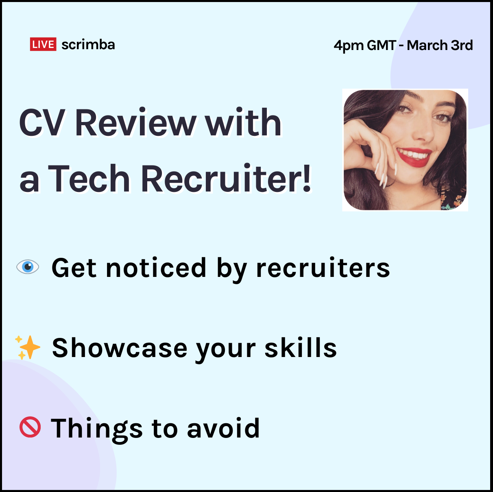

---

## Did I correctly optimize my LinkedIn profile to have the best chance of getting noticed by a tech recruiter?

### Find out in this week's article when tech recruiter Molly-May Gallagher reviews my profile!

---

**In addition to web development resources, Scrimba provides its students with many opportunities to learn and grow as developers. This week, Scrimba appointed a tech recruiter to look over several students' LinkedIn portfolios and CVs.**

**To better understand what tech recruiters are looking for in a LinkedIn profile, I submitted mine for the YouTube live stream review!**  

---

### Why use LinkedIn

**As a self-taught developer, LinkedIn is a fantastic platform to:**
* Showcase your work and skills
* Provide links to your site, blog, GitHub, etc.
* Connect with other developers
* Let employers and recruiters know you're available for work
* Help build your "personal brand"

---

**Information from LinkedIn:**

*LinkedIn is the world's largest professional network on the internet. You can use LinkedIn to find the right job or internship, connect and strengthen professional relationships, and learn the skills you need to succeed in your career.*

---

### Preparation for my LinkedIn profile review

In preparation for my LinkedIn profile review by a tech recruiter, I made sure to fill out all sections to the best of my current knowledge.

I am leaving a detailed list below of how I filled out each section.

After tech recruiter Molly-May Gallagher's review, I will go over her advisements.

---

### LinkedIn sections I completed (prereview)

* My profile picture
* Background Image
* Custom URL
* Summary Section
* Featured
* Education
* Activity
* Experience
* Licenses & Certifications
* Skills & Endorsements
* Accomplishments
* Contact

---

### My profile picture

For my profile picture, I chose a picture of myself in a suit and tie. I cropped the photo to get a close "headshot."

---

### Background Image (banner)

Time to show off my newly created blog logo!

I learned from my LinkedIn research that it was not advisable to leave the default blank background banner.

To meet the requirements of adding a background and promote my blog to recruiters, I used my blog logo.

---

### Custom URL

While watching YouTube videos on creating LinkedIn profiles, I learned that you could change the assigned default URL.

In my case, I was lucky to secure my first choice, which is my full name.

linkedin.com/in/[michaeljudelarocca](https://www.linkedin.com/in/michaeljudelarocca)

---

### LinkedIn Summary (about section)

Ok. so it seems I initially got a little carried away with writing this section. I went a little over my LinkedIn summary character limit by about 3,000 characters. But who's counting!

I originally had a description of what each of the four customized programs that I wrote did. So I had to strip that section down to just the names of each program.

Also, I had several URL links to YouTube videos that featured my blog articles. It seems that the LinkedIn summary section does not support markdown language. So I decided to leave the name and timestamp of the YouTube videos.  

---

### Featured

Every week, when I write a new blog article, I post a link to it on my LinkedIn featured.

Also, I make sure to add the latest articles to the top of my featured section.

---

### Education

I was hesitant to fill out this section. I attended a community college, part-time, for two years. However, I did not graduate.

Even though I did not finish college and earn a degree, I added the start and end years.

I also included the computer information path I was taking.

While I was attending college, a  job opportunity opened up for me that I decided to take. Taking the job required me to withdraw from my classes mid-term, and I never ended up going back.

I am relieved to say that the job worked out, as I am still employed there.

---

### Activity

I learned from watching Scrimba's last [LinkedIn tech recruiter YouTube live stream](https://www.youtube.com/watch?v=_KdwmOw3TMc) that recruiters look for activity on your profile. 

So that gives another big checkmark for web developers to start blogging! 

Writing weekly articles for my blog and then posting links to them on my LinkedIn provides me with constant LinkedIn activity.

---

***To help assist you in creating your LinkedIn profile, I advise you to take the time to watch this informative YouTube video.***

<iframe width="956" height="538" src="https://www.youtube.com/embed/_KdwmOw3TMc" frameborder="0" allow="accelerometer; autoplay; clipboard-write; encrypted-media; gyroscope; picture-in-picture" allowfullscreen></iframe>

---

#### *This video includes what our profiles look like on the LinkedIn recruiter's side!*

---

### Experience

In the experience section, I entered "**Microsoft Specialist**."

After rewatching Scrimba's last [LinkedIn tech recruiter YouTube live stream](https://www.youtube.com/watch?v=_KdwmOw3TMc), I realized that I could add the details of the programs that I wrote here. So the details of my customized programs that I removed from the summary were added back here.

**Also, I added the rest of my work experience with details here:**

* Produce Pro Support Team
* Customer Service Representative
* Truck Router

---

### Licenses & Certifications

**I add all of my course completion certificates from:**
* Scrimba
* Codecademy
* freeCodeCamp
* Solo Learn
* Udemy

---

### Skills & Endorsements

**Top Skills**

* Visual Basic for Applications (VBA)
* Microsoft Office
* Web Design

---

**Industry Knowledge**

* Responsive Web Design

---

**Tools & Technologies**

* Git
* HTML
* Cascading Style Sheets (CSS)
* SASS
* JavaScript

---

### Accomplishments

**Community Hero** ( Scrimba )

---

### Contact

**I filled out the contact section with this information:**

**Your Profile**

* linkedin.com/in/michaeljudelarocca

---

**Website**

* selftaughttxg.com (Blog)
* michaeljudelarocca.com (Personal)

---

**Email**
* michaeljudelarocca@gmail.com

---

**Pro-Tip**

***Information from LinkedIn***

**Filling out the following LinkedIn sections will give you an "ALL-STAR" profile:**

* Current position
* Location
* Industry
* Photo
* Education
* Adding 5 skills
* Summary

**Members with all-star profiles see more relevant feed updates and receive more profile views.**

---

### Here we go, off to the live stream!

**CV Review with a Tech Recruiter - Scrimba LIVE**

<iframe width="956" height="538" src="https://www.youtube.com/embed/4HPkm5ElcT0" frameborder="0" allow="accelerometer; autoplay; clipboard-write; encrypted-media; gyroscope; picture-in-picture" allowfullscreen></iframe>

---

#### *Michael Larocca - Time Stamp 24:37*

linkedin.com/in/[michaeljudelarocca](https://www.linkedin.com/in/michaeljudelarocca)

---

### What's right with my LinkedIn profile

I made it clear that I was available for employment by displaying the "**OPEN TO WORK**" banner on my profile picture.

On the Scrimba live stream, Molly-May states about my LinkedIn profile page "**He has a lot of things that are featured, he has a lot of activity, which is a good sign**."

---

### What's wrong with my LinkedIn profile

* I filled out the summary section incorrectly
* I failed to make it clear to recruiters and employers what kind of work I am looking for
* I used cliche sayings and a humorous approach 
* I did not list the technical skills that I am strong in
* I should remove everything else that is not relevant in the summary
* I did not detail the technologies that I use at my current workplace

---

### I filled out the summary section incorrectly

***Summary section - the wrong way***

The entire summary section is incorrect.

**I wrote too much detail about myself and my work experience**. And to think, this was the revised version after I originally went 3,000 characters over! 

**I also failed to make it clear to recruiters and employers what kind of work I am looking for**, which in my case is "front-end web development."

Also, **Molly-May advised against using cliche sayings and my humorous approach at the beginning of my summary**:

*Over the years, I earned a reputation as the "go-to" person. I am glad and willing to help, from simple computer support issues to creating fully customized programs. When I receive compliments from my colleagues for accommodating them, I humorously reply, "they don't keep me around here for my silly dad jokes!"*

**Molly-May then points out that she found the information about my website towards the end of my summary and that I am a web developer**. She advised that I move that information to the top of my LinkedIn summary and add a link to my portfolio website.

Then Molly-May suggests that I "**list the technical skills that I am strong in**." Also, **since I am interested in changing careers and going into web development, I should remove everything else that is not relevant**.

Finally, Molly-May advised me to **detail the technologies that I use at my current workplace**. I wrote about what I have done, but I did not clarify what I use.

---

***Summary section - the right way***

Leanne, The Scrimba live stream host, asks Molly-May, "**how long should a good summary be**?" To which Molly-May replies, "**a paragraph**."

Molly-May then elaborates on how long a summary should be. **It would be best if you did not have to click on the ellipses to expand the summary section**.

**One of the reasons to keep the summary short**, Molly-May explains, **is to pique the client's interest or the recruiter**.

---

### Key Points - LinkedIn profile review results

* Do not use cliche sayings
* Be professional and formal, not informal
* Your summary should be short, one paragraph
* Be clear as to the work you would like to do
* Remove anything that is not relevant to jobs you are seeking in your summary

---

### What I learned

I gained valuable insight as to what tech recruiters are looking for in a LinkedIn profile. Using all of the suggestions, I made the necessary adjustments, and I will continue to improve it as my skills develop.

Even though the live stream did not answer all of the questions I had, I now have a more "**polished**" LinkedIn profile that tech recruiters will notice! 

---

#### *If you enjoyed this article and would like to "**link up**," send me an invitation to join my LinkedIn network.*

linkedin.com/in/[michaeljudelarocca](https://www.linkedin.com/in/michaeljudelarocca)

---

### Conclusion

As self-taught developers, learning to promote ourselves properly is just as important as learning how to code correctly. Scrimba appointing a meeting with a LinkedIn tech recruiter to look over our profiles and CVs provided us with valuable insight!

Having the information on what tech recruiters are looking for allows us to appropriately create our LinkedIn profiles and CVs, which will give us a better chance of getting noticed and ultimately hired.

***I highly suggest that you watch both live streams, in full, for valuable information on creating LinkedIn profiles!***

[Chat to a Career Coach and Tech Recruiter - Weekly Web Dev Challenge Live - with Jermaine Jupiter](https://youtu.be/_KdwmOw3TMc)

[CV Review with a Tech Recruiter - Scrimba LIVE](https://youtu.be/4HPkm5ElcT0)