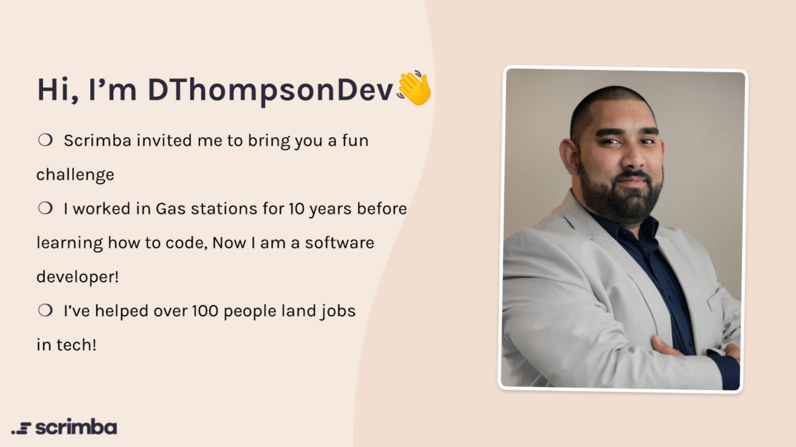
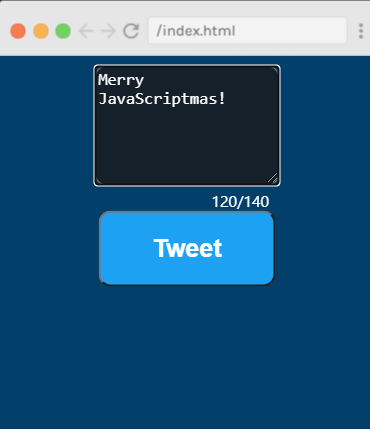

---

### Learning to code is challenging. Staying positive, keeping motivated, and believing in yourself may determine the difference between succeeding and failing.

### Danny Thompson will help you stay on track!

---

**I was introduced to Danny Thompson through one of Scrimba's JavaScriptmas challenges. What got my attention immediately was his teaching style. While Danny explains programming concepts, he talks to you positively and uplifting, much like a motivational coach. I found his teaching style to be exceptional and professional.**

**[Here is my solution to Danny Thompson's JavaScriptmas challenge:](https://scrimba.com/scrim/co53242be9477ff017910a833)**

---

#### When I completed Danny's JavaScriptmas challenge, I searched for him online to learn more about him. I found his Twitter and LinkedIn accounts and decided to follow him.

**Deciding to follow Danny Thompson on social media was one of the best decisions I made during my self-taught coding journey! Every day I now receive messages that inspire, motivate, and reaffirm my belief in myself.**

---
### Danny's inspirational messages:

<blockquote class="twitter-tweet">
To all the aspiring devs, the junior devs and the senior devs, you are awesome! Don&#39;t worry. You will solve that problem, you will learn that language and you will deliver that solution! You are absolutely incredible! Don&#39;t forget it!
&mdash; Danny Thompson (@DThompsonDev) <a href="https://twitter.com/DThompsonDev/status/1373498395768324096?ref_src=twsrc%5Etfw">March 21, 2021</a></blockquote> 

---

<blockquote class="twitter-tweet">
If you get discouraged because it has been hard learning to code and getting a job, think about how much you are going to celebrate once you actually get it! Stay the course! I can&#39;t wait to celebrate your success!
&mdash; Danny Thompson (@DThompsonDev) <a href="https://twitter.com/DThompsonDev/status/1363244868261314561?ref_src=twsrc%5Etfw">February 20, 2021</a></blockquote> 

---

<blockquote class="twitter-tweet">
Why are you doubting yourself? You got this!  Coding is hard! You got this!  Creating a website is hard! You got this!  Finishing this course is hard! You got this!  Chasing my dream to become a developer is an uphill battle! You ABSOLUTELY got this!<a href="https://twitter.com/hashtag/100DaysOfCode?src=hash&amp;ref_src=twsrc%5Etfw">#100DaysOfCode</a> <a href="https://twitter.com/hashtag/CodeNewbie?src=hash&amp;ref_src=twsrc%5Etfw">#CodeNewbie</a>
&mdash; Danny Thompson (@DThompsonDev) <a href="https://twitter.com/DThompsonDev/status/1373714765126766600?ref_src=twsrc%5Etfw">March 21, 2021</a></blockquote> 

---

<blockquote class="twitter-tweet">
When you&#39;re learning Programming you are learning a very in demand set of skills. You&#39;re learning what many jobs want!  Don&#39;t think someone needs to give you a chance so you&#39;ll beg, you are VALUABLE. Act like it.  They need developers &amp; you can solve that problem!<a href="https://twitter.com/hashtag/100DaysOfCode?src=hash&amp;ref_src=twsrc%5Etfw">#100DaysOfCode</a>
&mdash; Danny Thompson (@DThompsonDev) <a href="https://twitter.com/DThompsonDev/status/1372323237389012995?ref_src=twsrc%5Etfw">March 17, 2021</a></blockquote> 

---

### About Danny Thompson

Danny Thompson is a self-taught developer that started coding in his thirties. At that time, Danny was working at a gas station. Without a college degree, He found himself at a fork in the road.

He decided to transition into tech when he was inspired by a rapper who invested several million dollars into a tech company.

Danny learned the basics online from Free Code Camp and then started attending meetups. He accentuates the importance of "networking" with other coders.

---

### [Chat with Developer Danny Thompson](https://www.youtube.com/watch?v=vTDZH54egbk&t=1597s)

<iframe width="853" height="480" src="https://www.youtube.com/embed/vTDZH54egbk" frameborder="0" allow="accelerometer; autoplay; clipboard-write; encrypted-media; gyroscope; picture-in-picture" allowfullscreen></iframe>

---

***Michael Larocca: Time Stamp 18:40***

---

In this YouTube Scrimba Livestream, Danny answered my question that apparently many people have:

**My question:** *​I'm concerned about transitioning into tech, as I am going into my late 40's. Is age an issue if you do not have prior web developer experience, even if your skills qualify?*

**Danny's answer:** *You are not late, you are right on time! Whenever you decide to code, it is the right time.*

---

**Danny then lists:**

* He worked with a great 23-year-old developer
* He was 30 when he transitioned into tech
* His best friend transitioned at 46
* He worked with an incredible 62-year-old developer

---

*Danny states, "don't isolate your ideas to one specific area."*

---

**There are many ways to make money in tech:**

* Become a freelancer
* Make a product
* Make courses
* Offer mentor services
* Teach at a Bootcamp

Danny then elaborates on "giving yourself permission to take your time learning how to code." Also, Danny wants us to know that developers are in demand and that they are getting hired.

---

**However, Danny does warn us that it would be disingenuous for him to say that the tech industry doesn't have all of the "isms:"**

* Racism
* Ageism
* Sexism

Danny explains that the "isms" exist in every single industry, and it would be wrong of him the say that "it's going to be smooth sailing."

"This is your journey into tech. It is going to be hard. We need to keep this perspective in mind. We have to go in with an open heart, open mind, be ready to be disappointed, and be ready to be excited."

"There will be moments when we love the process, and there will be moments when we hate the process."

Danny explains to us that our joy shouldn't only come when we reach our goal, that we should celebrate all of the accomplishments along the journey.

---

***Danny quotes: "Coding is the culmination of the very consistent small wins."***

---

### [GET A JOB USING LINKEDIN](https://www.youtube.com/playlist?list=PL54X5yR8qizsMpvTCqUIEFMeEp-chvcxk)

#### Correctly optimizing your LinkedIn profile is crucial to get the attention of recruiters and employers.

#### Danny Thompson created a free four-part YouTube series to help you.

#### I am going to watch the entire series and then update my LinkedIn profile. I highly suggest that you do the same!

---

*If you are interested in learning about my first attempt at creating a LinkedIn profile, you can read my [03/08/21 article](https://selftaughttxg.com/2021/03-21/LinkedIn-Profile-Review/) and watch [Scrimba's Livestream](https://youtu.be/4HPkm5ElcT0?list=WL&t=1473) when
tech recruiter Molly-May Gallagher reviewed mine!*

---

### To give back to the community, Danny just gave away over $400 worth of Udemy courses during a [LinkedIn Livestream.](https://www.linkedin.com/video/live/urn:li:ugcPost:6778738338330488832/)

**Also, Danny raised $700 for a donation to Free Code Camp, which is currently being matched by [Darrell Silver](https://twitter.com/darrellsilver), for a total of $1,4oo!**

**[Follow this link to learn more about Free Code Camps fundraiser.](https://www.freecodecamp.org/news/building-a-data-science-curriculum-with-advanced-math-and-machine-learning/)**

---

**If you would like to learn more about my experiences with Free Code Camp, you can read these articles:**

* [Learn to code and earn a certification for free](https://selftaughttxg.com/2021/02-21/Earn_a_certification/)

* [There and Back Again](https://selftaughttxg.com/2021/01-21/ThereAndBackAgain/)

* [Teacher Feature: Dylan Israel](https://selftaughttxg.com/2020/12-20/12-06-2020_TeacherFeature-Dylan_Israel/)

---

### Danny's Links

* [Discord server](https://discord.gg/2ZUmKVn)
* [LinkedIn](https://www.linkedin.com/in/dannythompson901/)
* [Twitter](https://twitter.com/DThompsonDev)
* [Instagram](https://www.instagram.com/DThompsonDev)
* [YouTube](https://www.youtube.com/DThompsonDev)
* [Twitch](https://www.twitch.tv/DThompsonDev)

---

### Conclusion

Danny Thompson is a developer, community leader, and speaker that is "truly" helping as many people as he can.

He gives back to the community by continually motivating us, teaching and instructing us, and setting an example of what it truly means to be a **leader**.