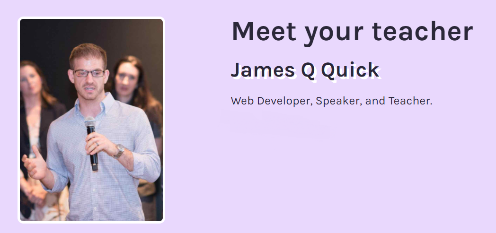
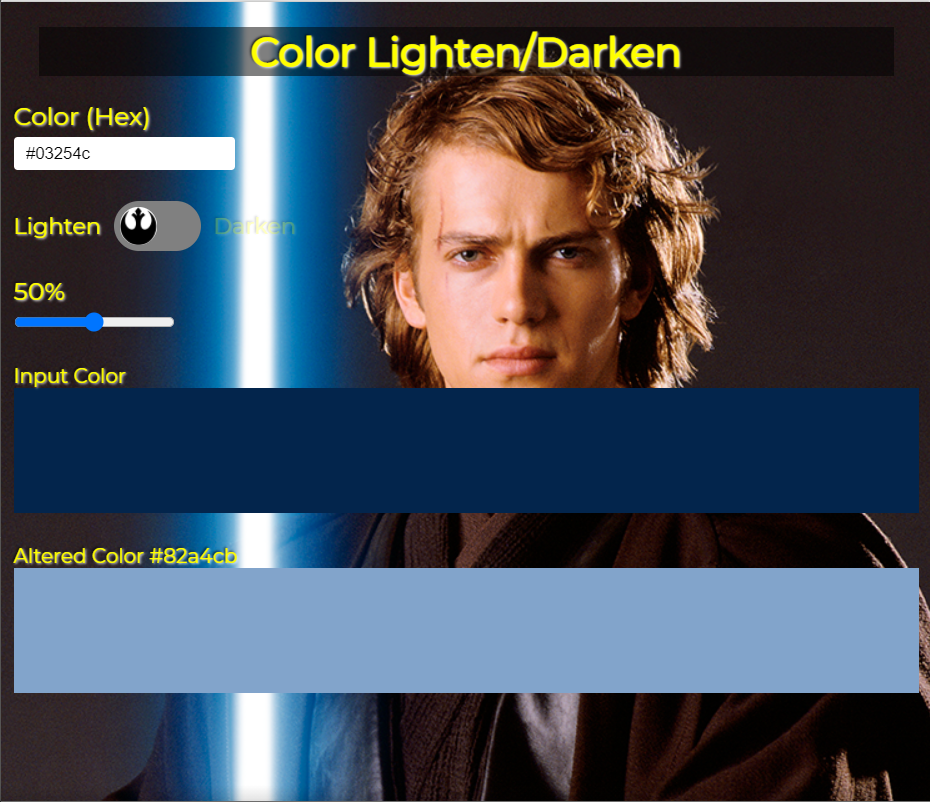
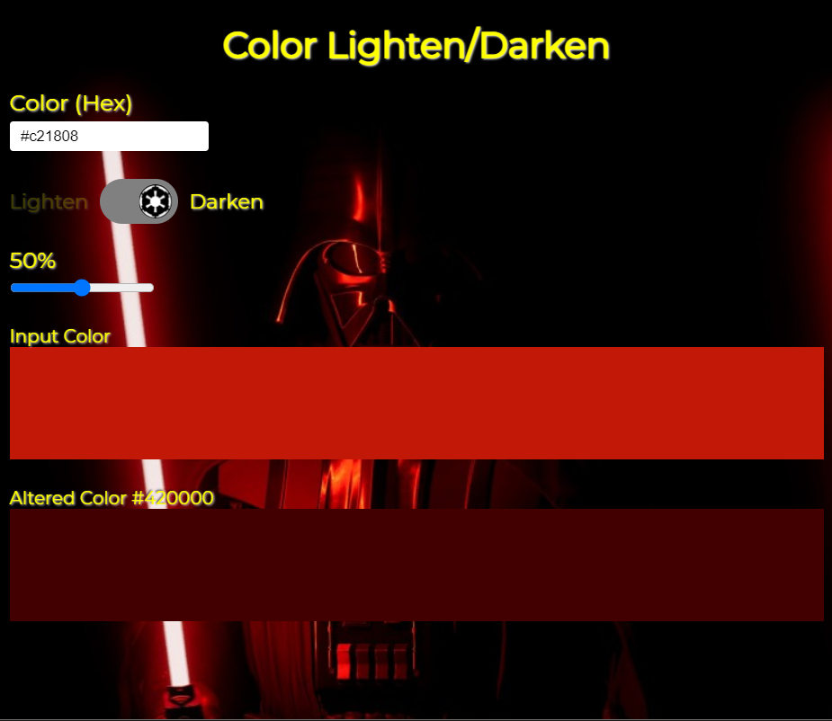

---

## Want to expedite learning how to code? Then you got to learn from James, QUICK!

#### James is a Fullstack Developer that lives by the motto "**Learn Build Teach!**" He creates valuable web dev content weekly.

I was introduced to James through the online coding school Scrimba. I am currently taking courses on Scrimba, and James is one of the teachers.

To make it in time for this article, I'm taking his "**Build a color tool in vanilla JavaScript**" Srimba course!

---

### Scrimba course:

### [Build a color tool in vanilla JavaScript](https://scrimba.com/learn/javascriptcolortool)

In this course, James teaches us how to create a color tool.

**The topics covered in the course are:**

* HTML, CSS, and JavaScript
* DOM manipulation
* Hex and RGB colors
* Creating a custom toggle button

### How the color tool works

When the color tool project is complete, the user enters a Hex color. The Hex color entered is displayed as the background color of the "Input Color" box.

There is a slider that changes the inputted Hex value. The Hex color is lighted or darkened in the "Altered Color" box depending on the toggle switch's selection.

During the course, James encourages us to create a theme for the color tool. Naturally, I chose to make a Star Wars theme.

When the lighten toggle button is selected for my newly created theme, I added a rebel logo to it and added an Anakin Skywalker background image.

*All rights reserved by Disney and Lucasfilm*

**When the darken toggle button is selected for my newly created theme, I added an empire logo to it and added a Darth Vader background image.**

*All rights reserved by Disney and Lucasfilm*

**[Here is a link to my scrim](https://scrimba.com/scrim/cofc440cd8e666e753d36659b)**

While taking this Scrimba course, I found James Q Quick to be an excellent teacher. He has an articulate teaching style, and he explains complex programming concepts in a manner that is easy to follow.

---

#### If you would like to learn more about Scrimba, you can read my [review article](https://selftaughttxg.com/2020/12-20/Review-Scrimba/) for further information.

#### *"That&#39;s one of the best Scrimba reviews I&#39;ve ever read, <a href="https://twitter.com/MikeJudeLarocca?ref_src=twsrc%5Etfw">@MikeJudeLarocca</a>. Thank you! 🙏 "*
###### &mdash; Per Harald Borgen, CEO of Scrimba <a href="https://twitter.com/perborgen/status/1338462544143540227?ref_src=twsrc%5Etfw">December 14, 2020</a></blockquote>

---

### Become a web developer for $10

<iframe width="853" height="480" src="https://www.youtube.com/embed/ny8-_y_hGbs" frameborder="0" allow="accelerometer; autoplay; clipboard-write; encrypted-media; gyroscope; picture-in-picture" allowfullscreen></iframe>

---

**In this YouTube video, James teaches us that all you need is a computer, access to the internet, and dedication to become a web developer.**

---

Even though there is a lot of free content available to learn from, I agree with James that there is a lack of structure when trying to learn on your own.

To give you a solid foundation of learning web development from beginning to end, James shares the course that he took with us, [The Web Developer Bootcamp 2021](https://www.udemy.com/course/the-web-developer-bootcamp/).

*I highly suggest you watch this YouTube video that James created for valuable detailed information on the course.*

---

**Pro-Tip**

**Udemy has sales frequently. Wait for a sale, and you can purchase courses for under $20 each.**

---

### Get up and running quickly with these "Quick" videos:

#### 5 JavaScript Concepts You HAVE TO KNOW

When learning JavaScript, it is important to understand concepts, not just syntax. In this informative YouTube video, James articulately explains five concepts that we have to know.

[5 JavaScript Concepts You HAVE TO KNOW](https://youtu.be/a00NRSFgHsY)

---

#### JavaScript Array Methods Practice

Here is a YouTube playlist of a series on JavaScript arrays

**Topics covered:**

* Filter
* Map
* Some
* Sort
* Reduce
* Every

To teach us how to use each JavaScript method, James uses data from the [Star Wars API!](https://github.com/jamesqquick/javascript-array-functions-practice)

[JavaScript Array Methods Practice](https://www.youtube.com/playlist?list=PLDlWc9AfQBfZGZXFb_1tcRKwtCavR7AfT)

---

#### Asynchronous JavaScript in ~10 Minutes - Callbacks, Promises, and Async/Await

James explains that learning how and why JavaScript is asynchronous and working with it is one of the most important concepts you can learn in JavaScript specifically.

**Topics covered:**

* Callbacks
* Promises
* Async/Await

[Asynchronous JavaScript in ~10 Minutes - Callbacks, Promises, and Async/Await](https://www.youtube.com/watch?v=670f71LTWpM)

---

### New Podcast (Coming soon!)

**Hosts: James Quick & Amy Dutton**

#### Compressedfm

***"A podcast about web design and development with a little zest."***
<!-- "A weekly podcast about web design and development from James Quick and Amy Dutton." -->
You can sign up for the newsletter for updates.

[compressed.fm](https://www.compressed.fm/)

---

### Quick Links:

[Website: jamesqquick.com](https://www.jamesqquick.com/)

[YouTube: James Q Quick](https://www.youtube.com/channel/UC-T8W79DN6PBnzomelvqJYw)

[Twitter: jamesqquick](https://twitter.com/jamesqquick)

[Twitch: jamesqquick](https://www.twitch.tv/jamesqquick)

---

### Advance your career with a 20% discount on Scrimba Pro using this [affiliate link](https://scrimba.com/?via=MichaelLarocca)!

Become a hireable developer with Scrimba Pro! Discover a world of coding knowledge with full access to all courses, hands-on projects, and a vibrant community. You can [read my article](https://selftaughttxg.com/2021/06-21/06-07-21/) to learn more about my exceptional experiences with Scrimba and how it helps many become confident, well-prepared web developers!

###### ***Important:*** *This discount is for new accounts only. If a higher discount is currently available, it will be applied automatically.*

**How to Claim Your Discount:**
1. Click [the link](https://scrimba.com/?via=MichaelLarocca) to explore the new Scrimba 2.0.
2. Create a new account.
3. Upgrade to Pro; the 20% discount will automatically apply.

##### ***Disclosure:*** *This article contains affiliate links. I will earn a commission from any purchases made through these links at no extra cost to you. Your support helps me continue creating valuable content. Thank you!*

---

### Conclusion

James Q Quick is passionate about programming. Hearing him teach excitingly provides a fun and enjoyable learning experience, even when the topics are complex!

Encouraging us to **learn**, **build**, and then **teach** is a fantastic way to learn how to code, and it sets an excellent example for the web dev community.

James provides us with premium programming content weekly, and he is also about to launch a new podcast. So if you want to *"get up to speed"* with learning to program, then you got to learn it *"Quick!"*
