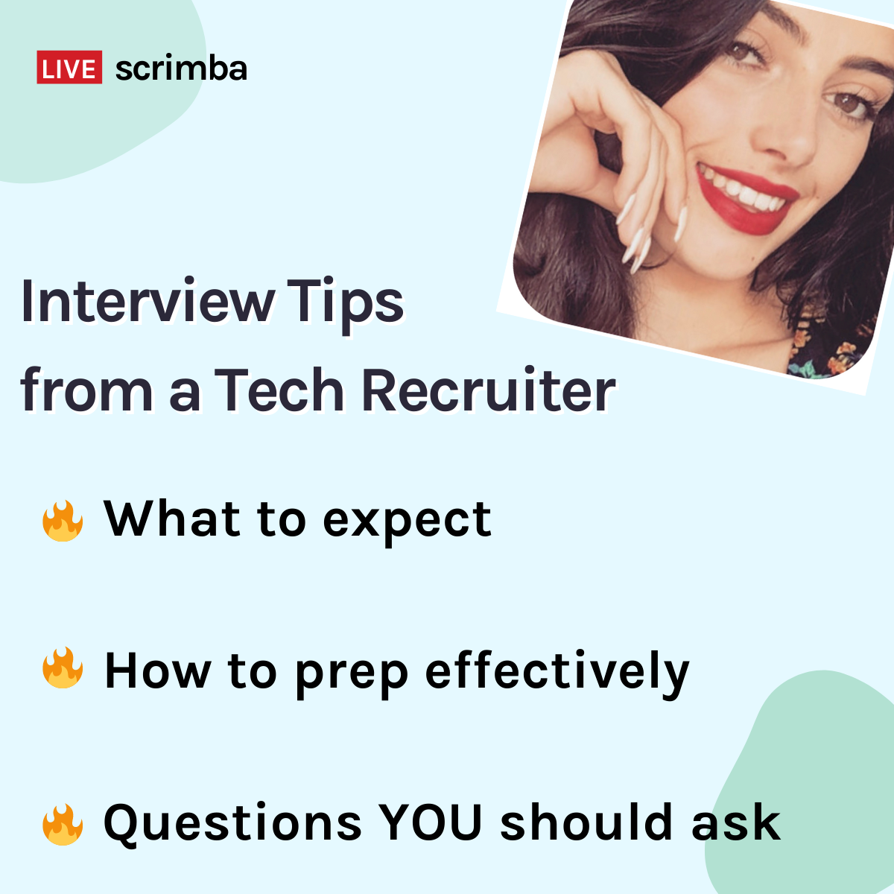

---

<!-- ## Would you like to learn what to expect from coding interviews, how to prepare effectively, and what questions you should ask them? Let's find out together in this week's article! -->

## Would you like to learn what to expect from coding interviews, how to prepare effectively, and what questions you should ask them? Let's find out together in this week's article with tech a recruiter!



----

### Find out as much as you can

The first tip that tech recruiter Molly-May Gallagher provides us is to find out as much as we can about the interview.

**Is there going to be:**

* Whiteboard testing?
* A project to complete?
* Code troubleshooting?

Knowing what tests ahead of time will give us time to prepare for them.

---

### Find out who is conducting the interview

**Is the interviewer from:**

* HR
* The technical team

Also, find out if more than one person conducts the interview.

As a tech recruiter, Molly will send her clients a link to the interviewer's LinkedIn profile. Having access to the interviewer's LinkedIn profile will allow you to learn more about them and the company.

---

### Know the position you are interviewing for

From experience, Molly has had a few candidates call her on the day of their interview and ask, "uh, yeah. What role is this again?

If you apply for multiple job roles, you may get confused about which job role you are currently interviewing for.

*To prevent embarrassment, be prepared by ensuring that you always know the role of the job you are interviewing for.*

---

### Learn about the company you are interviewing for

Molly informs us that we may be asked the question, "why do you want to work for our company." If you stumble on this question, it might prevent you from making it to the next round of their interview process.

**Molly suggests:**

* Researching their website
* Going over their about page
* Creating a relevant bullet point list

To assist, Molly provides candidates with a **preparation document**, which highlights notable information about the company and the posted position.

---

### Your previous job

If you are asked about why you are leaving your current job, Molly suggests avoiding **extremes**.

1. You should not talk very negatively about your current job
2. You should also not talk too positively about your current job

Speaking negatively about your current job will suggest that you may eventually talk negatively about their company.

Talking too positively about your current job may incline them to ask you why you want to leave.

Molly leaves us with the advice of answering the question "why are you leaving your current job" with interest in **progressing**.

**I'm leaving because:**

* I am looking for progression
* I want to transition into tech

---

### Come across as confident

Molly states that an interview is a nerve-wracking experience. However, we must come across as being confident.

To help us become more confident during the interview process, Molly suggests that we prepare well.

The more prepared we are for the interview, the calmer we will be.

*Molly informs us during the Livestream that some candidates that have passed the technical interview still did not get hired because of their lack of confidence. A lack of confidence may suggest that you will not be a good "cultural fit" for their company.*

---

### Culture and Growth

It is essential to understand the company's culture and growth that you are interviewing for. 

**What is the company's culture:**

* What's their development team like
* How big is their development team
* How is their development team structured

**What is the company's progression**

* Are they planning to change technologies 
* The scope of the projects their working on
* Are they working in agile (how fast are their sprints)

---

### If you have little or no experience

If you are a junior developer without much or any experience, Molly suggests sharing your projects with them.

**You can talk them through:**

* How they work
* Why you created them
* You can show them your code

---

### If you have gaps in work experience

Molly informs us if you seek a job through a recruiter, the recruiter will go over your gaps in work history with you first, and then they will go over it with the company you are applying for.

With this method of going over your work history in advance, it will most likely **not** come up during the interview.

If we have gaps in our work history and it comes up during the interview, Molly suggests that we be honest. If you're not, and they have already researched your work history, there will be conflicting information.

Molly then makes a point of letting us know that**we are not going to be penalized for gaps in our work history** and that they are most likely asking about it through curiosity.

*Another tip Molly has for us is to make sure our information is up to date on "all of our platforms" to prevent conflicting information.*

---

### Should you mention money

Molly's biggest advice to applicants is to "**never mention money during the interview**." If it is, **Molly suggests that you reply with not being comfortable discussing it until there is an offer made to you**.

If you are going through a recruiter, they may have already discussed a salary range with the company you are applying for.

Also, if they know your current salary, they may lower their initial offer.

*During the Livestream, Molly informs us that we can discuss benefits and vacation time.*

---

### Are employers forthcoming with feedback

How forthcoming are employers with feedback? Molly explains that some of the feedback she gets from employers are genuine and some of the feedback is preset "they are not a good culture fit" type of answers.

*In my opinion, it sounds like companies use standardized answers as an "umbrella" to protect themselves from being accused of discrimination.*

**If you are denied due to not being a good culture fit, Molly elaborates that we are:**

* Too old
* Too young
* Some other reason

If you are going through a recruiter, Molly explains that it is the recruiter's job to find out from the employer why you are not "culturally fit." However, most employers will not be forthcoming with an answer.

---

<iframe width="617" height="347" src="https://www.youtube.com/embed/Ch8o-UNq5ok" title="YouTube video player" frameborder="0" allow="accelerometer; autoplay; clipboard-write; encrypted-media; gyroscope; picture-in-picture" allowfullscreen></iframe>

---

### Molly answers my question

***Time stamp: 45:00***

---

My question: **They say that the interview process is a two-way street. Is there a tactful way to ask what their company will do for you?**

---

Molly answers my question by first relaying back to what was previously discussed about researching the company and the person who will be conducting the interview.

---

**With prior knowledge of the company and the person conducting the interview, you will be in a much better position to bring up your question in a tactful way.**

In fact, Molly suggests not directly asking the question " what their company will do for you."

**You may get your answer by asking the interviewer something like:**

* What enticed you to work here for so many years
* Is it the benefits package that has kept you working here
* If you've been getting job offers, what has kept you here

*Molly suggests that we get our answer by going around the question of what their company will do for you, not by directly answering it.*

---

#### During the Livestream, [Michael Rybintsev](https://twitter.com/alanmynah) from Scrimba also replied to my question:

```
michael r @Michael Larocca,
yes my take is 
"Do you have a development plan for this position?
3-6-12 months plan?"
```

**I believe that Michael brings up an excellent point. If you apply for a junior front-end web developer position, a development plan or a lack of a development plan should be clear before accepting the job.**

---

### Dealing with tricky questions

What was your biggest challenge? What is your greatest weakness? How do you handle working with difficult people?

The best way to handle these types of questions is to highlight yourself in a *positive manner*, while not highlighting others in a *negative manner*.

**Molly suggests the examples:**

* Talk about how you brought your team up
* Talk about how you solved a problem
* Avoid bad talking your coworkers

---

### Should you talk about your other offers

No. It would be best if you did not talk about your other offers.

Molly has previously been in situations where applicants that she was representing had talked about their other offers during the interview. **The companies were offended**.

Molly suggests to her clients to never bring up their other offers during the interview. Doing so may jeopardize all of the progress that they have made up to that point.

---

### Conclusion

As self-taught developers, learning how to prepare for interviews properly is just as important as learning how to code correctly. 

Scrimba's Livestream with a tech recruiter Molly May provided us with valuable insight on what to expect from coding interviews, how to prepare effectively, and the questions we should ask them.

Knowing what the interviewers are looking for allows us to prepare appropriately, ultimately giving us a better chance of getting hired.
