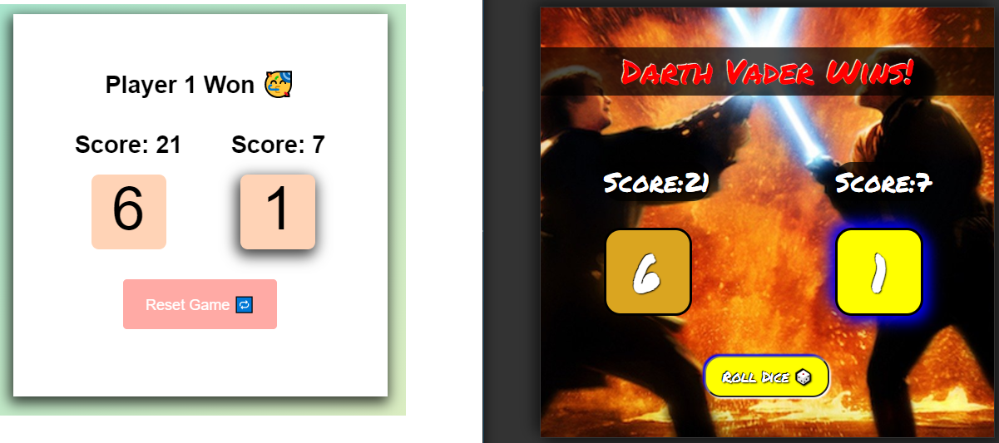
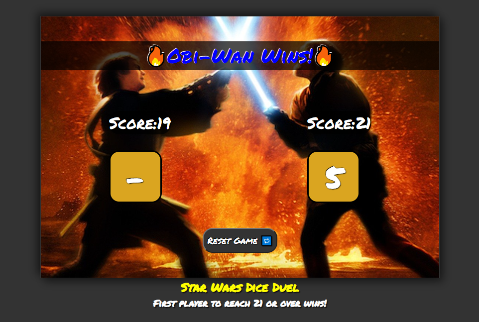
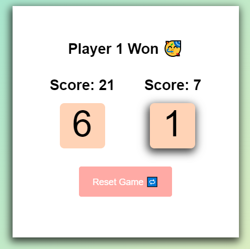
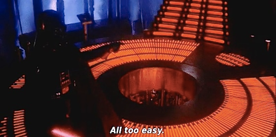
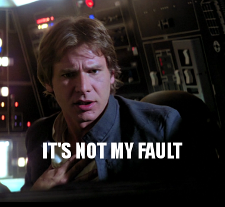
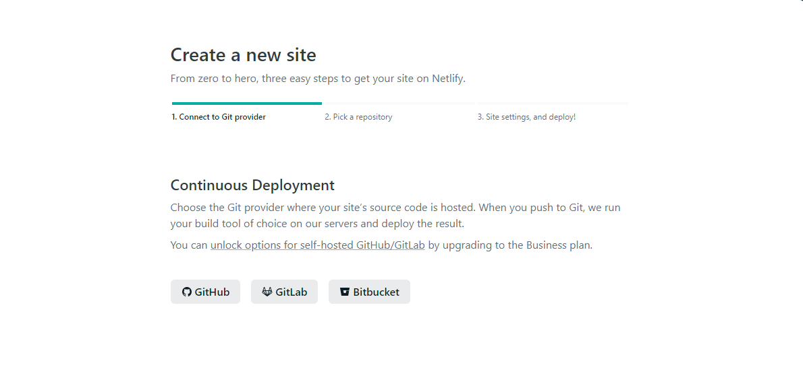
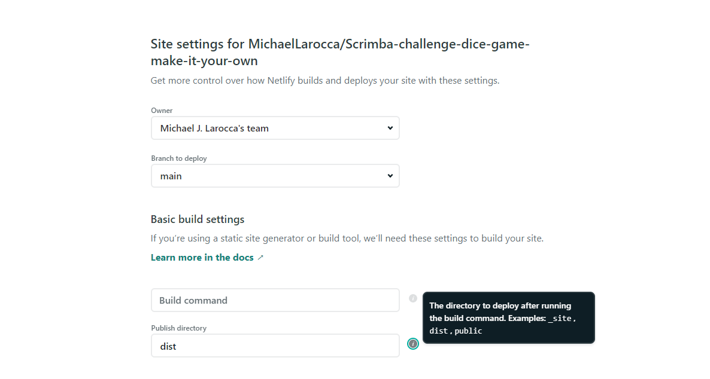
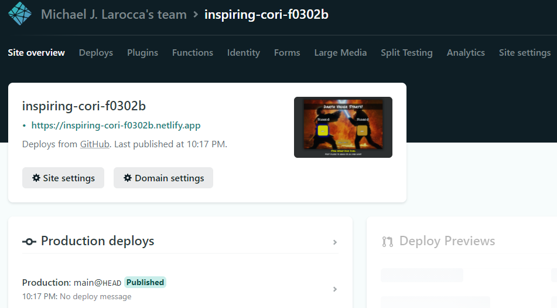
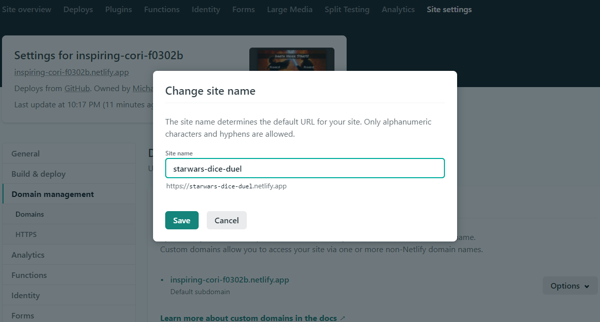

---

### While working on Scrimba's "Dice Game" Challenge project, there was an error, and now I can no longer access it.

### In this week's article, I document creating it again, this time, from the ground up!

---



As aspiring developers learning, we spend a lot of time coding in environments that are already configured for us. An environment such as Codepen's already has the HTML, CSS, and JavaScript configured to work together in the background.

Similarly, most of the programming code is already written out for you on Scrimba screencasts so that you can focus on a particular task.

An unfortunate event led me to this project I am creating on Github.
After working on Scrimba's "**Challenge: Dice Game - Make it your own**" project, there was an error, and now I can no longer access it.

I decided this to be an excellent opportunity to create a "seemingly easy" project from the ground up!

---

**In this article, I will be documenting all of the steps I take to create Star Wars Dice Duel.**

---

### Star Wars Dice Duel



### [Play the game!](https://starwars-dice-duel.netlify.app/)

---

### Create a Git repository on Github

I created a Git repository on Github's website.

During the creation of the Git repository, I choose the checkbox to add a readme file and add a Git ignore file. Also, I added an "MIT" license.

I am a big fan of SASS, and I found a specific premade ignore file for it. I'm planning on using Netlify to use my "**dist**" folder, which will include my CSS files compiled from created SASS files.

---

**Note:** I will be using this article, which is written in Markdown, for this project's readme file!

---

### Create a Git repository on my PC

The first mistake I made was creating a folder on my computer and using "**git init**" to turn it into a repository.

From my newly-created repository on my computer, I created a clone from my Github repository.

---
```
git clone https://github.com/MichaelLarocca/Scrimba-challenge-dice-game-make-it-your-own.git
```
---

When I tried to make my first commit, I received a warning message. It seems I had created a "**nested**" Git repository, and now, Git would not track specific files I create.

Right out of the starting gate, I made a mistake! Lol. Time to start over.

Now I know when you create a git repository on Github, you are supposed to clone it into a folder that is"**not already initiated as a Github repository.**"

---

### Setting up my VS Code environment

### SASS environment

I learned how to set up the SASS environment in VS Code from the Brad Traversy Udemy course, [Modern HTML & CSS From The Beginning (Including Sass)](https://www.udemy.com/course/modern-html-css-from-the-beginning/)

---

*During my "self-taught coding journey," I have been vigilant in taking notes and documenting my work. Time and time again, I hear professional developers say that you do not have to memorize everything. What you do need to do, is to know how to quickly and efficiently look things up.*

---

After following all of the instructions for setting up the SASS environment, I ran "**git add .**" to stage all the files to commit.

**I now got this warning:**

```
$ git add .
warning: LF will be replaced by CRLF in dist/CSS/main.css.
The file will have its original line endings in your working directory
warning: LF will be replaced by CRLF in package-lock.json.
The file will have its original line endings in your working directory
warning: LF will be replaced by CRLF in package.json.
The file will have its original line endings in your working directory
```

I found this insightful information on this error on [Stack Overflow](https://stackoverflow.com/questions/5834014/lf-will-be-replaced-by-crlf-in-git-what-is-that-and-is-it-important)

The issue has to deal with the way Git handles line feeds (LF) and carriage returns (CR). Unix systems use (LF) and Windows uses (CR), thus (CRLF).

The warning message produced great information to learn. The thought of cross-platforming issues arising while working on collaborative Github projects hadn't occurred to me.

**Now that the environment is configured and saved, and pushed back up to Github successfully, I am ready for the next step.**

---

### Initial HTML

Even though I have access to the prewritten code on Scrimba, I decided not to use it. I wanted to test myself to see if I could recreate it from scratch.

For reference, I took a screenshot of Scrimba's finished version that is displayed in their preview window.



Using a split-screen view for reference, I coded out the HTML in VS Code on the screen's left side while looking at Scrimba's finished version on the screen's right side.

[Here is a link to the Github repository's HTML code.](https://github.com/MichaelLarocca/Scrimba-challenge-dice-game-make-it-your-own/blob/main/dist/index.html)

---

### Initial SASS

I was planning on just working on the HTML today and then code out the SASS tomorrow. However, I really enjoy coding CSS (and SASS), so I worked on both on the same day!


[Here is a link to the Github repository's compiled SASS code.](https://github.com/MichaelLarocca/Scrimba-challenge-dice-game-make-it-your-own/blob/main/dist/CSS/main.css)

---

**Note:**

Now that I set it up this way, I realize that if I were to have collaborators on Github, they would also need access to the SASS file. Moving forward, I will include the SASS files.

---

### Initial JavaScript

Now it's time to code out the JavaScript.

During the "Create a dice game screencast," [Per Harald Borgen](https://scrimba.com/teachers/perborgen), CEO of Scrimba, gives us the challenge first and then goes through the solution with us. Not this time! This time around, I am on my own.

First, I need to create the JavaScript file and connect it to the HTML file.

The next step is to create variables from all of the "**id**" and "**class**" assignments in the HTML file.

---

**Note:** While working on the JavaScript file, I noticed that my code was not working as expected because I wasn't saving the changes I had made in the HTML file.

---

### Game Start

I created a function to start/restart the game.

I reset all applicable variables. I also run a function I wrote to choose which player goes first:

```javascript
function gameStart() {
    btnRollDie.disabled = true;
    btnResetGame.disabled = true;

    playSaberOn();

    setTimeout(() => {
        playCoolSaber();
    }, 750);

    setTimeout(() => {
        btnRollDie.disabled = false;
    }, 4000);

    btnRollDie.style.display = "block";
    btnResetGame.style.display = "none";

    message.style.color = "white";
    message.textContent = "";
    scorePlayerOne = 0;
    scoreBoardPlayerOne.textContent = scorePlayerOne;
    dieOne.textContent = "-";
    dieOne.classList.remove("active");
    scorePlayerTwo = 0;
    scoreBoardPlayerTwo.textContent = scorePlayerTwo;
    dieTwo.textContent = "-";
    dieTwo.classList.remove("active");

    chooseWhichPlayerStarts();
}
```

---

***One of Scrimba's "make it your own" suggestions was to make the game fair by randomly choosing which player starts at the beginning of each game.***

---

### Here is the roll die function I wrote:

```javascript
function rollDie() {
    const randomNumberOneToSix = Math.floor(Math.random() * 6 + 1);
    return randomNumberOneToSix;
}
```

---

### Here is the function I wrote to choose a random player to start:

```javascript
function chooseWhichPlayerStarts() {
    const result = rollDie();

    if (result >= 3) {
        message.textContent = `Darth Vader Starts!`;
        activePlayerOne = true;
        dieOne.classList.add("active");
    }   else {
        message.textContent = `Obi-Wan Starts!`;
        activePlayerTwo = true;
        dieTwo.classList.add("active");
    }
}
```

### Roll die button

I added a click event listener on the "**Roll Die**" button. When the  "**Roll Die**" button is clicked, it runs the "**btnRollDieCLicked**" function that I wrote:

```javascript
function btnRollDieCLicked() {

    btnRollDie.disabled = true;

    const rollDieResult = rollDie();

    if(activePlayerOne) {
        playSaberFight();
        scorePlayerOne += rollDieResult;
        dieTwo.textContent = "-";
        dieOne.textContent = rollDieResult;
        scoreBoardPlayerOne.textContent = scorePlayerOne;
        activePlayerOne = false;
        activePlayerTwo = true;
        message.style.color = "blue";
        dieTwo.classList.add("active");
        message.textContent = "Obi-Wan's turn";
        dieOne.classList.remove("active");
        checkForGameOver();
    } else {
        playSaberFight();
        scorePlayerTwo += rollDieResult;
        dieOne.textContent = "-";
        dieTwo.textContent = rollDieResult;
        scoreBoardPlayerTwo.textContent = scorePlayerTwo;
        activePlayerTwo = false;
        activePlayerOne = true;
        message.style.color = "red";
        dieOne.classList.add("active");
        message.textContent = "Darth Vader's turn";
        dieTwo.classList.remove("active");
        checkForGameOver();
    }

    setTimeout(() => {
        btnRollDie.disabled = false;
    }, 1500);
}
```

---

**Note:** I originally had two **if statements**; an if statement to check if player one is active and an if statement to check if player two is active.

I realized that my logic was wrong while playing the game. I could not correctly update the "activePlayerOne" and "activePlayerTwo" boolean values with two **if statements.**

I resolved the issue by creating one **if else** statement.

---

### Check for game over function

The last line of code for the roll die buttons **if else** statement invokes the **check for game over** function that I wrote.

```javascript
function checkForGameOver() {
    if(scorePlayerOne >= 21 || scorePlayerTwo >= 21){
        message.textContent = `Game Over`;

        if(scorePlayerOne >= 21 ){
            message.style.color = "red";
            message.textContent = `🔥Darth Vader Wins!🔥`; 
            playStarWarsWin();
        }

        if(scorePlayerTwo >= 21 ){
            message.style.color = "blue";
            message.textContent = `🔥Obi-Wan Wins!🔥`; 
            playStarWarsWin();
        }

        dieOne.classList.remove("active");
        dieTwo.classList.remove("active");

        btnRollDie.style.display = "none";
        btnResetGame.style.display = "block";

        setTimeout(() => {
            btnResetGame.disabled = false;
        }, 3000);
    }
}
```
---

### Reset button

Programing the reset button was a pleasant surprise! I just had to add a click event listener to the reset button and invoke the game start function.

```javascript

btnResetGame.addEventListener("click", gameStart);

```


*All rights reserved by Disney and Lucasfilm.*

---

### Adding sound

To configure my PC to record the audio directly instead of from my microphone, I read this article [How to Record Sound from Computer directly without a Microphone](https://codegena.com/record-sound-from-computer-without-microphone/).

I just wanted the Star Wars main theme's first bar to use at the end of the game. Since I couldn't find it, I created it using [Audacity](https://www.audacityteam.org/) to record my PC's sound while playing a YouTube video. I then trimmed/edited the file and then exported it as an mp3.

I found and used the lightsaber sounds from [soundboard.com](https://www.soundboard.com/).

**What I learned:**

* How to record sound from the PC (not the microphone)
* Use Audacity to create an mp3 file

---

### Coding the sound


*All rights reserved by Disney and Lucasfilm.*

Star Wars fans will understand the irony of me correctly coding the syntax for the sound effects, but resulting in the program breaking and then me exclaiming, "**It's not my fault!**"

Every time I try to run the program, it breaks, and the only sound I can hear is the Millennium Falcon's "whining sound" when its engine can't make the jump to hyperspace in my head!

---

### Async/await

While first creating this program on Scrimba's website, the saved note (saved program) was no longer accessible after adding the code to play the audio files.

Similarly, after adding the code to play the audio files in this program, it broke, and I saw errors in the console log about the audio code I wrote.

**Now I understand why asynchronous functions are needed.**

I resolved the issue by creating asynchronous functions for all of the sounds in my program.

**Here is an example of one:**

```javascript
async function playSaberOn() {
    try {
      await saberOn.play();
    } catch(err) {
      console.log(err);
    }
  }
```
---

**Note:** Even though I resolved the program crashing due to the sound code that I wrote, the "lightsabers igniting" sound does not load the first time it starts.

**It turns out that the chrome browser does not permit autoloading sounds on websites:**

```

DOMException: play() failed because the user didn't interact with the document first. https://goo.gl/xX8pDD

```

Below is the information from [https://goo.gl/xX8pDD](https://developers.google.com/web/updates/2017/09/autoplay-policy-changes)

---

#### Autoplay Policy Changesbookmark_border

**Note:** The Autoplay Policy launched in M66 Stable for audio and video elements and is effectively blocking roughly half of unwanted media autoplays in Chrome. For the Web Audio API, the autoplay policy will launch in M71. This affects web games, some WebRTC applications, and other web pages using audio features. Developers will need to update their code to take advantage of the policy. More details can be found in the Web Audio API section below.

---

Once my program was "**fully operational**," I implemented
setTimeout() methods to give the sounds the time they need to play out fully.


*All rights reserved by Disney and Lucasfilm.*

---

**Note:** Clicking the roll die repeatedly fast resulted in the sounds not playing. To resolve this issue, I implemented
the setTimeout() method to disable and enable the roll die and reset button.

---

### Netlify

**Now it's time to deploy the site!**

I will be deploying my Github project on [Netlify](https://www.netlify.com/). 

---

**Note:** I have already gone through the process of connecting my Github account to my Netlify account.

---

### Step 1

On your netlify account, navigate to "**Sites**" and click "**New site from Git.**"



**Click on the "Git-Hub" button.**

---

### Step 2



Choose the Git branch to deploy (Mine is **main**).

Under Basic build settings / Publish directory, I chose "**dist**"

---

### Step 3 

The site is now deployed!



**To change the default generated site name:**

* Site overview
* Domain settings
* Custom domains / options
* Edit site name



---

### Conclusion

I was amazed at how many steps are already taken care of for you when working in pre-configured environments, such as the [Codepens](https://codepen.io/) environment and [Scrimba](scrimba.com) screencasts.

Creating a project from scratch, even a seemingly simple one requires a lot of work and effort. Doing so will force you to "**take off the training wheels,**" resulting in helping you to become a better developer.