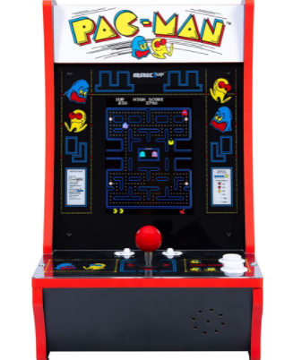
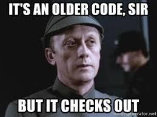
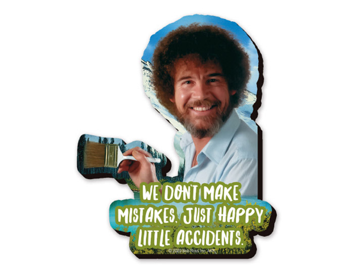

---

## In this article, I document creating my Scrimba Snake Game project taught by Ania Kubow, the style I added, how I addressed the "backing into yourself" issue, and the joystick controller I designed!

---


---

#### [Play the Snake Game!](https://scrimba-snake-game.netlify.app/)

---

### As part of Scrimba's "[Frontend Developer Career Path](https://scrimba.com/learn/frontend)," we are given a snake game project to complete.


**We are taught and stepped through coding the game's core mechanics by Scrimba teacher/YouTube celebrity [Ania Kubow](https://www.youtube.com/channel/UC5DNytAJ6_FISueUfzZCVsw)!**

We are encouraged by Scrimba to take "creative liberty" to style it and add features as we see fit.

**features that I created**

* Added a "High Score"
* Styled the game as an arcade cabinet
* Created a joystick controller 

**In addition to discussing how I coded the program, I also discuss how I set up the environment.**

---

### SASS

For this project, I wanted to use SASS. Once again, to set up the environment, I referenced the Brad Traversy course I purchased and completed from Udemy.

[Modern HTML & CSS From The Beginning Including Sass](https://www.udemy.com/course/modern-html-css-from-the-beginning/)

---

**Node Package Manager**

To set up the SASS environment in my [VS code editor](https://code.visualstudio.com/), I'm using [node.js](https://nodejs.org/en/download/package-manager/).

To check if you have node package manager installed, in the terminal type:

```
npm --version
```

If node package manager is already installed on your computer, after entering the command "npm --version," your computer will display your current version of npm in the terminal.

---

### Create a package .json file

in the terminal type:

```
npm init
```

or to skip the default of having to enter answers to prompted questions in the terminal type:

```
npm init -y
```

---

You will now have a newly created **package.json file**.

Next in the terminal type:

```
npm install node-sass
```

---

You will now see a **node_modules** folder. Now, **node-sass** will be listed under "**dependencies**" in your **package.json file**.

---

**Create a node package manager script**

To use SASS, you will need to create a node package manager script.

in your **package.json file**, you will see "**sass**" listed under "**scripts**."

Clear out the default text and replace it by typing:

```
"scripts": {
	"sass:" "node-sass -w scss/ -o dist/css --recursive"
}
```

---

**What does this script do?**

* **node-sass** (runs node sass)
* **-w** (this is a "watch" flag that watches the assigned folder)
* **scss/** (is the assigned folder that was flagged to watch)
* **-o** ("output" to a specified folder)
* **dist/css** (is the specified folder to "output" to)
* **--recursive** (this is a "--recursive" flag)

---

**Create an SCSS folder**

In the same directory as your **node_modules folder** and **package.json** file, create two new folders. The first folder to create will be **SCSS**, and the second folder will be named **dist**.

Inside your **SCSS** folder, create a **main.scss** file. You will be coding in the **main.scss** file.

**Run the node package manager script**

in the terminal type:

```
npm run sass
```

---

**How the script works**

The first time you run the script, a **main.css** file will automatically be created in the **dist** folder.

When you code in the **main.scss** file every time you save your file, the script will run, and your code will be compiled into the **main.css** file in your **dist** folder.

---

**Note:** do not code directly in the **main.css** file. Make sure to code in the **main.scss** file.

---

**What the dist folder used for**

When your project is complete, you will be deploying your project from the **dist** folder. Along with your other files, such as your **index.html**, the dist folder will contain the "**compiled**" sass file, **main.css**.

---

### What is a favicon

What is a favicon? **Wikipedia explains**, "A favicon, also known as a shortcut icon, website icon, tab icon, URL icon, or bookmark icon, is a file containing one or more small icons, associated with a particular website or web page."

For this project, I wanted to add a snake icon to the **webpage tab**. To accomplish this, I did a Google search for "royalty-free snake icons."  I used an icon image from [iconarchive.com](https://iconarchive.com/show/noto-emoji-animals-nature-icons-by-google/22285-snake-icon.html).

---

### How to Add a Favicon to your Site

To add a favicon to your website, all you need to do is create a link to your icon inside the **head** of your **HTML page**.

```html
<head>
    <link rel="icon" type="image/png" href="img/Google-Noto-Emoji-Animals-Nature-22285-snake.ico">
</head>
```

***Here is an informative site, w3.org, that I used to reference:***

[How to Add a Favicon to your Site](https://www.w3.org/2005/10/howto-favicon)

---

### Git

Make sure to create a **.gitignore** file and add the **node_modules** to it. I initially did not do this, and the **node_modules** were included.

Also, since I have not added my user name and user e-mail globally, I am prompted to enter them when I try to push my projects to Github. You can use **git config --list** to view your config setting.

```
 git config --list
```

---

### Game board

I am loosely modeling this game board in the style of an arcade cabinet.



All rights reserved by Bandai Namco Entertainment

A marquee-style display will hold the game's title. I will be placing the marquee directly above the game board.

An arcade bezel is on the left and the right side of the game board. 

Finally, I will create a joystick-style controller. I will be displaying the controller directly beneath the game board.


Taking some creative liberty, I decided to extend the bezel to be the length of the game board and marquee combined. I then reduced the size of the marquee to accommodate the left and the right side bezel.

With this layout, I will have more room to display the game instructions on the left side of the bezel and more room to display information on the right side of the bezel.

---

### JavaScript

Make sure that you connect your JavaScript file in your **index.html**. As I am accustomed to coding on Codepen and Scrimba, I often forget to add it manually.

```
<script src="main.js"></script>
```

---

### Coding the game

I followed along with the tutorial to create the core game mechanics. My code is available to view on Github.

For this article, I believe it would be more beneficial to document the original code that I created and added to the tutorial project.

---

### Handling the backing into yourself issue

The snake game ends if you collided with a wall or yourself. However, this logic creates an unintended issue.

If your snake's direction moves to the right and you change the direction to the left, you collide with yourself.

Similarly, if your snake's direction moves up and you change the direction to down, you collide with yourself.

This unintended issue occurs when you change directions in a manner that backs into yourself, respectively.

---

**How I handled the backing into yourself issue**

I created a variable called **currentDirection**.

The core mechanics of the game utilizes a **direction** variable.

If the snake is moving to the right, the **direction** variable is set to **1**. If the snake is moving to the left, the **direction** variable is set to **-1**. If the snake is moving up, the **direction** variable is set to **-gameGridWidth**. If the snake is down, the **direction** variable is set to **+gameGridWidth**.

Since the snake moves to the right at the start of the game, I set the default value of **currentDirection to 1** (right).

Now that we know what the **currentDirection** of the snake is, we only allow the snake to move in a new **direction** that is **not** the direct opposite.

---

This code states that if the snake's direction is **not** moving to the right, you can change the snake's direction to move to the left, thus preventing it from backing into itself.

```javascript
    if(currentDirection !== 1) {
        direction = -1; 
        currentDirection = direction;
        joystickLeft.style.backgroundColor = "greenyellow";
        gameSquares[currentSnake[0]].classList.add("snake-direction-left");
      }
```

---

**However, I must state that I now noticed a new unintended consequence to this logic.**

When the snake speed increments by eating apples, the player is forced to touch the arrow keys faster to prevent the snake from a collision. 

I then noticed that even with the new code, the snake can still back into itself! Then I realized why.

Within each interval of the snake's movements, **it is possible to enter more than one direction to the snake before you see it move**.

So if the snake is moving to the right and you quickly press up and then press left within the time of the current interval, the snake backs into itself. 

The collision occurs because the player first changes the direction to move up and then changes the direction to move to the left before the snake actually moves. 

Since the **currentDirection** variable is set to **1** (right) and the first assignment of the variable **direction** was set to **-gameGridWidth** (up), the snake backs into itself because the variable **direction** is no longer the opposite of the **currentDirection** variable.

---

#### I believe the solution to this new issue is to write code that only allows **one** direction assignment per interval.

---

### Styling the snake

I first made the snake green by setting the background color. Then, I added a snake pattern image from Pixabay.

I adjusted the snake pattern image by using a **filter**, and I added a **box-shadow**.

```css
.snake {
  background-color: green;
  background-image: url("https://cdn.pixabay.com/photo/2020/01/26/20/17/pattern-4795776_960_720.jpg");
  filter: hue-rotate(750deg);
  box-shadow: 0px 1px 1px rgba(0,0,0,.5);
}
```

To make the snake's head stand out, I removed the background image and made the head of the snake green by changing the background color.

I needed to add the **!important** property to prevent unintended changes to the snake's head.

```css
.snake-head {
  background-color: green !important;
  background-image: none;
}
```

---

**To make the snake look like it's changing directions, I rotated the background image accordingly.**

---

```css
.snake-direction-up {
  transform: rotate(-90deg)
}
.snake-direction-down {
  transform: rotate(-90deg)
}
.snake-direction-left {
  transform: rotate(0deg)
}
.snake-direction-right {
  transform: rotate(0deg)
}
```

---

### Styling the game board

**Background**

Since I am using SASS for this project, I took advantage of creating colors with variables and using the **darken()** function.

```css
$color: greenyellow;
$dark: darken($color,10%);
```
---

I first applied the light green color to the game grid.

```css
.square {
   height: 20px;
   width: 20px;
   background-color: $color;
  }
```

---

I then used **nth-child(odd)** to darken the color of every **odd** square on the game grid.

```css
.square:nth-child(odd){
  background-color: $dark;
}
```

---

**Apple**

For the apple, I used an emoji. I added a drop shadow to it, and I used a "**CSS ::after Selector**" to place the apple on the game board.

```css
.apple {
   filter: drop-shadow(2px 2px 2px rgba(0,0,0,.5));
}
.apple::after {
  content: "🍎";
}
```

---

### Creating the game controller

I was excited about creating an arcade-style game controller for the game.

My main goal is to create an arcade-style cabinet that I can reuse for future games that I make.

**Game controls**

* Directional arrows
* Start button
* Pause button

---

### Directional arrows

To create the directional arrows, I used arrow icons from [Font Awsome](https://fontawesome.com/).

If you do not have a Font Awesome account, you can use the following code in the head section of your HTML document to access and use the fonts:

```html
<link rel="stylesheet" href="https://use.fontawesome.com/releases/v5.12.1/css/all.css" crossorigin="anonymous">
```

---

**"It's an older code, but it checks out."**



*All rights reserved by Disney and Lucasfilm.*

---

To place and align the arrows, I used HTML div tags and CSS Grid.

I kept the design and color simple, so it would not draw too much attention away from the game.

```css
    #joystick-up,
    #joystick-down,
    #joystick-left,
    #joystick-right {
      border: 3px solid whitesmoke;
      padding: 5px 10px;
      border-radius: 100%;
      font-size: 1rem; 
    }
```

I created the **start** and **pause** buttons in a similar manner.

---

### How the buttons work

I utilized the **control** function that we created in JavaScript as part of the snake game project.

When the user controls the snake by using the keyboard arrows, I wrote code to change the background color of the corresponding arrow keys that are pressed.

```javascript
joystickRight.style.backgroundColor = "greenyellow";
```

In a similar manner, I also wrote code for the **start** and **pause** buttons.

---

### The pause button

While coding and testing the game, I printed out the variables I created to the console log and the [JavaScript Popupalert](https://www.w3schools.com/js/js_popup.asp) to see what was going on.

I then thought, "why not use the JavaScript Popup alert to pause the game intentionally?"

So, I devised the pause button by printing out code to the JavaScript Popup alert to view my coding mistakes!



*All rights reserved by Robert Ross.*

---

### Creating touch control buttons

When I showed the game to my child on my computer, she instinctively "touched" the buttons with her finger to control the snake.

I explained that the snake is controlled using the arrow keys and that the arrows only light up to indicate which arrow was pressed.

So then I thought, "well, why not make the arrows touch-controlled?"

I then wrote **event listeners** for all of the buttons on the game controller that I created.

I then had another thought, "I wonder if this controller will now work on my iPhone?" And you know what? It did!

Now I had the idea to create all of my future games to work both on computers and phones!

Finally, I created a media query to reconfigure the game to be properly displayed on cell phones. I removed the left and right bezel, and I rearranged the buttons on the game controller.

---

### Conclusion

Being stepped through creating just the core mechanics to a game project like Scrimba's Snake Game is an excellent method to teach their students how to program.

With just the core mechanics in place, it leaves the rest of the coding to the students' imaginations.

I imagined an arcade cabinet to play the Snake Game on, and then I created it. Next, I imagine an arcade website called "La Roc-Cade," where I will display all of my future games for everyone to play!
