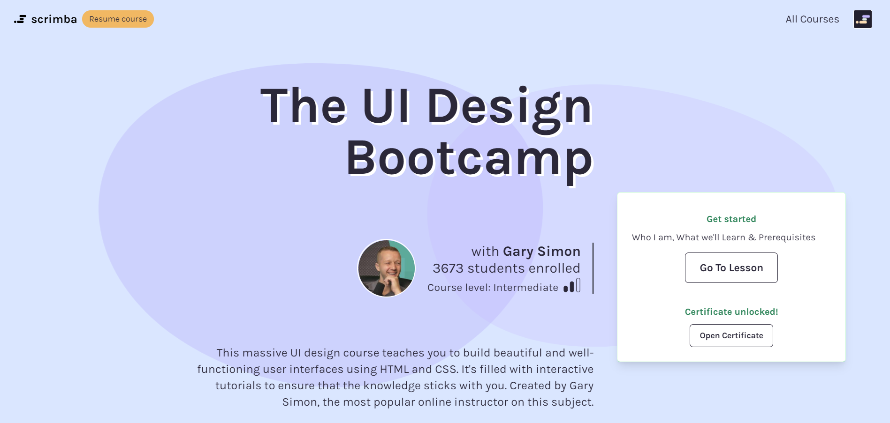
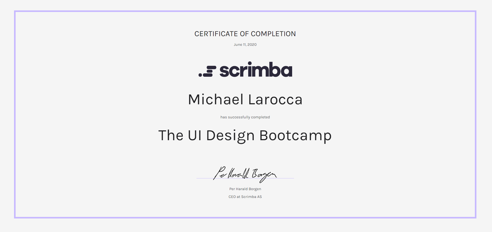

---

## To become the best front-end web developer you can be, you must attain a strong foundation in coding and UI/UX design.

## This article introduces you to Gary Simon, who will help you learn about both!

### Gary Simon

Gary Simon has over twenty years of experience in UI/UX Design and Front-end web development. Gary releases new premium content weekly on his YouTube channel [DesignCourse](https://www.youtube.com/user/DesignCourse), and he is also a teacher at Scrimba!

---

### What is UI/UX Design

UI Design stands for "**user interface**." [Wikipedia](https://en.wikipedia.org/wiki/User_interface_design) describes, "User interface design or user interface engineering is the design of user interfaces for machines and software, such as computers, home appliances, mobile devices, and other electronic devices, with the focus on maximizing usability and the user experience."

UX Design stands for "**user experience**." [Wikipedia](https://en.wikipedia.org/wiki/User_experience) describes, "The user experience is how a user interacts with and experiences a product, system or service. It includes a person's perceptions of utility, ease of use, and efficiency."

---

### My introduction to CSS

After learning **HTML** (*HyperText Markup Language*), the next step in learning front-end web development is to learn **CSS** (*Cascading Style Sheets*). Apart from the syntax, when I researched what CSS was all about, I discovered that it has a lot to do with colors, fonts, style, structure, and the overall users' interactive experience.

After my newfound understanding, I immediately thought, "learning CSS does not sound like a job for a programmer. Learning CSS sounds like a job for a graphic designer."

##### Since I aspire to become a well-versed front-end web developer, I decided to "put aside" coding for a moment and learn about graphic design fundamentals.

---

*While researching graphic design, I found this helpful YouTube playlist [Graphic Design](https://www.youtube.com/playlist?list=PLpQQipWcxwt9U7qgyYkvNH3Mp8XHXCMmQ).*

*I also purchased and completed this Udemy course, [The Complete Graphic Design Theory for Beginners Course](https://www.udemy.com/course/graphic-design-theory-for-beginners-course/).*

*Finally,  I discovered my favorite UI design source for coders, the DesignCourse YouTube channel created by [Gary Simon](https://www.youtube.com/user/DesignCourse)!*

---

### DesignCourse YouTube Chanel

I can not speak highly enough about Gary Simon's [DesignCourse](https://www.youtube.com/user/DesignCourse) YouTube channel.

As an aspiring front-end web developer, the information that he provides is invaluable. Not only does he teach you all about design, but he also teaches you how to code!

---

### UI Design Fundamentals

To create effective and great-looking UI designs, Gary tells us, **"The only way to produce good UI designs is by first understanding the UI design fundamentals."**  

To teach us, Gary created this free YouTube tutorial **"Learn UI Design 7 Fundamentals Tutorial - Full Course for Beginners."**

<iframe width="853" height="480" src="https://www.youtube.com/embed/vD3B6guUI0o" title="YouTube video player" frameborder="0" allow="accelerometer; autoplay; clipboard-write; encrypted-media; gyroscope; picture-in-picture" allowfullscreen></iframe>

---

#### You can learn by watching the YouTube course, or you can also take Gary's free interactive Scrimba course [Learn UI Design Fundamentals](https://scrimba.com/learn/design)

---

**The topics covered in the course are the UI Design Fundamentals:**

* White Space
* Color
* Contrast
* Scale
* Proximity
* Typography
* Visual Hierarchy

Gary references the "**UI Design Fundamentals**" frequently in his lessons.

Even though I am not a graphic designer, by just having a basic understanding of the UI Design Fundamentals, I noticed a drastic improvement in my work by applying them!

---

### The UI Design Bootcamp

[Learn UI Design 7 Fundamentals Tutorial - Full Course for Beginners
](https://www.youtube.com/watch?v=vD3B6guUI0o), is a small sample from Scrimba's [UI design Bootcamp](https://scrimba.com/learn/designbootcamp).

***I have taken both the course and the Bootcamp, and I can highly recommend both!***

 

---

### New Scrimba Course

<iframe width="1520" height="586" src="https://www.youtube.com/embed/VwM7SII8JOo" title="YouTube video player" frameborder="0" allow="accelerometer; autoplay; clipboard-write; encrypted-media; gyroscope; picture-in-picture" allowfullscreen></iframe>

---

#### During Scrimba's latest Livestream, they announced Gary's new upcoming Scrimba course!

**Scrimba course:** [Coding_For_Designers](https://scrimba.ck.page/codingfordesigners)

---

### Fun facts

#### Garry guest hosts for Brad Traversy

Many people consider Brad Traversy to be one of the leading pioneers of coding Tutorials on YouTube. It's not surprising that people feel this way when they learn that Brad gained well over a million YouTube subscribers on his [TraversyMedia](https://www.youtube.com/c/TraversyMedia/about) channel, all on his own!

When Brad Traversy decided to start inviting guest hosts on his YouTube traverse media channel, Gary Simon was the first!

---

<iframe width="853" height="480" src="https://www.youtube.com/embed/0JCUH5daCCE" title="YouTube video player" frameborder="0" allow="accelerometer; autoplay; clipboard-write; encrypted-media; gyroscope; picture-in-picture" allowfullscreen></iframe>

---
---

### Gary Simon is also a guitarist! 

#### Check out this video of Gary playing Stevie Vai's "For the Love of God."

---

<iframe width="853" height="480" src="https://www.youtube.com/embed/rQpCEvOym7s" title="YouTube video player" frameborder="0" allow="accelerometer; autoplay; clipboard-write; encrypted-media; gyroscope; picture-in-picture" allowfullscreen></iframe>

---
---

### Gary Simon Links

[Website - Designcourse](https://www.designcourse.com/)

[YouTube - DesignCourse](https://www.youtube.com/user/DesignCourse)

[Twitter - DesignCourse](https://twitter.com/designcoursecom?ref_src=twsrc%5Egoogle%7Ctwcamp%5Eserp%7Ctwgr%5Eauthor)

[Udemy - Gary Simon](https://www.udemy.com/user/garysimon2/)

[Lynda - Gary Simon](https://www.lynda.com/Gary-Simon/427927-1.html)

[Pluralsight - Gary Simon](https://www.pluralsight.com/authors/gary-simon)

[Skillshare - Gary Simon](https://www.skillshare.com/profile/Gary-Simon/249961)

---

### Advance your career with a 20% discount on Scrimba Pro using this [affiliate link](https://scrimba.com/?via=MichaelLarocca)!

Become a hireable developer with Scrimba Pro! Discover a world of coding knowledge with full access to all courses, hands-on projects, and a vibrant community. You can [read my article](https://selftaughttxg.com/2021/06-21/06-07-21/) to learn more about my exceptional experiences with Scrimba and how it helps many become confident, well-prepared web developers!

###### ***Important:*** *This discount is for new accounts only. If a higher discount is currently available, it will be applied automatically.*

**How to Claim Your Discount:**
1. Click [the link](https://scrimba.com/?via=MichaelLarocca) to explore the new Scrimba 2.0.
2. Create a new account.
3. Upgrade to Pro; the 20% discount will automatically apply.

##### ***Disclosure:*** *This article contains affiliate links. I will earn a commission from any purchases made through these links at no extra cost to you. Your support helps me continue creating valuable content. Thank you!*

---

### Conclusion

Having a solid foundation in UI/UX design is just as important as having a solid foundation in coding.

Understanding and applying the UI Design Fundamentals will significantly enhance your projects.

Gary Simon's experience in both design and programming makes him an ideal teacher for aspiring web developers.
