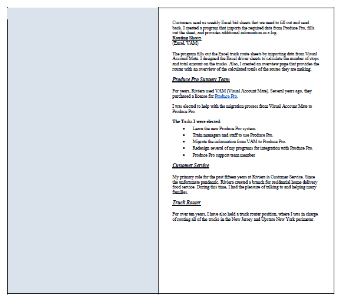

---

## This week's article covers a Scrimba Livestream event where tech recruiter Jermaine Murray helps web developers to optimize their CVs and Resumes, giving them the best opportunity to get hired!

## Covered in the Livestream

**During the Livestream, Jermaine covered the following topics:**

* Aesthetic/visual presentation
* Impact statements
* Use of keywords
* The theme of your resume

---

### Aesthetic/visual presentation

It would be best if you aimed to create a resume that is clean and easy to read. Make sure that your grammar and formatting are correct, and use a suitable template.

**Jermaine recommends that we use a good resume template, and he provides us with two resources:**

* [Canva](https://www.canva.com/design/play?category=tACZCki4tbY&type=TACQ-qm91ig)

* [Creddle](http://creddle.io/)

Ideally, your resume should be one page.

If you have more than five years of work experience, Jermaine says you can have a two-page resume but be selective on what you add. Having years of work experience shows tenure and has value, but it is essential to keep your resume consolidated.

---

### Review process

Jermaine tells us that we have to put ourselves in the "**seat of the person**" reading our CVs and Resumes.

Recruiters and hiring managers look at many resumes per day.

Jermaine explains that our CVs and resumes are being "**skimmed**" over and that we have **ten seconds** to get the reader's attention.

---

### Impact statements

Since we do not have much time, we need to grab the reader's attention.

Jermaine instructs us to "**front-load**" our resumes.

---

***Skills need to be at the top of your resume.***

---

During the Livestream, there were several resumes where people listed their skills toward the end of their resumes. Having your skills "**buried**" within your resume is ill-advised and might **not work in your favor**.

**Jermaine's suggested resume structure**

1. Name and contact information
2. Skills
3. Work experience

---

***"Put your skills at the front, and then contextualize your skills with your experience right after."***

---

**It is in our best interest to list out "skills" at the beginning.**

By having our skills listed first, the reader will continue to see how we applied them if the **keywords** match a job position.

---

*Photo by Markus Winkler from Unsplash*

---

### P.A.R.

Jermaine provides valuable inside information when he explains the "P.A.R." Process.

**P.A.R.**

* Problem
* Action
* Resolution

When it comes to our work experience and portfolio projects, recruiters and employers are gauging our ability to foresee a problem, our capabilities to handle that problem, and the outcome of how we resolve the problem.

---

### Projects

To gain technical experience to add to our resume, Jermaine suggests connecting with other developers and participating in projects, such as GitHub open source projects.

Also, when recreating projects provided from boot camps and courses, we are encouraged to add our own enhancements.

---

**Adding our own enhancements shows others our capability and proves that we know and can create with the topics studied, thus fulfilling the "P.A.R." requirement**. It also verifies that we are not simply *"copying and pasting"* code from our study projects.

---

Jermaine looks over a submitted resume during the Livestream. He compliments them on how they described their project as "**reverse-engineered**," citing that it is much better than describing their project as "**copied**."

The project is a Netflix clone, which is part of Scrimba's [Frontend Developer Career Path](https://scrimba.com/learn/frontend).

Jermaine elaborates that a programmer could enhance the Netflix project by coding it to provide ten curated movie suggestions to the viewer.

---

***The goal is to portray yourself as a problem solver—someone who envisions enhancements and the ability to add them.***

---

*Image by Mohamed Hassan from Pixabay*

---

### Suggested information to remove

* Portrait Picture
* Gender
* Race
* Age
* References

Jermaine explains that our resume will pass through several people and that there is a chance that someone along the process might have a prejudiced opinion which may result in our resume not reaching through to the top.

**We want to be judged by our abilities and experience, not our appearance.**

---

*"The entire hiring process... job search, interviewing, resumes... it's all an exercise on subjectivity and how you make the person feel on your first impression."*

> *- Jermaine Murray*

---

**To consolidate our resume, only include the essential information. We can provide references upon request later.**

---

### Irrelevant work experience

Jermaine instructs us to remove irrelevant work experience from our resumes.

Several of the submitted resumes had work experience listed that was not relevant to the jobs they were applying for, which, if removed, would leave only qualifying experience and would also consolidate the resume.

---

### Gaps in work experience

**Being an entrepreneur**

During the Livestream, **Mahidhar Nyayapati**​ was concerned with having a few failed e-commerce businesses. If he neglected to add his e-commerce businesses to his resume, it would create a gap in his work experience.

Jermaine addresses this by explaining that it takes a lot of courage to start any type of business, and it is to be commended, not to be ashamed of.

---

##### Leanne shares a comment in the Livestream, "Jeffrey Cohen says it nicely, Emphasize the successes you achieved."

---

**Being fired**

Jermaine suggests that if you were fired from a job, you should explain that **it was not a good fit for you**. Handling the situation in this manner should resolve any concerns.

---

***The overall consensus is that all job experience is good job experience, and you should include it in your resume.***

---

<iframe width="703" height="395" src="https://www.youtube.com/embed/NLPAkQagmNw" title="YouTube video player" frameborder="0" allow="accelerometer; autoplay; clipboard-write; encrypted-media; gyroscope; picture-in-picture" allowfullscreen></iframe>

---

***Timestamp: 49:00 - My resume review***

---

### My resume review

**What I did right**

* Name on top
* Links
* Skills

Jermaine said that it was a nice-looking resume. It was colored nicely and had sections with plenty of white space, making it easier to read.

The "**working**" pdf links were listed on top, right where they belong.

Skill's were listed next, right after the links.

---

---

**What I did wrong**

What concerned Jermaine, he is not a fan of resume templates that have a vertical split.

Jermaine explains, when it comes to "skimming," people naturally read from left to right. With the current layout, the reader is forced to read down to page two and then go back to page one and read down to page two again.

**Remember, we have a ten-second window to retain our resume reader's attention.**

---

---

*As for my portfolio projects, Jermaine brings up an excellent point, just because you list your projects on your resume doesn't mean that the person reading your resume is going to your website to view them.*

---

**It would be in your best interest to include information on at least one of your projects in your resume.**

---

### Social media

On my resume, I provided my social media links.

Jermaine brought to our attention that we should be "**mindful**" of what we post and like on social media, as it could have a potentially negative impact. Leanne added, even if you do not list your social media links, they may look at your content anyway!

---

### Key points

* Use a good resume template
* Ideally, your resume should be one page
* Resumes are being "skimmed" over
* We have ten seconds to get the reader's attention
* Skills need to be at the top of your resume
* portray yourself as a problem solver
* Do not include: gender, race, age, portrait picture
* Remove irrelevant work experience
* All job experience is good job experience
* Be mindful of what you post and like on social media

---

### My other related "recruitment" articles

* [Create a portfolio website that gets noticed by tech recruiters](https://selftaughttxg.com/2021/05-21/PortfolioWebsite/)

* [Interview Tips from a Tech Recruiter](https://selftaughttxg.com/2021/04-21/InterviewTipsFromATechRecruiter/)

* [Job Search and Interview Tips with Dylan Israel](https://selftaughttxg.com/2021/03-21/JobSearchAndInterviewTipsWithDylanIsrael/)

* [Create a LinkedIn profile that gets noticed by tech recruiters](https://selftaughttxg.com/2021/03-21/LinkedIn-Profile-Review/)

---

### Conclusion

Creating a clean and easy-to-read resume that showcases our skills provides recruiters and potential employers with a presentation of what we know and what we can do.

**Jermaine Murray** provided valuable insight into what tech recruiters and employers are looking for in potential candidates.

Following the advice given will improve our CV's and resumes, ultimately giving us the best opportunity of getting hired.
