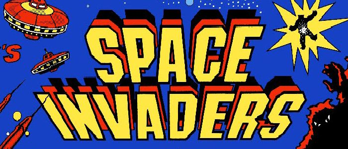

---

## With my growing coding skillset from learning at Scrimba, I created an arcade game website that includes game projects taught by them!

### In this week's article, I document the creation of [La Roc-Cade](https://www.laroccade.com/)!

---


---

### Logo

For the arcade website's logo, I once again worked with [Design Desk](https://www.fiverr.com/design_desk/create-3-original-logo-with-vector-source-file?context_referrer=logo_maker_banner&source=gallery-listing&ref_ctx_id=bc5f47b4-4d2f-4fc1-b92a-939ff2d05e95&pckg_id=1&pos=3&context_type=rating&funnel=10f6ae96-c261-468c-ae21-99a3c6a28b9a), through [Fiverr](https://www.fiverr.com/).

Design Desk created the logo for my blog, and my experiences working with them have been great. They have a talented and attentive staff, and I can highly recommend them.

---

### La Roc-Cade

I came up with the name of the website using my last name, **Larocca**.

Larocca's Arcade turns into **La Roc-Cade**.


For La Roc-Cade's logo design, I added the hyphen as a reference to the famous **Pac-Man** logo, and I had the "**A**'s" in the logo modified to look like an **Asteroids** style space ship.

I added a **Galaga**-style star for the final touch but positioned it in a manner that makes the space ship-styled "**A**" look like it's shooting.


*All rights reserved by Bandai Namco, Atari, Inc. and Namco*

---

### Games slogan

Directly underneath the La Roc-Cade logo is the slogan "**GAMES**."

I had this portion of the logo to be styled as a reference to "**SPACE INVADERS**."



*All rights reserved by Taito Corporation*

---

#### *Note: The La Roc-Cade logo has not been finalized. The finalized version may differ from the one displayed in this article.*

---

### Light & Dark Theme Toggle Switch

For my La Roc-Cade website, I wanted to incorporate a light & dark theme toggle switch.

Taking what I learned from Scrimb'a [Build a color tool in vanilla JavaScript](https://scrimba.com/learn/javascriptcolortool), I recreated and expanded on the light & dark theme toggle switch design.

---

In the Scrimba project taught by [James Q Quick](https://selftaughttxg.com/2021/03-21/TeacherFeature_JamesQQuick/), we build a simple toggle switch.

**When the light theme is selected, the toggle button is white. When the dark theme is selected, there is an animation of the toggle shifting, and the toggle button turns black.**


---

**For the Scrimba project, I created a Star Wars theme toggle switch that changes to a Rebel logo for the light themes and then turns into an Empire logo when switched to the dark theme.**


*All rights reserved by Disney and Lucasfilm*

**[Here is a link to my scrim](https://scrimba.com/scrim/cofc440cd8e666e753d36659b)**

---

### How I created the Pac-Man toggle

**I redesigned the toggle switch for my La Roc-Cade website and changed it into a Pac-Man theme toggle switch!**


When each theme is selected, Pac-Man eats the dots and shifts into the  
new position.

---

Building upon Scrimba's toggle,  I used a clip-path tool called [Clippy](https://bennettfeely.com/clippy/), which Bennett Feely created.

```css
.inner-circle-pac-man-right {
  clip-path: polygon(100% 0, 50% 50%, 100% 100%, 0 100%, 0 50%, 0 0);
}
.inner-circle-pac-man-left {
  clip-path: polygon(100% 0, 100% 50%, 100% 50%, 100% 100%, 0 100%, 50% 50%, 0 0);
}
```

---

#### I used a CSS "::after" Selector to create the "Pac dots."

---

```css
.toggle-btn::after {
  position: absolute;
  content: ". . . .";
  margin-bottom: 12px;
  margin-left: 5px;
}
```

---

### Flipping Game Cards

I based the flipping game cards on a [Scrimba Weekly Web Dev Challange](https://selftaughttxg.com/2021/01-21/ReviewScrimbaWebDevChallenge/), created by [Michael Rybintsev](https://twitter.com/alanmynah).

Displayed on the front of the game cards is an image of the game to play.

To play a game, hover over the game card and click the "**Play Game**" button.

I designed the "**Play Game**" button to resemble an arcade quarter slot.

To select games to play, cycling through the carousel by clicking on the next and previous arrow buttons.

---

### Webkit Reflection


Inspired by a fellow Scrimba student [Palak Jain's](https://github.com/Palak-coder626) [Movie Carousel](https://twitter.com/PalakJain626/status/1356644494414909441) project, I added reflections to the game cards.

I originally wanted to create a 3d carousel similar to Palak's. I decided against it because it would not be a viable model to scale as I continue to add games to it.

---

**To create the reflection, it actually only takes one line of code. However, it is not supported on all browsers.**

```css
-webkit-box-reflect: below 8px -webkit-gradient(linear, right top, right bottom, from(transparent), color-stop(40%, transparent), to(rgba(255, 255, 255, 0.5)));
```

---

#### *To find out if the code that you are using in your projects is supported across a list of browsers, I use an informative website that is aptly called "[Can I use](https://caniuse.com/)."*

---

**You can go to w3schools website to learn more about [-webkit-box-reflect:](https://www.w3schools.com/css/css3_image_reflection.asp).**

---

### 25 cent Coin Slot

Classic arcade cabinets typically have a red light-up quarter coin slot. I loosely designed the "**Play Game**" button on this.

When you hover over the "**Play Game**" button, it lights up green to indicate that it is selected.

---

### Custom Cursor

The final touch was to turn the mouse cursor into a quarter, so it gives the impression that you are inserting a quarter into the coin slot to play the game!

To learn more about creating custom cursors, watch this amazing YouTube video from the **[Code with Leanne channel](https://www.youtube.com/channel/UCcVIHAWGsOndLoxm9GEe03g)!**

**[How to Code Custom Cursors in HTML & CSS | PNG Cursors | SVG Cursors](https://www.youtube.com/watch?v=FOC5RZHK_Gw)**

---

### Custom Carousel

I devised the carousel from two Scrimba projects. One carousel was from a JavaScripmas challenge created by [Gary Simon](https://selftaughttxg.com/2021/04-21/TeacherFeature-GarySimon/).

The other Scrimba project was "Let's build a carousel from scratch" by Karl Hadwen.

I had to build, study, and learn how these carousels worked first to create mine successfully.

My carousel is different than the two that I learned on Scrimba. Mine shows multiple images at a time. Both of the  Scrimba projects only showed one image and a time and hid the rest.

---

To create my carousel, I had to overcome three issues.

**Issues I needed to overcome**

1. Select all images and get the "left: px" value
2. Increment and decrement each image "px" value by 400 respectively
3. Set boundaries for the beginning and the end of the carousel

---

**Select all images and get the "left: px" value**

To select all of the images and get the left pixel values, using a for loop, I used the **getComputedStyle()** method and assigned it to a variable named currentGameStyleLeftValue .

```javascript
let currentGameStyleLeftValue = window.getComputedStyle(allgameCards[i], null).getPropertyValue("left");
```

---

**Increment and decrement each image "px" value by 400 respectively**

I then had to change the pixel value from a string to an integer. To accomplish this, I used the **parseInt()** function and assigned it to a variable named **currentGameValueParseInt**.

```javascript
let currentGameValueParseInt = parseInt(currentGameStyleLeftValue);
```

---

**Finally, I subtracted 400 pixels to the images moving to the left and added pixels to the images moving to the right. I also had to convert the integer back into a string and append "px" (pixels).**

```javascript
let moveCurrentGameCardsLeft = currentGameValueParseInt - 400 + "px";
let moveCurrentGameCardsRight = currentGameValueParseInt + 400 + "px";
```

---

**Set boundaries for the beginning and the end of the carousel**

Using the current left pixel value of the images, I can determine the beginning and end of the carousel. I only allowed the images to move when they were within my specified range.

```javascript
    if(currentGameValueParseInt + 400 <= 1200) {
      allgameCards[i].style.left = moveCurrentGameCardsRight; 
    }  

    if(currentGameValueParseInt - 400 >= -1200) {
      allgameCards[i].style.left = moveCurrentGameCardsLeft; 
    }  
```

---

With this code applied, you can cycle through the carousel all the way to the last image and all of the way to the first image. Traversing all of the ways in either direction will leave only one image remaining. 

#### Before writing and implementing this code, you can go past all of the images beyond the scope of the carousel, and they would all just disappear!

---

### Custom bezier curve

To give my carousel a unique feel to the movement, I decided not to use the standard [transition-timing-function values](https://www.w3schools.com/cssref/css3_pr_transition-timing-function.asp).

**transition-timing-function values**
* ease
* linear
* ease-in
* ease-out
* ease-in-out

---

**Instead, I used [cubic-bezier.com](https://cubic-bezier.com/#.17,.67,.83,.67) to create a customized bezier curve for my carousel animation.**

What is a [Bézier curve](https://en.wikipedia.org/wiki/B%C3%A9zier_curve)? **Wikipedia states**, "A Bézier curve is a parametric curve used in computer graphics and related fields. The curves, which are related to Bernstein polynomials, are named after Pierre Bézier, who used it in the 1960s for designing curves for the bodywork of Renault cars. Other uses include the design of computer fonts and animation."

---

### CSS transition Property

To implement the custom bezier curve with my carousel, I wrote the following code and added it to my **game-card** class.

```css
transition: left .3s cubic-bezier(.27,-0.43,1,1.01);
```

**[transition-timing-function Property](https://www.w3schools.com/cssref/css3_pr_transition.asp)**

---

### La Roc-Cade Games

So far, I have created two Scrimba game projects that are available to play, **Scrimba Snake** and **Star Wars Dice Duel**.

As part of [Scrimba's Frontend Web Developer Career Path](https://scrimba.com/learn/frontend), there is also a Pac-Man game that I will be creating and adding to La Roc-Cade soon!

---

***While creating the first two Scrimba game projects, I documented and shared the process in two articles.***

**[Scrimba: Snake Game](https://selftaughttxg.com/2021/04-21/Scrimba-SnakeGame/)**

**[Scrimba Challenge: Dice Game - Make it your own](https://selftaughttxg.com/2021/04-21/Scrimba-Challenge-DiceGame-MakeItYourOwn/)**

---

### Advance your career with a 20% discount on Scrimba Pro using this [affiliate link](https://scrimba.com/?via=MichaelLarocca)!

Become a hireable developer with Scrimba Pro! Discover a world of coding knowledge with full access to all courses, hands-on projects, and a vibrant community. You can [read my article](https://selftaughttxg.com/2021/06-21/06-07-21/) to learn more about my exceptional experiences with Scrimba and how it helps many become confident, well-prepared web developers!

###### ***Important:*** *This discount is for new accounts only. If a higher discount is currently available, it will be applied automatically.*

**How to Claim Your Discount:**
1. Click [the link](https://scrimba.com/?via=MichaelLarocca) to explore the new Scrimba 2.0.
2. Create a new account.
3. Upgrade to Pro; the 20% discount will automatically apply.

##### ***Disclosure:*** *This article contains affiliate links. I will earn a commission from any purchases made through these links at no extra cost to you. Your support helps me continue creating valuable content. Thank you!*

---

### Conclusion

In creating this arcade website,  I completed a milestone goal that I set for myself two years ago when I started taking web development seriously.

As my coding skillset develops, I plan on creating and adding multiplayer games, a high scoreboard, and more!

I want to thank the Scrimba community, which provided me with the education, guidance, and confidence I needed to make my "**[La Roc-Cade](http://laroccade.com/)**" project a reality.
