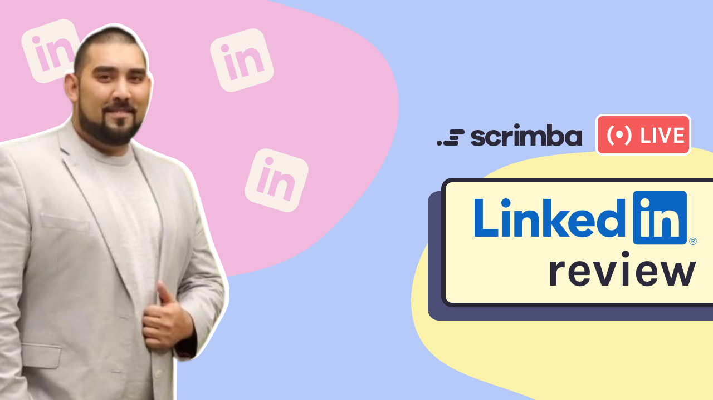
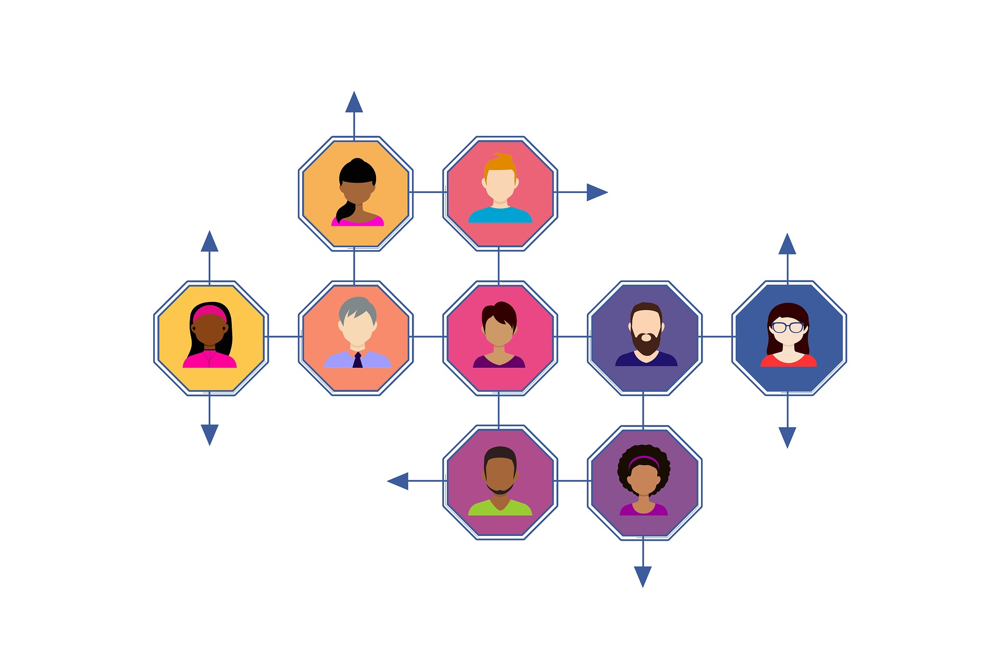
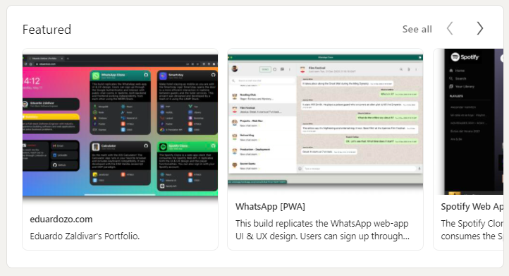
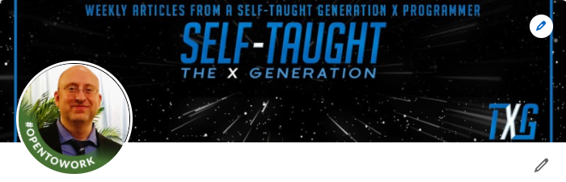

---

## This week's article covers a Scrimba Livestream event where Danny Thompson helps us optimize our LinkedIn profiles, providing us with valuable insight that gives us the best opportunity to get hired!

---

At the beginning of the Livestream, Danny explains that **our LinkedIn profiles are getting a six to ten-second glance and that we need to keep our profiles accessible and easy to read**.

It is important to note that most hiring managers are not programmers. **We need to "hook" the person reviewing our LinkedIn profile, enticing them to contact us** and to pass our profile to the next person in line in the hiring process.

---

### Danny's top 3 to fix recommendations

The Livestream host, Leanne, inquires from Danny his top three recommendations for our LinkedIn profiles to "really make them shine."

Danny replies with his top three fix's that are all too common in LinkedIn profiles:

1. Falsifying experience
2. Your about me is not your biography
3. Not enough keywords

---

**Falsifying experience**

Danny explains that people **unintentionally** falsify their work experience.

There is a distinct difference between being a **freelancer** and being a **student**.

When you say you are a freelancer, hiring managers want to see receipts. Meaning you were paid to make websites over the period of time that you are stating.

---

**Your about**

Your about me is not your biography. Your about section needs to be short and concise.

---

**Not enough keywords**

Candidate profiles are being searched for the technology needed for the job, not by the title of the job.

Danny explains in Eduardo's case that "**Back-end Software Engineer**" is not being searched. What is being searched is the technology used by a Back-end Software Engineer:

* Mongo DB
* MySQL
* Ruby
* PHP
* Laravel
* Node.js

**So we must list the technology we use on our LinkedIn profiles to appear in searches.**

---

*Image by Gerd Altmann from Pixabay*

---

### LinkedIn profile sections

**Banner**

It is recommended to create a banner that includes our "**call to action**" information.

**Call to actions**

* Website address
* e-mail address
* Phone number

---

**Profile**

For our profile picture, we should also use a professional-looking color photo of ourselves.

**Your profile needs to portray the job you want, not your current job.**

We need to provide "**keywords**" in this section that reflect our skills for the jobs we are interested in applying.

---

**Featured**

The featured section, Danny explains, is the most valuable piece of real estate on your profile.

**In the featured section, we control:**

* The narrative
* The impressions
* The conversation

***The featured section needs to include our best work, achievements, and awards.***

The work that we display here should be unique and original. You should not include projects taught in tutorials, such as to-do lists and calculators.

Also, it is in our best interest to display colorful, eye-catching content in our featured section, such as Eduardo did.

Note that Danny instructs us **not** to place our resume in our featured section.

**Our goal is to provide just enough information on our LinkedIn profile to pique the reader's interest and then have them eager to inquire more information from us.**

---

### Quantifiable achievements

Danny implores us not to list out daily job duties. He gives us an easily relatable example of a cashier. "If you were a cashier for six years, do not tell me that you handled cash transactions at a cash register."

We need to showcase our quantifiable achievements.

**Quantifiable achievements**

* How we brought value to a company
* How we resolved problems
* What we achieved

---

### Projects vs. Freelance

As discussed earlier, Danny explains that we often unintentionally falsify our work experience. Falsifying work experience offends the hiring managers and recruiters, and Danny encourages us to correct this.

---

### Do not portray yourself as overqualified.

Danny explains another ill-advisable approach is to present yourself as someone who is "**overqualified**" for the jobs you are applying for.

If you are a founder, president, CEO, or any other title above the position you are applying for, you will run into trouble.  

**If you portray yourself as someone who is overqualified for a position, you will most likely not get contacted and offered that position.**

In this situation, you will have to "**downplay**" your overqualified role to match the job role you are applying to.

---

---

### 500 + conections

Danny encourages us to make five hundred connections on LinkedIn. He explains to us that it is not as hard as it sounds to achieve.

Danny is also a big advocate for Meetups. **By attending Meetups, we can expand our network and add the people we meet to our LinkedIn connections.**

However, Danny instructs us not to "**spam**" people with copy-paste-style messages as this will harm our credibility. Also, only reach out to and add "**tech**" related connections.

---

### Improve your LinkedIn Page with Danny Thompson

<iframe width="956" height="538" src="https://www.youtube.com/embed/YuL_JoDeBDM" title="YouTube video player" frameborder="0" allow="accelerometer; autoplay; clipboard-write; encrypted-media; gyroscope; picture-in-picture" allowfullscreen></iframe>

---
---

### LinkedIn review timestamps 

* [Eduardo Zaldivar](https://www.linkedin.com/in/eduardozo/) | Back-end engineer 6:40
* [Franklyn Okenwa](https://www.linkedin.com/in/franklyn-okenwa/) | Intern 23:45
* [Michael Larocca](https://www.linkedin.com/in/michaeljudelarocca/) | Career changer 28:15
* [Paola Rossi](https://www.linkedin.com/in/paola-anttonela-rossi-querales/) | Certifications 38:10
* [Andrei-Valentin lordachescu](https://www.linkedin.com/in/aviordachescu/) | Founder 43:20
* [Minhajul Karim](https://www.linkedin.com/in/minhajul/) | Freelancer 52:50

---

### My review

For my banner, I used an image of my blog. As an unforeseen consequence, I was blatantly advertising to everyone that I am a "**self-taught**" developer.

Danny explains that in the web dev community, being a self-taught developer is commendable. However, to a non-technical person reviewing my LinkedIn profile, **being a self-taught developer could be a "bigger red flag than a reassurance.**"

Danny encourages me to change the banner and not promote the fact that I am a self-taught developer.

**Danny wisely states, "We don't want them questioning our abilities; let our abilities speak for themselves."**

My about me section was also too long. Danny suggests that I remove my website and add it to the banner along with my e-mail address and phone number as a "**call to action**."

**Then Danny states that our portfolio websites must be pristine, as we are using them as a call to action on our LinkedIn.**

Since I have sixteen years of experience as a Microsoft Office Specialist, Danny recommends that I leave it on my profile but leave it in the background.

Also, as I am interested in front-end developer positions, Danny recommends removing information about my blog.

With my new understanding of having my LinkedIn profile portray the job I want, I will update my banner as suggested and change my keywords to reflect appropriately.

---

### 4 Steps to land a job in tech

Also, during the Livestream, Danny gives us his "4 Steps to land a job in tech.
" 
1. LinkedIn profile
2. Portfolio website
3. Portfolio projects
4. Resume

To succeed in breaking into the tech field, we need to optimize our LinkedIn profile, portfolio website, portfolio projects, and resumes.

---

**About certifications:** Certifications that are taken at test centers such as Amazon (AWS) & Google certifications hold weight. Online certifications earned from home are acknowledged as personal achievements.

---

### Job gaps are no longer a hindrance

Danny provides much-needed relief to the viewers that gaps in our job history are no longer a hindrance.

At one point in time, Danny explains that gaps in our job history were a difficult hurdle to overcome. However, since the pandemic, this is no longer the case.

---

### Danny's disclaimer

Danny approached our LinkedIn profile review from the perspective of a hiring manager. Danny wants us to succeed, so he had to be transparent while conducting the reviews.

If you would like to learn more about LinkedIn reviews from the perspective of a hiring manager, Danny created a valuable free resource, a YouTube series titled: [GET A JOB USING LINKEDIN](https://www.youtube.com/playlist?list=PL54X5yR8qizsMpvTCqUIEFMeEp-chvcxk)

Danny also revealed an upcoming YouTube series where he will have four guests conducting five-minute tech Interviews. After the review, they will discuss what went right and what went wrong.

---

*I have been very impressed by Danny and all of his assistance to the web dev community. If you would like to learn more about Danny and how he has helped me, I wrote an article on him: [Teacher Feature: Danny Thompson](https://selftaughttxg.com/2021/03-21/TeacherFeature_DannyThompson/)*

---

### My other related "recruitment" articles

* [Create CVs and Resumes that get noticed by tech recruiters
](https://selftaughttxg.com/2021/05-21/CreateCVsAndResumesThatGetNoticedByTechRecruiters/)

* [Create a portfolio website that gets noticed by tech recruiters](https://selftaughttxg.com/2021/05-21/PortfolioWebsite/)

* [Interview Tips from a Tech Recruiter](https://selftaughttxg.com/2021/04-21/InterviewTipsFromATechRecruiter/)

* [Job Search and Interview Tips with Dylan Israel](https://selftaughttxg.com/2021/03-21/JobSearchAndInterviewTipsWithDylanIsrael/)

* [Create a LinkedIn profile that gets noticed by tech recruiters](https://selftaughttxg.com/2021/03-21/LinkedIn-Profile-Review/)

---

### Conclusion

We now know that we only have six to ten seconds to hook the person reviewing our LinkedIn profile. We need to make our about section short and concise, and we need to include keywords to the jobs we want to attain correctly.

Our goal is to provide just enough information to entice the reviewer to take the next step and contact us for more.

Following the advice given by **Danny Thompson** will improve our LinkedIn profiles, ultimately giving us the best opportunity of getting hired.
