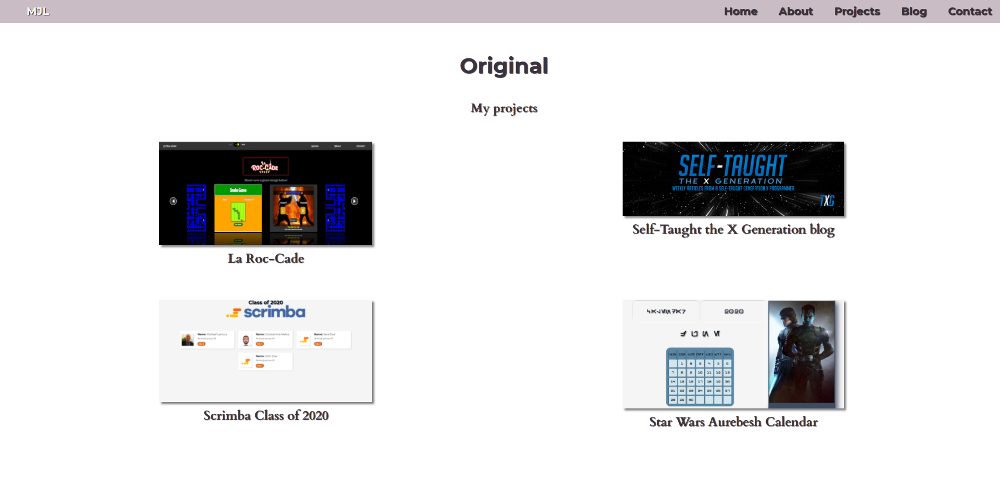
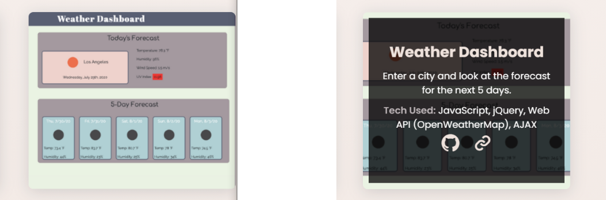
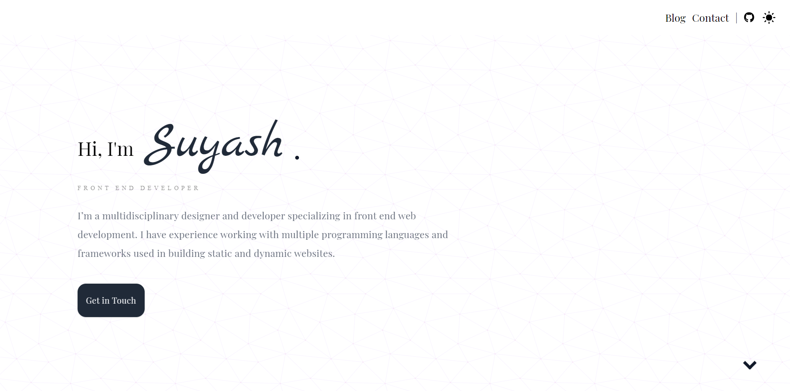
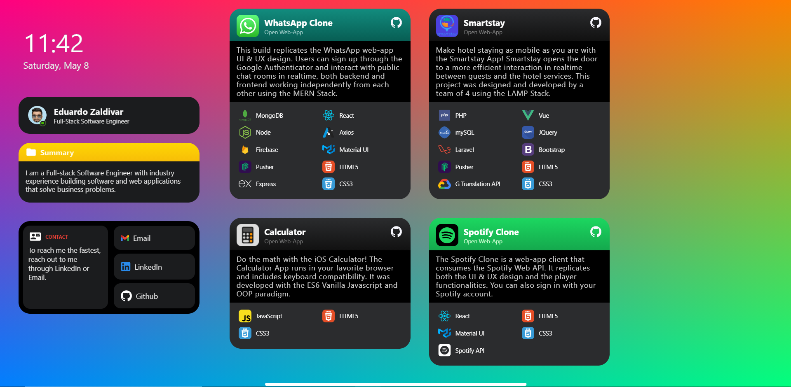

---

## This week's article covers a Scrimba Livestream event where tech recruiter Molly-May Gallagher helps web developers to optimize their portfolio websites, giving them the best opportunity to get hired!

---

### Tech recruiter Molly-May Gallagher is back again, reviewing students' work in a Scrimba Livestream hosted by community manager Leanne.

**In the Livestream, Molly discusses the importance of web developers having a portfolio website, what tech recruiters look for on your site, commons portfolio mistakes, and more.**

---

### How important is a portfolio website

Molly explains that if an employer reads your CV or resume **first** and is interested in you, their next step will be to request a demonstration of your work.

**Creating a portfolio website showcases what you can do.**

Molly elaborates in the Livestream that some companies gauge your abilities by having you take tech tests, which can be time-consuming.

Having your projects and your code available for potential employers to review could save both parties time.

---

### What tech recruiters look for

As a tech recruiter, Molly looks for clean, responsive websites that showcase our abilities. 

---

### Keep your portfolio up to date

Molly encourages us to keep our portfolio websites up to date.

**We need to make sure that our portfolio reflects our current capabilities.**

As we create new projects, we should showcase them on our website and systematically remove old projects.

If you are using GitHub, a collection of all of your work will be available to view by recruiters and potential employers. So there is no need to have older projects on your portfolio website.

---

### Create unique projects

In the beginning, it is good to create lesson-based projects and add them to your portfolio website.

When you've been programming for a while, it's in your best interest to start creating unique projects.

Having original projects that you imagined on your portfolio website will help you to "**stand out from the crowd**."

---

### Common portfolio mistakes

During the Livestream, Leanne asks Molly what the most common portfolio mistakes are.

Molly then talks about inaccessible links in portfolio projects. She explains that it may be a security issue, a login issue, or a broken link, but if she has a problem accessing them, so will the potential employer.

**So it is imperative to make sure that all of your links to your projects are accessible.**

---

<iframe width="853" height="480" src="https://www.youtube.com/embed/pW1LGCIYGV4" title="YouTube video player" frameborder="0" allow="accelerometer; autoplay; clipboard-write; encrypted-media; gyroscope; picture-in-picture" allowfullscreen></iframe>

---

**Timestamp: 22:30** - My portfolio review

**Timestamp: 48:12** - My question answered

---

### What they do and what we used

When we showcase our projects, we must clarify what they do and what we used to create them.

---

---

When Molly reviewed my portfolio site, she suggested that I **add descriptions** to my projects and inform **what I used to create them**.

*In my case, I used HTML, CSS/SASS, and JavaScript.*

Molly informs us that clearly stating what we used to create the website makes it easier for a recruiter to understand our projects, and then they can relay our work to potential employers.

**It's important to note that not all tech recruiters are programmers.**

Let's imagine a scenario where a tech recruiter on behalf of an employer is looking to hire an applicant that is well versed in **React**.
If this tech recruiter is not a programmer, it is definitely in the best interest of you, the programmer, to clearly indicate that you created your project in **React** if you used it.

---

#### Here is an example of a portfolio project that clearly indicates what was used to create it:

---

---

For [Maria's](https://mairagee524.github.io/portfolio/) weather dashboard portfolio project, she has an image of the project. When you hover over the weather dashboard project, an overlay appears that describes what the project does, what she used to create it, and she provided links to both the live project and the GitHub repository. Very impressive!

---

### Link to the live project

As mentioned earlier, not everyone reviewing your projects will be programmers themselves, so it is vital to link to the live projects.

After several years of being a tech recruiter, Molly explains that she is now becoming more comfortable with GitHub, but she still doesn't fully understand it.

**Having links to your live projects ensures that everyone will be able to view them.**

---

### My question answered

**My question:** *"From a recruiter's point of view, what are the pros and cons of providing a picture of yourself on your portfolio website?"*

**The consensus is that providing a picture of yourself on your portfolio website is optional.**

Molly explains that it doesn't bother her if there is no picture of yourself on your website. What matters to her is the work that you can do.

For my personal preference, I want potential employers to see my **work** first. If they are impressed with my portfolio projects and take the next step to learn more about me, they will see a picture of me on my LinkedIn, Twitter, and Github.

---

### The ideal portfolio

We were fortunate enough to have an ideal portfolio website submitted on the Scrimba Livestream. The portfolio website belongs to Suyash.

---

[Suyash's portfolio website](https://suyash.ca/)

---

Even though the portfolio website consists of only one page with three sections, the portfolio website is well designed.

**The ideal website**

* Clean, simple, yet elegant
* Showcases what you can do
* Straight to the portfolio section

***Molly was very impressed with Suyash's portfolio website and used it as an example of what we all should strive for when creating ours.***

---

### The "Wild Card" portfolio

Eduardo Zaldivar did not submit his portfolio website through Scrimba as the rest of us did. He was in the chat during the Livestream and requested it to be reviewed then.

**Eduardo set an excellent example to all of us by proving it pays to take the initiative to put yourself out there!**

The best part of Eduardo's story was that he submitted an excellent portfolio! Leanne and Molly were both impressed. His site differed from the standard style, was elegant, and colorfully attractive.

---

[Eduardo Zaldivar's portfolio website](https://www.eduardozo.com/)

---

When done right as Eduardo has, having a unique portfolio website is an excellent way to stand out from the crowd and get noticed!

I'm sure everyone, starting with me, will be using the color tech icons that Eduardo used on his portfolio!

---

### Submitted Portfolio Websites

We are all at different stages of learning web development, and everyone put a lot of work and effort into creating their portfolio site that Scrimba reviewed in the Livestream.

I believe what is most important, at any stage, is to put yourself out there.

So in this article, I am showcasing and linking to every portfolio website that Scrimba reviewed in the Livestream!

---

### Portfolio Websites and timestamps

**[Maira](https://mairagee524.github.io/portfolio/) | Timestamp 15:00**

**[Andrei](http://aiordachescu.herokuapp.com/webportofolio) | Timestamp 19:55**

**[Michael Larocca](https://michaeljudelarocca.com/) | Timestamp 22:30 - My portfolio review**

**[Thomas Chant](http://tomsclassroom.com/#/) | Timestamp 24:40**

**[Ambreen Khan](https://ambreenkhan.netlify.app/) | Timestamp 27:25**

**[Abhijeet Saxena](https://itsrockyy.me/) | Timestamp 34:00**

**[Diego](https://www.diegoraffa.com/) | Timestamp 36:17**

**[Ifeoluwa Oderinde](https://my-portfolio-nu-eosin.vercel.app/) | Timestamp 38:25**

**[Suyash](https://suyash.ca/) | Timestamp 39:50 & 45:30**

**[Doriana Zela](http://dorianazela.com/)  | Timestamp 42:25**

**[Eduardo Zaldivar](https://www.eduardozo.com/)  | Timestamp 52:50**

---

### Key Points

* Create a clean, responsive website
* Showcase what we are capable of doing
* Create a multi-page portfolio website
* Have a portfolio tab (preferably linked to a separate webpage)
* Note what tech you used to create your projects
* Link to the live project and GitHub project
* A picture of yourself on your portfolio website is optional
* Keep your portfolio updated
* Create unique projects

---

### My other related "recruitment" articles

[Interview Tips from a Tech Recruiter](https://selftaughttxg.com/2021/04-21/InterviewTipsFromATechRecruiter/)

[Job Search and Interview Tips with Dylan Israel](https://selftaughttxg.com/2021/03-21/JobSearchAndInterviewTipsWithDylanIsrael/)

[Create a LinkedIn profile that gets noticed by tech recruiters](https://selftaughttxg.com/2021/03-21/LinkedIn-Profile-Review/)

---

### Conclusion

Creating a clean, responsive portfolio website that showcases our abilities provides recruiters and potential employers with a demonstration of what we know and what we are capable of doing.

Molly-May Gallagher provided us with valuable insight on what tech recruiters and employers are looking for in potential candidates. Following the advice given will improve our portfolio websites, ultimately giving us the best opportunity of getting hired.