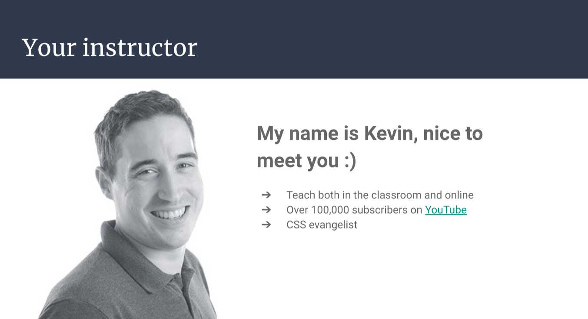
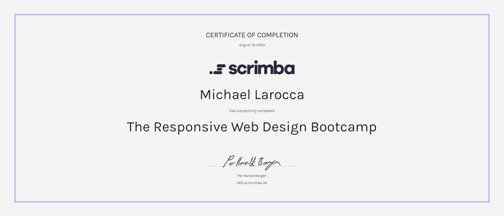

---

### To become an exceptional front-end web developer, you must attain a skill for positioning and layouts without depending on a framework. Kevin Powell is the teacher that you need to help you succeed!

---

---

### Kevin Powell

As part of Scrimba's [Front-end Developer Career Path](https://scrimba.com/learn/frontend), Kevin Powell was chosen to teach CSS.

Since Kevin has a strong YouTube presence, I already knew of him when Scrimba presented him as one of their teachers.

Choosing Kevin Powell as a teacher is an excellent decision. I intend on explaining why I decided to entrust Kevin as my primary CSS teacher and why I recommend him to aspiring web developers.

---

### About Kevin

Kevin is well known in the web dev community as a "**CSS Evangelist**."

When you get to know him, it is clear that he genuinely enjoys coding and teaching, and he is not afraid to mention the flaws that CSS has.

**Learning from a teacher who truly loves their work produces an enjoyable environment for students.**

---

### About Kevin's career transition

Kevin was a full-time teacher that was able to transition into being self-employed in tech.

The ability to leave a solid job to work self-employed successfully says a lot about his technical skills.

Since Kevin's previous job was teaching, he has already acquired the necessary qualifications and experience to be an instructor.

**Kevin's teaching experience is noticeable. He goes into the depth of topics that he is teaching and emits a patient and understanding manner towards his students' needs.**

---

### Positioning and layouts

To become a front-end web developer, you need to learn **HTML**, **CSS**, and **JavaScript**.

**HTML, CSS, and JavaScript are the core foundation for web development.**

---

*Image by Camilo Garcia from Pixabay*

---

Cited from **Wikipedia**, *"The HyperText Markup Language, or HTML is the standard markup language for documents designed to be displayed in a web browser. It can be assisted by technologies such as Cascading Style Sheets (CSS) and scripting languages such as JavaScript."*

---

To describe **CSS** as an intricately involved "[style sheet language](https://en.wikipedia.org/wiki/CSS)" would still be an understatement.

The simple syntax could easily be misleading for new aspiring web developers.

**In CSS, many concepts can be easily understood but can take a long time to master.**

---

*Image by Negative Space from Pexels*

---

#### Here is where Kevin comes in. When Kevin Powell teaches, he goes into great detail on what the code does, the effects that the code has, and the overall concept of what needs to be learned and understood.  

---

Also, he has many different tutorials that cover the same topics.

**Going over the same topics in various tutorials allows you to learn concepts by repetition.**

---

### Sass

Kevin is also a big advocate for **Sass**.

Cited from **Wikipedia**, *"Sass (short for syntactically awesome style sheets) is a preprocessor scripting language that is interpreted or compiled into Cascading Style Sheets (CSS). SassScript is the scripting language itself."*

---

---

**[Sass](https://sass-lang.com/) adds the ability to create variables and functions, along with the ability to nest your code and more!**

Note that web browsers cannot directly interpret Sass. After writing your code in Sass, your code needs to be compiled into a CSS file.

**The best part of learning Sass is the ability to use CSS syntax.**

Kevin often reminds us that we can learn Sass by slowly incorporating the new syntax that we learn. 

Since Sass files accept all CSS syntax, it makes it easy to "[mixin](https://sass-lang.com/documentation/at-rules/mixin)" Sass syntax with CSS (pun intended)!

---

### Here is an informative video by Kevin on this topic:

#### 5 Sass features that make it better than vanilla CSS

---

<iframe width="956" height="538" src="https://www.youtube.com/embed/g1kF45K-q7o" title="YouTube video player" frameborder="0" allow="accelerometer; autoplay; clipboard-write; encrypted-media; gyroscope; picture-in-picture" allowfullscreen></iframe>

---
---

### Step up your front-end skills with these 5 resources

In addition to all of the fantastic resources that he creates, Kevin has recently released a YouTube video the directs us to five additional resources to "**step up**" our front-end development skills:

* [Frontend Mentor](https://www.frontendmentor.io)
* [Style Stage](https://stylestage.dev) 
* [CSS Battle](https://cssbattle.dev/)
* [CodeWars](https://www.codewars.com/) 
* [Frontend Practice](https://www.frontendpractice.com/)
* [First Timers Only](https://www.firsttimersonly.com/)

---

<iframe width="853" height="480" src="https://www.youtube.com/embed/QqDH5sYzDS8" title="YouTube video player" frameborder="0" allow="accelerometer; autoplay; clipboard-write; encrypted-media; gyroscope; picture-in-picture" allowfullscreen></iframe>

---
---

### Kevin's Courses

Here is a list of Kevin's courses from his personal [website](https://www.kevinpowell.co/):

* Conquering Responsive Layouts (FREE)
* CSS Demystified
* Flexbox Simplified
* HTML & CSS Crash Course (FREE)
* The Responsive Design Bootcamp
* Sass: From hello world to real world

---

### Kevin's Scrimba Courses

Scrimba is a fantastic online coding school that I have been attending.

Kevin Powell is the instructor for several courses.

If you are interested in learning web development, you can get started for free with these two courses!

**[HTML & CSS Crash Course](https://scrimba.com/learn/htmlcss) (FREE)**

**[Build and deploy your portfolio](https://scrimba.com/learn/portfolio) (FREE)**

---

#### Suppose you are already learning web development and would like to take that step to the next level. In that case, I can highly recommend taking Scrimba's intermediate-level course taught by Kevin Powell, [The Responsive Web Design Bootcamp](https://scrimba.com/learn/responsive).

---

### Kevin's Links

* [Website](https://www.kevinpowell.co/)
* [YouTube](https://youtube.com/kevinpowell)
* [Twitch](https://twitch.com/kevinpowellcss)
* [CodePen](https://codepen.io/kevinpowell/)
* [Discord](https://discord.gg/GaBdxcE)
* [GitHub](https://github.com/kevin-powell)

---

### Conclusion

Attaining a skill for positioning and layouts without depending on a framework will turn you into a proficient web developer and help you stand out from the crowd.

Kevin Powell is an exemplary instructor that has created many resources to help web developers acquire this skill and much more.

I chose Kevin as my primary CSS instructor because learning from a person who genuinely enjoys coding and teaching is helping me to become an accomplished developer, and I believe he can help you become one too!
