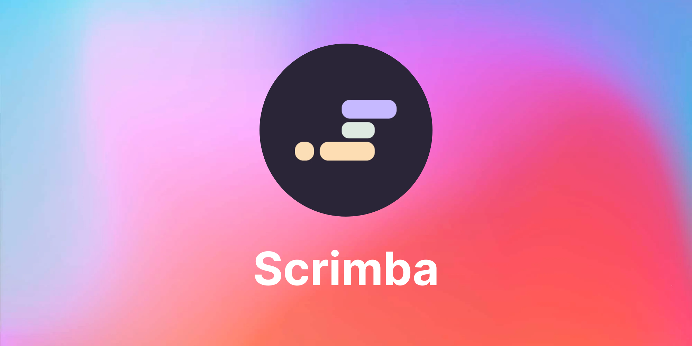
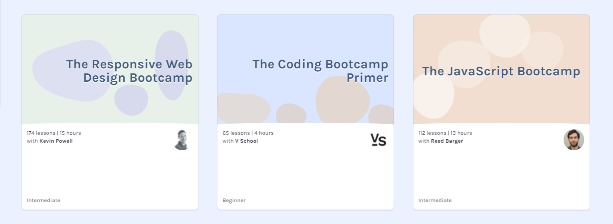
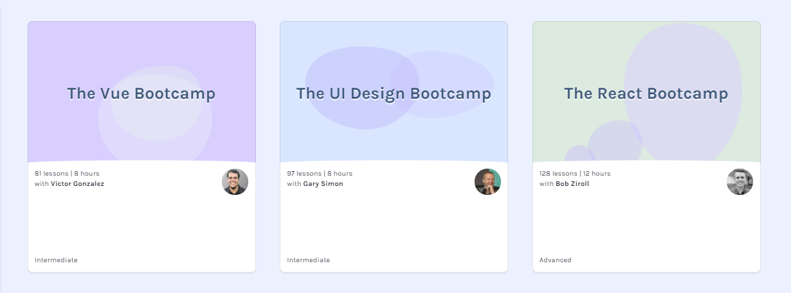

---

---

## There is so much more involved in becoming a web developer than just learning how to code. This week's article covers how Scrimba teaches students how to code and prepares them to enter the job market.

---

### What is Scrimba

What is Scrimba? [Scrimba](https://scrimba.com/) is an online coding school with the goal of "**giving you the quality of a coding Bootcamp at the price of a gym membership.**"

**What Scrimba has to offer**

* Scrim Technology (pause & edit code videos)
* World-class instructors, including YouTube celebrities
* A curriculum to hack you into the job market
* Peer-to-Peer learning on Discord
* A friendly online community meetups
* Livestream events
* Web dev weekly challenges
* Live weekly challenge walk-through with Leanne & Michael

---

### Becoming a self-taught web developer

There is so much more involved in becoming a self-taught web developer than just learning how to code. It would be best if you also prepared yourself to enter the tech field.

Not only does Scrimba teach you how to code, but they also prepare you to enter the job market by covering everything in the following web developer preparation checklist.

**Web developer preparation checklist**

* Portfolio projects
* Portfolio website
* LinkedIn
* Resume
* Interview

---

### Frontend Developer Career Path

Scrimba describes their course, *"This career path will turn you into a hireable frontend developer and teach you how to nail the job interview. It contains over 70 hours of top-notch tutorials, hundreds of coding challenges, and dozens of real-world projects."*

I am currently enrolled in this course, and I think it's fantastic!

They also have Bootcamp courses that are a great supplement to the Frontend Developer Career Path.

**I have completed three of the Bootcamps so far:**

* The UI Design Bootcamp - Gary Simon
* The Responsive Web Design Bootcamp - Kevin Powell
* The JavaScript Bootcamp - Reed Barger

**Scrimba also offers the following Bootcamps:**

* The React Bootcamp - Bob Scroll
* The Vue Bootcamp - Victor Gonzalez
* The Coding Bootcamp Primer - V School

---

***Also, Scrimba just released a FREE course, "[Learn JavaScript for free course](https://scrimba.com/learn/learnjavascript)," created by the CEO and co-founder of Scrimba Per Harald Borgen!***

---

### Scrimba students are getting hired.

That's right! Scrimba students are getting hired. You can hear their stories on "[The Scrimba Podcast](https://feeds.transistor.fm/scrimba)," hosted by Alex.

---

### What Scrimba has done for me

Before joining Scrimba, **I was learning to code, by myself,** from online tutorials.

When I found Scrimba, I was immediately impressed by their scrim technology that allows you to pause the video, edit and save the code displayed in the video, and then resume the tutorial.

I then joined their Discord community. In Scrimba's Discord, I started to share my code with other students, leave comments, and help them with their code. I also opted to join a "study group." **Now I was no longer learning to code by myself.**

---

**Twitter**

To take part in the [weekly web dev challenges](https://selftaughttxg.com/2021/01-21/ReviewScrimbaWebDevChallenge/), you need to submit your work through Twitter.

Submitting my web dev challenges forced me to start using my dormant Twitter account. I actually had to learn how to use Twitter to submit my work! Shortly after updating and using my Twitter account, I received congratulations on joining Twitter 10 years ago! Until joining Scrimba, I must have used Twitter for just ten days, ten years ago!

---

**Blogging**

Before joining Scrimba, during my online tutorial learning, I kept hearing how web developers should blog.

So, after much research and thought, I was finally convinced to start one, and I decided it would be fun and educational to set up and use a Gatsby starter blog.

It was quite eventful for me to set up, as the Gatsby starter blog is created in React, which I haven't learned yet.

I then purchased a domain name and got it up and running at the beginning of December 2020.

My original plan was to write several blog posts first, hold on to them as a buffer, and then start releasing them in January 2021.

However, in December, Scrimba created [JavaScriptmas](https://selftaughttxg.com/2020/12-20/Scrimba-JavaScriptmas_2020/), which was similar to an advent calendar, where participants completed challenges every day. It was enjoyable and well-received by all who participated. So I decided to start blogging early, without pre-writing several articles as I initially planned and promoted JavaScriptmas on the weekly articles I released.

**My blog was featured on the JavaScriptmas Livestream**

Following my instinct and starting to blog early really paid off for me. Leanne from Scrimba reached out to me through their Discord channel and informed me that they were going to showcase my blog on the JavaScripmas Livestream on Christmas eve!

Also, Scrimba took notice of my participation in helping other Scrimba students and decided to make me a community hero.

**Seemingly overnight, I went from being a lonely self-taught web developer learning from static online tutorials to a well-known participating member of a wonderful community created by Scrimba.**

---

<iframe width="853" height="480" src="https://www.youtube.com/embed/OdO_tPDcnus" title="YouTube video player" frameborder="0" allow="accelerometer; autoplay; clipboard-write; encrypted-media; gyroscope; picture-in-picture" allowfullscreen></iframe>

---
---

**Portfolio projects and website**

As Scrimba students take the Frontend Developer Career Path, they must create projects to complete the course.

In addition to the required projects I completed, I also created a portfolio website. Along with several other Scrimba students, our portfolio websites were reviewed by a tech recruiter on a Livestream.

---

---

***Scrimba has helped me and many others prepare to enter the job market through their recruitment Livestream events, and I personally participated in several of them.***

**Here is a list of articles I wrote on Scrimbas recruitment-related Livestreams:**

* [LinkedIn Review with Danny Thompson](https://selftaughttxg.com/2021/05-21/LinkedInReviewWithDannyThompson/)
* [Create CVs and Resumes that get noticed by tech recruiters](https://selftaughttxg.com/2021/05-21/CreateCVsAndResumesThatGetNoticedByTechRecruiters/)
* [Create a portfolio website that gets noticed by tech recruiters](https://selftaughttxg.com/2021/05-21/PortfolioWebsite/)
* [Interview Tips from a Tech Recruiter](https://selftaughttxg.com/2021/04-21/InterviewTipsFromATechRecruiter/)
* [Job Search: with Dylan Israel](https://selftaughttxg.com/2021/03-21/JobSearchAndInterviewTipsWithDylanIsrael/)
* [LinkedIn: with Molly-May Gallagher](https://selftaughttxg.com/2021/03-21/LinkedIn-Profile-Review/)

---

### Scrimba's 500,000 student milestone

I have been a Scrimba student for some time now, and I must say, they keep getting better! With a current milestone of 500,000 plus students enrolled, self-taught programmers everywhere are taking notice!

---

#### For additional reading about Scrimba, here is an excellent article written by **Per Harald Borgen**, 
[The quality of a coding Bootcamp at the price of a gym membership](https://scrimba.com/articles/the-quality-of-a-coding-bootcamp-at-the-price-of-a-gym-membership/)

---

### Summary of what Scrimba has done for me

* I no longer code alone
* I now use Twitter
* I now blog weekly
* I now have a properly set up LinkedIn
* I now have a properly created resume
* I am now properly prepared for interviews
* I created a portfolio website
* I created portfolio projects
* **I ultimately gained confidence!**

---

### Conclusion

Scrimba is so much more than an online coding school, and everyone is taking notice!

They have incredible staff and teachers, helpful students, and a wonderful community, making learning an immersive experience.

When you learn with Scrimba, they teach you how to code, help you to grow your skillset confidently, and readily prepare you to enter the job market.