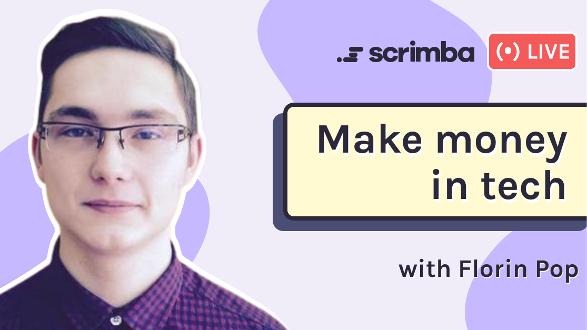
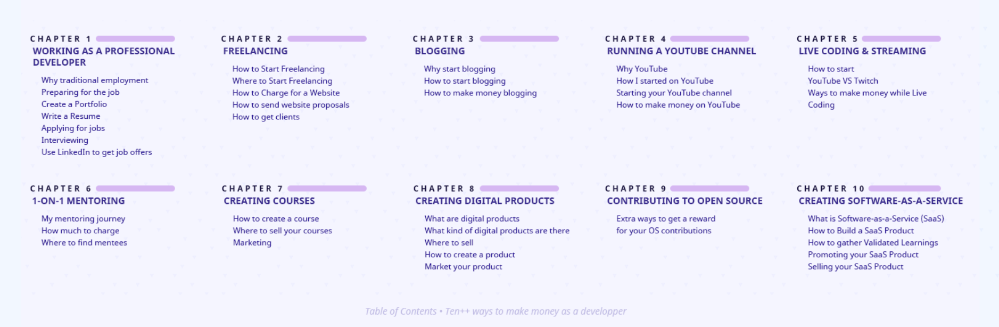

---

## Florin Pop joins us in a Scrimba Livestream to answer our questions, talk to us about his "Ten++ Ways to Make Money as a Developer" eBook, and celebrate his recent 100k YouTube subscribers milestone!

---

### Florin Pop's Intro 

Florin starts off the Livestream by telling us how he got his start in the tech field.

Florin explains that he had some experience when he was younger but credited 2013 as the year he started.

In 2013 he acquired work through the website "[freelancer.com](https://www.freelancer.com/)."

At that time, he saw projects of various sizes available and was hired by one after he applied to several.

The project that he took on was was a coding gig to convert a design into HTML and CSS.

Since Florin was attending school at the time, he was not under pressure to make money as a freelancer, but he tells us that the experience opened up a lot of possibilities for him.

---

### Invest in yourself

Florin teaches us that the best investment that we can make in tech is to invest in ourselves.

**To learn and develop his skills, Florin has:**

* Purchased courses
* Hired mentors
* Joined communities
* Joined programs
* Bought books

---

***Florin noted that he did not limit his learning to the tech field; he also expanded the areas of study to include finance and personal development.***

---

A turning point for Florin was the advice he was given by a person conducting one of his interviews. The constructive criticism that he received was that "**he needed to learn how to sell himself**." He was advised to sell himself by talking about what he knows well and what value he can provide.

When it comes to promoting ourselves, Florin advises trying multiple platforms and utilizing what works best for us on an individual basis:

* Facebook
* Instagram
* Twitter
* LinkedIn

---

### LinkedIn

Florin reveals his largest paid projects were sourced by people reaching out to him through [LinkedIn](https://www.linkedin.com/).

He made an effort to attain "**500+**" connections on LinkedIn and made sure they included recruiters, CEOs, and other developers.

The host, [Leane](https://www.youtube.com/channel/UCcVIHAWGsOndLoxm9GEe03g), brings to everyone's attention that Danny Thompson also recommended us to attain "**500+**" connections on LinkedIn in a recent Scimba Livestream event.

My LinkedIn profile was reviewed in this Livestream, and I documented it in my "[LinkedIn Review with Danny Thompson](https://selftaughttxg.com/2021/05-21/LinkedInReviewWithDannyThompson/)" article.

To learn more about Danny Thompson, you can read my "[Teacher Feature: Danny Thompson](https://selftaughttxg.com/2021/03-21/TeacherFeature_DannyThompson/)" article.

---

<iframe width="853" height="480" src="https://www.youtube.com/embed/ozZG-RjepCs" title="YouTube video player" frameborder="0" allow="accelerometer; autoplay; clipboard-write; encrypted-media; gyroscope; picture-in-picture" allowfullscreen></iframe>

---
---

### Blogging

Florin advises developers to blog. He explains to us that we should start by simply documenting what we are learning.

We should start by documenting new programming concepts, such as CSS flexbox and grid.

When we develop our skills and have a better understanding of such topics, we should then write a blog to explain them in detail to someone else. Writing an article with this approach will make you both a better developer and blogger.

In time, Florin started to receive requests to start writing for other publications.

**For his first paid article, Florin was offered approximately fifty dollars. Soon afterward, he was offered three hundred and then five hundred dollars.**

Florin learned how to earn money by writing articles through this experience and realized blogging to be a viable source of income.

During this Livestream section, Florin tells us about an article he recently read that provided twenty publications that will pay you to write articles for them. He suggests that we reach out to such publications to inquire about paid work.

---

**Florin also addresses the cliche question,** *"why should I blog about topics that other writers already cover?"* He insightfully explains that our writing will resonate with specific groups of people due to our style and our current level of programming experience.

Florin concludes by instructing us to create a blogging schedule that works for us and to be consistent with releasing the articles.

---

**For additional ways to earn money by blogging, Florin suggests adding:**

* Ads
* Affiliate links
* Advertise your products and services

---

### "Ten++ Ways to Make Money as a Developer" eBook

*By  Florin Pop*

---

#### Florin tells us that this book encompasses what he has learned over the years while creating content to earn money through various avenues in the tech field.

#### Florin provided a [20% discount when purchasing his eBook through this Scrimba link.](https://gumroad.com/l/makemoneydev/scrimba20)

---

### About the eBook

Knowing how to code is a fantastic skill that you can possess, but did you know that there are multiple ways you can monetize your coding skills?

**In this eBook, we're going to cover TEN++ ways of making money as a developer:**

1. Working as a Professional Developer
2. Freelancing
3. Blogging
4. Running a YouTube Channel
5. Live Coding & Streaming
6. 1-on-1 Mentoring
7. Creating Courses
8. Creating Digital Products
9. Contributing to Open Source
10. Building a SaaS (Software-as-a-Service)

---

---

### 100k YouTube Subscribers

**It took two years for Florin to reach 100k YouTube Subscribers.**

Florin Pop's goal for his YouTube channel was to build a reputation. He made sure that the content he created for the channel was projects that he knew he could handle.

One of his ideas for a YouTube video doubled his subscribers. The concept was a coding challenge to create ten projects in ten hours.
After the success of this video, Florin Pop's YouTube subscribers jumped from **30,000** to **60,000**!

---

**[10 JavaScript Projects in 10 Hours - Coding Challenge](https://www.youtube.com/watch?v=dtKciwk_si4&t=13s)**

1. Countdown Timer
2. Quiz App
3. Recipe App
4. Notes App
5. ToDo App
6. Movies App
7. GitHub Profiles
8. Drawing App
9. Password Generator
10. Weather App

---

<iframe width="853" height="480" src="https://www.youtube.com/embed/dtKciwk_si4" title="YouTube video player" frameborder="0" allow="accelerometer; autoplay; clipboard-write; encrypted-media; gyroscope; picture-in-picture" allowfullscreen></iframe>

---
---

However, another video idea he had ended up annoying his followers. The annoyance was due to "too much content" released in too short of a time.

**Florin teaches us from his experience to keep trying out new ideas and not trouble ourselves by anticipating which ones will work.**

---

### Florin's Links

* 📃 Website/Blog: https://florin-pop.com 
* 👉 Twitter: https://twitter.com/florinpop1705 
* 👉 Linkedin: https://linkedin.com/in/florinpop17 
* 👉 Instagram: https://instagram.com/florinpop17
* 👉 Facebook: https://facebook.com/florinpop17 
* 👉 Github: https://github.com/florinpop17 
* 👉 Dev.to: https://dev.to/florinpop17
* 👉 Twitch: https://twitch.com/florinpop17

---

### Advance your career with a 20% discount on Scrimba Pro using this [affiliate link](https://scrimba.com/?via=MichaelLarocca)!

Become a hireable developer with Scrimba Pro! Discover a world of coding knowledge with full access to all courses, hands-on projects, and a vibrant community. You can [read my article](https://selftaughttxg.com/2021/06-21/06-07-21/) to learn more about my exceptional experiences with Scrimba and how it helps many become confident, well-prepared web developers!

###### ***Important:*** *This discount is for new accounts only. If a higher discount is currently available, it will be applied automatically.*

**How to Claim Your Discount:**
1. Click [the link](https://scrimba.com/?via=MichaelLarocca) to explore the new Scrimba 2.0.
2. Create a new account.
3. Upgrade to Pro; the 20% discount will automatically apply.

##### ***Disclosure:*** *This article contains affiliate links. I will earn a commission from any purchases made through these links at no extra cost to you. Your support helps me continue creating valuable content. Thank you!*

---

### Conclusion

Florin Pop's message to us is that **we will achieve success through consistency**. On an individual basis, we need to set attainable goals and maintain a schedule that we can follow.

To "**Make Money as a Developer**," we need to try out the various avenues of freelancing mentioned in his **[eBook](https://gumroad.com/l/makemoneydev/scrimba20)** to see what works for us. While you may only earn a small amount with one, using several combined methods will add up!
