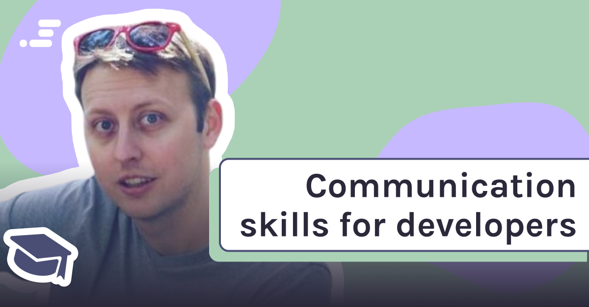

---

## In this week's article, self-taught web developer turned full-time Amazon employee Dylan Israel talks to us about the importance of acquiring communication skills on a Scrimba podcast hosted by Alex!

---

---

### To become a successful developer, it takes more than just learning how to code. Communication skills are just as essential as programming skills.

#### On Scrimba's June 21, 2021, Podcast, Dylan Israel talks to Alex booker about the importance of having communication skills.

---

### Dylan asks and answers three questions about Communication skills:

**Question:** "Do you have to have great communication skills?"

**Answer:** No.

---

**Question:** "Do you have to have mediocre communication skills?"

**Answer:** Yes.

---

**Question:** "Can you have no communication skills?"

**Answer:** Not if you want to do very well.

---

***When we are being interviewed, Dyan teaches us that we are being interviewed for more than just our technical skills; we are also being assessed to see how well we would work on a team.***

---

### Joining your first team

Dylan explains that we are often on a "**Solo**" adventure when learning as self-taught developers.

Using various resources, we customarily research and learn to code on our own.

---

*All rights reserved by Disney and Lucasfilm.*

---

#### When we enter the workforce as developers, we no longer work independently; we become part of a team.

---

**Programming is a team sport:**

* Engineers
* QA
* Business analysts
* Project managers
* Scrum masters
* UI/UX designers
* Managers
* Marketing

Dylan teaches us that we need to clearly communicate what we need when we are blocked, what our concerns are, and if we have questions, the ability to ask and follow up with them.

---

#### Dylan credits the communications skills that he has developed as being a driving factor to his success.

---

**Communication skills helped Dylan:**

* With interviews
* With job prospects
* To convey the value that he brings

---

### How we develop communication skills

Dylan tells us that communication skills are a ***learned skill*** and that developing communication skills takes time and effort.

He advises us to get out of our comfort zone and be more open by talking to people and asking questions.

**Dylan explains that he developed his communication skills by talking on podcasts, YouTube videos, and events.**

He also credits confidence that he gained by overcoming imposter syndrome aspects as helping him to develop communication skills.

---

***When you gain more confidence in your job role, Dylan states that it is essential for you to have the ability to communicate more clearly to others.***

---

### Applying your communication skills in the workplace

Dylan teaches us how to apply communication skills correctly by sharing experiences he had.

There were plenty of times when someone from upper management came directly to him and requested additional work to complete. **This situation creates a *"break in the chain of command,"* which should be handled tactfully.**

Dylan address this situation by replying, *"give me just a moment, let me figure out what that's going to look like, and I'll get back to you."*

Dylan then takes about twenty minutes to put together a rough estimate of what it will take to incorporate the request and then brings it to his direct manager. **He then resolves the situation by asking his direct manager to prioritize the request and talk to upper management.**

---

<iframe width="100%" height="180" frameborder="no" scrolling="no" seamless src="https://share.transistor.fm/e/bd0f8328"></iframe>

*Be sure to listen to the full episode, where Dylan also talks about the following:*

**SUMMARY**

#### If you want to become a successful developer in 2021, communication skills are more important than you might think. In this episode, Dylan Israel from Amazon talks about Agile software practices, teamwork, working with your manager, boundaries, and dealing with anxiety as someone on the shyer or introverted side.

[Communication skills for developers with Dylan Israel -transistor.fm](https://share.transistor.fm/s/bd0f8328)

---

### Just saying YES

By just saying **yes** all of the time, Dylan warns us that we are hurting ourselves.

Dylan continues by stating that companies out there will overwork you and then replace you when you have "**burnt out**."

By saying yes without having a conversation about putting together a rough draft and then getting back to them, we will be taken advantage of and lose respect in the eyes of our colleagues.

---

### Just say NO

Dylan believes, as developers, we need to get comfortable with saying "**no**."

If you are afraid to say no to your employer, Dylan states that we might not be in a good work environment.

**We should not be taken advantage of as a result of feeling that "we should just be happy that we have a job."**

As we are equipped with highly in-demand developer skills, Dylan encourages us by explaining that "**we have options**."If we are not satisfied with our current situation, we can leave to pursue a better work environment elsewhere.

---

### How Dylan judges a work environment

Dylan is an advocate for unit testing. So, if unit testing is not on a company's radar, he considers it to be a "**death march**."

Dylan explains that [technical debt](https://en.wikipedia.org/wiki/Technical_debt) is a result of not incorporating unit testing.

---

*All rights reserved by Disney and Lucasfilm.*

---

#### At the beginning of our developer career, we may need to work at companies that do not follow unit testing practices. However, Dylan advises that we should avoid such work environments when we reach the mid to senior level.

---

### Companys want to hire you

As for the companies with a good work environment, they want to hire skilled workers, and they want them to succeed.

"**Your success is your manager's success**," Dylan informs us.

So it is up to us, on an individual basis, to develop communication skills and utilize them to our advantage. We need to make sure that we transition from a "**Solo**" worker into an effective team player.

Armed with a new *point of view* on communication skills provided by  Dylan Israel, I feel more knowledgeable and confident entering into the web dev work **"force."**

---

*All rights reserved by Disney and Lucasfilm.*

---

### Dylan's book suggestions

#### For additional guidance on becoming a well-versed developer, Dylan suggests that we read the following books:

---

### The Clean Coder: A Code of Conduct for Professional Programmers 1st Edition

*by Robert Martin*

Dylan suggests **The Clean Coder** because he believes it does an excellent job teaching you how to be a professional in software engineering. It talks about technical skills, and it talks about the business environment.

---

### Clean Code: A Handbook of Agile Software Craftsmanship 1st Edition

*by Robert C. Martin*

Dylan also recommends **Clean Code**, regardless of whether you are a senior engineer or an aspiring engineer; he states that we should read both Robert Martin's books.

---

### The Self-Taught Developers Playbook

*by Dylan C. Israel*

Dylan is currently in the process of writing his first book!

**With all of Dylan's life experience, starting as a self-taught developer and working up to a six-figure salary at a FAANG company, this book has the potential of becoming a best seller!**

*Alex Booker already invited Dylan back to the Scrimba Podcast to talk about the book when released!*

---

### Dylan's links

* [Hire Dylan to mentor you via MentorCruise](https://mentorcruise.com/mentor/DylanIsrael)

* [Dylan Israel's website](http://dylanisrael.com/)

* [Dylan Israel's YouTube Chanel](https://www.youtube.com/user/pizzapokerguy87)

* [Self-Taught or Not website](https://www.selftaughtornot.com/)

* [Dylan Israel's Udemy courses](https://www.udemy.com/user/dylanisrael/)

* [Dylan Israel's Github](https://github.com/PizzaPokerGuy)

* [Twitter](https://twitter.com/PizzaPokerGuy)

* [LinkedIn](https://www.linkedin.com/in/dylan310/)

---

### My other Dylan Israel articles

* [Job Search and Interview Tips with Dylan Israel](https://selftaughttxg.com/2021/03-21/JobSearchAndInterviewTipsWithDylanIsrael/)

* [Teacher Feature: Dylan Israel](https://selftaughttxg.com/2020/12-20/12-06-2020_TeacherFeature-Dylan_Israel/)

---
### Conclusion

Learning to communicate well is a learned skill, and it is just as crucial as having programming skills.

As self-taught developers, we need to transition from a **Solo** developer into a developer that is part of a team.

Acquiring well-developed communication skills will help us become more confident, help us to earn the respect of our colleges, and ultimately assist us in excelling in our careers.

##### Has Dylan's advice on communication skills helped you? Please tell your "**Solo story**" by sharing this article and commenting on it!