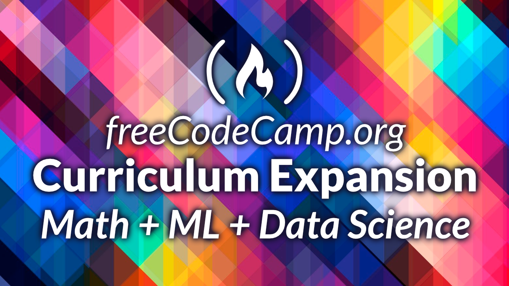
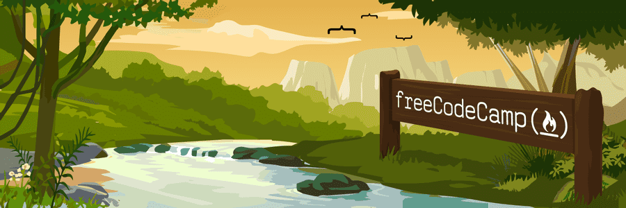

### This week's article covers Free Code Camp's 2021 Summit! New features announced, the Data Science Curriculum fully funded, and Ania Kubów joins the team to administer the Free Code Camp Talks Channel!

---

---

### What is Free Code Camp?

Founded by Quincy Larson, [Free Code Camp](https://www.freecodecamp.org/) is a non-profit organization committed to continually providing the education needed to enter the job market as a developer.

Without installing additional software, you can learn to code online for free with just a computer and access to the internet.

**Free Code Camp awards certifications!** Upon building and submitting five passing required projects per certification, you can earn and add them to your resume and post them to your social media.

In addition to their curriculum, Free Code Camp has a forum, a library of educative YouTube videos, and an online community to assist you on your coding journey.

---

*- Here is my Free Code Camp Responsive Web Design Certification*

---

**Free Code Camp certifications**

As the Free Code Camp curriculum evolves, rest assured, you will not lose any of your progress.

During the July 2021 Summit, Quincy Larson states that all Free Code Camp certifications will always be claimable as legacy certifications.

---

---

### Data Science Curriculum Expansion

Quincy Larson explains that data science skills are currently only taught at a few universities around the world. **Free Code Camp's goal is for anyone, anywhere, to have free access to these advanced mathematics and machine learning concepts that data scientists use in the field.**

Through donations, the community fully funded the **$150,000** [Data Science Curriculum](https://www.freecodecamp.org/news/building-a-data-science-curriculum-with-advanced-math-and-machine-learning/) Expansion, and an additional **$150,000** was matched by [Darrell Silver](https://twitter.com/darrellsilver)!

The Data Science Curriculum consists of 12 new certifications focused on math, computer science, and machine learning – all taught using Python.

Free Code Camp has already started bringing on experienced teachers using the funds raised from the community pledge drive.

During the Summit, Quincy introduced two new teachers who are helping design the Data Science Curriculum, Kylie and Ed. He praises them both as very talented developers and teachers and tells us that they are both Free Code Camp contributors.

**[Kylie Ying](https://twitter.com/kylieyying)** is a graduate student at MIT and the creator of Free Code Camp's [12 Beginner Python Projects - Coding Course](https://www.youtube.com/watch?v=8ext9G7xspg).

**[Ed Pratowski](https://twitter.com/EPratowski)** has taught math and computer science at the high school and collegiate level for nearly 20 years. He is now creating the foundational mathematical education of the new data science curriculum.

---

### The freeCodeCamp Talks Channel

YouTube celebrity [Ania Kubow](https://www.youtube.com/channel/UC5DNytAJ6_FISueUfzZCVsw) joins the Free Code Camp team and is entrusted with curating the content of their freeCodeCamp Talks channel!

Free Code Camp describes the channel's purpose as *"sharing great conference talks about software to get a wider audience."* They get the discussions from various sources, and they are all under the creative commons license. 

**Ania encourages us to subscribe to the freeCodeCamp Talks channel and tell her what additional content we would like to see!**

---

### Campfire Mode

Campfire Mode enhances your learning experience with the addition of beautiful aptly chosen acoustic guitar music provided by [Devin Lane](https://twitter.com/DevinCLane).

**Devin is a San Francisco-based musician who also goes by the name [Gentle Return](https://open.spotify.com/artist/7dFoXdChS3pVrba3MyuuTu) on Spotify.**

Devin explains that the addition of the music is to help the learner's mindset and ease the challenges of learning how to code.

With Campfire Mode enabled, as you type, you are treated with gentle melodically picked notes that form into an entire song as you code. 

When you submit a passing challenge, a victory chord is struck! When you submit a failing challenge, a palm-muted chord is struck, which clearly indicates to musicians and non-musicians alike that they did not pass the challenge in a gentle manner.

In addition to the added music while coding, similar melodic sounds are now heard while navigating through the Free Code Camp website! Toggle buttons, expansion menus, and the donation page all generate music through interactions.

They saved the best for last! When you successfully claim a hard-earned certification, you are rewarded with a victory song!

---

***Nicholas Carrigan, a prolific contributor to Free Code Camp who is now part of the staff, provides a demonstration of "Campfire Mode" during the summit at timestamp [5:02 ](https://www.youtube.com/watch?v=auaGiP2pP64&t=302s)***

---

<iframe width="900" height="506" src="https://www.youtube.com/embed/auaGiP2pP64" title="YouTube video player" frameborder="0" allow="accelerometer; autoplay; clipboard-write; encrypted-media; gyroscope; picture-in-picture" allowfullscreen></iframe>

---

***Be sure to watch the FreeCodeCamp July 2021 Summit!***

---

### Chapter - The Self-Hosted Open Source Event Management System for Non-profits

Free Code Camp has been working on "**Chapter**" a free self-hosted open-source alternative to Facebook Groups and Meetup.com.

Soon, other non-profits will also have the ability to host their instance of this event management tool on their servers.

Creating a tool like "**Chapter**" will eliminate the need for spending large amounts of money per year and allow them to maintain control of their own data.

You can watch a demonstration of "**Chapter**" on the Free Code Camp July 2021 Summit at timestamp [34:57](https://www.youtube.com/watch?v=auaGiP2pP64&t=2097s)

---

### The 2021 New Coder Survey is Now Live

[Dilan Eren](https://www.freecodecamp.org/news/2021-new-coder-survey/) is a Ph.D. candidate in sociology at Boston University. Over the past few months, she has been working with Free Code Camp founder Quincy Larson to design the 2021 New Coder Survey.

**The survey aims to understand the various needs of self-taught web developers to create a robust learning curriculum.**

As with past surveys, Free Code Camp will publish the results as an open data set. The survey is anonymous. They do not ask for any personally identifiable information, and all of the questions are optional.

**Here is a link to the survey: [The 2021 New Coder Survey-freeCodeCamp](https://docs.google.com/forms/d/e/1FAIpQLSccF-G2iSYVilXCk-SJe02-sGLtE0CQa-ejVrZDk8JL7sEuZw/viewform)**

---

### My other Free Code Camp related articles

* [Learn to code and earn a certification for free](https://selftaughttxg.com/2021/02-21/Earn_a_certification/)

* [There and Back Again](https://selftaughttxg.com/2021/01-21/ThereAndBackAgain/)

* [Teacher Feature: Dylan Israel](https://selftaughttxg.com/2020/12-20/12-06-2020_TeacherFeature-Dylan_Israel/)

---

### Free Code Camp Twitter Links

* 🔗[Devin Lane:](https://twitter.com/DevinCLane)
* 🔗[Nicholas Carrigan:](https://twitter.com/nhcarrigan)
* 🔗[Dilan Eren:](https://twitter.com/dilaner23746199)
* 🔗[Ed Pratowski:](https://twitter.com/EPratowski)
* 🔗[Kylie Ying:](https://twitter.com/kylieyying)
* 🔗[Ania Kubow:](https://twitter.com/ania_kubow)
* 🔗[Quincy Larson:](https://twitter.com/ossia)

---

**Note: If you can financially afford to, please consider a monthly contribution to Free Code Camp. Free Code Camp accepts monthly donations of $5 to help their non-profit organization run.**

---

### Advance your career with a 20% discount on Scrimba Pro using this [affiliate link](https://scrimba.com/?via=MichaelLarocca)!

Become a hireable developer with Scrimba Pro! Discover a world of coding knowledge with full access to all courses, hands-on projects, and a vibrant community. You can [read my article](https://selftaughttxg.com/2021/06-21/06-07-21/) to learn more about my exceptional experiences with Scrimba and how it helps many become confident, well-prepared web developers!

###### ***Important:*** *This discount is for new accounts only. If a higher discount is currently available, it will be applied automatically.*

**How to Claim Your Discount:**
1. Click [the link](https://scrimba.com/?via=MichaelLarocca) to explore the new Scrimba 2.0.
2. Create a new account.
3. Upgrade to Pro; the 20% discount will automatically apply.

##### ***Disclosure:*** *This article contains affiliate links. I will earn a commission from any purchases made through these links at no extra cost to you. Your support helps me continue creating valuable content. Thank you!*

---

### Conclusion

Quincy Larson tells us that having a tech job can provide a high quality of life for us; we can earn a high level of income working for a company, have the flexibility of working remotely or even start our own business.

With the upcoming courses announced in the 2021 Summit, Quincy tells us that Free Code Camp will continually provide education for us, even after we become established developers!

**Are you now encouraged to learn how to code? Have you or are you interested in earning certifications from Free Code Camp? Please share the article and comment!**
