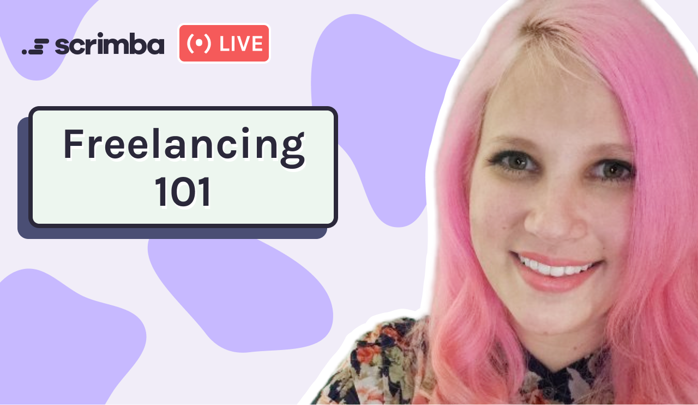
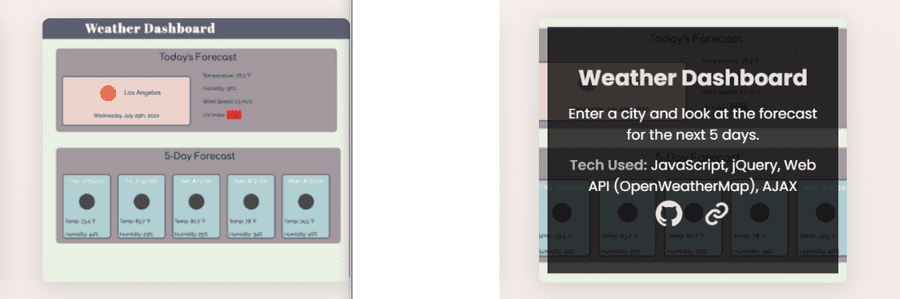

### In this week's article,  freelancer/Full-stack Developer Sarah Shook joins us on a Scrimba Livestream to teach us how to get started with freelancing, including tips, tools, and finding clients!

---
### About Sarah

Sara is a full-stack developer that transitioned into freelancing upon becoming a parent.

She is also a Bootcamp graduate and an advocate for networking on social media.

Sara currently works for a freelancing agency that she 
met through Twitter!

---

### Prerequisites of a Freelancer

To be a freelancer, Sara tells us that we need to learn foundational programming skills and that we also need to learn a framework.

**Foundational skills**

* HTML
* CSS
* JavaScript

In addition to the coding foundations, Sara uses [React](https://reactjs.org/) and [GraphQL](https://graphql.org/).

---

### How to get started freelancing

After learning the coding foundations, it is in our best interest to create a **strong portfolio** that showcases our skills to potential clients and employers.

For each portfolio project, it is vital to clearly note what each project does and the technology you used to create them.

---

**Have a strong portfolio that showcases your skills**

***- Scrimba student [Maria's](https://mairagee524.github.io/portfolio/) weather dashboard portfolio project***

---

To learn more about creating a strong portfolio, you can read my article that covers another Scrimba Livestream when a tech recruiter reviewed my portfolio along with several of my fellow Scrimba classmates! 

**Article: [Create a portfolio website that gets noticed by tech recruiters](https://selftaughttxg.com/2021/05-21/PortfolioWebsite/)**

---

**Your first freelancing job**

To get started freelancing, it would be best if you considered taking on a few free projects in return for testimonials and referrals.

**Create free projects for:**

* Local businesses
* Charitable organizations
* Friends and family

---

After successfully fulfilling such projects, it is advisable to charge low fees at first, "**to get your foot in the door**," and raise your prices to your preferred cost once you have the freelancing client momentum started.

**Low fee projects:**

* [Upwork](https://www.upwork.com/)
* [Fiverr](https://www.fiverr.com/)
* Though networking

---

### Finding clients

Sara tells us that we can find many freelancing opportunities through networking.

**Networking**

To expand her network and meet like-minded people, Sara joined the online web dev community through Twitter.

Sara tells us that many opportunities came her way through Twitter, including her current agency job!

---

**Tip:** We could attain clients through other freelancers of our level who currently have "too much work on their plate!"

---

<iframe width="900" height="506" src="https://www.youtube.com/embed/Z0MwoQ3lT3w" title="YouTube video player" frameborder="0" allow="accelerometer; autoplay; clipboard-write; encrypted-media; gyroscope; picture-in-picture" allowfullscreen></iframe>

---

##### *Be sure to watch the Livestream!*

---

**"If you are open to learning any technology, you can find work with it!"**

*- Sara Shook*

---

### Charge by the project vs. the hour

Sara personally knows freelancers that choose to be paid by the project.

Being paid by the project provides you with the benefit of receiving a portion of the payment upfront. Then upon completion of the project, freelancers receive the remainder of the payment.

Sara prefers to work by the hour. Being paid by the hour provides the benefit of time/money management, as she will know what amount she will earn per week and the additional perk of being paid to work through technical difficulties.

---

**Tip:** Sara tells us that there are a lot of freelance opportunities for developers that can create [WordPress](https://wordpress.com/) and [Shopify](https://www.shopify.com/) websites!

---

### Taxes

Depending on our global location, the laws will vary. Sara stresses the importance of us doing the research and correctly setting aside money to pay taxes.

---

### Freelancing Tools

With having to pay taxes in mind, along with time tracking, invoice creation, and other freelancing needs, Sara uses [Hello Bonsai](https://www.hellobonsai.com/).

**Hello Bonsai** describes their product as "Everything you need to run your freelance business."

---

### Freelancing Pros & Cons

**Pros**

* Be your own boss
* Choose your own clients
* Flexible hours
* Choose your preferred tech stack

**Cons**

* Lack of benefits
* Lack of reimbursements

---

### Sara want us to know

When Scrimba host [Leanne](https://www.youtube.com/channel/UCcVIHAWGsOndLoxm9GEe03g) asked Sara what she wishes she knew when she started freelancing and what she would do differently, Sara talks about **time/money management**.

**It is essential to give ourselves more than enough time to complete freelance projects and to have our services clearly stated in writing.**

---

### Sarah Shook links

* 🔗[Website](https://shook.codes/)
* 🔗[GitHub](https://github.com/shookcodes)
* 🔗[Twitter](https://twitter.com/shookcodes)
* 🔗[LinkedIn](https://linkedin.com/in/sarahshook)
* 🔗[dev.to](https://dev.to/shookcodes)

---

### Conclusion

Freelancing provides us the opportunity to earn income on our own terms. We have the liberty to choose our schedule, clients, and our preferred tech stack.

Taking on freelance projects will provide us with a strong portfolio and help us grow our network, ultimately providing us with even more opportunities!

**Are you interested in becoming a freelancer? If you have freelancing experience, what were your pros and cons? Please share the article and comment!**