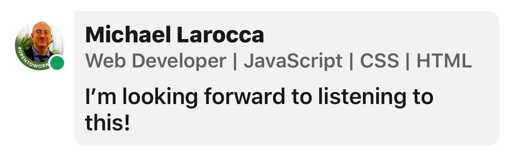
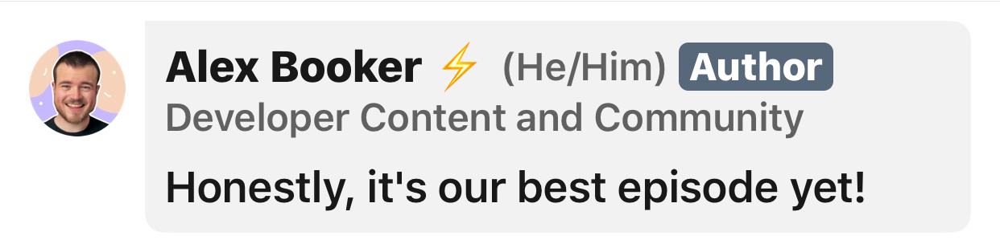
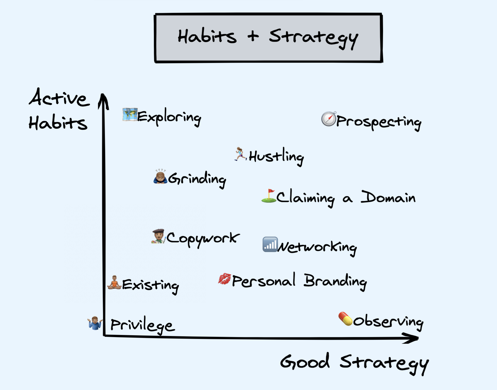
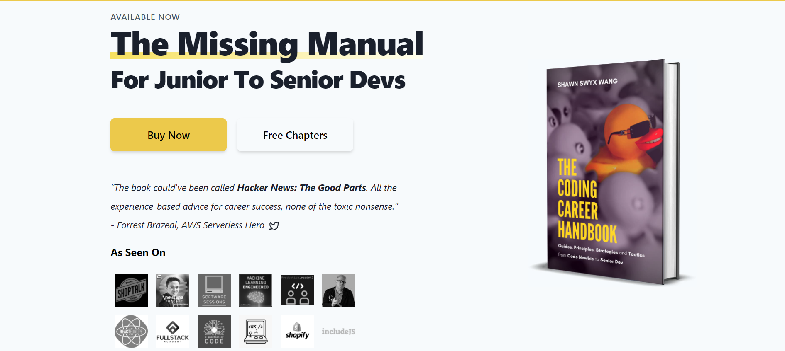

### In this week's article, Shawn Wang (Swyx) joins us on a Scrimba podcast to discuss concepts in his book that will teach us the principles, strategies, and actionable tactics we need to become hireable!

---

---

### Introduction

As a self-taught developer, I was excited to "**listen and learn**" about the principles, strategies, and actionable tactics that will help us become hireable from the Scrimba podcast featuring Shawn Wang.

So I sent out a message on social media about my enthusiasm, to which Scrimba host **[Alex Booker](https://twitter.com/bookercodes)** replied, "**Honestly, it's our best episode yet!**"

**Yes, Scrimba has delivered once again!**

The Podcast starts off strong when Scrimba host **Alex Booker** provides us with invaluable information, *"The best way to succeed at a job interview is to have them know who you are before you walk through the door."*

**Alex then elaborates**, *"We will benefit from having open-source work, blog posts, and a social media presence."*

---

This Podcast episode focuses on the benefits of **learning in public** and creating an "**online presence**" for ourselves.

Following through with the advice of this Podcast will provide potential employers with your "**technical chops**" and your "**dedication to learning**," resulting in "**breaking the ice**" at interviews!

---

### About Shawn

Shawn Wang is a developer/PM/angel investor, primarily active in the web dev community as a [blogger](https://www.swyx.io/ideas/) and frequent speaker. He is a GitHub Star 🌟, Stripe Community Expert, and helped co-found [Svelte Society](http://twitter.com/sveltesociety) and run the [React subreddit](https://www.swyx.io/moderating-rreactjs/) for over 200,000 developers.

Shawn is best known for being a #LearnInPublic evangelist and speaking/writing on React, JavaScript, and the Web's future. He is currently working on Developer Experience at [Temporal.io.](https://temporal.io/)

---

### Applying for your first tech job

When are you ready to apply for junior developer jobs?

Before jumping into creating an online presence for ourselves, Shawn addresses the common question, "**how do I know I'm ready to apply for my first tech job?**"

Shawn tells us, *"There'll never be a point where you're 100% ready,"* and that *"you're probably preventing yourself from finding some really great opportunities that you might be ready for, but you just had no idea."*

**The benchmark that Shawn provides for front-end developers is when you reach a point when you can take a coding project from beginning to end.**

---

*I believe a great way to attain the skills needed to apply for your first tech job is to complete a comprehensive course of study such as Scrimba's [Frontend Developer Career Path](https://scrimba.com/learn/frontend)!*

---

### Learning In Public

**What is learning in public, and why is it important?**

Learning in public is when we share our progress by posting our work on social media, having our coding projects accessible online, and documenting our learning journey through blogging.

**Shawn tells us that there is a fundamental change in proving our skills and our interests to employers.**

**We need to find a way to:**

* Build our skills in public
* Broadcast our interests
* Have people follow our progress

---

*Following these guidelines will result in employers seeking us out instead of us reaching out to them.*

---

Shawn explains to us that the business world calls this concept of **inbound marketing**.

###### [According to Wikipedia: ](https://en.wikipedia.org/wiki/Product_management) Inbound product management (also called inbound marketing) is the "radar" of the organization and involves absorbing information like customer research, competitive intelligence, industry analysis, trends, economic signals, and competitive activity, as well as documenting requirements and setting product strategy.

---

***Our goal is to create a reputation for ourselves so that when employers seek out candidates with a particular skill set, they think of us.***

---

### 80 / 20 Job Market

Shawn provides valuable insight when he reveals that **80%** of available jobs are not formally advertised first! People fill these jobs by hiring within the organization, recruiting family members and friends, and **hiring people with a reputation**.

---

### Teaching what you learn

It is said that a great way to learn a topic and reinforce your knowledge is to teach that topic to others.

**You do not have to be a professional in the topics you teach, and you should document and teach them right after you learn them.**

Teaching through writing blog articles will not only provide help for others, but you will also be able to reference the material at a later point should you need it!

---

***"Sometimes, the best communicator of knowledge is someone who just learned it."***

 ***- Shawn Wang***

---

### Why should you write blog articles on topics that are already covered by so many others?

The way we teach, on an individual basis, is unique and derives from our own perspectives. Certain people will resonate with our style of teaching over others.

---

### Why should I even start a blog?

Starting a blog will help you to become disciplined by the consistent writing and posting of articles.

Over time, your blog will provide a documented growth path for yourself and others to view and reference.

**Consistently blogging will prove to others that you are passionate, help grow your online presence, and ultimately produce more opportunities for you!**

---

**How you will benefit from blogging:**

* You will reinforce your knowledge
* You will have a documented growth path
* You will resonate with and help certain groups of people
* You will prove that you are passionate
* You will showcase your discipline through consistency
* You will build your online presence

---

<iframe width="100%" height="180" frameborder="no" scrolling="no" seamless src="https://share.transistor.fm/e/caf9ceab"></iframe>

***Be sure to listen to the full episode!***

---

### How to Create Luck

**Shawn tells us that there are four kinds of luck:**

* Accidental luck
* Active luck
* Prepared luck
* Magnetic luck

---

**Accidental luck**

We do not have control over Accidental luck, such as "being at the right place at the right time," winning a lottery or being born privileged.

---

**Active luck**

The more active you are, the better chance you have of "being at the right place at the right time."

---

**Prepared luck**

Prepared luck happens when you put in the work, time, and effort, and then an opportunity arrives that you are readily prepared to seize.

---

**Magnetic luck**

Magnetic luck is when you're working on something so compelling that people are drawn to you, and luck becomes your destiny.

---

### Creating luck through habits and strategy

Shawn created a model on "**how to get more lucky**" by incorporating habits and strategy:

 

---

**Check out this "must-read" article by Shawn Wang: [How to Create Luck: Article](https://www.swyx.io/create-luck/)**

---

***"When hard work meets opportunity, great things happen."***

***- Alex Booker***

---

### The Coding Career Handbook

The discussions during this Scrimba Podcast are derived from concepts taken out of Shawn's book, "**The Coding Career Handbook**."

Shawn provided a **30%** discount for Scrimba, and you can use this link to apply it: [The Coding Career Handbook: 30% off Scrimba coupon!](https://www.learninpublic.org/?c=SCRIMBA30#buy)

---

### My other related "recruitment" articles

* [LinkedIn Review with Danny Thompson](https://selftaughttxg.com/2021/05-21/LinkedInReviewWithDannyThompson/)

* [Create CVs and Resumes that get noticed by tech recruiters](https://selftaughttxg.com/2021/05-21/CreateCVsAndResumesThatGetNoticedByTechRecruiters/)

* [Create a portfolio website that gets noticed by tech recruiters](https://selftaughttxg.com/2021/05-21/PortfolioWebsite/)

* [Interview Tips from a Tech Recruiter](https://selftaughttxg.com/2021/04-21/InterviewTipsFromATechRecruiter/)

* [Job Search and Interview Tips with Dylan Israel](https://selftaughttxg.com/2021/03-21/JobSearchAndInterviewTipsWithDylanIsrael/)

* [Create a LinkedIn profile that gets noticed by tech recruiters](https://selftaughttxg.com/2021/03-21/LinkedIn-Profile-Review/)

---

### The Scrimba Podcast

***Hosted by: Alex Booker***

**Be sure to check out other episodes of the Scrimba Podcast!**

###### Hear from inspiring developers about how they found meaningful and fulfilling work that also pays them well. On the #StoriesByScrimba Podcast, you'll hear motivational advice and job-hunting strategies from developers who've been exactly where you are now. We talk to developers about their challenges, learnings, and switching industries in the hopes of inspiring YOU. This Podcast provides the inspiration, tools, and roadmaps to move from where you are to work that matters to you and uniquely fits your strengths and talents.

* ###### 🔊 [Scrimba Podcast: spotify](https://open.spotify.com/show/1oJamVudy2v3oSJTejUyus)
* ###### 🔊 [Scrimba Podcast: apple](https://podcasts.apple.com/us/podcast/the-scrimba-podcast/id1537632252)
* ###### 🔊 [Scrimba Podcast: listennotes](https://www.listennotes.com/podcasts/the-scrimba-podcast-alex-booker-rbds3EQSfNl/)
* ###### 🔊 [Scrimba Podcast: podcastaddict](https://www.podcastaddict.com/podcast/3145006)
* ###### 🔊 [Scrimba Podcast: podcastguru](https://app.podcastguru.io/podcast/the-scrimba-podcast-1537632252)
* ###### 🔊 [Scrimba Podcast: transistor.fm](https://feeds.transistor.fm/scrimba)

---

---

### Shawn Wang (SWYX) links

* 🔗[Website](https://www.swyx.io/)
* 🔗[Newsletter](https://www.swyx.io/subscribe)
* 🔗[GitHub](https://github.com/sw-yx/swyxdotio)
* 🔗[YouTube](https://youtube.com/swyxTV)
* 🔗[Twitter](https://twitter.com/swyx)
* 🔗[rss](https://swyx.io/rss.xml)

---

### Conclusion

Learning in public and creating an online presence will give us a competitive advantage in the job market.

By publicly displaying and documenting our work, employers will know our skill set before we are interviewed.

Having an online presence will open up even more opportunities as jobs will start coming to us!

**Are you now encouraged to learn in public? Do you have or would like an online presence to advance your career?  Please share the article and comment!**
