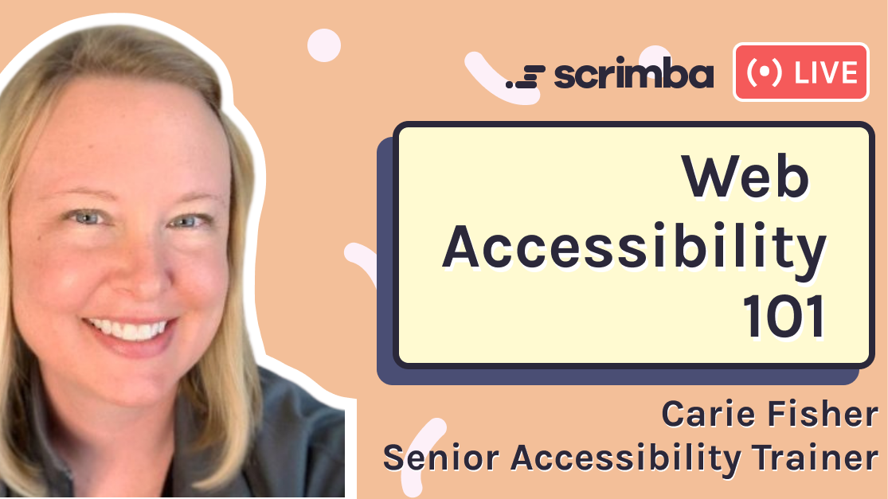
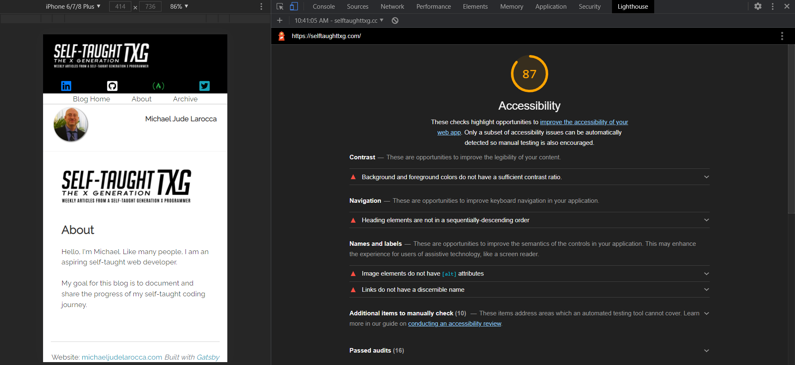

---

## In this week's article, Senior Accessibility Trainer Carie Fisher joins us in a Scrimba Livestream event to instruct us on making our websites and apps accessible and inclusive for all!

---

---

### Introduction

As web developers, we are taught to think "**responsively**" when designing our layouts.

Thinking "**responsively**" refers to us being mindful of how our websites look on different screen sizes as well as devices, such as tablets and mobile phones.

In this Scrimba Livestream, we are joined by [Carie Fisher](https://cariefisher.com/), a Senior Accessibility Instructor and Developer who encourages us also to think "**inclusively**" when designing our layouts.

Thinking "**inclusively**" refers to us being mindful of how individuals with special needs perceive our websites and apps.

---

### About Carie Fisher

*Senior Accessibility Instructor and Developer*

Carie is a Senior Accessibility Instructor and Developer at Deque. She has been building websites professionally since 2005 and is passionate about accessibility and promoting diversity in the tech world. She founded both the [A11y Style Guide](https://a11y-style-guide.com/style-guide/) and the YouTube series [Accessibility Talks](https://www.youtube.com/c/AccessibilityTalks/featured) to help educate others on website accessibility.

[Carie Fisher on the deque website](https://www.deque.com/team/carie-fisher/)

---

### Accessibility design

Carie comprehensively compares the creation of websites long ago, before responsive layouts, to how the creation of websites is headed in the future, where accessibility design will be part of the regular workflow.

In the past, Carie explains that programmers knew the size of the computer screen displaying the website and that there was only one breakpoint which made the design layouts easily manageable.

As time went on, new devices were created for users, resulting in new ways to connect online. Programmers created responsive layouts to address this issue, providing multiple layout configurations to accommodate user experience on the device in use.

Likewise, with inclusivity in mind, accessibility design is starting to become part of the regular workflow, accommodating users' needs and improving their experience.

---

### What Carie wants us to know

Scrimba host [Leanne](https://www.youtube.com/channel/UCcVIHAWGsOndLoxm9GEe03g) askes Carie during the Livestream, *"What is the one thing you wish everybody knew about web accessibility?"*

Carie wants us to know, even though the topic of web accessibility is vast, that the implementation of accessibility design is an attainable goal.

Carie then introduces us to the "**Web Content Accessibility Guidelines**" to learn from and reference when implementing accessibility design in our workflow.

---

### Web Content Accessibility Guidelines

*From Wikipedia, the free encyclopedia*

The Web Content Accessibility Guidelines (WCAG) are part of a series of web accessibility guidelines published by the Web Accessibility Initiative (WAI) of the World Wide Web Consortium (W3C), the main international standards organization for the Internet. They are a set of recommendations for making Web content more accessible, primarily for people with disabilities—but also for all user agents, including highly limited devices, such as mobile phones. WCAG 2.0, were published in December 2008 and became an ISO standard, ISO/IEC 40500:2012 in October 2012.[3] WCAG 2.1 became a W3C Recommendation in June 2018.[1]

---

### Web Content Accessibility Guidelines (WCAG) 2.1

**W3C Recommendation 05 June 2018**

*Information provided from [w3.org](https://www.w3.org/TR/WCAG21/#intro)*

**Understanding the Four Principles of Accessibility**

The guidelines and Success Criteria are organized around the following four principles, which lay the foundation necessary for anyone to access and use Web content. Anyone who wants to use the Web must have content that is:

1. **Perceivable** - Information and user interface components must be presentable to users in ways they can perceive.
    * This means that users must be able to perceive the information being presented (it can't be invisible to all of their senses)

2. **Operable** - User interface components and navigation must be operable.
    * This means that users must be able to operate the interface (the interface cannot require interaction that a user cannot perform)

3. **Understandable** - Information and the operation of user interface must be understandable.
    * This means that users must be able to understand the information as well as the operation of the user interface (the content or operation cannot be beyond their understanding)

4. **Robust**- Content must be robust enough that it can be interpreted reliably by a wide variety of user agents, including assistive technologies.
    * This means that users must be able to access the content as technologies advance (as technologies and user agents evolve, the content should remain accessible)

If any of these are not true, users with disabilities will not be able to use the Web.

Under each of the principles are guidelines and Success Criteria that help to address these principles for people with disabilities. There are many general usability guidelines that make content more usable by all people, including those with disabilities. However, in WCAG 2.1, we only include those guidelines that address problems particular to people with disabilities. This includes issues that block access or interfere with access to the Web more severely for people with disabilities.

---

<iframe width="900" height="506" src="https://www.youtube.com/embed/oEiTjDMA7UU" title="YouTube video player" frameborder="0" allow="accelerometer; autoplay; clipboard-write; encrypted-media; gyroscope; picture-in-picture" allowfullscreen></iframe>

---

***Be sure to watch the full episode for more on making your sites and apps accessible and inclusive!***

---

### HTML Semantic Elements

Information provided from [w3schools](https://www.w3schools.com/html/html5_semantic_elements.asp)

**What are Semantic Elements?**

A semantic element clearly describes its meaning to both the browser and the developer.

Examples of non-semantic elements: `
` and `` Tells nothing about its content.

Examples of semantic elements: `<form>`, `<table>`, and `<article>` Clearly defines its content.

---

### Screen reader semantic navigation

Through a screen reader, it is now possible to navigate a web page through its elements.

HTML Elements have implicit roles, which means that the browser knows what the role and purpose are.

Utilizing semantic HTML elements enables screen readers to inform users what they are navigating through, such as the `<header>`, a `<section>`, the `<footer>`, and more.

---

### Introduction to ARIA

**ARIA** is an acronym for "**A**ccessible **R**ich **I**nternet **A**pplications."

[ARIA definition from MDN](https://developer.mozilla.org/en-US/docs/Web/Accessibility/ARIA): Accessible Rich Internet Applications (ARIA) is a set of attributes that define ways to make web content and web applications (especially those developed with JavaScript) more accessible to people with disabilities.

---

### WAI-ARIA

*From Wikipedia, the free encyclopedia*

Web Accessibility Initiative – Accessible Rich Internet Applications (WAI-ARIA) is a technical specification published by the World Wide Web Consortium (W3C) that specifies how to increase the accessibility of web pages, in particular, dynamic content, and user interface components developed with Ajax, HTML, JavaScript, and related technologies.

---

#### Here is a great video on the topic, and it includes syntax examples of impementeing aria: 

<iframe width="1520" height="553" src="https://www.youtube.com/embed/qdB8SRhqvFc" title="YouTube video player" frameborder="0" allow="accelerometer; autoplay; clipboard-write; encrypted-media; gyroscope; picture-in-picture" allowfullscreen></iframe>

---
---

### Be mindful of your fonts

**The overall consensus on fonts is to choose a font family that has distinct characters.**

Differentiating a **zero** from an "**O**" or a **one** from an "**l**" could be problematic with certain font families.

Leanne shared a cautionary story when she and her husband Michael ended up at the wrong airport terminal in Japan when they mistakingly went to terminal **one**; They were supposed to go to terminal "**I**" for "**International!**"

---

### Accessibility tools for developers

**Here are a few standard accessibility tools that developers use:**

* color contrast
* accessibility audits
* accessibility overlays

---

### Utilize color contrast tools

Carie color contrast tool of choise is tpgi's [Colour Contrast Analyser (CCA)](https://www.tpgi.com/color-contrast-checker/).

She uses this tool because it works great with testing manually, which helps resolve the issues that automated checkers can not catch.

---

### Google Chrome Lighthouse

[Lighthouse](https://developers.google.com/web/tools/lighthouse) is an open-source, automated tool for improving the quality of web pages. You can run it against any web page, public or requiring authentication. It has audits for performance, accessibility, progressive web apps, SEO, and more.

---

**Using Lighthouse to audit accessibility does have the following limitations:**

**Accessibility**

*These checks highlight opportunities to improve the accessibility of your web app. Only a subset of accessibility issues can be automatically detected so manual testing is also encouraged.*

---

### To test out and learn how Lighthouse works, I decided to audit the website you are currently reading!

For this audit, I only selected the "**Accessibility**" checkbox under "**Categories**," with "**Mobil**" selected under "**Device**."

---

**Results of the Lighthouse audit on this site, https://selftaughttxg.com/**

**Contrast** These are opportunities to improve the legibility of your content.
Background and foreground colors do not have a sufficient contrast ratio.

**Navigation** These are opportunities to improve keyboard navigation in your application.
Heading elements are not in a sequentially-descending order

**Names and labels** These are opportunities to improve the semantics of the controls in your application. This may enhance the experience for users of assistive technology, like a screen reader.

**Image elements do not have [alt] attributes**

**Links do not have a discernible name**

Additional items to manually check (10) These items address areas which an automated testing tool cannot cover. Learn more in our guide on conducting an accessibility review.

**Passed audits (16)**

**Not applicable (24)**

---

---

**accessibility audit results**

My accessibility audit resulted in a score of **87**. Clearly, there is plenty of room for
accessibility improvement on this website.

---

### Avoid using accessibility overlays

Carie describes accessibility overlays as a "**band-aid**." Using an overlay
does not solve web accessibility issues in your site's source code, and using one is not advisable.

**Carie invites us to watch an informative upcoming video by her colleague on the subject matter:**

### [The Fatal Flaw of Overlays](https://www.youtube.com/watch?v=k6VmSjEIiks)

---

<iframe width="853" height="480" src="https://www.youtube.com/embed/k6VmSjEIiks" title="YouTube video player" frameborder="0" allow="accelerometer; autoplay; clipboard-write; encrypted-media; gyroscope; picture-in-picture" allowfullscreen></iframe>

---

**Recorded:** July 28, 2021 (3pm ET)

**Speaker:** Shell Little (Twitter - @ShellELittle)

---

Overlays are technologies implemented on websites with the aim of increasing accessibility. Even if these Overlays could do as they claim, they would still have a fundamental flaw. You can never out code bad design. During this talk let's discuss how Overlays will never be the answer and the importance of accessible, inclusive, and usable designs.

---

### Carie's parting message to us

Carie describes herself as just "**one voice in a choir**" of a wonderful community of professional accessibility developers that are willing to help us.

She encourages us to reach out to the welcoming community of accessibility developers for guidance, who are eager to instruct us.

---

### Carie Fisher Links

* 👉 **Website:** [https://cariefisher.com/](https://cariefisher.com/)
* 👉 **Notist:** [https://noti.st/cariefisher](https://noti.st/cariefisher)
* 👉 **Linkedin:** [https://www.linkedin.com/in/cariefisher](https://www.linkedin.com/in/cariefisher)
* 👉 **Twitter:** [https://twitter.com/cariefisher](https://twitter.com/cariefisher)
* 👉 **Github:** [https://www.github.com/cehfisher](https://www.github.com/cehfisher)

---

---
### Key Notes

* Incorporate **accessibility** into your workflow
* Use semantic HTML tags
* Utilize ARIA in your HTML
* Be mindful of your fonts
* Utilize color contrast tools
* Utilize accessibility audits
* Avoid using accessibility overlays

---

### Conclusion

Senior Accessibility Trainer Carie Fisher implores us to think "**inclusively**" and incorporate web accessibility into our workflow.

Although accessibility is an extensive topic, Carie teaches us that coding for accessibility is not, and with time and practice, it is attainable.

Carie did an exceptional job introducing web accessibility and encourages us to reach out to the helpful community of accessibility developers to continue our training.

#### Are you now encouraged to start coding with web accessibility in mind? Do you already code inclusively? Please share the article and comment!
