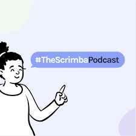

### In this week's article, tech industry veteran Cassidy Williams joins us on a Scrimba Podcast to provide career advice derived from her vast experience to give us the best chance of breaking into tech!

---

---

### About Cassidy

As well as being a teacher at Scrimba, Cassidy Williams has also worked at Amazon, CodePen, and various nonprofits. She is currently the Director of Developer Experience at Netlify.

Cassidy is also known for making silly videos on the internet and enjoys building mechanical keyboards, playing music, and teaching in her free time.

---

### Learning in public

Cassidy tells us, ***"It's all about learning in public."***

**By learning in public, you are creating an online journal that proves your discipline and dedication, and it also becomes a portfolio of work for others to view.**

As your skills develop over time, more and more people will start to take notice of you.

Then when it comes time to seek employment, your "**online presence**" will prove to be a great asset, as it will provide employers and clients alike a demonstration of your work and skillset.

**Ways to learn in public**

* Tweet your work
* Blog your work
* Make a screencast

**Twitter**

Cassidy tells us we can Tweet about our coding accomplishments using the hashtag **100 days of code**.

**[Alex Kallaway](https://twitter.com/ka11away)** created the 100 days of code challenge as a "**light-weight challenge**" and a way to hold yourself accountable by committing to a code learning schedule.

---

***To learn more about this challenge, check out the official website: [100 days of code ](https://www.100daysofcode.com/)***

---

**Blog your work**

Creating a blog and committing to a consistent article release schedule is a fantastic way to learn in public!

**Having a well-maintained blog can open up many opportunities for you.**

In my personal experience, I had several articles featured on Scrimba YouTube Livesteams and had several articles requested to be cross-posted to "**[dev.to](https://dev.to/michaellarocca)**" republished under Scrimba. I've also made acquaintances with techs in the industry by writing articles featuring them and their works.

---

**Make a screencast**

Did you know that Scrimba allows you to create and publish your own screencasts?

If you would like to learn how to create and publish your own Scrimba  screencasts, I wrote a tutorial article on how to make them:

**[How to create Scrimba screencasts and turn them into a Scrimba course](https://selftaughttxg.com/2021/02-21/CreateAScrimbaScreencast/)**

---

##### ***To learn more about learning in public, check out my article: [Shawn Wang (Swyx): Actionable tactics that will help you to become hireable](https://selftaughttxg.com/2021/07-21/Swyx-ActionableTactics/)***

---

### Coding

Cassidy tells us,***"coding never really gets easier; it's just that you understand more ways to solve a specific problem."***

As a self-taught developer, it is comforting to hear that "coding never really gets easier" from a developer of Cassidy's stature.

As developers, we are constantly learning. **Over time, we will develop problem-solving skills by researching, utilizing Stack Overflow, 3Wschools, Googling, and similar means.**

---

### Getting A Gig

Cassidy created a valuable resource for developers; it is a GitHub Repository called Getting A Gig.

Cassidy tells us her primary motivation for creating it was to have a resource to refer people to when they ask common questions about seeking employment.

**[Getting a Gig: A Guide](https://github.com/cassidoo/getting-a-gig)**

---

<iframe width="853" height="480" src="https://www.youtube.com/embed/7O0z06YRKHg" title="YouTube video player" frameborder="0" allow="accelerometer; autoplay; clipboard-write; encrypted-media; gyroscope; picture-in-picture" allowfullscreen></iframe>

---

### *Be sure to check out Cassidy's Ted Talk!*

---

### Cassidy's resume advice

**On your resume:**

* Remove irrelevant information
* Clear information that's easy to find
* Remove your mailing address

**In your cover letter, answer:**

* who
* what
* when
* where
* why

Be sure to include information on how they can reach you, why you might be a good fit for the role, and additional details that aren't necessarily on your resume.

---

##### ***To learn more about resume advice, check out my article: [Create CVs and Resumes that get noticed by tech recruiters](https://selftaughttxg.com/2021/05-21/CreateCVsAndResumesThatGetNoticedByTechRecruiters/)***

---

### Interviewing

Cassidy has experience on both sides of the interview table, the person interviewed and the person conducting the interview.

Cassidy provides us with a sigh of relief when she explains that sometimes, **situations out of the interviewer's control may prevent us from being hired**.

**Situations**

* No longer have space
* The role has changed
* May never know the reason

**Cassidy advises us not to take it personally and just keep applying.**

---

##### ***To learn more about interview tips, check out my article: [Interview Tips from a Tech Recruiter](https://selftaughttxg.com/2021/04-21/InterviewTipsFromATechRecruiter/)***

---

### Applying for jobs

As **[Erik Hanchett](https://selftaughttxg.com/2021/08-21/ErikHanchett-AdviceOnGettingYourFirstDevJob/)** similarly describes in his Scrimba Podcast episode, Cassidy discusses two approaches when applying for jobs. The first approach is to send out many applications, applying to many jobs. The second approach is to hone in on a few jobs and apply to them.

Cassidy advises, ***"When you're entry-level, you just want your name out there. You just want your foot in the door because once you have work experience under your belt, that's technical, you can go anywhere after that, but you have to be able to prove that you've worked somewhere."***

---

### Discrimination

**When it comes to discrimination, the best defense is a good offense.**

In Cassidy's own words, ***"I have had some pretty bad experiences, my sister has had some pretty bad experiences, but what I think has made a significant difference for the both of us and for all of the women I know, all of the non-binary people I know who have had issues in this regard, and people of color even more so, is having a community that has your back."***

---

**I can personally vouch for the Scrimba community. To hear my Scrimba testimonials, you can read the following articles I wrote:**

* [Review: Scrimba](https://selftaughttxg.com/2020/12-20/Review-Scrimba/)

* [I Get By With a Little Help from My Friends](https://selftaughttxg.com/2021/01-21/LittleHelpFromMyFriends/)

* [How Scrimba is helping me and many others to become confident, well-prepared web developers](https://selftaughttxg.com/2021/06-21/06-07-21/)

<iframe width="100%" height="180" frameborder="no" scrolling="no" seamless src="https://share.transistor.fm/e/22e67307"></iframe>

#### ***Be sure to listen to the Scrmba Podcast!***

---

### Book recommendation

Cassidy believes that networking plays a big part in employment opportunities and recommends read: [Build Your Dream Network: Forging Powerful Relationships in a Hyper-Connected World](https://www.amazon.com/Build-Your-Dream-Network-Hyper-Connected/dp/0143111493/ref=sr_1_1?dchild=1&keywords=Build+Your+Dream+Network+by+J.+Kelly+Hoey&qid=1628702060&sr=8-1)

---

### The Scrimba Podcast

***Hosted by: Alex Booker***

**Be sure to check out other episodes of the Scrimba Podcast!**

###### Hear from inspiring developers about how they found meaningful and fulfilling work that also pays them well. On the #StoriesByScrimba Podcast, you'll hear motivational advice and job-hunting strategies from developers who've been exactly where you are now. We talk to developers about their challenges, learnings, and switching industries in the hopes of inspiring YOU. This Podcast provides the inspiration, tools, and roadmaps to move from where you are to work that matters to you and uniquely fits your strengths and talents.

* ###### 🔊 [Scrimba Podcast: spotify](https://open.spotify.com/show/1oJamVudy2v3oSJTejUyus)
* ###### 🔊 [Scrimba Podcast: apple](https://podcasts.apple.com/us/podcast/the-scrimba-podcast/id1537632252)
* ###### 🔊 [Scrimba Podcast: listennotes](https://www.listennotes.com/podcasts/the-scrimba-podcast-alex-booker-rbds3EQSfNl/)
* ###### 🔊 [Scrimba Podcast: podcastaddict](https://www.podcastaddict.com/podcast/3145006)
* ###### 🔊 [Scrimba Podcast: podcastguru](https://app.podcastguru.io/podcast/the-scrimba-podcast-1537632252)
* ###### 🔊 [Scrimba Podcast: transistor.fm](https://feeds.transistor.fm/scrimba)

---

### Cassidy's Links

* 🔗 [Website](https://cassidoo.co/)
* 🔗 [CodePen](http://codepen.io/cassidoo/)
* 🔗 [Twitter](http://twitter.com/cassidoo)
* 🔗 [GitHub](http://github.com/cassidoo)
* 🔗 [LinkedIn](http://linkedin.com/in/cassidoo)

---

### Conclusion

At the beginning of our tech career, Cassidy advises us to apply for many jobs to first "get our foot in the door." After gaining experience, we can hone in on the jobs we want and then apply for them.

To give ourselves the best chance of getting hired, it is in our best interest to "learn in public" and build an online presence to help us stand out from other applicants.

Finally, through her personal experiences, Cassidy recommends we join a community, as it will be our best defense against discrimination.

##### ***Has Cassidy's advice helped you? Are you interested in joining, or are you already a member of a wonderful tech community? Please share the article and comment!***