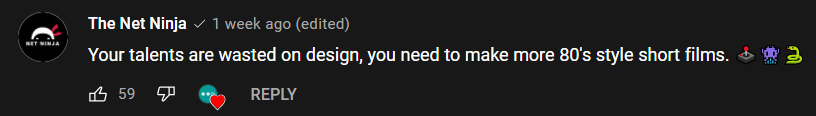
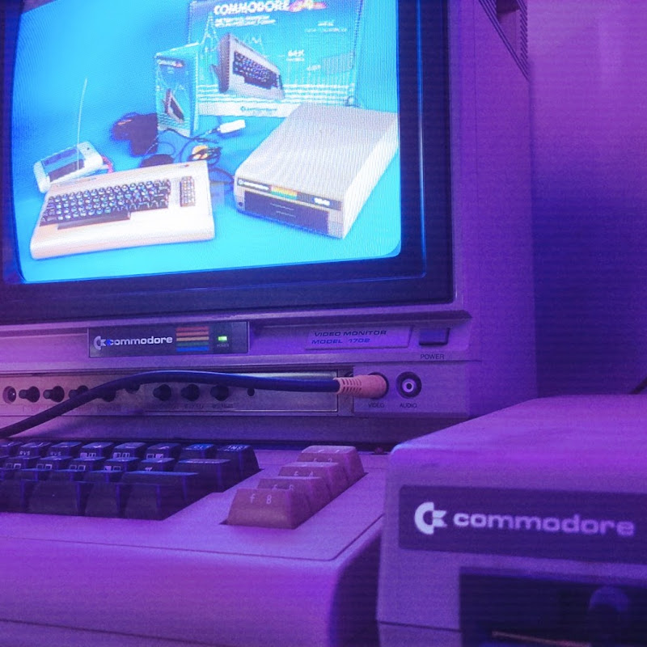
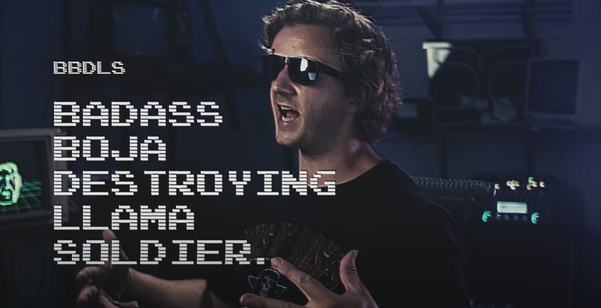
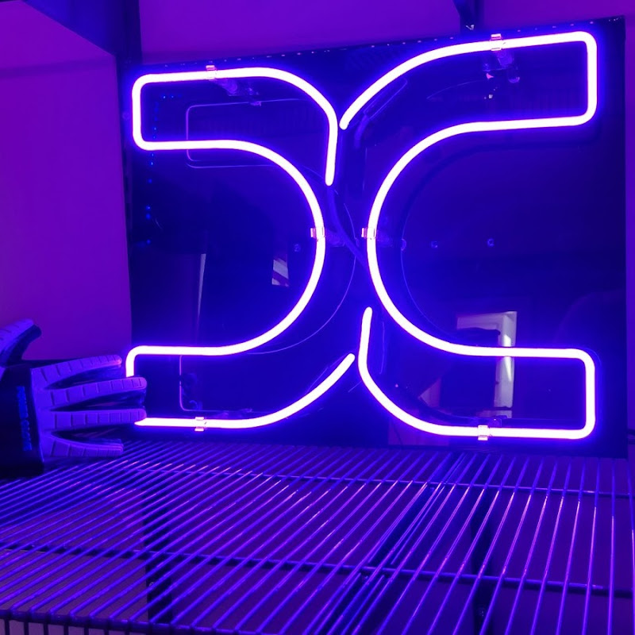

### In this week's article, I review Gary Simon's new two-year project, "The Boja," a Sci-Fi web series that teaches web developers the UI design fundamentals in a refreshingly new and entertaining way!

---

---

### Gary Simon

Gary Simon is a full-stack developer with over twenty years of experience. He has created over 100 courses for big brands such as LinkedIn, Lynda.com, Pluralsight, and Envato Network, and he is also a teacher at Scrimba!

Gary also creates free premium content weekly on his YouTube channel and is well known as a UI/UX Design expert in the web dev community.

---

### The Boja

Description:  **"The year's 2083 and Jon Frok is tasked with building an advanced UI to help defeat an aggressive aliens species: The Boja. The problem? Frok isn't a designer."**

Gary introduces us to his new project, The Boja, ***"These would be released as bite-sized episodes that occur over the span of the next 2 years, with perhaps 1 to 2 episodes released per month. Each episode would include learning some topic of UI design, music, snakes, and other shenanigans."***

Gary informs us that ***"The Boja" is a free series that I will upload as regular YouTube videos. ;)***

---

### What people are saying about "The Boja"

---

### Episode I

For the past 18 months, it's been quiet on Outpost 481. Just moments after Jon Frok takes an incoming phone call, an emergency "DC CODE ONE" alert goes off!

*"Jon, get to the Commodore!"* exclaims Jon's retro-style "high tech" computer.

*"At approximately 800 hours,"* the green wireframed face displayed on the computer monitor continues, *"I detected an aggressive alien species that will reach earth in two years. They're known as the Boja."*

Jon quickly moves to the desk where the Commodore 64 computer is stationed. On the Commodore's screen, the enemy's objective is displayed: *"The Boja originate from the Ursa Minor dwarf galaxy, and their objective is to destroy all of humanity and consume resources!"*

**To combat the imminent threat, Jon is instructed by the "high tech" computer to design an "Advanced User Interface" to help our soldiers to defeat the Boja!**

*"But I'm not a designer. I'm a soldier!"* Jon replies.

*"We have two years. I will teach you. Are you ready?"* the "high tech" computer answers.

Then, Jon Frok dramatically puts on his **Power Glove** and says, *"let's kick ass!"*

---

### The Commodore 64

To develop the "**enhanced user interface**" weapon that will assist our soldiers in defeating the **Boja**, on Outpost 481, **Jon Frok** will utilize a Commodore 64 computer to "**merge the old with the new**."

***"Commodore 64. In 1982, this was the pinnacle of computing and graphics. Soon, we will merge the old with the new in an attempt to develop the most advanced UI design skills the world has ever seen."***

---

---

If you wanted to play video games on a computer back in the day, the Commodore 64 was the premium device to play them on!

Although I never owned a Commodore 64, a few of my friends did, and I have fond memories of spending countless hours playing games with them on it!

---

### Power Glove

---

In episode one of "**The Boja**," Jon Frok dramatically puts a **Power Glove** in preparation for his UI Design training.

When the Power Glove was released, even though it was cumbersome in practical application, it was really cool and highly sought-after by X Generation kids, such as myself!

To learn more about this device, here is a fantastic documentary about it.

**[The Story of the Power Glove | Gaming Historian](https://www.youtube.com/watch?v=3g8JiGjRQNE)**

**YouTube description:** *"The Gaming Historian provides a comprehensive history on the Power Glove, the very first mass-marketed, gesture-based device. This is the most detailed history available on how Mattel was able to take a $9000 virtual reality device and turn it into a Nintendo controller."*

---

### Episode II

***In episode two of The Boja, Jon Frok discovers his new mission as a UI designer.***

It's another quiet day on Outpost 481. After taking a sip of his drink and setting it aside, Jon uses the search engine **Grooble** on his computer and keys in "**Hot Aliens**."

*"Jon, enough of that. It's time to start your training to defeat the Boja,"* states Jon's retro-style "high tech" computer.

*"Yeah, whatever,"* Jon sighs as he silences the music playing in the Outpost by clicking the off button of his Magnavox.

*"First, do you know what UI is?"* the green wireframed face displayed on the computer monitor asks.

*"Yeah,"* Jon replies, *"it's like where you and I, we design something... together."*

Jon grabs a cute pink stuffed animal, slams it on his desk, and states, *"Like, take this llama, you give it a bandana, and I give it a gun!" Jon concludes, "Then it becomes BBDLS."*

---

---

### BBDLS

* Badass
* Boja
* Destroying
* Llama
* Soldier

---

---

*"No,"* says Jon's computer. *"The UI in UI design is an acronym that stands for User Interface."*

Jon's computer continues, *"user interface design is the process designers use to build interfaces in software or computerized devices, focusing on looks or style."*

*"A UI designer,"* Jon's computer says,*"is one who is proficient at IU design software, such as [Figma](https://www.figma.com/), [Sketch](https://www.sketch.com/), or [Adobe Experience Design](https://www.adobe.com/products/xd.html)."*

*"You use these apps to design both wireframes and to get a general idea or the structure of a user interface, and ultimately, a high fidelity prototype that stakeholders can use before handing off the concept to front-end developers, who then make the user interface a reality in browsers or other devices."* Jon's computer concludes.

Jon acknowledges and replies, *"Yeah, and how do I start?"*

*"You first need to understand the core UI Design principles. In your next lesson, we will examine these principles. For now, all you need to understand is what UI Design is and what a UI designer does."*

The UI Design principles then display on Jon's Commodore 64 computer.

---

**UI Design principles**

* Visual Hierarchy
* Typography
* Color
* Alignment
* Scale
* White Space

---

Jon acknowledges and then requests, *"Show me some sick interfaces."*

*"User interfaces have changed throughout the decades,"*

Jon interrupts, *"No, no. I'm sorry, you're about a hundred years old, and all I see is a mess of green poop. Port this over to the better screen."*

The computer complies with Jon's request and then continues, *"There weren't many best practices early on. However, the human species is good at progressing in adapting."*

*"You know what,"* Jon responds with a new understanding of UI Design, *"Some of those sucked, but then they got better."*

*"I think I can become,"* Jon exclaims as he powerfully uppercuts with his Power Glove on, *"a UI Designer!"*

---

### A refreshingly new approach to teaching

The way Jon Frok's retro-style "High Tech" computer teaches the **UI Design principles** in episode two indicates how web developers will learn by watching "**The Boja**" web series.

**I believe this is a refreshingly new approach to teaching web development, as programmers and non-programers alike can learn from a UI/UX Design professional by simply watching a creative and enjoyable Sci-Fi web series.**

---

### The Boja Playlist

**As episodes of "The Boja" are released, they will be added to the following playlist:**

**[The Boja - Jon Frok the UI Designer Playlist link:](https://www.youtube.com/playlist?list=PL0lNJEnwfVVNjJFWqLQ8h_bzVmayWcSeZ)**

---

***Be sure to check out my Gary Simon Teacher Feature article!***

***[Teacher Feature: Gary Simon](https://selftaughttxg.com/2021/04-21/TeacherFeature-GarySimon/)***

---

### My other "Review" articles

* [Review: Scratch (programming language)](https://selftaughttxg.com/2021/02-21/Review-Scratch/)

* [Review: Scrimba](https://selftaughttxg.com/2020/12-20/Review-Scrimba/)

* [Review: Scrimba Course - 21 Web Dev Tips for 2021](https://dev.to/scrimba/review-scrimba-course-21-web-dev-tips-for-2021-510b)

* [Review: Scrimba's Weekly Web Dev Challenge](https://selftaughttxg.com/2021/01-21/ReviewScrimbaWebDevChallenge/)

---

### Gary's updated channel logo

---

**Garry is updating his channel logo!**

Garry's long-standing "**3 dots**" logo will soon be replaced with the new "**DC**" logo.

Garry informs us, ***"I want everyone to know because sometimes changing a channel's logo can result in a drop in views because they don't recognize it right away."***

---

### Gary's DesignCourse relaunch

---

**Gary is relaunching his design course!**

For notifications about the course, you can sign up for the **[mailing list on his website.](https://designcourse.com/)**

Garry informs us, ***"DesignCourse relaunch is coming soon. I will have a prelaunch in approximately 4-5 weeks if all goes smooth."***

---

### Gary's UI design game called "uEye"

"**Lookout**" for Gary's free UI design game "**uEye**" coming soon!

**Please show your support on ProductHunt!**

Gary tells us, ***"I will be releasing the free UI design game called "uEye." I need all of you to help get it to the top of [ProductHunt](https://www.producthunt.com/)! I will share more info about that when the time comes."***

---

### Special thanks from Gary

*"Special thanks to Cyberoptics for the track I solo'd over. It's called 'Vice City Vengeance' Track located here: [cyberoptics](https://cyberoptics.bandcamp.com)"*

*"Also special thanks to Tarot Blood for the intro and outro track, which I heavily modified to make it sound like it's coming from an old stereo. The track is called 'Dowsing': [Dowsing]"(https://tarotblood.bandcamp.com/music)*

---

### Gary Simon Links

🔗 [Website - Designcourse](https://www.designcourse.com/)

🔗 [YouTube - DesignCourse](https://www.youtube.com/user/DesignCourse)

🔗 [Twich](https://www.twitch.tv/designcourse)

🔗 [Twitter - DesignCourse](https://twitter.com/designcoursecom?ref_src=twsrc%5Egoogle%7Ctwcamp%5Eserp%7Ctwgr%5Eauthor)

🔗 [Udemy - Gary Simon](https://www.udemy.com/user/garysimon2/)

🔗 [Lynda - Gary Simon](https://www.lynda.com/Gary-Simon/427927-1.html)

🔗 [Pluralsight - Gary Simon](https://www.pluralsight.com/authors/gary-simon)

🔗 [Skillshare - Gary Simon](https://www.skillshare.com/profile/Gary-Simon/249961)

---

###  Review Results:

***Gary Simon's "The Boja"***

***5 out of 5 Stars!***

"⭐ ⭐ ⭐ ⭐ ⭐"

---

### Advance your career with a 20% discount on Scrimba Pro using this [affiliate link](https://scrimba.com/?via=MichaelLarocca)!

Become a hireable developer with Scrimba Pro! Discover a world of coding knowledge with full access to all courses, hands-on projects, and a vibrant community. You can [read my article](https://selftaughttxg.com/2021/06-21/06-07-21/) to learn more about my exceptional experiences with Scrimba and how it helps many become confident, well-prepared web developers!

###### ***Important:*** *This discount is for new accounts only. If a higher discount is currently available, it will be applied automatically.*

**How to Claim Your Discount:**
1. Click [the link](https://scrimba.com/?via=MichaelLarocca) to explore the new Scrimba 2.0.
2. Create a new account.
3. Upgrade to Pro; the 20% discount will automatically apply.

##### ***Disclosure:*** *This article contains affiliate links. I will earn a commission from any purchases made through these links at no extra cost to you. Your support helps me continue creating valuable content. Thank you!*

---

### Conclusion

By watching  "The Boja," you will learn UI Design from an industry professional in a new and entertaining format that differs from the typical courses aspiring web developers are accustomed to taking.

As a musician, aspiring web developer, and a huge Sci-Fi fan, saying I'm ecstatic about "The Boja" web series would still be an understatement!

Creating a web series that is educational, entertaining, and musical is a feat that only someone of Gary Simon's caliber could pull off! Watch out, world; here comes "The Boja!"

###### Are you ready to learn UI Design, become a soldier, and help Jon Frok defeat the Boja? Help save the earth from the imminent threat by sharing this article to enlist more UI Design soldiers to join the battle!
