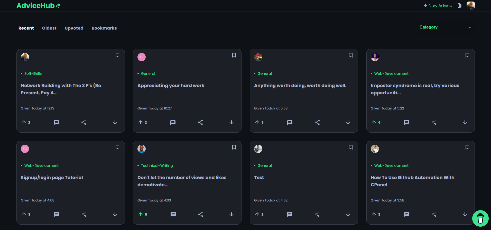
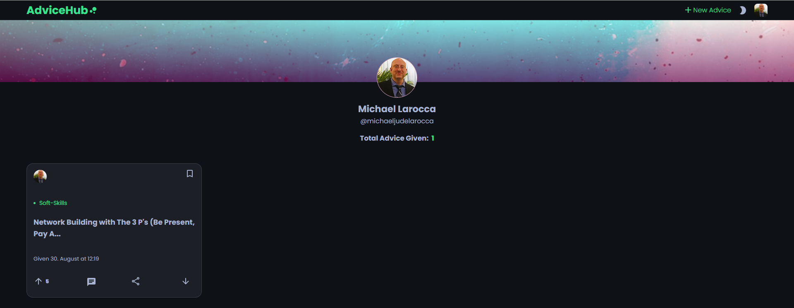
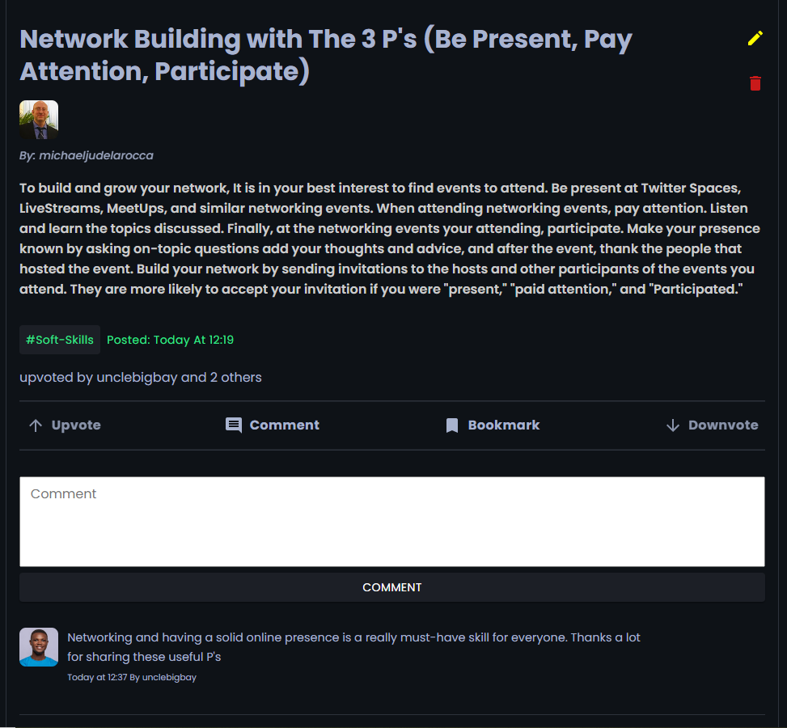

### This article explores "The Advice Hub," created by Ayodele Samuel Adebayo, also known as Unclebigbay. The Advice Hub is a new dedicated platform for developers to exchange valuable advice in one place!

---

### [The Advice Hub](https://advicehub.tk/)

---

### About Ayodele Samuel Adebayo

*AYODELE, Samuel Adebayo is a Front-End developer from Kwara State, Nigeria. With hands-on experience in JavaScript, React, Redux, and Version control, he graduated from Tiidelab (cohort 2) in 2020 as the best graduating student (Front-End).*

*He spends his free time contributing to open source projects and writing technical articles to help break down complex concepts in programming.*

---

#### Ayodele Samuel Adebayo

***Technical Writer, Freelance Frontend Developer***

---

### Ayodele is also a Community Champion!

[Here is an excerpt from the africode.org article:](https://www-africode-org.cdn.ampproject.org/c/s/www.africode.org/mentors-mentees/africode-comm-champ-2021?format=amp)

**2021 Africode Community Champion: Adebayo Ayodele**

*August 3, 2021 Africode*

**Meet Adebayo Ayodele, 2021 Africode Community Champion!**

The title of Community Champion is bestowed on one Africode member who has made exemplary contributions to the community. This person has a long track record of creating value in the Africode community by sharing resources, connecting with members, and leveraging the network in their pursuit of technical excellence.

Ayodele is currently pursuing a diploma in Computer Science at the Federal Polytechnic Bida, Nigeria. His strong interest in exploring new technologies led him to start writing about technologies he encountered. He is the author of a top-50 most-read technical blog on Hashnode.

---

### What is The Advice Hub

The Advice Hub is a new dedicated platform created by Ayodele Samuel Adebayo for developers to exchange valuable advice with each other in one place.

**[INTRODUCING The Advice Hub: A Centralized Advice Center for Developers](https://unclebigbay.com/introducing-the-advice-hub)**

---

***Necessity is the mother of invention***

*From [Wikipedia](https://en.wikipedia.org/wiki/Necessity_is_the_mother_of_invention): "Necessity is the mother of invention" is a well-known proverb. It means, roughly, that the primary driving force for most new inventions is a need.*

---

### Inspiration for the creation of The Advice Hub

A few months after Ayodele started learning JavaScript, he created a [Linkedin](https://www.linkedin.com/in/ayodele-samuel-ayodele-55902819a/) account and started a personal blog on [Hashnode](https://unclebigbay.com/).

Ayodele wanted to learn how to build genuine connections on social media platforms like Linkedin and Twitter rather than simply being an ordinary follower. He also wanted to learn how to grow his blog, freelance, and build his personal brand.

To achieve his goals, Ayodele needed guidance and advice from his web developer peers. However, he found the information he required challenging to attain.

---

***"As a newbie, I needed a lot of help and advice in a variety of categories."***

> -*Ayodele Samuel Adebayo*

---

Ayodele realized that every developer, through their personal experiences, has learned valuable lessons along their journey.

The lessons learned by developers include what worked for them and what did not work for them as they advanced in the tech field.

However, Ayodele discerned that developers do not viably exchange the insightful lessons they learned; They often ask for and share helpful advice through tweets and posts, which are cumbersome to track and access.

**To resolve this issue, Ayodele envisioned a centralized place for developers to exchange knowledge in the form of cards. Having such a place will enable developers to ask for and share advice.**

---

***"The goal of the project is to establish a platform where developers may ask for or create advice in the form of cards for other developers to answer or learn from."***

> *-Ayodele Samuel Adebayo*

---

---

### How The Advice Hub Works

To participate on The Advice Hub, you need to log in with Auth0. You can create an Advice Hub account via e-mail and password, or you can log in with a Google Account.

***You are still welcome to view the advice cards without logging in.***

On the Advice Hub, each user has a profile that displays all of the advice cards they created along with a "**Total Advice Given**" total.

---

---

**Once logged in, you are free to participate by creating advice cards, upvoting others' advice cards, and creating question cards to be answered by fellow Advice Hub users.**

---

On the Advice Hub's main page, the default sort of all of the communities created cards is "**recent**."

You can toggle the Advice Hub's main page sorting between Recent, Oldest, Upvoted, and Bookmarks.

***The Bookmarks are your personal bookmarked cards.***

---

In addition to the sorting options, you can also filter the communities-created cards on the Advice Hub's main page by category.

**Categories**

* All
* General
* Technical Writing
* UI-UX
* Web development
* Product Management
* Soft Skille
* Other

---

#####  For more in-depth details about The Advice Hub, I provide the following information from Ayodele's article.

***Excerpt from Ayodele article:***

**How it works 🛠**

* A registered user get to post an advice card 🃏
* Every user can view the advice card 👁
* The advice card can be upvoted if useful 👍
* The advice card can be downvoted if not useful 👎 (trashed after 5 downvotes)
* Registered users can post comments on the advice card 💌
* Every user can share the advice card to their social media 👨‍💻
* Registered users can bookmark the advice card for later 🔖

---

**Technologies 🧩**

1. 🏁 The HERNA Stack
1. Frontend - React.js
1. Frontend Hosting - Netlify
1. Backend - Node.js, Express.js , Harperive , Nodemailer .
1. Backend Hosting - Heroku
1. Authentication and User management - Auth0
1. Database - HarperDB Cloud
1. Version control - Github
1. Design - Material-UI and CSS

---

> ***-The HERNA stack is a development tool that combines HarperDB, Express.js, React.js, Node.js, and Auth0.***

---

**Features 🚀**

1. Advice Cards
1. Filtering and Categories
1. Bookmarking
1. Upvote and Downvote
1. User Profile
1. Comments
1. Managing Advice Cards
1. Social Media Share

---

### My Soft Skills Card

I had the honor of being personally invited by Ayodele along with a select group of people to review and participate in his newly created Advice Hub.

***Below is the information I entered when creating a "Soft Skills" category advice card.***

---

### Network Building with The 3 P's

* Be present
* Pay Attention
* Participate

To build and grow your network, It is in your best interest to find events to attend. Be **present** at Twitter Spaces, LiveStreams, MeetUps, and similar networking events.

When attending networking events, **pay attention**. Listen and learn the topics discussed.

Finally, at the networking events your attending, **participate**. Make your presence known by asking on-topic questions add your thoughts and advice, and after the event, thank the people that hosted the event.

**Build your network by sending invitations to the hosts and other participants of the events you attend. They are more likely to accept your invitation if you are "present,"  "paid attention," and "Participated."**

---

---

### Why the Advice Hub is remarkable

Ayodele observed a gap between those who need advice and those who are willing to share it.

He also proves the point that everyone, at every level, has valuable advice to share with the community.

Finally, Ayodele presents a persuasive argument that developers do not viably share advice in a manner that is easy to reference.

Thanks to Ayodele, the community now has a viable centralized place to ask for and provide advice, ultimately benefiting everyone.

---

### Thank you, Ayodele!

Ayodele provided the web dev community with a valuable platform for
exchanging advice, and he gave the users the ability to **Upvote** the content added to it to make sure it will provide us with premium content.

Let's thank Ayodele by **Upvoting** The Advice Hub on **[producthunt.com](https://www.producthunt.com/posts/the-advice-hub?utm_source=badge-featured&utm_medium=badge&utm_souce=badge-the-advice-hub)**

---

### Ayodele's Links

🔗 [Website](https://ayodelesamueladebayo.netlify.app/#/)

🔗 [GitHub](https://github.com/unclebay143)

🔗 [LinkedIn](https://www.linkedin.com/in/ayodele-samuel-ayodele-55902819a/)

🔗 [Twitter](https://twitter.com/unclebay143)

🔗 [Facebook](https://www.facebook.com/unclebay)

---

### Conclusion

The Advice Hub provides the community with a viable centralized place to ask for and provide advice, ultimately benefiting everyone.

Ayodele sets an excellent example to all of us by teaching leadership through example; Ayodele is a hard-working student and a community hero that provides value for everyone by teaching through blogging and creating projects such as "**The Advice Hub**."

---

###### What valuable lessons have you learned through your personal experiences? Are you seeking answers that will help you breakthrough to the next level? Let us know on The Advice Hub!
