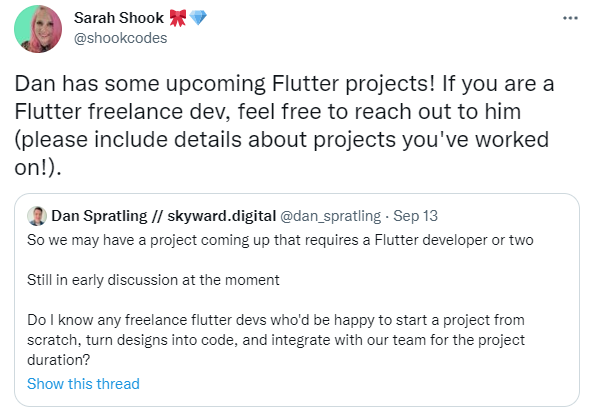

### In this article, freelancer Shaquil Hansford joins us on a Francesco Ciulla Livestream to share his story of how he went from $0 to $5K per month, provide us freelance guidance, and introduce his book!

---

---

### About Shaquil Hansford

Shaquil is a Full Stack Developer specializing in the MongoDB, ExpressJS, React, and NodeJS stack and a technical writer. In the tech community, he is well known as a prosperous freelancer.

As a contracted designer, Shaquil handles all aspects of the business, including acquiring customers, working with them to determine their needs, and providing them with market-ready, professional end-products.

---

### His story of how he went from $0 to $5K per

When Shaquil attended college, he was an English major. He decided to switch his major to Computer Science, and he also taught himself how to program in the C computer language.

When his living situation changed, he dropped out of college, and he had to start working.

From the time he left college, Shaquil worked in retail for years and freelanced as a designer, an artist, and a videographer.

Then the pandemic hit. He got sick. He lost his job. He lost his opportunities.

Shaquil reached a crossroad of where he was deciding between going back to school, seeking new employment in retail, or trying out this "**web dev stuff**."

Shaquil went with the "**web dev stuff**" path, and it worked out!

**Shaquil is currently earning $5k a month as a freelancer.**

---

**Be sure to check out Shaquil's "Story Time" Twitter thread on the subject: [Storytime! 🙂](https://twitter.com/shaquilhansford/status/1410750625080479748)**

---

### New opportunity

So, how does Shaquil earn $5k a month as a freelancer?

**Shaquil earns $5k a month by securing clients through networking, primarily through Twitter.**

---

*"You would not believe how much opportunity and success there is out here, and you can have that success freelancing."*

> -*Shaquil Hansford*

---

**But how did these new opportunities through networking start? It started by creating astonishing portfolio projects.**

---

### Create astonishing portfolio projects

Shaquil's initial plan was not to freelance; it was to seek employment as a Full-Stack developer.

After researching the requirements of applying for a Full-Stack developer position, Shaquil learned that he needed to create portfolio projects to showcase at interviews.

**While most applicants create simple "to-do" apps to showcase their skills, Shaquil's strategy was to develop an astonishing project to stand out from the crowd.**

---

### Buddy Viewer

The astonishing project Shaquil created to showcase his skills at interviews is called the "**Buddy Viewer**."

The "**Buddy Viewer**" is an app that lets multiple people join a room and watch videos simultaneously from:

* YouTube
* Vimeo
* Tumblr
* Twitter
* Twitch

The host of Buddy Viewer can control the video that the group is watching in the room by pausing, rewinding, and fast-forwarding.

In addition, the Buddy Viewer also includes chat!

---

He knew this ambitious project would be challenging to create, especially because he did not know how to code in JavaScript at that time.

To complete the Buddy Viewer project, Shaquil coded eight hours a day and created a list of what he needed to do every day, similar to a ticketing system.

---

When the Buddy Viewer project was complete, he added it to his portfolio website. Shaquil then included a link to his portfolio website on his Twitter account profile.

**With his Buddy Viewer project online and available to explore, successful developers on Twitter started to notice him and his abilities as a developer, resulting in new opportunities for him!**

---

<iframe width="900" height="506" src="https://www.youtube.com/embed/ChkM3EFASGE" title="YouTube video player" frameborder="0" allow="accelerometer; autoplay; clipboard-write; encrypted-media; gyroscope; picture-in-picture" allowfullscreen></iframe>

---

**Buddyviewer Portfolio Demonstration**

---

***Shaquil encourages us to "take the time you need to learn how to code."***

***Although incomplete, Shaquil has a background in computer programming and encourages everyone to learn at their own pace.***

---

### Connections made through Twitter

Shaquil explains that successful programmers in the industry started to reach out to him on Twitter after viewing his **Buddy Viewer** project.

With Shaquil's developer capabilities proven, successful programmers, such as [Edan Ben-Atar](https://edanbenatar.com/) and [Rocco Sangellino](https://blog.roccosangellino.com/), on Twitter began to offer him employment opportunities.

---

*"Dedicate yourself to making good projects and writing real applications that are impressive to people."*

> -*Shaquil Hansford*

---

**A strong portfolio, Shaquil tells us, is way more valuable than any amount of growth hacking.**

---

### Employment opportunities

In addition to freelance opportunities through your direct networking connections, Shaquil tells us you will also have subcontracting opportunities offered to you by other developers who need your skillset and assistance.

---

*"Twitter is not necessarily the source for direct clients, but it's always the source for client sources, and client sources are much more important."*

> -*Shaquil Hansford*

---

---

***To learn more about Sarah Shook, check out my article: [Freelancing 101 - with Sarah Shook](https://selftaughttxg.com/2021/07-21/Freelancing101-WithSarahShook/)***

---

### Twitter as a  networking platform

To explain to us how incredible Twitter is as a networking platform, Shaquil tells us of a story he heard about that took place in the late seventies. A man seeking employment as a day trader would share NYC cabs with Wallstreet executives and have conversations to learn about and discuss the business of stockbroking.

Eventually, by displaying interest, enthusiasm, and through his consistency, one Wallstreet executive sharing a cab with him inquired if he had a job and then helped him to secure one!

---

"Twitter is like that!" Shaquil enthusiastically tells us. 

The scenario of "sharing a cab" with someone in pursuit of networking is not practical nowadays.

Twitter, however, provides us with the platform needed to network and achieve the desired results of employment described to us in the "cab sharing" success story.

---

**Shaquil tells us, with Twitter, you are in an ecosystem of people looking to employ someone with technical skills that showcase drive and the ability to learn and puts in the effort.**

---

### Mailing List

Shaquil explains that having a dedicated mailing list empowers you.

With an e-mail list, you have control of your audience and can drive your audience where you want them to go, primarily to your created content. 

As a practical example, Shaquil says that we could drive our mailing list to Amazon, to a page where we sell a book that we wrote.

Since you drove your mailing list to Amazon, Amazon's algorithm will see a spike in the link to your book resulting in your product's rise in ranking.

**Having a mailing list puts you in control of your audience. Without a dedicated mailing list, you depend on other social media platforms to control your audience.**

---

**During the Livestream, Shaquil tells us of three mailing lists we can use:**

* [Twitter Revue](https://www.getrevue.co/)
* [Mailchimp](https://mailchimp.com/)
* [ConvertKit](https://convertkit.com/)

**Shaquil uses Mailchimp because of its customizable abilities.**

---

<iframe width="1520" height="553" src="https://www.youtube.com/embed/AHjJwCf3lFM" title="YouTube video player" frameborder="0" allow="accelerometer; autoplay; clipboard-write; encrypted-media; gyroscope; picture-in-picture" allowfullscreen></iframe>

---

***Be sure to watch the full interview for additional freelancing guidance!***

---

### Shaquil's Additional tips

Shaquil provides these additional tips if you're having difficulty connecting to your first client.

**Make sure**

* Your social media reflects/represents what you are good at
* Make sure you are engaging with freelancers/influencers on social media
* Consider learning from Shaquil's Book

---

### Shaquil's Book

**The Definitive Guide to Landing Your First Freelance Client**

*Author: Shaquil Hansford*

Shaquil's book serves as a guide on how to find multiple clients from different sources. Whether you are working with WordPress, Shopify, Front-End, or Back-End, this book will help you!

The book includes interviews with other successful freelancers, where they share their experiences.

**If you subscribe to Shaquil's e-mail list, you will get a chapter of the book delivered to your inbox every week for FREE!**

Then when the book comes out, you can also purchase it at a discount!

Just click on his tweet to sign up!

**[Twitter link: Writing The Definitive Guide to Landing Freelance Clients. Join the newsletter](https://t.co/wCA654eswD?amp=1)**

---

### Shaquil Hansford Links

* 🔗 [Website](https://www.shaquilhansford.com/)
* 🔗 [Twitter](https://twitter.com/shaquilhansford)
* 🔗 [LinkedIn](https://www.linkedin.com/in/shaquil-hansford)
* 🔗 [GitHub](https://github.com/S3Prototype/)

---

### Francesco Ciulla Links

* 🔗 [YouTube](https://www.youtube.com/c/FrancescoCiulla/featured)
* ❤️  [SUPPORT](https://www.youtube.com/redirect?event=video_description&redir_token=QUFFLUhqa2NxaEUyTV9ab3E5SGFacFBiZ0FOWVNEdG1SQXxBQ3Jtc0tsY0t3UzI1azBnbHBJUmVqaEtoaV9nNnc5VE9TU0hvc0ZCcDN4SXpqdUE2bFpBWk5sQjNaUnJ4anR2RVFjT3FBWi1SLW9XOEN3S3hzUEJYOTZpU2RTRmhLOFFmclNRUHg5VXpCVXQyNUg4UEdXX29WVQ&q=https%3A%2F%2Fgithub.com%2Fsponsors%2FFrancescoXX) 
* 🎮 [DISCORD SERVER](https://www.youtube.com/redirect?event=video_description&redir_token=QUFFLUhqbXJweF9IMVpRNnVKMTNFby1iTEoyR3VQN3lOZ3xBQ3Jtc0tubFZIYzJFUmp1cUNUcmh1eU5GR1ZITS1QNjEzQk5IU0VmSFdHcmE1U013M21ZcXdIT0ljYzV6VXlySEtJS21xZmFtZUd1RHh0VGotTkpROWt6eFQ0bE9pMnhvVjg2RDZOMWZHd0U1dWdTREVzVDJOaw&q=https%3A%2F%2Fdiscord.com%2Finvite%2FcRjhjFRRre) 
* 🎥 [YOUTUBE](https://www.youtube.com/c/FrancescoCiulla) 
* ✉️ [NEWSLETTER](https://www.youtube.com/redirect?event=video_description&redir_token=QUFFLUhqbmRtVmNndENQMkdRYmtrR01rU3c0d0lxc0J4QXxBQ3Jtc0tuMTRyclZuRk5lOFVZVnZXZEhfM1J2X1lObmw3eFJNanFSOUJyWmxRRjNfU1RIVEpKMzhhUG9ubUk3MTFRU05MZ0thWXEwcFdDRm9hWlJtSTdTWExnbG41R2hSb05xdEpBTjQ3blpTSXRoYlVtU0tiQQ&q=https%3A%2F%2Ffrancescociulla.com%2Fnewsletter) 
* 🐦 [TWITTER](https://www.youtube.com/redirect?event=video_description&redir_token=QUFFLUhqbXM5aWpBZVJRdUkzQXRRZXBYVHJpcllfYjZ4Z3xBQ3Jtc0ttMmFDTzdTSXVfeTNMWEE3YS1EXzhRcEw5QU5JeF9MQUtNMV8yTWlRZ2tfSm9CeG4wM3JzbDBYOXNMVXFkUGdjb0VZeGFDSFR2UXl3aGstMElRanl4ZXBPX09MQUU1VXVuMlUxbXdkNWJpQzZsTWtwaw&q=https%3A%2F%2Ftwitter.com%2FFrancescoCiull4) 
* 📷 [INSTAGRAM](https://www.youtube.com/redirect?event=video_description&redir_token=QUFFLUhqa1dUWW1ic3dIQTVLcXVnNjVxY1Nod2NWMWdnd3xBQ3Jtc0trbGVER21xVnl1ZDhBMWhGbnRGZUxFcmZiSDRsOFhWcjlvaktJR2lHeFo3c3lLdG1lcFhGX0NlUmJkcUxTMzVkVDdRQnRBemNpaHViSF81Q01DdGpZTkdzUGNPMGhxYXhYbTNXRWtoTmlWN2x5bDBWaw&q=https%3A%2F%2Fwww.instagram.com%2Ffrancescociullaroma) 
* 💼 [LINKEDIN](https://www.youtube.com/redirect?event=video_description&redir_token=QUFFLUhqa2R2TTRZcG0zMFNhYVYxcHQ1cG1lWURKMzA0Z3xBQ3Jtc0tsUmNHZm9TMmlxVEdDRWtHbFJlY3V0OG5jcFY0LVN1Uk1nSzZwS0lTbE0ycVlqaDNVT0pwRmo4ZkRYTUliOFFoMWl2VU1nSF9laHlBdDZ5MVhMaVF1T3ZOeTYzaVBtb3lmeWVVMmpLSFhmQm9tSHRjYw&q=https%3A%2F%2Fwww.linkedin.com%2Fin%2Ffrancesco-ciulla-roma%2F)
* ✏️ [BLOG](https://www.youtube.com/redirect?event=video_description&redir_token=QUFFLUhqbmZ3aUVodlFfNmUxUm1MeWxOSTBoWjVoNC12QXxBQ3Jtc0tueXNJeFM0Nk5IQm5CLXp3RFNBV2tDZEU2Y3FJbDdFcDhrMXl3T0lPSjFiRW9oOHl1aEp0YjFWNTR6cXgwcm14SFQzQi1sbHNnV3FXTkFPcVFpS3FWd09GUGZybkJZTmdpNGk1X1NITWw0SEZ6Zl9Rcw&q=https%3A%2F%2Ffrancescociulla.com) 
* 🎒 [SHOWWCASE](https://www.youtube.com/redirect?event=video_description&redir_token=QUFFLUhqa0NRVGRBbTIwS2F5N182TmtaQWE5YjV6YUJVZ3xBQ3Jtc0tsT1hrWEhvTzY2LUNxYmpKM0lYbXlBeU1qWjNCbXJsRU9xTUw2T0MzWFllYW9vLVlURjI1bHZWeTAxUmdyZWJmX3QySnAwR29KT0lzV2lySy10R1JlTWIxOE1BdTRnTTlOeGc5TmZZbUEzMHlKeDZiNA&q=https%3A%2F%2Fwww.showwcase.com%2Ffrancesco) 
* 🔗 [GitHub](https://github.com/FrancescoXX)

---

### Advance your career with a 20% discount on Scrimba Pro using this [affiliate link](https://scrimba.com/?via=MichaelLarocca)!

Become a hireable developer with Scrimba Pro! Discover a world of coding knowledge with full access to all courses, hands-on projects, and a vibrant community. You can [read my article](https://selftaughttxg.com/2021/06-21/06-07-21/) to learn more about my exceptional experiences with Scrimba and how it helps many become confident, well-prepared web developers!

###### ***Important:*** *This discount is for new accounts only. If a higher discount is currently available, it will be applied automatically.*

**How to Claim Your Discount:**
1. Click [the link](https://scrimba.com/?via=MichaelLarocca) to explore the new Scrimba 2.0.
2. Create a new account.
3. Upgrade to Pro; the 20% discount will automatically apply.

##### ***Disclosure:*** *This article contains affiliate links. I will earn a commission from any purchases made through these links at no extra cost to you. Your support helps me continue creating valuable content. Thank you!*

---

### Conclusion

Shaquil establishes through his experience that employment through freelancing is attainable, even for self-taught developers.

Shaquil tells us that we can also achieve freelance success by learning how to code, creating incredible projects to showcase, and proper networking.

Shaquil also makes a compelling case for having your own dedicated mailing list. Having a mailing list puts us in control of our signed-up followers, eliminating platform middlemen, such as Twitter, that ultimately empowers us to direct people on our mailing list directly to our created content of choice.  

---

###### Has Shaquil's story of $0 to $5K inspired you to freelance? Are you now interested in creating your own mailing list? Please share the article and comment!

---
