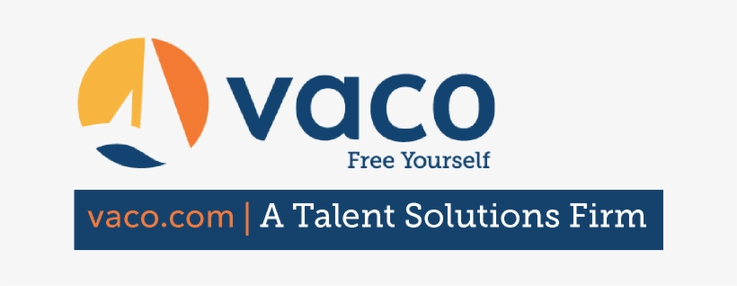

## In this week's article, senior tech recruiter Taylor Desseyn joins us on a Scrimba Podcast to inform us of leveraging recruiters as a viable option to the traditional way of pursuing a job in tech!

---

---

### About Taylor Desseyn

Taylor Desseyn is a senior recruiter whose goal is "to be your advocate within your career by giving you the necessary resources to be able to navigate the sales-y recruiters as well as elevate your career to new levels."

He has over ten years of experience and works at [Vaco](https://www.vaco.com/) in Brentwood, Tennessee.

---

### Taylor's mission

Taylor is on a mission to educate people by informing them of an alternative way to find a job by leveraging tech recruiters.

---

*"I'm trying to educate people to get away from the traditional way of finding a job, which is apply, apply, apply, submit, submit, submit, and doing the same daggum thing over and over again that you just become frustrated with."*

> *-Taylor Desseyn*

---

### Recruiting process

You may not have heard, but there are many negative feelings towards recruiters in the tech industry.

Taylor is well aware of this, and in his opinion, he believes that recruiting is inherently broken.

**Taylor explains recruiting is broken because recruiters put metrics around people.**

* Taylor believes:
* People are not metrics
* people are not numbers
* People are people.
* Every person has a story
* Every person should be treated like their story
* Every person should be treated with care

---

At **Vaco**, where Taylor works, the recruiters focus on the candidate experience.

**Taylor tells us that Vaco does its best to ensure that its candidates do not feel like a number.**

---

---

### Agency vs. Internal recruiters

Tailor tells us that there are two types of recruiters; the first type of recruiter is an agency recruiter, the second type is an in-house recruiter.

*Tailor is an agency recruiter.*

---

**Agency recruiter**

An agency recruiter works externally from the companies where you are applying.

---

**In-house recruiter**

An in-house recruiter works internally at the company where you are applying.

---

**Taylor provides the following companies with In-house recruiters:**

* Google
* Eventbrite
* Calendly

---

*"I think if you can leverage a recruiter appropriately, which is why I'm so vocal about it, it could be a huge like cheat code to your career."*

> *-Taylor Desseyn*

---

### How do you get a recruiter?

*"You need to focus on your social currency because if you do not have social currency, you will always struggle to find a job."*

> *-Taylor Desseyn*

---

**One way of getting a recruiter is to have them come to you.**

After building an online presence for yourself, recruiters will start to seek you out!

Fellow self-taught developer Dylan Israel landed a six-figure job at Amazon via a recruiter that reached out and contacted him!

---

***To learn more about Dylan Israel, you can read my articles:***

[Teacher Feature: Dylan Israel](https://selftaughttxg.com/2020/12-20/12-06-2020_TeacherFeature-Dylan_Israel/)

[Communication skill advice from a six-figure Amazon developer](https://selftaughttxg.com/2021/06-21/06-28-21/)

---

**Another way to get a recruiter is for you to seek them out.**

Taylor advises us to find recruiters on LinkedIn by searching for "technical and recruiter" in the city you're living.

When you find a recruiter you would like to work with, Taylor tells us to send them a DM (direct message).

---

### DM recruiters on LinkedIn

**Taylor's three steps to DM recruiters**

1. Admiration and flattery
2. State a specific amount of time that you want to talk to them
3. Ask the specific question that you want to ask

---

**Admiration and flattery**

Learn about the recruiters you are sending direct messages to, and start with compliments. 

Starting a conversation with compliments will let the recruiters know that you took the time and effort to learn about them.

---

**State a specific time**

Ask for a specific amount of time of theirs that you would like to talk to them, such as seven or twelve minutes.

---

**Ask the specific question**

Taylor provides an excellent example question, "I would love to ask you about what you look for when you're interviewing junior developers."

---

*"I think what most job seekers have a problem with is they are not intentional in their job search, and they are vague because they're too scared to ask. I will tell you this, the more comfortable you get asking for things, the more your career starts to take off."*

> *-Taylor Desseyn*

---

### Build relationships with recruiters

Taylor advises us to reach out to recruiters and build relationships with them.

**After building relationships with recruiters, Taylor instructs us to send job leads to them to see if the recruiters are working on those jobs or they know someone at those companies.**

---

How to judge if a recruiter is good

Taylor provides us with valuable insight when he advises us to work with recruiters that have worked at their current company for more than two years. 

Taylor explains that recruiters are "heavily commission" based, and if they are not really good at their job, they will have to bounce around to make the base raise around every eighteen months to two years.

---

<iframe width="100%" height="180" frameborder="no" scrolling="no" seamless src="https://share.transistor.fm/e/e137c34c"></iframe>

***Be sure to listen to the full Scrimba Podcast!***

---

### When are you "job-ready" to work with a recruiter?

Regardless of our current tech level, Taylor encourages us to start our job search and tells us that we should always be networking.

Taylor says during the interview, *"You should always be networking. Always. You should always be talking to recruiters. Hey recruiter, Mr., Mrs. Recruiter, who's hiring in our city? Who's doing it the right way? Who are some companies I should stay away from? Who are some individuals that I should be connected to?"*

**Taylor also informs us that we need to have a very well-written resume and LinkedIn profile.**

---

***Taylor provides us with a resume template, as well as other resources on his website:***

[FREE GUIDES](https://www.taylordesseyn.com/freeguides)

---

### LinkedIn

Taylor provides us with the following advice to optimize our LinkedIn profile:

**Optimize your LinkedIn**

* your profile picture
* your banner photo
* the title portion

---

**Your profile picture**

Make sure it's fun, and make sure you're well lit. Taylor believes it is worth hiring a photographer to take a professional headshot.

**Your banner photo**

The top part of your LinkedIn needs to have information about you. Taylor also advises that the banner needs to have some "pizazz" because that's the first thing people see when viewing your profile.

**The title portion**

The title portion is the words under your profile picture. The title portion should be specific to what you do because recruiters don't even open up your profile; recruiters just read the title portion.

---

### The cost of hiring a recruiter

*"And I think another thing too, with the recruiting industry, is no one knows how to operate us, like work with us. Like no one knows how we operate. You know, they hear about recruiters like making these huge fees, and they're like, do they take it out of my salary? Does a company pay them directly? Like, do I need to sign a contract with a recruiter? There's so many intricacies of our job."*

> *-Taylor Desseyn*

---

**Taylor did not discuss in detail the cost of hiring a recruiter during the Scrimba Livestream.**

I then visited Vaco's website and discovered that they do not display the cost of hiring a recruiter through them.

Vaco does have a "**Job Seekers**" page, where you search for jobs and submit a resume.

---

**The resume application form on Vaco's website consists of general contact information and also instructs you to:**

* Pick an office location (Taylor works at the Nashville, TN office)
* Pick your area of expertise (from a dropdown menu)
* If you are interested in On-site, Hybrid, Remote

There is also a "**How Can We Help**?" field for you to leave a detailed message and a "**resume upload**" submit button (PDF, DOC, DOCX | 5MB limit).

---

***Here is a link to the Vaco [job seekers page](https://www.vaco.com/for-job-seekers/)***

---

### Daily live shows

Be sure to check out Taylor's daily live shows!

Taylor broadcasts daily live shows at 9:30 am, central time every single morning on LinkedIn.

---

### Taylor Desseyn Links

* 🔗 [Website](https://www.taylordesseyn.com/)
* 🔗 [LinkedIn](https://www.linkedin.com/in/taylordesseyn)
* 🔗 [Twitter](https://twitter.com/tdesseyn)
* 🔗 [Instagram](http://instagram.com/guidancecounselor2.0)

---

### Advance your career with a 20% discount on Scrimba Pro using this [affiliate link](https://scrimba.com/?via=MichaelLarocca)!

Become a hireable developer with Scrimba Pro! Discover a world of coding knowledge with full access to all courses, hands-on projects, and a vibrant community. You can [read my article](https://selftaughttxg.com/2021/06-21/06-07-21/) to learn more about my exceptional experiences with Scrimba and how it helps many become confident, well-prepared web developers!

###### ***Important:*** *This discount is for new accounts only. If a higher discount is currently available, it will be applied automatically.*

**How to Claim Your Discount:**
1. Click [the link](https://scrimba.com/?via=MichaelLarocca) to explore the new Scrimba 2.0.
2. Create a new account.
3. Upgrade to Pro; the 20% discount will automatically apply.

##### ***Disclosure:*** *This article contains affiliate links. I will earn a commission from any purchases made through these links at no extra cost to you. Your support helps me continue creating valuable content. Thank you!*

---

### Conclusion

Utilizing recruiters is a viable option to the traditional way of finding a job: applying and submitting applications.

Building relationships with recruiters ultimately provides us with a streamlined resource, giving us a competitive advantage when seeking to land a job in tech!

---

###### Did Taylor's insight encourage you to seek a job in tech through a recruiter? Have you already worked with a recruiter and would like to share your experience? Please share the article and comment!
