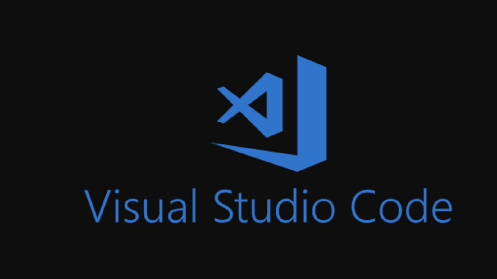
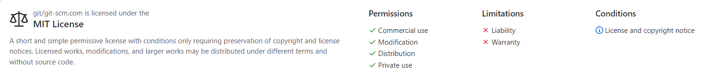
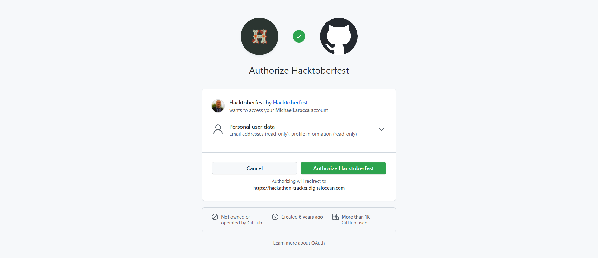
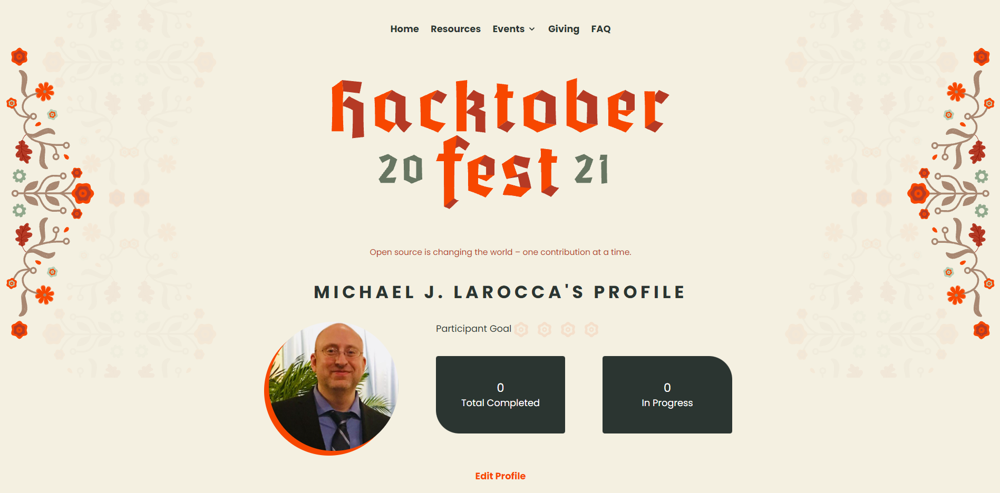
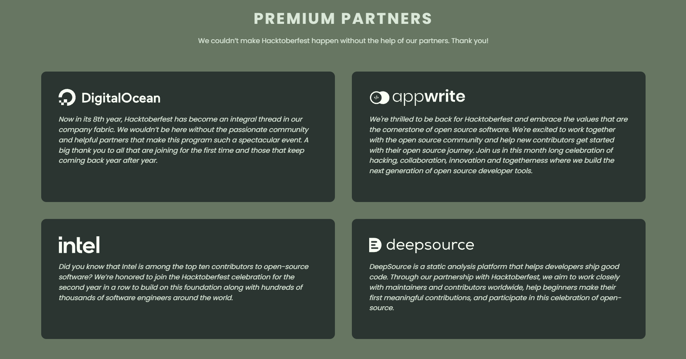
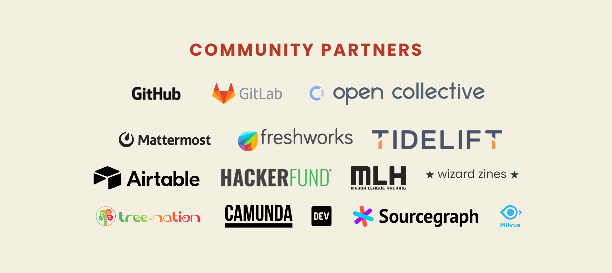

## In this article, I am covering this year's Hacktoberfest, what it is, and how to participate! This article will be the first in a series of articles covering registering, contributing, and maintaining!

---

### What is Hacktoberfest

Hacktoberfest is a seasonal event that promotes engagement in open-source projects. 2021 will mark Hacktoberfest's eighth year! The event takes place in October, and DigitalOcean hosts the event.

**The Hacktoberfest website informs us of how we can participate:**

* Prepare and share your project for collaboration
* Contribute to the betterment of a project via pull requests
* Organize an event
* Mentor others
* Donate directly to open-source projects

**Programmers that contribute to four Hacktoberfest participating projects via qualifying pull requests earn exclusive Hacktoberfest swag!**

---

### Open-source projects

Ok, it sounds fun, but what are open-source projects?

**Basically, open-source projects are collaborative community-created programs that are publicly available to download, alter, and distribute.**

---

**[Wikipedia: Open-source software](https://en.wikipedia.org/wiki/Open-source_software)**

*Open-source software (OSS) is computer software that is released under a license in which the copyright holder grants users the rights to use, study, change, and distribute the software and its source code to anyone and for any purpose. Open-source software may be developed in a collaborative public manner. Open-source software is a prominent example of open collaboration, meaning any capable user is able to participate online in development, making the number of possible contributors indefinite. The ability to examine the code facilitates public trust into the software.*

---

**One of the most famous open-source software projects is Microsoft's code editor, Visual Studio Code.**

( I'm using Visual Studio Code to create this article! )

---

---

*Information from GitHub:*

### Visual Studio Code - Open Source ("Code - OSS")

**The Repository**

*This repository ("Code - OSS") is where we (Microsoft) develop the Visual Studio Code product together with the community. Not only do we work on code and issues here, we also publish our roadmap, monthly iteration plans, and our endgame plans. This source code is available to everyone under the standard MIT license.*

---

---

### Pull requests

Right, so now that we know what an open-source project is, how do we interact with them?

**In simple terms, to interact and contribute to an open-source project, you first download the project, add or make changes to the code, and then submit a pull request, which means that your changes will be uploaded and incorporated into the project upon approval.**

---

*Since the process of creating a pull request is beyond the scope of this article, I will refer you to a good source created by the host of hacktoberfest, Digitalocean:*

[Digitalocean Tutorial: How To Create a Pull Request on GitHub](https://www.digitalocean.com/community/tutorials/how-to-create-a-pull-request-on-github)

---

### Taking part in Hacktoberfest

*To participate in Hacktoberfest, you need to have a GitHub or a GitLab account and register for the event.*

*Also, it's important to note that you have to contribute to Hacktoberfest participating repositories.*

---

---

### Getting started

**I documented the following steps while I registered for the Hacktoberfest event.**

**Step 1**

To participate in Hacktoberfest, you need to register on the [hacktoberfest website](https://hacktoberfest.digitalocean.com/). You will need to have a GitHub or GitLab account and use that account to register here: [hacktoberfest: register](https://hacktoberfest.digitalocean.com/register)

---

**Step 2**

After registering, there is an "**about you**" form to fill out, and it also includes information on Hacktoberfest's rules and values.

---

**Step 3**

Happy Hacking!

Your profile will now: "**track your pull request progress, help you find cool projects, and provide open-source resources**."

You are now prompted to "[Read our Values](https://hacktoberfest.digitalocean.com/resources#values)," and "[Quality Standards](https://hacktoberfest.digitalocean.com/resources/qualitystandards)" learn how to [Reduce Spam](https://hacktoberfest.digitalocean.com/resources#reduce-spam) and familiarize yourself with the [rules](https://hacktoberfest.digitalocean.com/resources/participation).

Check the acknowledgment boxes and click the "**Start Hacking**!"

---

---

***Note:*** *You can edit your profile after creating it by clicking on "Edit Profile" on the profile page. Make sure you have the "Participant" check box checked, and if you plan to be a maintainer, make sure you have the "Maintainer" check box checked.*

---

### Your Profile

Once you have created your Hacktoberfest profile by connection to your GitHub or GitLab account, you can access your profile page at [https://hacktoberfest.digitalocean.com/profile](https://hacktoberfest.digitalocean.com/profile).

Your profile page displays how many participation goals you complete and how many participation goals are in progress.

**With your newly created profile, you are now ready to contribute quality pull requests with participating Hacktoberfest repositories.**

---

### So, what are the "quality standards?"

To qualify and earn Hacktoberfest 2021 swag, you must participate by contributing quality pull requests to four participating Hacktoberfest repositories.

The main question that I have is, "**what qualifies as a quality contribution**?"

**Here is the detailed list provided by Hacktoberfest's quality standards:**

---

**details**

In line with Hacktoberfest value #2 (Quantity is fun, quality is key), we have provided examples of the pull requests that we consider to be low-quality contributions (which we discourage and may be marked as spam by maintainers).

---

**examples of low-quality contributions**

* Pull requests that are automated e.g. scripted opening pull requests to remove whitespace / fix typos / optimize images.
* Pull requests that are disruptive e.g. taking someone else's branch/commits and making a pull request.
* Pull requests that are regarded by a project maintainer as a hindrance vs. helping.
* Something that's clearly an attempt to simply +1 your pull request count for October.
* Last but not least, one pull request to fix a typo is fine, but 5 pull requests to remove a stray whitespace is not.

---

### Hacktoberfest repositories

Ok. So now that we have our profile and know what "**quality contributions**" are, where are the participating Hacktoberfest repositories?

So I thought, *"what better way is there to find out than to ask the tech Twitter community and tag all of the premium partners?"*

---

---

**Premium Partners**

* DigitalOcean
* appwrite
* intel
* deepsource

**And you know what? Without missing a beat, I got a response from them!**

---

### deepsource

Deepsource provided a website that contains beginner-friendly code quality issues that need fixing: [deepsource.io/discover](deepsource.io/discover).

Deepsource also has a Discord channel: [deepsource.io/discord](deepsource.io/discord)

---

### appwrite

Appwrite provided a website with over 200 beginner-friendly issues across their repositories: [hacktoberfest.appwrite.io](hacktoberfest.appwrite.io)

Appwrite also provided a Discord channel: [appwrite.io/discord](appwrite.io/discord)

---

---

### Hacktoberfest repositories I'm participating in

To my pleasant surprise, I was personally invited by [Ayodele Samuel Adebayo](https://github.com/unclebay143), also known as Unclebigbay, to participate in his hacktoberfest-accepted project!

---

*Ayodele Samuel Adebayo hacktoberfest-accepted project:*

**Nigeria Presidents**

Profile list of Nigeria past to present Presidents who ruled from 1960 till date.

**[GitHub repository: nigeria-presidents](https://github.com/unclebay143/nigeria-presidents)**

**[Visit Site: 🔗 take me there](https://nigeria-presidents.netlify.app/)**

---

*To learn more about Ayodele Samuel Adebayo (Unclebigbay), you can read my article covering one of his amazing projects: [Exploring The Advice Hub: A Centralized Advice Center for Developers](https://selftaughttxg.com/2021/09-21/ExploringTheAdviceHub/)*

---

**Scrimba's Weekly Web Dev Challenge Submissions**

I reached out to [Leanne](https://www.youtube.com/c/CodewithLeanne) and expressed my interest to participate in the Scrimba "Weekly Web Dev Challenge Submissions" hacktoberfest-accepted project.

She gave me a choice of two issues; I chose to add icons to the links on the footer pages.

It sounded like an easy contribution; all I had to do was utilize [font awesome](https://fontawesome.com/) and adjust the icons next to the links. However, there is no icon for the Scrimba logo!

No worries. I already came up with a solution, and I will cover it in an upcoming article in this Hacktoberfest series!

**[GitHub repository: Weekly web dev challenge poll](https://github.com/lkrryba/weekly-web-dev-challenge-poll)**

**[Visit Site: 🔗Scrimba weekly webdev challenge scrimba](https://weeklywebdevchallenge.scrimba.com/)**

---

*To learn more about Scrimba's Weekly Web Dev Challenge, you can read my review article!*

*[Review: ScrimbaWebDevChallenge](https://selftaughttxg.com/2021/01-21/ReviewScrimbaWebDevChallenge/)*

---

#### I will participate in Hacktoberfest participating repositories, document the process, and publish them in my upcoming article series!

---

### Advance your career with a 20% discount on Scrimba Pro using this [affiliate link](https://scrimba.com/?via=MichaelLarocca)!

Become a hireable developer with Scrimba Pro! Discover a world of coding knowledge with full access to all courses, hands-on projects, and a vibrant community. You can [read my article](https://selftaughttxg.com/2021/06-21/06-07-21/) to learn more about my exceptional experiences with Scrimba and how it helps many become confident, well-prepared web developers!

###### ***Important:*** *This discount is for new accounts only. If a higher discount is currently available, it will be applied automatically.*

**How to Claim Your Discount:**
1. Click [the link](https://scrimba.com/?via=MichaelLarocca) to explore the new Scrimba 2.0.
2. Create a new account.
3. Upgrade to Pro; the 20% discount will automatically apply.

##### ***Disclosure:*** *This article contains affiliate links. I will earn a commission from any purchases made through these links at no extra cost to you. Your support helps me continue creating valuable content. Thank you!*

---

### Conclusion

Hacktoberfest is a seasonal event that promotes engagement in open-source projects.

This first article in the series discusses what Hacktoberfest is in detail and includes step-by-step instructions on registering for the event.

My upcoming articles in the series will document the process of participating in Hacktoberfest registered projects!

---

###### Are you now encouraged to participate in Hacktoberfest? Are you interested in becoming or already a Hacktoberfest maintainer? Please share the article and comment!

---
