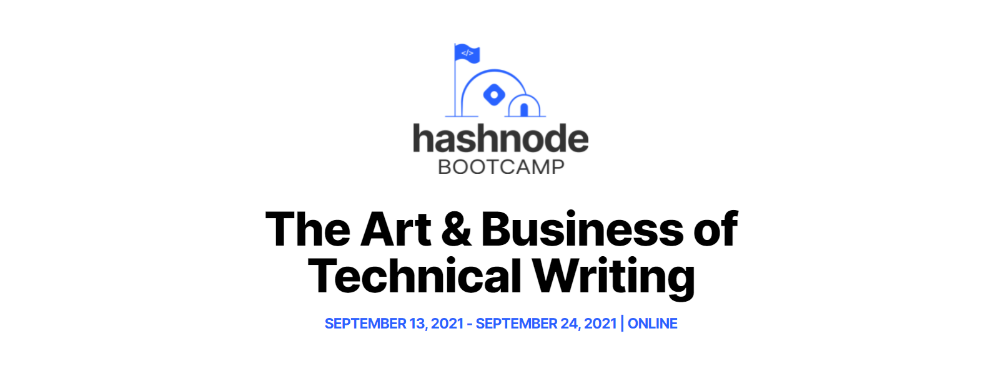

## This week's article is the Hashnode Bootcamp - The Art & Business of Technical Writing Prompt 1, which discusses how I got started blogging, what motivates me to keep going, and my goals as a writer!

---

---

### Hashnode Bootcamp 2021, Writing Prompt 1

***Share your path to becoming a writer/becoming interested in writing.***

---

### Hashnode Writing Prompt Topics

* How did you get started?
* What motivates you to keep going
* What are your goals as a writer?

---

### How did I get started?

I began my self-taught coding journey at the beginning of 2019. After much research, I decided to learn JavaScript as it was a popular and in-demand language at that time, even though I did not first learn HTML and CSS. I covered that cautionary tale in my "[There and Back Again](https://selftaughttxg.com/2021/01-21/ThereAndBackAgain/)" article. 

**While searching YouTube, articles, and online schools for resources to learn JavaScript, a common thread kept coming up; you need to blog.**

**Reasons I heard to start a blog**

* Document your work
* Build your online presence
* Opportunities will come to you
* You will earn passive income
* It's as good for you as eating vegetables
* It's the cool thing to do
* Join the "Blog" side of the force!

Like a teenager bombarded with peer pressure, I conceded, *"Alright already! I'll start a blog!"*

---

Now that I decided to start a blog, I began to research online how to create one.

**The consensus was clear; what is essential about blogging is to focus on blogging, not the technology of creating a blog. So I learned that it's in our best interest to use a premade blog, such as Hashnode, Dev, or Medium.**

So, of course, I recklessly decided to create my own blog; I am, after all, an aspiring web developer, right?

I managed to create a blog using a Gatsby starter blog, along with Netlify and GitHub. With much trial and error, my blog is working and online with the purchased domain name "[selftaughttxg.com](https://selftaughttxg.com/)."

***Self-Taught TXG: Weekly articles from a self-taught Generation X programmer***

---

---

### What motivates me to keep going

What motivates me to keep going? Well, it's all the monetary opportunities, passive income, and celebrity status that my blog creates for me, of course!

**Ten months of consistent weekly blogging:**

* Monetary opportunities: ZERO
* Passive income: $0.00
* Celebrity status: NULL

Ok. So maybe my initial reasons for starting to blog were a little ambitious.

---

**What ten months of consistent weekly blogging did do for me**

What consistent weekly blogging did do for me is put me on the "**tech community map**!"

My first article, "[Teacher Feature: Dylan Israel](https://selftaughttxg.com/2020/12-20/12-06-2020_TeacherFeature-Dylan_Israel/)," was read and recognized by Dylan Israel. Shortly after the release of the article, Dylan became a LinkedIn connection.

**The article/LinkedIn connection did not end there; since then, I have written more articles and connected with more tech industry influencers.**

**Tech industry influencer connections on LinkedIn**

* Dylan Israel
* Erik Hanchett
* James Quick
* Jesse Hall
* Danny Thompson
* Anna J McDougall
* Sara Shook

**Tech industry influencers that follow me on Twitter**

* Gary Simon
* Ania Kubów
* Eddie Jaoude
* Mike @HTML All The Things Podcast
* Shaquil Hansford
* Sam Sycamore
* Claudio Bernasconi

In addition to industry influencers, through blogging, I have also gotten the attention of staff members of online schools, such as Free Code Camps Quincy Larson and Scrimba's Per Harald Borgen.

Also, blogging has connected me with fellow self-taught developers attending Free Code Camp, Scrimba, and other bloggers!

These industry influencers and fellow bloggers shared my tweets advertising several of my articles, resulting in significantly increased traffic to my blog!

---

**What ten months of consistent weekly blogging also did for me**

As a direct result of writing blog articles, I now have contacts who work at:

* Amazon
* Google
* MongoBD
* Autho
* Hashnode
* Scrimba
* Codecademy
* Zeal

**I also now have contacts that freelance, host Podcasts, and have gotten the attention of several tech recruiters.**

---

*Although it was not a monetary opportunity, several of my articles we requested to be republished on "[dev.to](https://dev.to/scrimba)" as a Scrimba author, and several of my articles were also featured on Scrimba YouTube Livestreams!*

---

<iframe width="956" height="538" src="https://www.youtube.com/embed/OdO_tPDcnus" title="YouTube video player" frameborder="0" allow="accelerometer; autoplay; clipboard-write; encrypted-media; gyroscope; picture-in-picture" allowfullscreen></iframe>

---

**[The Weekly Web Dev Challenge - LIVE! 🎥](https://youtu.be/zK4ekjzp7-s?t=1483)**

**[Weekly Web Dev Challenge LIVE](https://youtu.be/vu1di3lONFE?t=2658)**

---

### My goals as a writer

**My goals as a writer**

* Document and share my progress
* Share great resources created by the community.
* Network with like-minded people
* Continue to build my online presence
* Provide content to potential employers

Documenting and sharing my progress through blogging will provide a resource for myself and others. Writing articles on projects I create will serve as wonderful supplements for potential employers to view and provide proof of my consistency and work ethic.

**In addition to the growth of my online presence, writing articles covering others' works as a mediator between teacher and student will help to "get the word out" about their projects, and I may make a few more connections along the way. It's a "win/win" for myself and the other content creators that I highlight.**

---

### Advance your career with a 20% discount on Scrimba Pro using this [affiliate link](https://scrimba.com/?via=MichaelLarocca)!

Become a hireable developer with Scrimba Pro! Discover a world of coding knowledge with full access to all courses, hands-on projects, and a vibrant community. You can [read my article](https://selftaughttxg.com/2021/06-21/06-07-21/) to learn more about my exceptional experiences with Scrimba and how it helps many become confident, well-prepared web developers!

###### ***Important:*** *This discount is for new accounts only. If a higher discount is currently available, it will be applied automatically.*

**How to Claim Your Discount:**
1. Click [the link](https://scrimba.com/?via=MichaelLarocca) to explore the new Scrimba 2.0.
2. Create a new account.
3. Upgrade to Pro; the 20% discount will automatically apply.

##### ***Disclosure:*** *This article contains affiliate links. I will earn a commission from any purchases made through these links at no extra cost to you. Your support helps me continue creating valuable content. Thank you!*

---

### Conclusion

Although I am impatient for blogging to bring monetary opportunities, I must acknowledge that it is paying off in other aspects.

In just ten months of consistent weekly blogging, I've made connections with tech industry influencers on LinkedIn and Twitter, had my articles featured on YouTube Livestreams, and was invited to become a Scrimba author and republish my articles under Scrimba's name.

In time, when my programming skills increase and I meet the requirements of jobs that I apply for, I believe my blog will give me the competitive advantage I need to secure employment opportunities!

---

###### Are you now inspired to start your own blog? Are you already a blogger with your own success stories? Please share the article and comment!
