### This article covers how to participate in a Hacktoberfest repository. You will need to fork, clone, edit, and submit a pull request. I went through the process, and I'm providing the instructions!

---


---

### GitHub from a beginner's point of view

Let's first discuss GitHub from a beginner's point of view.

As a self-taught developer myself, I must admit that one of the most confusing things for me was to work with GitHub when I started out.  

In my opinion and experience, GitHub is not an intuitive platform for a developer who is starting out.

While working on JavaScript YouTube projects, I remember being directed by the instructors' to reference the source code for the projects on repositories on GitHub.

I remember thinking, *"what are repositories? Where is the code I need? Now that I found the index HTML page, where is the website? Why and how do I fork a project? What is the difference between forking and cloning a project?"*

Look, it has become clear to me that learning to work with GitHub is a whole separate thing to learn in addition to learning Git, the bash terminal, and a code editor such as Visual Studio code.

**It will take time to learn how to work with GitHub, but I do not want you to miss out on contributing during Hacktoberfest. So I will now step through what you need to do to participate in a Hacktoberfest project.**

---

### Prerequisites

**You need to:**

* Have a GitHub or GitLab account
* Register on the hacktoberfest website.
* Know how to work with repositories

If you would like step-by-step instructions on registering your GitHub account for Hacktoberfest, you can read my article:

**[Hacktoberfest: 2021](https://selftaughttxg.com/2021/10-21/Hacktoberfest-2021/)**

I will provide step-by-step instructions for working with GitHub repositories in this article.

---

### Working with GitHub repositories

The first step to contributing to GitHub repositories is to read the "**contributing**" instructions of the repository you want to contribute to.

I will contribute to Scrimba's "**Weekly web dev challenge**" repository to demonstrate and step through this process.

***Note:*** *Each GitHub repository will have its own contributing instructions that will vary.*

---

[Website: weeklywebdevchallengeWeekly Web Dev Challenge Submissions](https://weeklywebdevchallenge.scrimba.com/)

[Repository: weekly-web-dev-challenge-poll](https://github.com/lkrryba/weekly-web-dev-challenge-poll/)

[Contributing file: contributing.md](https://github.com/lkrryba/weekly-web-dev-challenge-poll/blob/master/contributing.md)

---

### Contributing instructions

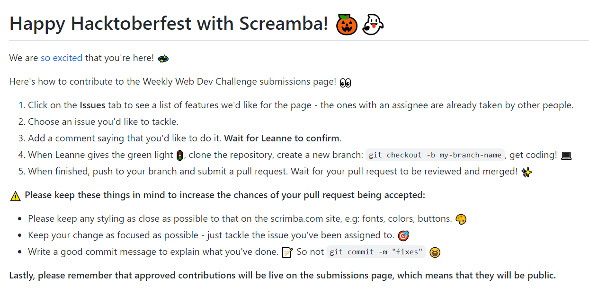

**The contributing instructions in the Scrimba repository tell us to pick an issue from the issue list.**

---

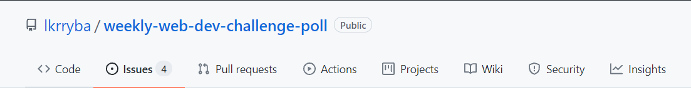

---

Clicking on the **Issues**" tab will take you to the issues page.

---

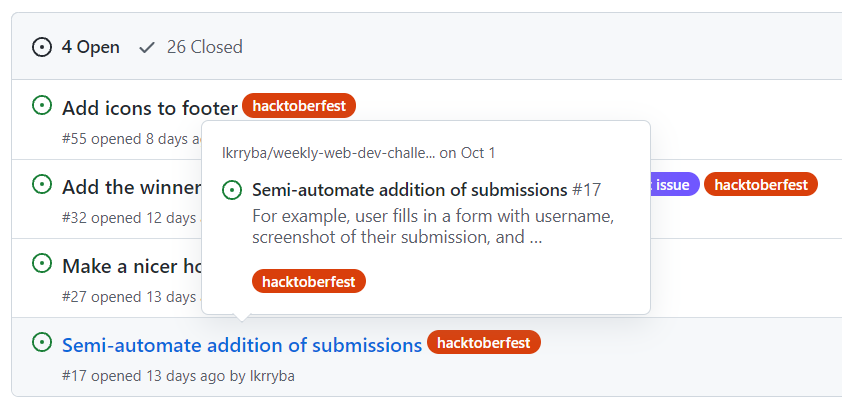

---

Here, we have selected the "**Semi-automate addition of submissions**"

Clicking on "**Semi-automate addition of submissions**" will take you to that issue's page.

---

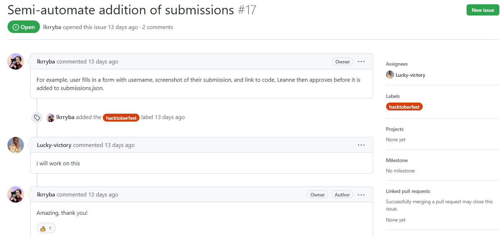

---

On Issue# 17 page, Leanne ( lkrryba ) leaves detailed instructions on how to resolve this issue.

Victor ( Lucky-victory ) offers to take care of this issue, and then  Leanne ( lkrryba ) assigns Issue# 17 to him.

---

### Once you are assigned an issue

Once you are assigned an issue, it is on to steps 4 and 5.

**Step 4**

* When Leanne gives the green light 🚦, clone the repository, create a new branch: git checkout -b my-branch-name, get coding! 💻

**Step 5**

* When finished, push to your branch and submit a pull request. Wait for your pull request to be reviewed and merged! ✨

---

**Here is the issue assigned to me**

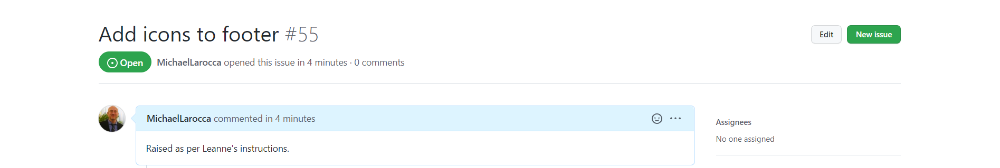

---

### Detailed instructions for step 4 & 5

To say I had difficulties cloning, editing, and pushing my changes would be an understatement! ( I kept getting a 403 permission denied error )

I eventually got it to work, and I now better understand how to work with and contribute to GitHub repositories.

I will now provide step-by-step instructions to contribute to Scrimba's "**weekly-web-dev-challenge-poll repository**."

---

### Detailed instructions for step 4

**Step 4**

* When Leanne gives the green light 🚦, clone the repository, create a new branch: git checkout -b my-branch-name, get coding! 💻

---

To complete step 4, we first must "**fork**" the repository.

To "**fork**" the repository, while signed in to GitHub, go to the author's repository and click the fork button located in the top right corner.

---

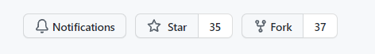

---

**Now, here is the crucial part. Make sure you go to your GitHub account and go to your newly forked repository there.**

---

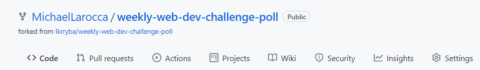 

---

Please take notice, under the repository name, it clearly says "**forked from lkrryba/weekly-web-dev-challenge-poll**."

Now that we know we are working with the forked repository in the correct GitHub account, it is time to clone it.

---

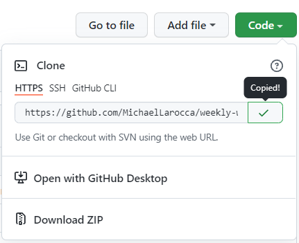

---

Now, click on the green "**Code**" button, select "**HTTPS**," and copy the provided address.

In the bash terminal on your computer, in a folder that is **NOT** initiated as a Git folder, type "**git clone**" and then paste the provided address.

```

$ git clone https://github.com/MichaelLarocca/weekly-web-dev-challenge-poll.git

```

---

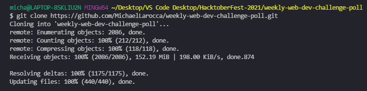

---

The last step is to create a new branch in your forked/cloned repository, "**git checkout -b my-branch-name**."

*( The -b flag changes the branch from master branch to the new branch you create. )*

The provided code created a new branch named MichaelLarocca and switched to it. You can use this code and replace my name with a branch name of your choosing.

```

 git checkout -b MichaelLarocca

```

---

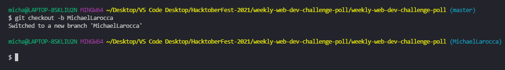

---

### You have now completed step 4!

---

***Note:*** *If you do not have your user name and e-mail set up globally in Git, you must add it to your cloned repository.*

```
$git config user.email "your email" 
$git config user.name "Your name"
```

---

### Detailed instructions for step 5

**Step 5**

* When finished, push to your branch and submit a pull request. Wait for your pull request to be reviewed and merged! ✨

---

**Now that you have cloned the forked repository from your GitHub account, you can start your work/contribution on your newly created branch.**

When you have finished your work/contribution on your newly created branch, it is time to push **your branch** to **your GitHub account repository**.

**To make sure that your fork in your GitHub account's repository is up to date, you need first to fetch the upstream.**

---

### Fetch upstream

When you fork a repository, you are receiving a duplicate of the current state of that repository.

When you "**Fetch**" the upstream, you are updating your forked repository on your GitHub account to once again be in sync with the current state of the creator's repository in their account.

The image below shows 29 additional commits made to the creator's repository in their account since I forked it into a repository on my GitHub account.

---

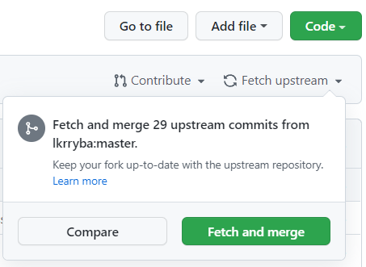

---

Clicking the "**Fetch and merge**" will download and merge the 29 additional commits to bring my forked repository in my GitHub account up to date.

---

### Creating an upstream

To push **your newly created branch** to **your GitHub account repository**, you must create an upstream.

By simply typing "**git push**" in your bash terminal, you will receive a message stating that you need to create an upstream, and the exact syntax you need is then provided for you.

```

git push --set-upstream origin your-branch-name

```

Now, run the provided upstream code to create the upstream, replacing **your-branch-name** with the name you chose for your branch's name.

---

*( Below is the code I used to create my upstream. )*

```

git push --set-upstream origin MichaelLarocca-Test-Branch

```

---

### Creating a pull request

Now, head over to **your GitHub repository**. You will now see the branch that you just pushed.

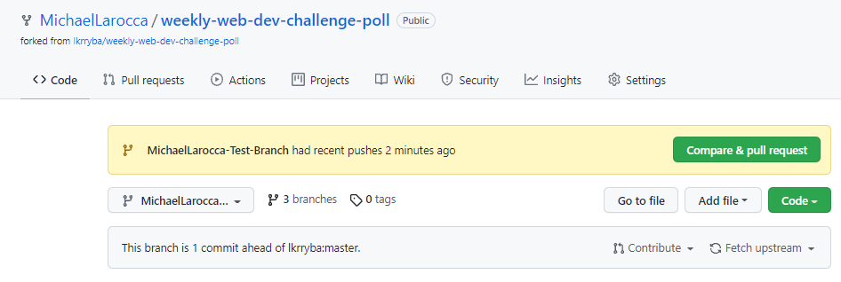

---

Now head over to **the creator's repository account**. You will now also see the branch that you just pushed there.

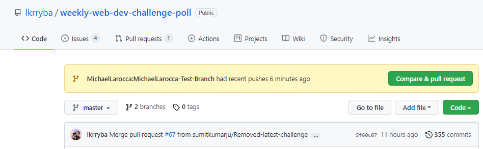

---

***Note:*** *When you first created a fork, behind the scenes, GitHub made a connection that connects your forked repository to the creator's repository.*

---

### Open a pull request

Now, head back over to **your forked repository** on **your GitHub account**.

First, click the "**Fetch and merge**" button, as discussed earlier, to bring your forked repository up to date with the creator's repository.

Once your forked repository is up to date, click "**Compare & pull request**."

If there are no merge conflicts, you will receive a message stating that you are "**able to merge**."

*If there are merge conflicts, you will need to resolve them before creating a pull request.*

To open a pull request, now click the "**Create pull request**."

---

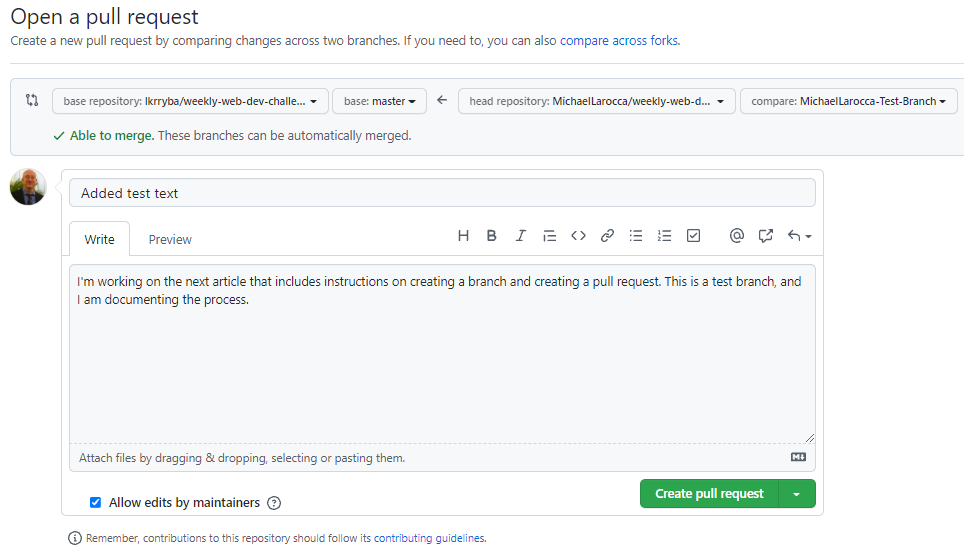

---

**You have now created a pull request! Your pull request will be visible in the creator's repository under "Pull requests."**

---

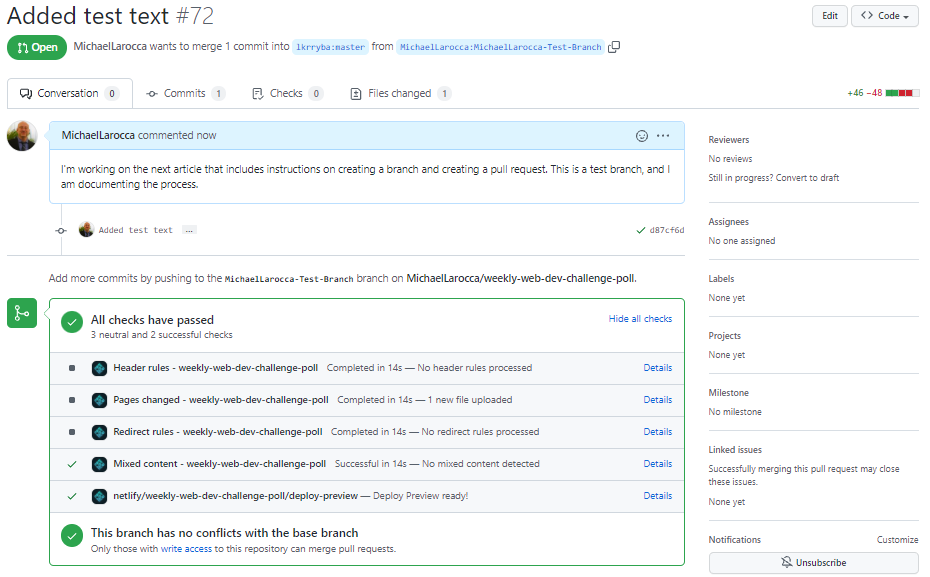

---

### You have now completed step 5!

---

### Hacktoberfest profile

You will know both you and the participating Hacktoberfest
repositories correctly registered for the event when you view your Hacktoberfest profile page.

[https://hacktoberfest.digitalocean.com/profile](https://hacktoberfest.digitalocean.com/profile)

You will see your participating Hacktoberfest pull requests pending under "***CONTRIBUTIONS***."

---

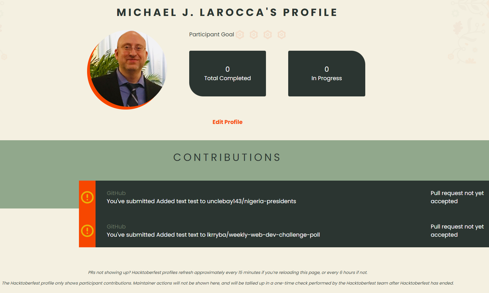

---

### Congratulations!

You have now successfully forked, cloned, branched, and pushed your Hacktoberfest contribution to GitHub.

The branch you pushed up to **your repository** is automatically connected to the **original repository** you forked it from.

**Your branch** will be merged by the creator of the original repository, on the **original repository**, upon approval.

---

### Troubleshooting

**I had a difficult time cloning a participating Hacktoberfest repository to take part in, and I documented the steps that I took to resolve the problems in this section.**

**If you are also facing difficulties, one of the troubleshooting steps provided may help you.**

---

### What I was doing wrong

**What I was doing wrong:**

I was directly cloning the repositories from the creator's account/repository.

This method is allowed. However, you must be assigned as a collaborator to the creator's repository, or you will be denied permission, resulting in a 403 error.

---

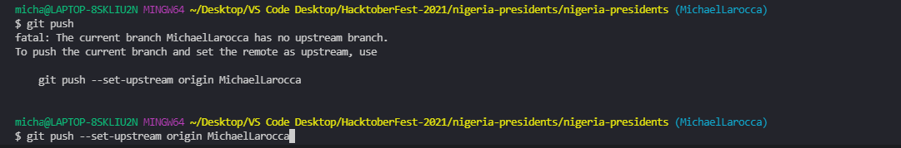

---

*Here is a link to GitHub Docs that explains Access permissions.*

*[Access permissions on GitHub](https://docs.github.com/en/get-started/learning-about-github/access-permissions-on-github)*

---

**The correct way is to:**

* Go to the creator's account/repository
* Fork the creator's repository
* Go to your GitHub account/repository
* Then clone the repository from your GitHub account

---

**Here are step-by-step instructions on how to fork and clone a repository, provided by the GitHub docks.**

[Fork a repo](https://docs.github.com/en/get-started/quickstart/fork-a-repo)

---

*Here is an informative article I came across that helped me to understand forking and cloning repositories better.*

*[The difference between forking and cloning a repository](https://github.community/t/the-difference-between-forking-and-cloning-a-repository/10189)*

---

### Attempts at solving a GitHub 403 error

While trying to solve the GitHub 403 error I kept receiving upon pushing my Hacktoberfest cloned repository, I documented the different troubleshooting attempts.

**The troubleshooting attempts listed are common fixes to resolve the GitHub 403 error. If you are experiencing the same 403 error and my final solution did not resolve your problem, perhaps one of the listed attempts may help you.**

---

### Windows Credential Manager

The most common solution to the GitHub permission denied 403 error that I found was to clear the "cashed" GitHub information ( on Windows 10) using the Windows Credential Manager.

This error might happen due to your current GitHub credentials not matching the GitHub credentials that are cashed in your Windows account.

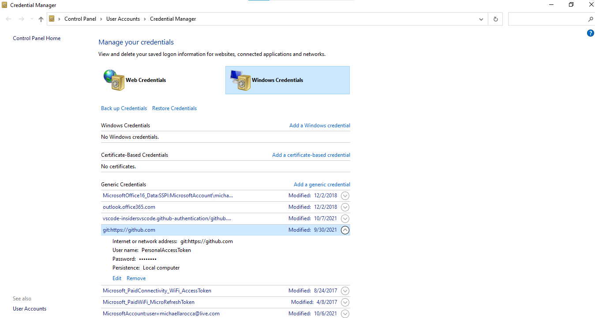

To find the Credential Manager on Windows 10, simply type "Credential Manager" in the "Type here to search" bar located on the bottom left of your screen. (The Credential Manager is located on the control panel. )

Once you are in the Credential Manager, click on "Windows Credentials." Then find and select GitHub cached credentials and click remove.

**Once your cached credentials are removed from Windows, there will be no conflict with your GitHub credentials, and this will resolve your 403 error if that was the issue.**

---

### Personal access token

Upon cloning the nigeria-presidents repository, making changes, and then trying to push back, I received an e-mail from GitHub stating that I have an outdated access token.

---

**This is the e-mail sent from GitHub**

*"We noticed your personal access token, git: https://github.com/ on LAPTOP at 17-May-2020 17:10, has an outdated format and was used to access the GitHub API on October 6th, 2021 at 04:21 (UTC) with a user-agent header of git-credential-manager (Microsoft Windows NT 6.2.9200.0; Win32NT; x64) CLR/4.0.30319 git-tools/1.20.0."*

*"We recently updated the format of our API authentication tokens, providing additional security benefits to all our customers."*

*"In order to benefit from this new format, please regenerate your personal access token, git: https://github.com/ on LAPTOP May-2020 17:10, using the button below."*

---

Steps I have taken to generate a new personal access token

To generate a new personal access token, I used the button provided in the e-mail above. By following all of the steps, they will give you a one-time code to use. 

Now that you have your one-time code to use, in the bash terminal, run the command "gh auth login."

```
$ gh auth login
```

The image below shows the steps taken to connect to GitHub with your one-time code.

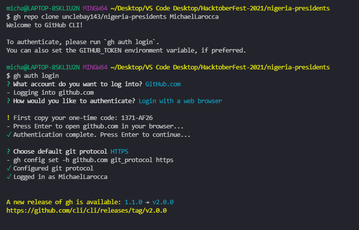

---

*Even though I successfully updated my personal access token, it did not resolve my situation's 403 permission denied error. However, updating your personal access token may resolve an issue you may be facing.*

---

### Git user name and user e-mail

**To participate in Git collaboration, you need to have a Git user name and user e-mail.**

When working with Git, it is common to set your user name and e-mail globally so that you won't have to set it every time you start a new Git project.

```
$git config --global user.email "your email" 
$git config --global user.name "Your name"
```

**Since I'm stubborn and like to control everything, I did not set my user name and e-mail globally and often forgot to add them when working on new projects.**

```
$git config user.email "your email" 
$git config user.name "Your name"
```

To see your user name and password setting, use "**git config --list**."

If the user name and password are not in the list, they are not there, and you need to add them.

```
git config --list
```

---

*Whether global or local, make sure you have set your user name and e-mail in the git config so that you can participate in GitHub collaboration.*

---

### GitHub e-mail and GitHub no-reply e-mail

Although I did not follow through with this method, it is good to know that you can use an alias e-mail address when collaborating.

GitHub uses your primary e-mail for collaborating unless you have "email privacy" enabled.

Your primary e-mail is the e-mail that GitHub uses to send you notifications and information pertaining to your GitHub account.

If you do not wish to have this e-mail used for all to see when making commits and collaborating in GitHub projects, you can enable "email privacy."

Here is a link to the GitHub docs: [Setting your commit email address](https://docs.github.com/en/account-and-profile/setting-up-and-managing-your-github-user-account/managing-email-preferences/setting-your-commit-email-address)

---

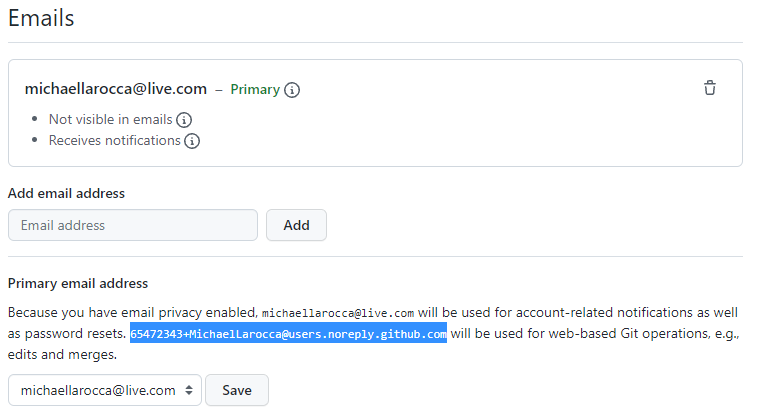

---

### Running VS Code in Restricted Mode

I was running VS Code in Restricted Mode, which prevents a lot of activity.

---

[Visual Studio Code documentation](https://code.visualstudio.com/docs/editor/workspace-trust)

*"Restricted Mode tries to prevent automatic code execution by disabling or limiting the operation of several VS Code features: tasks, debugging, workspace settings, and extensions."*

---

*Unfortunately, turning off Restricted Mode did not solve my Git 403 error, but it may resolve your issues.*

---

### Additional Troubleshooting

*( What I have done wrong in the past )*

**GitHub: What not to do**

Do not clone a GitHub repository into a folder that is already Git initiated.

I made this mistake, and I will explain what happened.

I created a folder, and then Git initialized it first in a previous project using "git init."

Let's call the folder I created, **folder 1**.

I then cloned a repository from GitHub into my already initialized folder on my computer.

Let's call the cloned a repository **folder 2**.

I then remember seeing a message that said changes made in the cloned repository **(folder 2)** would not be tracked by my Git initialized folder **(folder 1)**.

To describe what is happening in simple terms, imagine I have an empty large cardboard box **(folder 1)** and told my computer to track the changes made in the cardboard box **folder 1**.

I then take another small cardboard box **(folder 2)** that is closed and place it inside the first cardboard box **(folder 1)**.

Now I make changes inside of the small cardboard box **(folder 2)**.

Even though the small cardboard box **(folder 2)** is being tracked by the large cardboard box **(folder 1)**, the computer is like, "What changes? I can't see any changes that you make in the closed small cardboard box **(folder 2)**."

---

*The correct way to clone a repository is to clone it into a regular folder, not a folder that is already Git initialized.*

---

### Conclusion

Hacktoberfest is a seasonal event that promotes engagement in open-source projects.

Learning how to collaborate in open-source projects is an essential part of becoming a developer.

In the following article in this series, I will create and document my contribution to Scrimba's "Weekly web dev challenge" Hacktoberfest project!

---