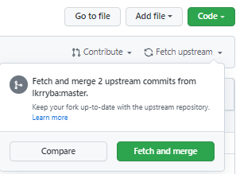
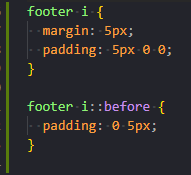
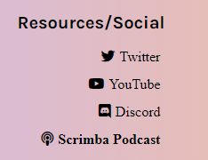
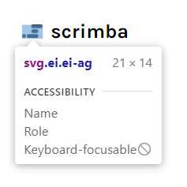

### This article, I document coding my first Hacktoberfest contribution, including forking, cloning, creating a branch, and submitting a pull request; but will I succeed in making a quality contribution?

---


---

### My Hacktoberfest contribution

For my Hacktoberfest contribution, I will be working on the issue assigned to me, **issue #55 add icons to footer**, in the Scrimba "**web dev challenge submissions**" repository.

[Website: weeklywebdevchallengeWeekly Web Dev Challenge Submissions](https://weeklywebdevchallenge.scrimba.com/)

[Repository: weekly-web-dev-challenge-poll](https://github.com/lkrryba/weekly-web-dev-challenge-poll/)

[Contributing file: contributing.md](https://github.com/lkrryba/weekly-web-dev-challenge-poll/blob/master/contributing.md)

---

***If you would like step-by-step instructions on registering your GitHub account for Hacktoberfest, you can read my article: [Hacktoberfest: 2021](https://selftaughttxg.com/2021/10-21/Hacktoberfest-2021/)***

***If you would like step-by-step instructions on being assigned to a Hacktoberfest participating repository issue, you can read my article [How to participate in your first Hacktoberfest repository/project](https://selftaughttxg.com/2021/10-21/HowToParticipateInHacktoberfest/)***

---

### Introduction

I thought this was going to be a simple Hacktoberfest contribution. All I had to do was add icons to the footer links. Now I was thrown two curveballs; there is no icon for the Scrimba logo, and other Hacktoberfest contributors turned the website footers into React components.

So, I already resolved the "**no icon for the Scriba logo**" issue by utilizing a Scriba logo SVG that I sourced from their website.

**However, I have not learned React. Like many self-taught programmers before me, I will have to read the code and figure out how it works.**

---

### Working on my branch

In the previous issue of this series, I cloned Scrimba's Hacktoberfest participating repository, the "**weekly-web-dev-challenge-poll**," and created a branch to work on as instructed.


I will be making changes in this branch, which I will then push up to **my GitHub account**. Upon approval by the repository creator Leanne, the contribution I submit via "**pull-request**" will be merged by Leanne on the Scrimba "**weekly-web-dev-challenge-poll**" repository.

---

*This whole process is covered in detail in my last article. If you have already read the article, you will know I had a lot of difficulties. If you are also experiencing difficulties in forking, cloning, creating a branch, and pushing/creating a pull request, I covered the correct procedure and wrote a troubleshooting section that may help you.*

---

### Fetch and pull

As discussed in my last article, when you fork a repository, you are receiving a duplicate of the current state of that repository.

When you "**Fetch**" the upstream, you are updating your forked repository on your GitHub account to once again be in sync with the current state of the creator's repository in their account.

**To bring my branch up to date, I will:**

* "Fetch" the upstream on my GitHub account ( online )
* Use "git pull" on the main branch to update my cloned version ( my pc)
* Switch to my created branch, and then merge

---



---

I went to **my forked repository** on my **GitHub account**, "forked from lkrryba/weekly-web-dev-challenge-poll," and clicked **Fetch upstream** and then clicked **Fetch and merge**.

---


---

Next, in the bash terminal in VS Code, I make sure I'm on the "**main**" branch, and then I run "**git pull**."

---


---

Finally, I switched from the "**main**" branch to my *"MichaelLarocca"* branch and then ran "**git merge**."

---


---

**Now that my local branch on my pc is up to date, I will use Live Server, and I will begin to write the code to add the icons to the footer links.**

---

### Live Server

[Live Server](https://marketplace.visualstudio.com/items?itemName=ritwickdey.LiveServer) is a VS Code extension used to launch a local development server with a live reload feature for static and dynamic pages.

Once installed as an extension in VS Code, running Live Server will launch a web browser displaying the website in which you are working.

---

***The following image displays the Scrimba repository in VS Code that is downloaded on my computer. Selecting the index.html file and running "Open with Live Server" will launch the web browser displaying the Scrimba weekly web dev challenge poll website.***

---


---

### Adding the icons

A common way to add icons to a website is to utilize [Font Awesome](https://fontawesome.com/).

To implement icons from Font Awesome into your website, you need to add the following link in the **`<head>`** section in your HTML.

```html
<link rel="stylesheet" href="https://use.fontawesome.com/releases/v5.12.1/css/all.css" crossorigin="anonymous">
```

Once you add this link to the **`<head>`** section in the HTML of your website, you can add icons using the **`<i>`** element.

**The following code adds a Twitter icon:**

```html
<i class="fab fa-twitter"></i>
```

---

***On [Font Awesome's](https://fontawesome.com/) website, you can search for icons that you would like to use. When you find the icons, copy the provided code and add them to your website.***

---

Now that I added the link to Font Awesome in the Scrimba web dev challenge website's **`<head>`** section and have the code blocks needed for each of the icons, I am ready to write the code.

So the next step is to find out where to write the code. I know the links I need to add the icons to are located on the main website page ( **index.html** ), so I will start there.

---

### Working with the React component

To add the icons to the links in the footer, I will need to write the code in the **footer section** of the main index page ( **index.html** ).

However, when I looked, the **HTML** code in the footer section that was previously there was replaced by the following:

---

```html
 <!-- Start of Footer -->
	 <footer-component>
	 <!-- imported from components/footer.js REQUIRES pumpkin.js -->
	 </footer-component>
<!-- End of Footer -->
```

---

Okay, so looking at this logically, the footer section is now a React component.

Also, a very helpful remark states that the **footer component** is located in a components folder, and the file I need to work in is the **footer.js** file.

**Even though I did not learn React yet, I understand the concept of replacing the HTML code with a component; to follow the dry principle of coding ( dry: do not repeat yourself ).**

---

*If the footer section of the index page were still written in HTML, I would have to write out the code that added the icons to each of the other website pages; there are three pages total.*

*Writing the code that adds the icons to the footer in the React component eliminates the need to code it out on each website page.*

---

### The added HTML code

In the components folder of the Scrimba web dev challenge website, I need to write the HTML code to add the Font Awesome icons in the **footer.js** file.

Once I located the hyperlinks links, I surrounded each link with the corresponding Font Awesome icon.

```javascript
<i class="fab fa-twitter"><a rel="noopener" href="https://twitter.com/scrimba">Twitter</a></i>
```

---


---

**Now that the Font Awesome icons are added to each of the hyperlinks links. The next step is to adjust the positioning of each one in the CSS file.**

---

### The added CSS code

Since I haven't learned React yet, I wasn't sure if I had to add the CSS code to the React component in the **footer.js** file or if I had to add the CSS code to the main CSS file ( **main.css** ).

I tried adding the CSS code to the main CSS file ( **main.css** ), and it worked.

To position the Font Awesome icons, I added margin and padding to the icon element **`<i>`**.

I also added padding to the "**::before**" pseudo-element.

---



---

**Below is the results of the code I wrote.**

---



---

### Added code to the media queries

**In CSS, media queries change the layout of the webpage, depending on the device's screen size.**

After adding my code to the Scrimba web dev challenge website, I manually resized the screen with my mouse and noticed two additional design layouts.

Unfortunately, the Font Awesome icons I added were no longer appropriately positioned on the additional design layouts.

**I wrote the following code to appropriately position the Font Awesome icons on the two additional design layouts with trial and error.**

---


---


---

### Utilizing the Scrimba SVG logo

**What is an SVG?**

**According to Wikipedia,** "Scalable Vector Graphics is an XML-based vector image format for two-dimensional graphics with support for interactivity and animation."

---

***In the case of the [weekly web dev challenge website](https://weeklywebdevchallenge.scrimba.com/), an SVG logo is an ideal choice because the website's background color changes randomly upon entering and refreshing the page.***

***The Scrimba SVG logo will act similar to a transparent PNG file, where the color behind/through the SVG logo will always match the current background color of the webpage.***

---

I sourced the Scrimba SVG logo from [https://scrimba.com/](https://scrimba.com/). The SVG logo is located on the upper left side.

---

**So, how did I copy the Scrimba SVG logo?**

---

Using the Google Chrome web browser, I accessed the Chrome DevTools. To access the Chrome DevTool, you can use "**Ctrl + Shift + I**," or you can right-click with your mouse and choose "**Inspect**."

Located on the upper left side of the Chrome DevTools, a button to click lets you **select an element in the page to inspect it**.

---


---

**Once the select an element button is clicked, hover over the element on the web page you would like to inspect.**

---



---

**While hovering over the element, you would like to inspect, click on the element.**

---

*Clicking on the element will select the code you need in the elements section of the Chrome DevTools.*

---


---

**The last step is to:**

* Right-click the selected code
* Select Copy
* Then Select Copy element

---


---

**You now have a copy of the element you selected with Chrome DevTools to use in your code.**

---

### Adding the Scrimba SVG logo

Now that I have a copy of the Scrimba logo SVG element copied, the next step is to paste it in front of the Scrimba hyperlink, located in the React component in the **footer.js** file.

---

```javascript
<svg width="15" height="10" viewBox="0 0 108 72" fill="black" xmlns="http://www.w3.org/2000/svg" class="ei ei-ag "><rect x="48" width="60" height="20" rx="10" class="ei ei-ai "></rect><rect x="25" y="52" width="60" height="20" rx="10" class="ei ei-aj "></rect><rect x="49" y="26" width="36" height="20" rx="10" class="ei ei-ak "></rect><rect y="52" width="20" height="20" rx="10" class="ei ei-al "></rect></svg><a rel="noopener" href="https://scrimba.com/">Scrimba</a>
```

---

### Here are the results of the code.

---


---

**Okay, the Scrimba logo SVG is now on the webpage, but it is on top of the Scrimba hyperlink.**

I resolved this issure by surrounding the **`<svg>`** and **`<a>`** in a **`<span>`**.

---

```javascript
<span><svg width="15" height="10" viewBox="0 0 108 72" fill="black" xmlns="http://www.w3.org/2000/svg" class="ei ei-ag "><rect x="48" width="60" height="20" rx="10" class="ei ei-ai "></rect><rect x="25" y="52" width="60" height="20" rx="10" class="ei ei-aj "></rect><rect x="49" y="26" width="36" height="20" rx="10" class="ei ei-ak "></rect><rect y="52" width="20" height="20" rx="10" class="ei ei-al "></rect></svg><a rel="noopener" href="https://scrimba.com/">Scrimba</a></span>
```

---

Here is the result of the code after surrounding the **`<svg>`** and **`<a>`** in a **`<span>`**.

---


---

**The final step is to adjust the positioning of the Scrimba SVG logo.**

---

### Positioning the SVG logo

To adjust the positioning of the Scrimba SVG logo, I created two classes; **spacing-span** and **spacing-svg**.

I added the following code to the main CSS file ( **main.css** )

---

```css
.spacing-span {
  margin: 0;
}

.spacing-svg {
  margin-right: 5px;
}
```

---


---

Then, I added the classes to the corresponding **`<span>`** and **`<svg>`** tags in the **footer.js** file.

---


---

**The last step is to adjust the positioning of the Scrimba SVG logo in the CSS media queries.**

I wrote the following code to add five pixels of space to the top and bottom of the "**spacing-span**" class.

---

```css
.spacing-span {
  margin: 5px 0;
}
```

---

I added this code to the media query with the minimum width set to **970 pixels**. This code results in top and bottom space added to the "**spacing-span**" class on devices **970 pixels** and above in width.

---


---

**At this point, my contribution to the Hacktoberfest Scrimba participating repository/project is now complete!**

It is now time to commit my branch and push it up to my GitHub account to create a pull request.

---

### Bring my branch up to date

As discussed and stepped through earlier in this article, I will bring my branch up to date.

**To bring my branch up to date, I will:**

* "Fetch" the upstream on my GitHub account ( online )
* Use "git pull" on the main branch to update my cloned version ( my pc)
* Switch to my created branch, and then merge

---

### Commit my branch

By running "**git status**" in the bash terminal, you will see all of the files containing additions to the code.

```
$ git status
```

---


---

To stage all of these files with one command, run "**git add .**"

```
$ git add .
```

---


---

**The files are now staged and ready to commit.**

---

### Writing the commit message

According to GitHub Docs, you can link a pull request to an issue.

To link a pull request to an issue, use a supported keyword in a commit message and the issue number.

The supported keyword I chose was "**resolves**," and my assigned issue number is **55**.

My commit message is: **resolves #55**.

My extended detailed commit message is: **This pull request resolves issue number 55, adding icons to the website page**.

```
$ git commit -m "resolves #55" -m "This pull request resolves issue number 55, adding icons to the website page footers."
```

---


---

***To learn more about linking a pull request to an issue, you can read this GitHub Docs information: [Linking a pull request to an issue](https://docs.github.com/en/issues/tracking-your-work-with-issues/linking-a-pull-request-to-an-issue)***

---

### Creating the pull request

As discussed and stepped through in my last issue in this article series, [Hacktoberfest 2021 issue #2](https://selftaughttxg.com/2021/10-21/HowToParticipateInHacktoberfest/), we need to create an upstream, push the branch, and then create a pull request.

---

### Creating an upstream

To push **your newly created branch** to **your GitHub account repository**, you must create an upstream.

By simply typing "**git push**" in your bash terminal, you will receive a message stating that you need to create an upstream, and the exact syntax you need is then provided for you.

```

git push --set-upstream origin your-branch-name

```

---


---

Now, run the provided upstream code to create the upstream, replacing **your-branch-name** with the name you chose for your branch's name.

---

***( Below is the code I used to create my upstream. )***

```

git push --set-upstream origin MichaelLarocca

```

---


---

### Open a pull request

To open a pull request, go to **your forked repository** on **your GitHub account**.

First, click the "**Fetch and merge**" button, as discussed earlier, to bring your forked repository up to date with the creator's repository.

---


---

Once your forked repository is up to date, click "**Compare & pull request**."
If there are no merge conflicts, you will receive a message stating that you are "**able to merge**."

If there are merge conflicts, you will need to resolve them before creating a pull request.

---


---

To open a pull request, now click the "**Create pull request**."

---


---

***You have now created a pull request! Your pull request will be visible in the creator's repository under "Pull requests."***

---

### My pull request was refused!

Okay, all of the steps to create and submit a pull request to a Hacktoberfest repository are correct; I correctly registered for the Hacktoberfest event, and so did the repository I am participating.

**However, the creator refused my pull request due to problematic issues arising from the code I wrote.**

---

*"Hello Michael, definitely along the right lines, however wrapping social media links in tags seems to be causing some problems with the styling."*

> *- Leanne*
---


---

*"You may have to tweak the CSS to make sure the styling stays consistent.*

*Also, could you give a little explanation of the changes you've made in index.html?*

*Thanks very much :)"*

> *- Leanne*

---

### Resolve the refused pull request

My initial plan was to next participate in [Ayodele Samuel Adebayo's](https://github.com/unclebay143) [Nigeria Presidents](https://github.com/unclebay143/nigeria-presidents) hacktoberfest-accepted project, which is a profile list of Nigeria past to present Presidents who ruled from 1960 till date.

**However, I believe the right course of action is to "not give up" on contributing to the Scrimba Hacktoberfest repository/project. I will once again write code, taking into consideration Leanne's feedback and suggestions, and create another pull request.**

---

*Note: It's not React*

*Towards the end of completing my contribution to the Scrimba Hacktoberfest "weekly web dev challenge poll," I realized that the footer I was working on was not a React component.*

*The footer in the weekly web dev challenge poll is a custom component created by fellow contributors.*

---

***If you would like to learn about Scrimba's Weekly Web Dev Challenge, you can read my review article: [Review: Scrimba's Weekly Web Dev Challenge](https://selftaughttxg.com/2021/01-21/ReviewScrimbaWebDevChallenge/)***

---

### Conclusion

In this article, I covered in detail the correct steps required to participate in a Hacktoberfest repository/project; I forked, cloned, created a branch, and submitted a pull request.

However, my pull request was refused due to problematic issues arising from the code I wrote.

Will I successfully create an acceptable pull request and earn my first ever "Hacktoberfest Participant Goal" before time runs out? Let's find out together in the final Hacktoberfest 2021 article series next week!

---

###### Have you created an accepted pull request to a participating Hacktoberfest repository? Have you already completed all four Hacktoberfest 2021 Participant Goals and earned exclusive swag? Please share the article and comment!

---