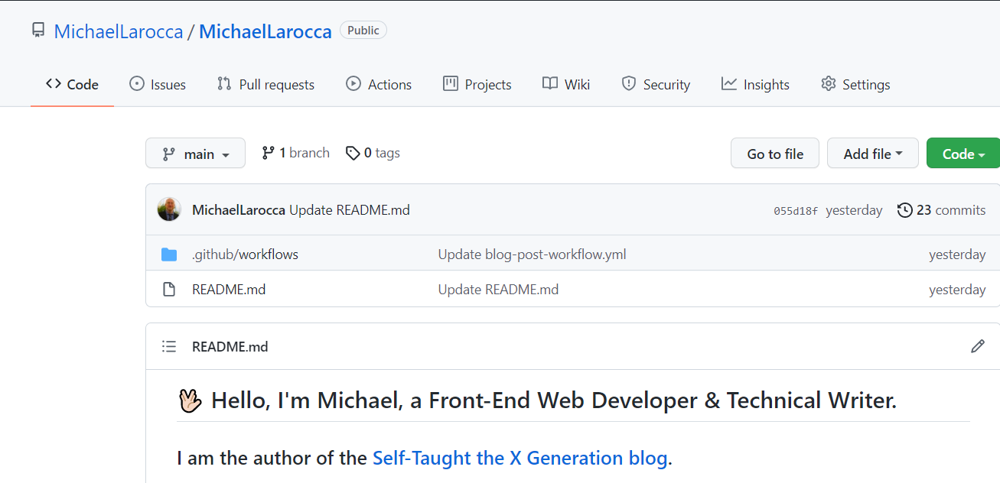
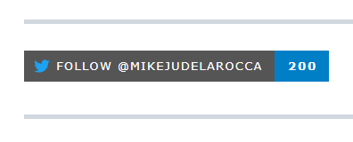

### In this article, Jesse Hall shows us how to take our GitHub profile to the next level by utilizing GitHub Actions to display our latest blog posts, add social links, display the tools we use, and more!

---


---

### About Jesse Hall

Jesse Hall is a full-stack developer with over 20 years of experience in the tech industry.

Jesse creates premium content on his YouTube channel [codeSTACKr](https://www.youtube.com/c/codeSTACKr), and he shares other tech industry experts' content on his [STACKr News](https://www.youtube.com/playlist?list=PLkwxH9e_vrALgl3pq8qb_PSKVO5201z-D) weekly video and [newsletter](https://newsletter.codestackr.com/issues/stackr-news-weekly-what-is-devops-next-js-12-mr-beast-collab-828875). 

---

### Prerequisites

**You need to have a GitHub special repository**. For instructions on how to create a GitHub special repository, you can read my [last article](https://selftaughttxg.com/2021/11-21/ReviewEddieJaoudeGitHubCourse/), where we customized our GitHub profiles with **Eddie Jaoude's** FREE course, "[How to customize your GitHub Profile](https://www.eddiejaoude.io/portal)."

To take our GitHub profiles to the next level, we first need to learn about **GitHub Actions** and **YAML** Files.

---

### GitHub Actions

**What are GitHub Actions?**

**GitHub explains,** *"GitHub Actions makes it easy to automate all your software workflows, now with world-class CI/CD. Build, test, and deploy your code right from GitHub. Make code reviews, branch management, and issue triaging work the way you want."*

[GitHub Actions - Supercharge your GitHub Flow](https://www.youtube.com/watch?v=cP0I9w2coGU&t=17s)

---

### YAML Files

**Wikipedia describes,** *"YAML is a human-readable data-serialization language. It is commonly used for configuration files and in applications where data is being stored or transmitted."*

**GitHub Actions uses YAML syntax to define the events, jobs, and steps.**

* Event
* Job
* Steps
* Actions/commands

The **event** automatically triggers the workflow which contains a job.

The job uses the **steps** to organize the order of the **Actions/commands** to run.

---

**You need to place the YAML files in the repository you are using and create a file structure as follows to put them in:**

```
.github/workflows
```

So for your GitHub profile, you need to go to your **special repository** ( the one that matches your GitHub user name ) and then create the file structure mentioned above.

For my special repository, **MichaelLarocca**, I have my `README.md` file in the root directory and my YAML file inside my`.github/workflows` folder.



---

### Next Level GitHub Profile README (NEW) | How To Create An Amazing Profile ReadMe With GitHub Actions

<iframe width="956" height="538" src="https://www.youtube.com/embed/ECuqb5Tv9qI" title="YouTube video player" frameborder="0" allow="accelerometer; autoplay; clipboard-write; encrypted-media; gyroscope; picture-in-picture" allowfullscreen></iframe>

---
---

### Adding your latest blog posts

Now that we understand **GitHub Actions** and **YAML Files**, it's time to see them in "action" by adding our latest blog posts to our GitHub profiles!

We are going to use "[blog-post-workflow](https://github.com/gautamkrishnar/blog-post-workflow)," which **Gautam Krishna R** created.

---

***Note:*** *You do not have to fork or clone this repository. You only need to set up your folder correctly, copy/edit the YAML file from the blog-post-workflow repository, and add code to your README.md file.*

---

#### Blog post workflow README file

**Following the directions, we are first going to add the following code to our README file:**

```
# Blog posts
<!-- BLOG-POST-LIST:START -->
<!-- BLOG-POST-LIST:END -->
```

---

Next, we will create a new file named **blog-post-workflow.yml** inside of our "**.github/workflows**" folder. Then we are going to copy/paste the following code in the blog-post-workflow.yml file:

```
name: Latest blog post workflow
on:
  schedule: # Run workflow automatically
    - cron: '0 * * * *' # Runs every hour, on the hour
  workflow_dispatch: # Run workflow manually (without waiting for the cron to be called), through the Github Actions Workflow page directly

jobs:
  update-readme-with-blog:
    name: Update this repo's README with latest blog posts
    runs-on: ubuntu-latest
    steps:
      - name: Checkout
        uses: actions/checkout@v2
      - name: Pull in dev.to posts
        uses: gautamkrishnar/blog-post-workflow@master
        with:
          feed_list: "https://dev.to/feed/gautamkrishnar,https://www.gautamkrishnar.com/feed/"
```

---

If you have articles on the "[dev.to](https://dev.to/)" website, all you need to do is edit the feed_list. Also, remove the "gautamkrishnar" website address.

**The new code should look like this:**

```
"https://dev.to/feed/yourname"
```

Replace **yourname** with your dev.to name; mine is "michaellarocca."

---

**That's it! Now we will run the code by selecting the "Actions" tab of your special repository, selecting "Latest blog post workflow," and then clicking "Run workflow."**  

---


 
---

**You will see a yellow light that indicates the GitHub Action is running.**

---


---

The code in the YAML file pulls the five most recent articles you posted on the "[dev.to](https://dev.to/)" website every hour and then lists them as links between the `<!-- BLOG-POST-LIST:START -->` and `<!-- BLOG-POST-LIST:END -->` HTML tags.

```
# Blog posts
<!-- BLOG-POST-LIST:START -->
<!-- BLOG-POST-LIST:END -->

```

---

Now, go to your GitHub profile and refresh the page.


---

### Options

This workflow has additional options that you can use for customization. Just adjust the YAML file, following the instructions on the "blog-post-workflow" [README](https://github.com/gautamkrishnar/blog-post-workflow).

---

### Popular Sources

If you do not have articles on the Dev.to website, the following list contains other sources you can use! Just adjust the YAML file, following the instructions on the "blog-post-workflow" [README](https://github.com/gautamkrishnar/blog-post-workflow).

**Some popular blogging platforms and their RSS feed URLs:**

* Dev.to
* Wordpress
* Medium
* Medium (Sub Domain)
* Stackoverflow
* StackExchange
* Ghost
* Drupal
* Youtube Playlists
* Youtube Channel Video list
* Anchor.fm Podcasts
* Hashnode
* Google Podcasts
* Reddit
* Analytics India Magazine
* Feedburner
* Tumblr
* Blogger

---

### UPDATE: Next Level GitHub Profile README (NEW) | GitHub Actions | Vercel | Spotify

<iframe width="956" height="538" src="https://www.youtube.com/embed/n6d4KHSKqGk" title="YouTube video player" frameborder="0" allow="accelerometer; autoplay; clipboard-write; encrypted-media; gyroscope; picture-in-picture" allowfullscreen></iframe>

---
---

### Adding Social Icons

To add icons to your GitHub profile, Jesse introduces us to [simple-icons](https://github.com/simple-icons/simple-icons).

Following the directions from the [simple-icons](https://github.com/simple-icons/simple-icons) repository, use the following code and replace `[ICON SLUG]` with the icon of your choosing.

---

### CDN Usage

**Directions from the simple-icons repository,** *"Icons can be served from a CDN such as JSDelivr or Unpkg. Simply use the simple-icons npm package and specify a version in the URL like the following:"*

```
<!-- JSDelivr  -->


<!-- Unpkg -->


```

---

**I used the following code to add a LinkedIn icon:**

---

```

```

---

**I then added code Jesse used to customize the layout further:**

---

```

```

---

**For a list of supported icons, use the website: [https://simpleicons.org/](https://simpleicons.org/).**

---

### Adding Language and Tool Icons

To add the language and tool icons, Jesse copied the image address of the individual icons located on GitHub.

In Jesse's second video, he searches JavaScript on GitHub and then copies the image address of the icon:

```
https://raw.githubusercontent.com/github/explore/80688e429a7d4ef2fca1e82350fe8e3517d3494d/topics/javascript/javascript.png
```

In your GitHub profiles README file, create an image tag and add the copied image address to the source attribute as follows:

```

```

---

To add additional icons, create more image tags with the image address of the icon you want. For CSS, replace `/javascript/javascript.png` with `css/css.png`

---

Then, to line the icons horizontally, add the `align="left"` attribute to the image and the width attribute to resize the image in your Markdown file as follows:

```


```

---

***Note:*** *Leave the align="left" off of the last image on your list.*

---

**Here is my list of language and tool icons**


---

### Adding your Twitter follower count

Jesse, in his second YouTube video,  introduces us to [shields.io](https://shields.io/).  Utilizing this website, we will create the code needed to add your Twitter follower count to your GitHub profile Markdown file.

On the [shields.io](https://shields.io/) website's main page, type "**Twitter**" in the search.

---


---

**Next, click on "Twitter Follow." You will now be taken to a page where you can customize the Twitter badge.**

---


---

**Now, fill out the form entering as follows:**

* Your Twitter username
* Style (select a badge of your choice)
* Override color (blue for Twitter)
* Named logo Twitter (to add the icon)

---


---

Finally, click on "**Copy Badge URL**" and choose "**Copy Markdown**."

---

**In your special GitHub README file, paste the copied code and save the file.**

Refresh the page of your GitHub profile, and you will now see your Twitter follower count badge!

---



---

***Be sure to watch both of Jesse Hall's videos to add even more customization to your GitHub profile!***

---

### Summary

**In this article, we took our GitHub profile to the next level by:**

* Adding our latest blog articles
* Adding icons
* Adding our Twitter follower count
* And was introduced to more customization options from Jesse Hall's videos

---

### Jesse Hall Links

* 🔗 [CodeSTACKr website](https://www.codestackr.com/)
* 🔗 [CodeSTACKr YouTube](https://www.youtube.com/c/codeSTACKr/featured)
* 🔗 [freecodecamp articles](https://www.freecodecamp.org/news/author/jesse/)
* 🔗 [Twitter: @codeSTACKr](https://twitter.com/@codeSTACKr)

---

***Want to learn more about Jesse Hall? Check out my [Teacher Feature: Jesse Hall (codeSTACKr)](https://selftaughttxg.com/2021/02-21/TeacherFeature_JesseHall/) article!***

---

### Conclusion

Not only is GitHub a provider of internet hosting for software development and version control, but it has also turned into a social platform. It is in our best interest as developers to customize our profiles to help us stand out from the crowd.

By customizing our GitHub profile using icons, we can visibly display the languages and tools we use and offer attractive links to our other social platforms.  

Utilizing GitHub Actions, we can further enhance our profiles by scheduling updates, such as displaying our latest blog posts.

---

###### Are you now interested in customizing your GitHub profile? Have you already customized your GitHub profile? Please share the article and comment!

---