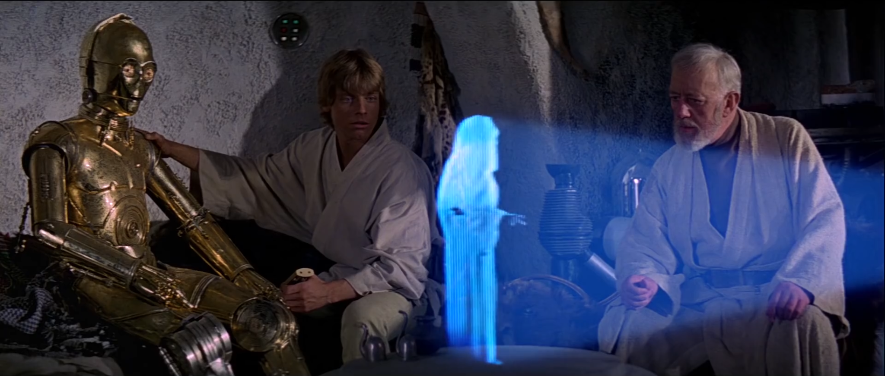

### In this climactic conclusion of the Hacktoberfest 2021 article series, I seek guidance from the teachings of a CSS Master in "A NEW HOPE" to create my first ever contribution before Hacktoberfest ends!

---


---

In the last [issue](https://selftaughttxg.com/2021/10-21/MyFirstHacktoberfestContribution/), I documented my first contribution to a Hacktoberfest repository, the "[weekly-web-dev-challenge-poll](https://github.com/lkrryba/weekly-web-dev-challenge-poll/)".

All of the steps I took to fork, clone, create a branch, and create a pull request were correct. However, the repository creator refused my pull request due to problematic issues arising from the code I wrote.

In this article, I will document the creation of my new pull request.

---


---


---

### A new approach

**The issue I was assigned was to add icons to the hyperlinks on the footer of the web pages.**

The approach I took to add the icons was first to surround each hyperlink in a Font Awesome `<i>` tag and then add CSS classes to the `<i>` tags.

---

```html
<i class="fab fa-twitter"><a rel="noopener" href="https://twitter.com/scrimba">Twitter</a></i>
```

---

Here are instructions on the topic provided by the Font Awesome website: [Basic Use](https://fontawesome.com/v5.0/how-to-use/on-the-web/referencing-icons/basic-use)

---

**However, in this particular project, this approach leads to issues with both styling and positioning.**

---

For website design layouts, my main go-to person is Jedi Master, I mean,  CSS Master [Kevin Powell](https://www.kevinpowell.co/).

*"Help me CSS Master Kevin Powell. I need a new approach!"*

---



*All rights reserved by Disney and Lucasfilm.*

---

### CSS Master Kevin Powell

Since I knew I wanted to work with Font Awesome Icons, I searched YouTube for "Font Awesome social media icons."

When I found Kevin Powell's [Setting up Font Awesome icons as pseudo-elements](https://www.youtube.com/watch?v=lMBa7gLWyO4&t=361s), I knew "**this was the tutorial I was looking for.**"

---


*All rights reserved by Disney and Lucasfilm.*

---

### Kevin's YouTube tutorial

In Kevin's YouTube tutorial, he encourages us to stray away from the "**quick and easy path**" of creating empty elements.

Kevin explains in this particular case of adding icons, *"It's not really a piece of content; it's a visual aid that is not important to the content itself."*

Kevin then directs us to the advanced section of the Font Awesome website and advises us to use [CSS Pseudo-elements](https://fontawesome.com/v5.15/how-to-use/on-the-web/advanced/css-pseudo-elements) instead of creating HTML elements to add the icons to.

---

<iframe width="956" height="538" src="https://www.youtube.com/embed/lMBa7gLWyO4" title="YouTube video player" frameborder="0" allow="accelerometer; autoplay; clipboard-write; encrypted-media; gyroscope; picture-in-picture" allowfullscreen></iframe>

---
---

### CSS Pseudo-elements

To understand what pseudo-elements are, let's look at the definition provided by [w3schools](https://www.w3schools.com/css/css_pseudo_elements.asp).

---

*"A CSS pseudo-element is used to style specified parts of an element."*

*-w3schools*

---

**The pseudo-element "we are looking for" is the before.**

---

#### CSS - The ::before Pseudo-element

*The ::before pseudo-element can be used to insert some content before the content of an element.*
*The following example inserts an image before the content of each `<h1>` element.*

```css
h1::before {
  content: url(smiley.gif);
}
```

*-w3schools*

---

### The new approach

**The new approach of utilizing the before pseudo-element allows me to add the icons to the hyperlinks without the need to write/add additional HTML!**

---

*When changing the HTML on your project is not an option, we can leverage a feature of CSS to add icons to a page. CSS has a powerful feature known as Pseudo-elements. Font Awesome has leveraged the ::before pseudo-element to add icons to a page since the very beginning.*

*-Font Awsome*

---

**This solution is perfect for me since adding HTML elements caused design layout and styling issues. Also, with this new approach, I will not have to write additional CSS code for the media queries!**

---

### Using the ::before Pseudo-element

**Step 1**

According to the advanced Font Awesome documentation, the first step to using the **::before** Pseudo-element to add icons is to write/add this CSS code which creates an **icon** class and selects the **before pseudo-element**.

```css
/* Step 1: Common Properties: All required to make icons render reliably */

 .icon::before {
    display: inline-block;
    font-style: normal;
    font-variant: normal;
    text-rendering: auto;
    -webkit-font-smoothing: antialiased;
    margin-right: 5px;
  }
```

( Note: I added the margin-right: 5px )

**Step 2**

Now that we have the "**.icon::before**" class to take care of the common CSS properties that apply to all icons, it's time to add the individual icons we are looking for.

The following CSS code adds the needed **Font Awesome** font family and the **Unicode** required for the content.

```css
.twitter::before {
    font-family: "Font Awesome 5 Brands"; content: "\f099";
  }
```

---

***The image below shows the Font Awsome Brand Styles for Twitter, which includes the Unicode f099.***

---


---

**Step 3**

Finally, find the tag you want to add the Twitter icon to in the HTML code and add both the **icon** and **twitter** class ( class="icon twitter" ).

---

```html
<a rel="noopener" href="https://twitter.com/scrimba" class="icon twitter">Twitter</a>
```

---

We have now successfully added the Twiter icon to the Twitter hyperlink without adding any additional HTML elements! We just had to add the **icon** and **twitter** class to the anchor `<a>` tag with the Twitter hyperlink.

---

### Some fine-tuning

**All was well with the new approach of utilizing the before pseudo-element to add the rest of the Font Awesome icons until I reached the Podcast icon; it did not work!**

*If an individual icon does not work for you, read and look through the entire Font Awesome [advanced section](https://fontawesome.com/v5.15/how-to-use/on-the-web/advanced/css-pseudo-elements). Reading this documentation helped me to resolve the Podcast icon issue.*

I resolved the issue of the Podcast Font Awesome icon not working by changing the CSS  font-family from "Font Awesome 5 **Brands**" to "Font Awesome 5 **Free**," and adding font-weight "**900**."

---

```css
.podcast::before {
    font-family: "Font Awesome 5 Free"; content: "\f2ce";
    font-weight: 900;
  }
```

---

### Scrimba logo

**To add the Scrimba logo, I also used the new approach of utilizing the before pseudo-element.**

However, there is a catch. As discussed in my last article, there is no Font Awesome icon for Scrimba. So I had to add it to add the Scrimba logo by other means.

**I added the Scrimba logo to the hyperlinks by using a transparent png file.**

I tweaked the previous code I wrote to help a fellow Scrimba student with [a past Scrimba weekly web dev challenge](https://codepen.io/Michael_Larocca/pen/MWebNev?editors=0100) when she wanted to add a Spotify logo to each song title in a list.

---

```css
.scrimba-logo::before {
	content: "";
	display: inline-block;
	height: 11px;
	width: 15px;
	background-size: 15px;
	background-image: url("imgs/SVG-Scrimba-Logo.png");
	background-repeat: no-repeat;
	margin-right: 5px;
	}
```

---

### Create the new pull request

Now that the coding was complete, it was time to commit and push my branch, as detailed in my last article.

**Then, the unthinkable happened, I received another GitHub push error!**

---


*All rights reserved by Disney and Lucasfilm.*

---

This can't be happening! I went through all of the possible GitHub push error problems until I understood what I was doing wrong. When I got it working, I even wrote a troubleshooting section in the previous article! "**It's not my fault!**"

---

Here is the issue. On my branch, on my local computer, I wrote all of the code **BEFORE I created the upstream** to the forked GitHub repository in my account.

```
git push --set-upstream origin MichaelLarocca
```

When I tried to create the upstream, it did not work! I received a message stating something along the lines of my local branch being ahead of the remote and trying git pull first.

---

**Troubleshooting**

I then used "**Fetch**" to update my forked repository on my GitHub account to once again be in sync with the current state of the creator's repository in their account.

Then I used git pull on the main branch of my local repository and then switched to my MichaelLarocca branch and merged it. I then tried to create the upstream again, and it still did not work!

---

*I resolved the "not being able to set the upstream" problem by just starting over.*

**To resolve the issue, I once again cloned and downloaded the forked repository from my GitHub account. I then created a new branch, "MichaelJudeLarocca," switched to it, and then created the upstream before writing any additional code to it.**

Once the upstream was established, I was then able to write additional code to the newly created branch and push it up to my GitHub account repository without any further incident.

---

### Submit the pull request

Now, with my Hacktoberfest quality contribution "**locked and loaded**," it was time to take my shot and submit my pull request to be merged.


*All rights reserved by Disney and Lucasfilm.*

---

### My pull request was accepted!

---

*Excellent work, thank you Michael! Closes #55*

*-Leanne*

---


---


---

### Your first step into a larger world

For Hacktoberfest 2021, if you learned how to register, participate, and create just one quality contributing pull request, or if you created a repository and accepted a pull request for the first time, it is a grand achievement you should be proud of!

**You've taken your first step into a larger world, contributing to open source!**

---


*All rights reserved by Disney and Lucasfilm.*

---

***Learn how to make a CSS Only Lightsaber with the Kevin Powell YouTube tutorial: [CSS Only Lightsaber (with sound?!?!)](https://www.youtube.com/watch?v=CBw9-K6hYVA)***

***Learn more about Kevin Powell in my article: [Teacher Feature: Kevin Powell](https://selftaughttxg.com/2021/05-21/TeacherFeature-KevinPowell/)***

***Learn more about Scrimba's Weekly Web Dev Challenge in my article: [Review: Scrimba's Weekly Web Dev Challenge](https://selftaughttxg.com/2021/01-21/ReviewScrimbaWebDevChallenge/).***

---


*All rights reserved by Disney and Lucasfilm.*

---

### Conclusion

The Hacktoberfest 2021 article series covered registering for the event if you are a participant or hosting a repository, step-by-step instructions on forking, cloning, creating a branch, and how to make a quality contributing pull request.

Programmers who participate in Hacktoberfest learn to collaborate in open-source projects, which is an essential skill needed to become a professional developer.

Hacktoberfest is a fun seasonal event that brings awareness to open source and encourages us to contribute to projects. But be mindful, open-source projects are available to contribute to all year round!

Even though Hacktoberfest 2021 has come to an end, "REMEMBER, OPEN SOURCE WILL BE WITH YOU, ALWAYS!"
