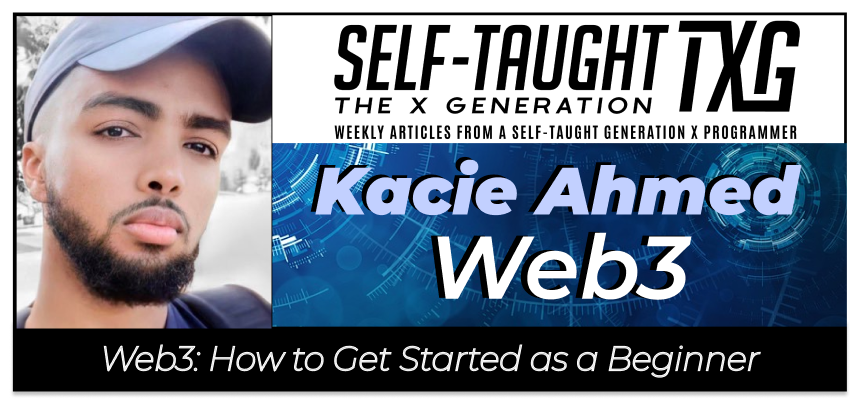
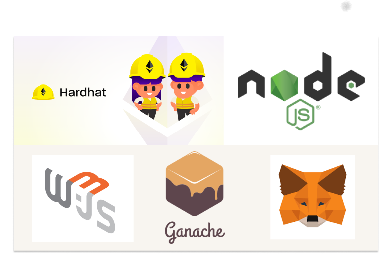
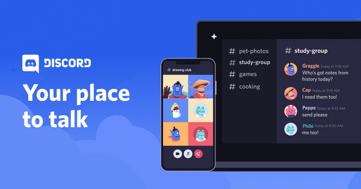
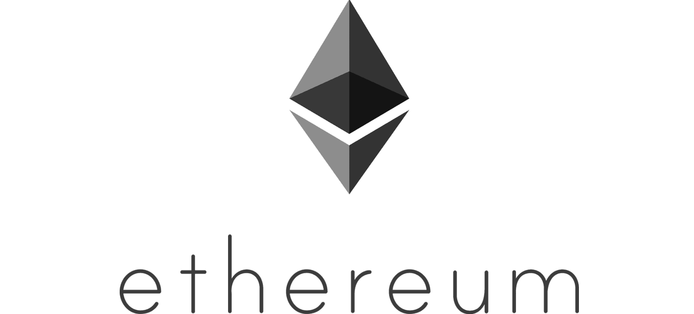

### In this article, Tech Twitter celebrity Kacie Ahmed teaches us how to get started in Web3 development by providing the libraries and frameworks to use, practice projects, tutorials to watch, and more!

---

---

### About Kacie Ahmed

Kacie is a freelance developer with experience in advanced technologies, such as Web3, Solidity, smart contracts, and Decentralized settlement platforms on Blockchain.

Kacie is also a top 1% Tech Twitter Space host with over 12k followers, and he holds a Bachelors's degree from York University in Toronto, Ontario.

Kacie believes cryptocurrencies and the underlying blockchain technology will change the world. He envisions this tech industry's direction as his best opportunity to help make a change for a brighter future.

---

---

### What is Web3?

**To better understand the concept of Web3, let's take a look at Web1 and Web2.**

#### Web 1.0

**Wikipedia describes,** *"Web 1.0 is a retronym referring to the first stage of the World Wide Web's evolution, from roughly 1991 to 2004.*

**Wikipedia further describes** that Web 1.0's vast majority of users simply acted as consumers of content and that personal web pages were common, consisting mainly of static pages.

---

#### Web 2.0

**Wikipedia describes,** *"Web 2.0 Although the term mimics the numbering of software versions, it does not denote a formal change in the nature of the World Wide Web, but merely describes a general change that occurred during this period as interactive websites proliferated and came to overshadow the older, more static websites of the original Web."*

**Wikipedia continues,** *"A Web 2.0 website allows users to interact and collaborate with each other through social media dialogue as creators of user-generated content in a virtual community. This contrasts the first generation of Web 1.0-era websites where people were limited to viewing content in a passive manner."*

---

#### Web3

**Wikipedia explains,** *"Web3, also known as Web 3.0, is an idea for a version of the Internet that is decentralized and based on public blockchains. The concept gained popularity in 2020 and 2021 with interest from cryptocurrency enthusiasts and investments from high-profile technologists and companies."*

---

### Why learn Web3?

**To reiterate Web1, Web2, and Web3 in Kacie's words:**

* Web1 was the "read-only" era
* Web2 was the social media revolution
* Web3 is decentralization, the next jump in how people use the internet

**Now that we understand the technical aspects of Web3, why would we want to learn it?**

**Kacie tells us,** "Web3 is a great opportunity for those of us who are ambitious. Other fields in tech are tight and established. Web3 is a vast frontier."

**Kacie elaborates,** "Because Web3 is new, there is a greater opportunity to rise to the top and become a thought leader."

**Kacie then provides an eye-opening statement to make his point clear,** "Imagine how hard it would be to get in a room with [Mark Zuckerberg](https://en.wikipedia.org/wiki/Mark_Zuckerberg). In Web3, the giants of the space are still accessible. Some of them sit in Twitter Spaces."

---

### Kacie's actionable steps to learn Web3

Kacie first advises to "**know what you are getting yourself into**" before worrying about languages and courses. He then provides an informative YouTube video that put him on the right path: [How to become a blockchain developer in 2021](https://www.youtube.com/watch?v=OwSl2xwl2-w)

---

<iframe width="956" height="538" src="https://www.youtube.com/embed/OwSl2xwl2-w" title="YouTube video player" frameborder="0" allow="accelerometer; autoplay; clipboard-write; encrypted-media; gyroscope; picture-in-picture" allowfullscreen></iframe>

---
---

### Languages

Next, Kacie instructs us to learn the basics of [JavaScript](https://en.wikipedia.org/wiki/JavaScript) and [Solidity](https://en.wikipedia.org/wiki/Solidity), as they are the two main languages for [blockchain](https://en.wikipedia.org/wiki/Blockchain) development on [Etherume](https://en.wikipedia.org/wiki/Ethereum).

Solidity is used to make [smart contracts](https://en.wikipedia.org/wiki/Smart_contract), and JavaScript is used for interacting with smart contracts.

---

### Libraries & Frameworks

**Here is Kacie's list of frameworks you'll need to download and why:**

* Node.js/NPM - Runs JavaScript
* Hardhat - Useful framework
* MetaMask - Your Ethereum wallet
* Ganache - Your localhost blockchain
* Web3.js - Connects sites to blockchain

---

---

### Projects

**Kacie provides us with four projects we can complete and add to our web3 portfolio in less than a week:**

1. [Issue your first coin (cryptocurrency)](https://github.com/BlockDevsUnited/TokenTutorial)
2. [Build your fist DApp](https://github.com/BlockDevsUnited/BasicFrontEndTutorial)
3. [Deploy your first NFT](https://github.com/BlockDevsUnited/NFT-Tutorial)
4. [Create your own NFT marketplace](https://dev.to/dabit3/building-scalable-full-stack-apps-on-ethereum-with-polygon-2cfb)

---

#### *The first three projects listed are available on GitHub. The fourth project is a blog post tutorial.*

---

### Project 1

[Issue your first coin (cryptocurrency)](https://github.com/BlockDevsUnited/TokenTutorial)

**Issue an ERC-20 token with Remix and Metamask**

In this step-by-step tutorial you will learn how to issue and play with your own ERC-20 token on Ethereum. This tutorial can be completed by people with no blockchain programming experience and novice programmers.

---

### Project 2

[Build your fist DApp](https://github.com/BlockDevsUnited/BasicFrontEndTutorial)

**Create An Ethereum Dapp with Ethersjs**

This is a step-by-step tutorial on how to create a front end, deploy a Solidity smart contract, and connect them together. We will use Metamask, Remix IDE and Ethersjs.

---

### Project 3

[Deploy your first NFT](https://github.com/BlockDevsUnited/NFT-Tutorial)

**NFT-Tutorial**

Deploy an NFT project on Ethereum.

---

### Project 4

[Create your own NFT marketplace](https://dev.to/dabit3/building-scalable-full-stack-apps-on-ethereum-with-polygon-2cfb)

Building a Full Stack NFT Marketplace on Ethereum with Polygon.

---

---

### Join a development group

Once you have completed a few of the projects listed above, Kacie advises us to create Web3 projects on our own.

Kacie knows from experience it can be a difficult task to create Web3 projects on our own without guidance, so he recommends we join a Web3 development group.

Kacie provides us with a really good Web3 development [Discord](https://discord.com/) group called [BDU - Block Devs United](https://t.co/LwuEV6WIHB).

---

### Know the lingo of Web3

When you reach a comfortable level working with Web3 and are ready to engage with development groups, Kacie created a [Twitter thread](https://twitter.com/haezurath/status/1452666439018631168?s=21) of common words used in Web3 that we should know.

---

***Definitions according to https://www.merriam-webster.com/***

**Fungible:** being something (such as money or a commodity) of such a nature that one part or quantity may be replaced by another equal part or quantity in paying a debt or settling an account.

**Non-fungible:** a unique digital identifier that cannot be copied, substituted, or subdivided, that is recorded in a blockchain, and that is used to certify authenticity and ownership (as of a specific digital asset and specific rights relating to it).

**NFTs:** are NON-FUNGIBLE TOKEN'S

**Blockchain:** a digital database containing information (such as records of financial transactions) that can be simultaneously used and shared within a large decentralized, publicly accessible network.

---

##### *[Ethereum](https://en.wikipedia.org/wiki/Ethereum) is a decentralized, open-source blockchain with smart contract functionality. Ether (ETH or Ξ) is the native cryptocurrency of the platform.*

---

***Definitions in Kacie's words***

**ERC20** ERC20 coins are fungible tokens (e.g. Bitcoin).

**ERC721:** ERC721 coins are non-fungible tokens (e.g. NTFs).

**ERC 1155:** ERC 1155 is a hybrid between ERC20 and ERC721. They are tokens that support fungible and non-fungible coins alike.

**Wallets:** Wallets (crypto-wallets) are essentially applications that manage your private and public keys. These are used to send and receive crypto-currency and NFTs.

**DApps:** DApps are decentralized applications. Basically, any app that's connected to the blockchain instead of a central web server.

**DAO (Decentralized Autonomous Organization):** Unlike regular organizations (e.g. Google), DAOs are governed by transparent rules that are encoded by smart contracts. These rules are visible to all.

**Layer2:** Layer2 is a term that describes solutions that handle transactions OFF the main Ethereum blockchain. These solutions (e.g. ParaState) are useful because as the blockchain becomes busier, fees go up, so handling transactions off the main network is cheaper.

**ETH 2.0:** ETH 2.0 refers to Ethereums's future "Serenity" patch that will transition Ethereum from "Proof of Work" to "Proof of Stake," drastically reducing carbon footprint.

---

---

### Start networking

#### Twitter Spaces

Kacie, as a Web3 developer, receives multiple paid offers weekly! He tells us that most of the paid offers are sourced from Twitter Spaces.

In Twitter Spaces, Kacie has networked with celebrities; recently, [Elon Musk](https://mobile.twitter.com/elonmusk) attended one!

At this time, Kacie credits Twitter Spaces as the number one place to meet Web3 clients.

---

### The Metaverse

**Wikipedia explains,** *"The metaverse is a hypothesized iteration of the internet, supporting persistent online 3-D virtual environments through conventional personal computing, as well as virtual and augmented reality headsets. Metaverses, in some limited form, are already present on platforms like VRChat or video games like Second Life."*

**Kacie tells us that the metaverse is a decentralized community that is large and booming right now. Money is being made there, and it has caught the attention of very important people.**

---

<iframe width="853" height="480" src="https://www.youtube.com/embed/b9vWShsmE20" title="YouTube video player" frameborder="0" allow="accelerometer; autoplay; clipboard-write; encrypted-media; gyroscope; picture-in-picture" allowfullscreen></iframe>

---
---

**To network in the metaverse, Kacie informed us of unspoken rules of conduct to follow:**

* Do not self promote
* Match the vibe of the conversation
* Do not force introducing yourself and speaking ( wait for the opportunity )

Kacie tells us that if we follow the rules of conduct he provided, we will most likely receive direct messages from clients seeking our services and hiring us as developers.  

---

**However, Kacie warns us of scammers. Scams are big in the space, and it is up to us to decipher who is legit and who is not.**

**Kacie provides us with what he considers to be a good offer:**

* They mention paying right away
* They want to schedule a zoom call
* They are willing to make milestone payments

---

### Building in public

**Ah yes, "building in public/having an online presence" seems to be a recurring phenomenon that consistently provides developers with monetary opportunities.**

So it is no surprise to me to learn that Kacie credits his "**Building in public**" to provide monetary opportunities for him.

**The topic of building in public and having an online presence is vast, and I have written several articles on the topic, including:**

* [The Importance of Learning in Public](https://selftaughttxg.com/2021/08-21/TheImportanceOfLearningInPublic/)
* [Shawn Wang (Swyx): Actionable tactics that will help you to become hireable](https://selftaughttxg.com/2021/07-21/Swyx-ActionableTactics/)

---

### Resources

**Kacie ends with a list of resources that he wished he knew about early in his Web3 learning journey:**

* Polygon
* Learn and Earn
* Etherscan
* Documentation

**Polygon** is a protocol and a framework for building and connecting Ethereum-compatible blockchain networks. Aggregating scalable solutions on Ethereum supporting a multi-chain Ethereum ecosystem.

**Learn and Earn**, Kacie tells us, are websites that pay you to learn Web3.

**Etherscan** allows you to explore and search the Ethereum blockchain for transactions, addresses, tokens, prices, and other activities.

**Documentation:** Kacie advises us to read the documentation on [Openzeppelin.com](https://docs.openzeppelin.com/), as most smart contracts you deploy will import from existing ones on that website.

---

### Kacie's upcoming events

***Would you like to learn more about Kacie and Web3 from him? Be sure to check out his upcoming events!***

**Nov 30, 2021:** [Francesco Ciulla: Blockchain and web3 | Kacie Ahmed](https://www.youtube.com/watch?v=nMimDaiOTv4)

**Date to be announced** [The Scrimba Podcast](https://scrimba.com/podcast/)

**Kacie also regularly hosts Twitter Spaces, so be sure to look out for them and join in on the conversations!**

---

<iframe width="956" height="538" src="https://www.youtube.com/embed/nMimDaiOTv4" title="YouTube video player" frameborder="0" allow="accelerometer; autoplay; clipboard-write; encrypted-media; gyroscope; picture-in-picture" allowfullscreen></iframe>

---
---

### Kacie's Links

* 🔗[Twitter](https://twitter.com/Haezurath)
* 🔗[LinkedIn](https://www.linkedin.com/in/kacie-ahmed-2a8b5b171/)

---

### Conclusion

Web3 is a vast new frontier. Becoming a Web3 developer will provide you with many opportunities, including monetary, help you visibly stand out from other developers in the crowd, and potentially network with giants in the industry.

Joining development groups, such as the Block Devs United on Discord and participating in Twitter Spaces like Kacie hosts regularly will give us the help and support needed to become successful Web3 developers.

---

###### Are you now interested in becoming a Web3 developer? Have you already learned Web3 and successfully created projects? Please share the article and comment!

---
