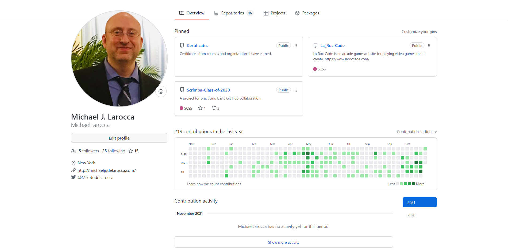
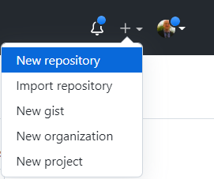
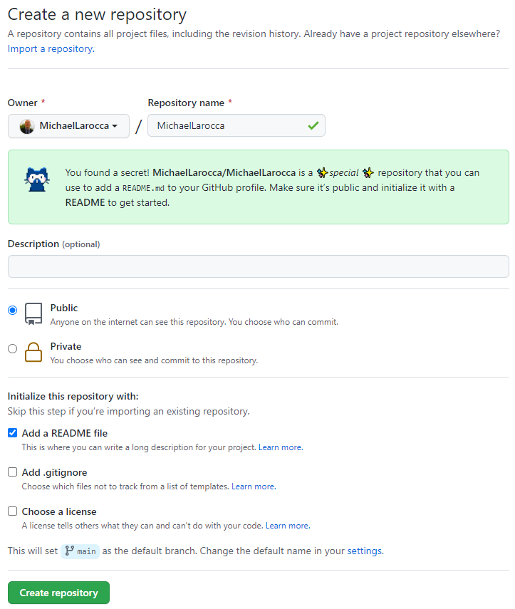
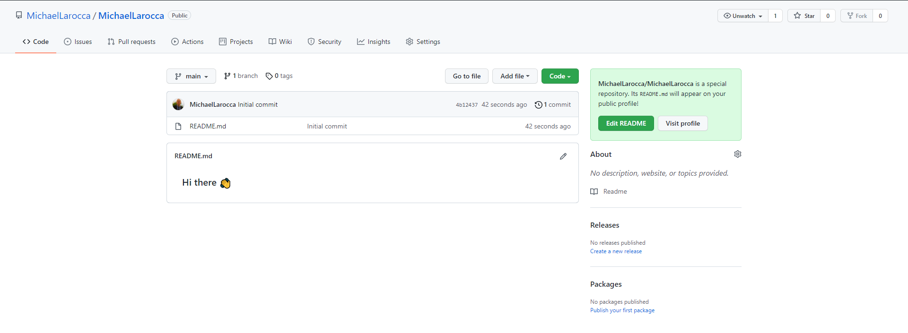
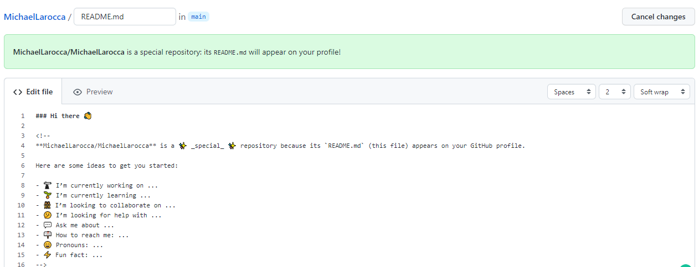
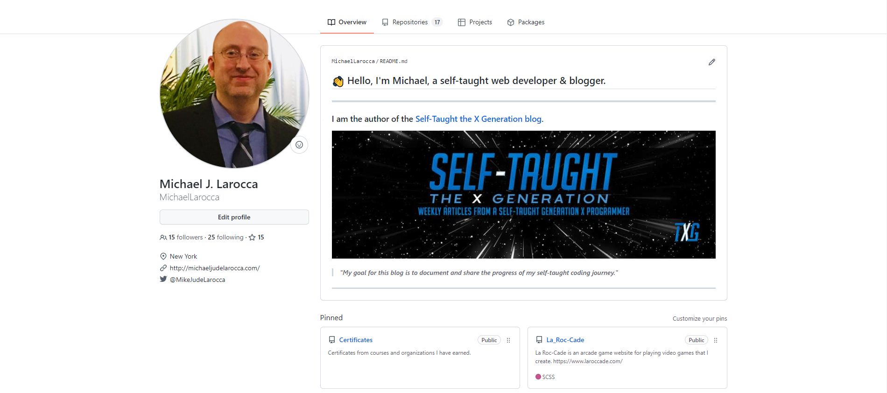
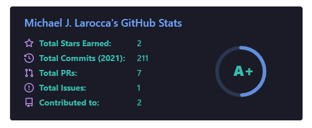
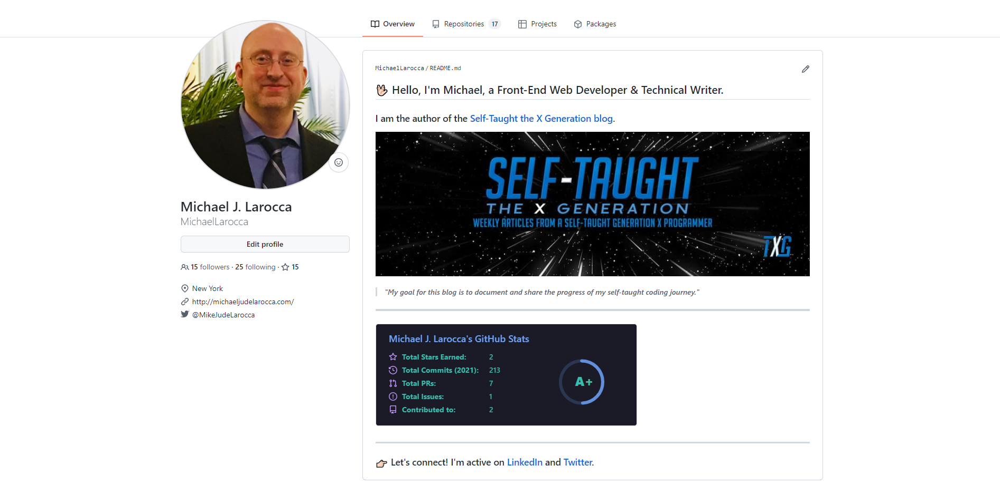

### We spent a lot of time on GitHub participating in Hacktoberfest 2021. But did you know you can customize your GitHub profile? In this article, Eddie Jaoude shows us how to make our profiles stand out!

---


---

### About Eddie Jaoude

Eddie Jaoude is a full-stack developer and an advocate for open-source.
He is also the founder of the [Eddie Hub Community](https://github.com/EddieHubCommunity).

Recognizing his contributions and influence in the open-source community, Eddie was nominated as a [GitHub Star](https://stars.github.com/profiles/eddiejaoude/)!

[Introducing the GitHub Stars Program ⭐️](https://github.blog/2020-09-03-introducing-the-github-stars-program/)

---


#### *Meet Hubber! EddieHub's Mascot! 🤝*

---

### Why you should customize your GitHub Profile

**Eddie tells us, GitHub has turned into a social platform. With over 55 million users, it is in our best interest to customize our profiles to help us stand out from the crowd.**

Not only does our GitHub profile showcase our portfolio, skills, and contributions, our portfolio can also present our other content, such as Youtube videos, blog posts, and more!

To give us examples of what a customized GitHub profile can look like, Eddie provides us with a link to [Awesome GitHub profiles](https://github.com/EddieHubCommunity/awesome-github-profiles), which is part of his [EddieHubCommunity](https://github.com/EddieHubCommunity).

---

***Eddie Tips: Create a GitHub username as close as you can to your actual name. Doing so will make it easier for others to discover you from other platforms.***

---

### Here is my current GitHub profile before any changes



---

### To customize your GitHub Profile

Eddie's course provides instructions on creating a GitHub account if you have not already set one up. As I already have a GitHub account, I will skip to first step of creating it.

**To customize your GitHub Profile, you first need to create a new repository. The newly created repository needs to be the same name as your GitHub username.**

---

*Eddie provided step-by-step instructions that I will follow now.*

---

### Create a new repository

The first step is to create a new repository in our GitHub account by clicking the plus symbol, located at the top right, and then click New Repository.



---

### The next step is to name the repository

**Important:** You need to use your GitHub user name as the name for this repository. ( **Owner** must match **Repository Name** )

***You will know you did it correctly when a special message appears! Make sure to follow the instructions in the special message next.***



---

**Special message instructions**

* Make sure Public is selected
* Click the Add a README file

After naming the repository and following the special message instructions, click "**Create repository**."

---

### Your New Repository

You will be taken to your new repository after clicking "**Create repository**."



**Your new repository is a special Markdown file that will appear on your profile page on GitHub.**

---

To edit this special Markdown file, click on the edit button that resembles a pencil.



Feel free to make changes to the file by following the suggested ideas to get you started.

Click on the **Preview** tab to see the results of your changes, and then click the **Commit changes** button when you are satisfied.

---

*Here are the changes I made:*

```md
### 👋 Hello, I'm Michael, a self-taught web developer & blogger.
```

---

**Important:** In order to commit your changes, you will need to make changes to the special Markdown. The **Commit changes** button is inactive until changes are made to the file.

---

Eddie's course also teaches you how to write in the [Markdown](https://en.wikipedia.org/wiki/Markdown) language, which is needed to customize your GitHub profile.

---

***To learn more about writing Markdown files, you can read my article: [Learn Markdown, With Scrimba & Dylan Israel!](https://dev.to/michaellarocca/learn-markdown-with-scrimba-dylan-israel-24ng)***

---

### Your Profile Page

You will now see your new special Markdown file/repository displayed at the top of your profile page.


---

### Eddie's invitation

At this point in Eddie's free "**[How to customize your GitHub Profile](https://www.eddiejaoude.io/portal)**" course, he invites us to take a screenshot of our new profile so far and share it on social media. He instructs us to list two tips we learned and tag him ( **@eddiejaoude** ) so that he can re-share them on his network!

**Steps**

* Write about yourself
* Add images/photos
* Share on your social media



---

***Eddie did share my tweet. I received positive feedback from the community and gained a few new Twitter followers along the way!***

---

### Widgets

Your special GitHub Markdown file that is used to create your custom profile supports Widgets.

**A Widget is a reusable component that allows you to perform a function and access a service.**

Eddie's course provides us with a Widget that you can easily implement with one line of the following HTML code.

*( Just replace my GitHub username with your GitHub username ) Replace "michaellarocca" with your username.*

---

```html

```

---

**This Widget, created by [Anurag Hazara](https://github.com/anuraghazra), is used to display your current GitHub stats.**

Here is the README file for the Widget: [https://github.com/anuraghazra/github-readme-stats](https://github.com/anuraghazra/github-readme-stats)

---



---

### GitHub Actions

Similar to Widgets, you can also use GitHub Actions to customize your profile.

**GitHub describes,** *"GitHub Actions makes it easy to automate all your software workflows, now with world-class CI/CD. Build, test, and deploy your code right from GitHub. Make code reviews, branch management, and issue triaging work the way you want."*

**Here is a link to the GitHub Actions Marketplace** [https://github.com/features/actions](https://github.com/marketplace?category=&query=&type=actions&verification=)

---

*I found a GitHub Action I'm particularly interested in; it creates a list of your latest Hashnode articles!*

[Hashnode Blogs - Github Action](https://github.com/marketplace/actions/hashnode-blog), created by: [Varun Sridharan](https://github.com/varunsridharan)

---

**Eddie mentions during his course that some of the GitHub profile customizations are beyond the scope of the course. I now understand why.**

To implement the "**Hashnode Blogs - Github Action**," you need to learn how to create Github Action's and work with YAML files ( which I have not learned yet ). Now is a good time for me to learn, as I want to display my latest Hashnode blogs on my GitHub profile.

---

*Eddie encourages us to make small adjustments to our GitHub profiles. Even a few small adjustments will help our profiles to stand out. As we continue to learn, we can continue to make more changes to our GitHub profiles later.*

---

### My new GitHub profile

Here is my finished GitHub profile!



**With a few simple adjustments, my GitHub profile will now stand out from the crowd!**

<!--  -->

---

### TXG Review Results:

**5 out of 5 Stars!**

"⭐ ⭐ ⭐ ⭐ ⭐"

---

#### ***"Eddie Jaoude's 'How to customize your GitHub Profile' is a MUST TAKE free course!"***

> *-Michael Jude Larocca*

---

### Eddie's links

* 🔗[Website: eddiejaoude](https://www.eddiejaoude.io/)
* 🔗[GitHub: eddiejaoude](https://github.com/eddiejaoude)
* 🔗[EddieHubCommunity](https://github.com/EddieHubCommunity)
* 🔗[YouTube: eddiejaoude](https://www.youtube.com/c/eddiejaoude)
* 🔗[Twitter: eddiejaoude](https://twitter.com/eddiejaoude)

---

### Advance your career with a 20% discount on Scrimba Pro using this [affiliate link](https://scrimba.com/?via=MichaelLarocca)!

Become a hireable developer with Scrimba Pro! Discover a world of coding knowledge with full access to all courses, hands-on projects, and a vibrant community. You can [read my article](https://selftaughttxg.com/2021/06-21/06-07-21/) to learn more about my exceptional experiences with Scrimba and how it helps many become confident, well-prepared web developers!

###### ***Important:*** *This discount is for new accounts only. If a higher discount is currently available, it will be applied automatically.*

**How to Claim Your Discount:**
1. Click [the link](https://scrimba.com/?via=MichaelLarocca) to explore the new Scrimba 2.0.
2. Create a new account.
3. Upgrade to Pro; the 20% discount will automatically apply.

##### ***Disclosure:*** *This article contains affiliate links. I will earn a commission from any purchases made through these links at no extra cost to you. Your support helps me continue creating valuable content. Thank you!*

---

### Conclusion

With over 55 million users, not only is GitHub a provider of internet hosting for software development and version control, it has turned into a social platform, and it is in our best interest to customize our profiles to help us stand out from the crowd.

Eddie's FREE "How to customize your GitHub Profile" course is so well put together that a complete beginner will be able to customize their profile, helping them to stand out from the crowd before they even learn version control! 

Eddie also teaches Markdown language in his course, which is required to customize a GitHub Profile. Furthermore, Markdown language is also an essential skill for developers to learn for other means, such as writing blog articles like the one you are reading!

---

###### Are you now interested in customizing your GitHub profile? Have you already customized your GitHub profile with widgets and GitHub Actions? Please share the article and comment!

---
