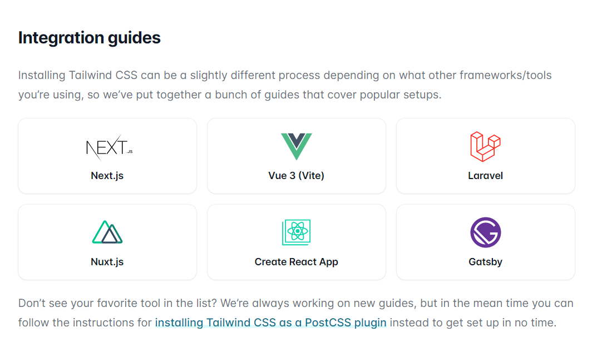

### In this article, Shruti Balasa joins us on a Scrimba Livestream to teach us how to get started with Tailwind CSS, give us further instruction on her YouTube channel Thirus, and introduce her new book!

---


---

### About Shruti Balasa

Shruti Balasa is a full-stack developer with over ten years of experience that has delivered over 200 websites ranging from static to full-fledged social networking and eCommerce websites.

Shruti is also a course creator, tech speaker, and YouTuber.

---

### What is Tailwind?

Tailwind is a customizable utility-first CSS framework that provides you with the ability to style and layout your website by writing code directly in your HTML file.

**Tailwind:**

* Tailwind includes an expertly crafted set of defaults, but everything can be customized
* Easy to be consistent with color choices, spacing, typography, shadows
* Hover and focus states
* Responsive breakpoints
* Use component or template partial to make changes in one place
* automatically removes all unused CSS when building for production
* Tailwind projects ship less than 10kB of CSS to the client
* Now includes a Dark Mode
* Tailwind CSS IntelliSense extension for VS Code

Be sure to check out the [Tailwindcss website: https://tailwindcss.com/](https://tailwindcss.com/) for complete details.

---

### Why use Tailwind?

Shruti tells us that Tailwind is a utility first framework, which means you have a utility for every single CSS property.

Shruti also tells us that, unlike Bootstrap-created websites, Tailwind-created websites do not all look the same.

**Utilizing Tailwind will help you to be more productive:**

* Build websites faster
* More options to customize
* Benefit from just using the framework

---

### Installing Tailwind

You can find detailed instructions to install Tailwind on the [Tailwindcss website](https://tailwindcss.com/).



Shruti also provides video tutorials on setting installing Tailwind on her YouTube channel.

**[Shruti's YouTube channel: Thirus](https://www.youtube.com/channel/UCDQTzZ871T7uJpx9yeMPhAw)**

---

### Try out using Tailwind

You can try out using Tailwind on [play.tailwindcss.com](https://play.tailwindcss.com/).

---

If you would like to "**quick start**" and try out using Tailwind, Scrimba host [Leanne](https://www.youtube.com/c/CodewithLeanne) provides instructions to install Tailwind using Scrimba's platform during the Livestream *(Timestamp 50:00).*

**Add Tailwind to a Scrimba scrim:**

1. Create a new scrim
2. Choose a template
3. Dependencies / Add Module / Tailwind

---

<iframe width="1520" height="585" src="https://www.youtube.com/embed/wjQwOnPWggI" title="YouTube video player" frameborder="0" allow="accelerometer; autoplay; clipboard-write; encrypted-media; gyroscope; picture-in-picture" allowfullscreen></iframe>

---
---

### My Tailwind made profile card


Following along with Shruti's Scrimba Livestream, I created my own Tailwind card using the [play.tailwindcss.com](https://play.tailwindcss.com/) website.

---

*I added my profile picture to the card by adding an HTML image tag with the source set to my GitHub profile image.*

```html

```

---

#### Here is the Tailwind code I wrote to create my profile card.

```html
<div class="w-full min-h-screen bg-gray-100 p-12 grid place-items-center text-gray-700">
  <div class="">
    <div class="p-12 pb-0 bg-white rounded-t-lg text-center md:flex md:justify-between md:items-center md:text-left" >
      <div>
        <h1 class="font-bold text-4xl bg-gradient-to-br from-purple-700 to-pink-700 rounded-b-lg text-transparent bg-clip-text">Michael Larocca</h1>
        <p class="text-lg mt-2 ">Hello, I'm Michael, a Front-End Web Developer & Technical Writer.</p>
      </div>
      <div class="bg-white">
        
      </div>
    </div>
    <div class="p-12 bg-gradient-to-br from-purple-700 to-pink-700 rounded-b-lg md:flex md:justify-between md:items-center md:text-left">
      <div class="text-white mt-1">
        <h2 class="font-bold text-xl">Self-Taught the X Generation</h2>
        <p class="sm">
          I am the author of the Self-Taught the X Generation blog.
        </p>
      </div>
      <a href="#" class="inline-block bg-white mt-4 px-6 py-2 rounded-md font-bold text-gray-700">e-mail me</a>
    </div>
  </div>
</div>
```

---

### CSS as a prerequisite

**How much CSS do you already need to know to use the Tailwind framework?**

Shruti tells us that we should know the fundamentals of CSS and understand how flex-box and grid work.

With an understanding of the CSS fundamentals and the help of an "**autocomplete**" code editor plugin feature, we should be able to pick up learning the Tailwind framework fairly quickly.

Shruti advises us to create several Tailwind projects. She explains during the Livestream that even though the language is vast, you will find yourself using the same common Tailwind code to create your projects.

If you need to find uncommon Tailwind code to complete your project, Shruti shows us how to search the code that we need in the [Tailwind documentation](https://tailwindcss.com/docs).

---

### Fine-tuning in Tailwind

**What if you need to create a pixel-perfect website?**

**During the Livestream, Scrimba host Leanne asks Shruti,** *"What if you're working in an environment where you're given a design that you need to recreate accurately?"*

---

**Shruti tells us we have two options to customize Tailwind:**

* Add the property you need to the config file
* Hardcode the property you need in an "inline-style" fashion

---

**Add the property you need to the config file**

In the code below, Shruti added a new height to the config file by adding a new size **68** and then adding the value of the new size to **300 pixels**.

```javascript
const colors = require('tailwindcss/colors')

module.exports = {
  mode: 'jit',
  theme: {
    extend: {
      height: {
        '68': '300px'
      },
    },
  },
  variants: {},
  plugins: [],
}
```

After adding this code to the config file, the new size 68 is now available to use in your Tailwind project.

---

**Hardcode the property you need in an "inline-style" fashion**

In Tailwind, you can hardcode the property you need in an "**inline-style**" fashion by surrounding the value in brackets.

**This code will set the height to 15.3rem:**

`h-[15.3rem]`

**To try this method, I added the code to my image. It adjusted the height as expected, but it distorted my image in this particular case, so I removed the added code.**

```html

```

---

*Additionally, you can add other CSS properties that are not preconfigured in Tailwind by adding them to the config file. To demonstrate, Shruti shows us in the Tailwind documentation how to add additional fonts.*

---

### Bootstrap vs. Tailwind

The framework Bootstrap in the developer community has a bad reputation. The reason is, a website created with Bootstrap has a distinct look that you can clearly see that it was created with Bootstrap.

**So now that question has come up during the Livestream, does a website made Tailwind look like it was created with Tailwind?**

Fortunately, with the customizable ability demonstrated earlier, a website made Tailwind does not look like it was created with Tailwind.

Shruti then directs us to the Tailwind CSS website, where this question is answered right on the front page.

---


---

### Tailwind is best used with a framework

Shruti explains that since the nature of coding with Tailwind is similar to inline-style, it is best used in conjunction with other frameworks to keep our code organized and clean.

For a list of frameworks to use with Tailwind and for instructions on how to set up your work environment, follow the instructions provided by the [Tailwind documentation](https://tailwindcss.com/docs/installation).

*Shruti also provides instructions for installing Tailwind on her YouTube channel.*

---

### Shruti's YouTube Channel

**To learn how to install Tailwind and much more, be sure to check out [Shruti's YouTube Channel](https://www.youtube.com/c/Thirus)!**

---


---

*"Shruti Balasa introducing her new channel Thirus, which is an effort to bring hundreds of simple web development tips and tutorials together that you as a beginner / newbie can consume regularly on your coding journey. So stay tuned for lots of videos that give you the feeling of - Oh! So that's how it's done!"*

---

### Shruti's new book

**Complete Guide to CSS Flexbox & Grid**

*200+ pages eBook with 70+ real-world examples*

**Become a Pro at building components & layouts with CSS Flexbox and Grid. Learn from a curated list of 70+ real-world use cases and examples. Gain access to Private CodePen links with working demos for all examples.**

*"Don't just learn all the things CSS flexbox and grid can do for you. Instead, learn all the things YOU can do with them."*

---


---

### 25% Discount Code!

#### Discount code: scrimbalive

---

### Shruti's links

* 🔗[Website](https://shrutibalasa.com/)
* 🔗[YouTube](https://www.youtube.com/c/Thirus)
* 🔗[Linkedin](https://www.linkedin.com/in/shrutibalasa/)
* 🔗[Twitter](https://twitter.com/shrutibalasa/)
* 🔗[Facebook](https://www.facebook.com/ShrutiSBalasa/)
* 🔗[Instagram](https://www.instagram.com/shruti_balasa_web_developer/)

---

### Conclusion

Utilizing Tailwind can increase your productivity by providing you with a method to quickly create responsive websites with less code.

If you already have a strong foundation in CSS, Tailwind is a framework that you can pick up and learn rather easily.

With Tailwind's customizable features, you will be able to create pixel-perfect websites that have unique looks.

---

###### Are you now interested in Tailwind? Have you already learned Tailwind and successfully created projects using it? Please share the article and comment!

---