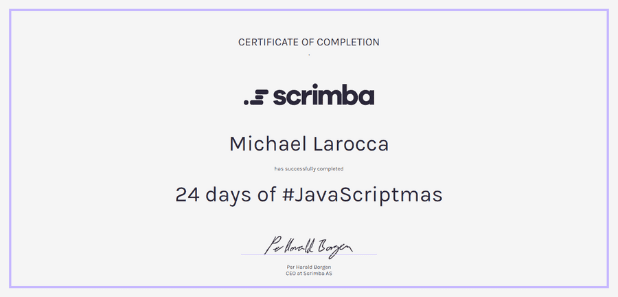

### This article starts off the JavaScriptmas 2021 series! I will be documenting Scrimba's event in this series, including my challenge solutions, coverage of winners, and the Christmas Eve Livestream!

---


---

### What is JavaScriptmas

JavaScriptmas is an annual event created by the online coding school [Scrimba](https://scrimba.com/). All are welcome to join this **FREE** event where you participate in a 24-day "**coding advent calendar**" challenge, solving and submitting your JavaScript solutions.

New challenges are released daily and need to be completed on the Scrimba website's "[24 days of #JavaScriptmas course](https://scrimba.com/learn/javascriptmas2021#)." Also, you need to be registered and submit your solutions by midnight GMT to be eligible to win prizes.

---

### Submit your solutions

**To submit your JavaScriptmas solutions, you have two options:**

* Submit via Twitter
* Submit via Discord

---

**Submit via Twitter**

Once you have completed your solution, you need to share it on Twitter under the **#JavaScriptmas** hashtag by midnight GMT.

**Submit via Discord**

On Scrimba's Discord channel, submit by leaving a link to your solution on the "**javascriptmas-solutions**" channel by midnight GMT.

---

### Prizes

Anyone who has submitted a **valid solution** is eligible for winning prizes.

Each submitted solution is treated as a "**raffle ticket**," so the more JavaScriptmas solutions you complete, the better chance you have to win!

**The prizes include:**

* win a free one-year Pro membership on Scrimba worth $150!
* Grand Prize of $1,000 along with a lifetime Pro membership to Scrimba announced on Christmas Eve!

---

*Full details are availale on [Scrimba's JavaScriptmas page](https://scrimba.com/learn/javascriptmas2021).*

---

<iframe width="837" height="471" src="https://www.youtube.com/embed/CsoujaMhl4g" title="YouTube video player" frameborder="0" allow="accelerometer; autoplay; clipboard-write; encrypted-media; gyroscope; picture-in-picture" allowfullscreen></iframe>

---
---

### Earn a certificate and Discord badge

Upon completing the 24-day "**coding advent calendar**" challenge, you are awarded a Scrimba certificate and an exclusive Discord badge.

---

***I completed last year's JavaScriptmas event. Here is my certificate.***



---

### JavaScriptmas Livestream

The remaining contest winners will be announced during the JavaScriptmas Livestream on December 24th, including the grand prize winner which will be awarded a lifetime Scrimba membership and $1,000!

During last year's JavaScriptmas Livestream, upcoming Scrimba courses were announced, student challenge submissions were highlighted, and several student blog articles were featured, including mine!

---

<iframe width="837" height="471" src="https://www.youtube.com/embed/EfhfoU7oVT0" title="YouTube video player" frameborder="0" allow="accelerometer; autoplay; clipboard-write; encrypted-media; gyroscope; picture-in-picture" allowfullscreen></iframe>

---

**Timestamp: 42:00 - My JavaScriptmas 2020 article**

---

### *Below are my coding solutions to the first four JavaScriptmas challenges!*

---

### Challenge 1

#### Countdown To Christmas

The first JavaScriptmas challenge is to create a "**Countdown To Christmas**." ( I'm creating a Countdown To the JavaScripmas Livestream on December 24th! )

All of the HTML and CSS code is provided and written. You just need to code out the JavaScript.

---

*So my "go-to place" for this kind of JavaScript help is [w3schools](https://www.w3schools.com/JSREF/jsref_obj_date.asp).*

---

Now, to keep things organized, I will leave the instruction remarks provided in the JavaScript file and write the appropriate code under the corresponding remarks.

---

**First, we need to create a JavaScript Date Object.**

```javascript
const todaysDate = new Date();
```

**Information from w3schools:**

#### Date Object

*"The Date object is used to work with dates and times. Date objects are created with new Date()."*

---

**Next, we need to get today's day.**

```javascript
let today = todaysDate.getDate();
```

---

**Finally, we need to calculate the remaining days until Scrimba's JavaScriptmas Livestream on the 24th.**

```javascript
let remainingDays = 24 - today;
```

---

**To display the remaining days, we select the ID of the HTML paragraph tag we want and then set the inner HTML to the remaining days variable.**

```javascript
document.getElementById('countdown-display').innerText = remainingDays;
```

---

**To style the page, I added:**

* Text shadow
* Background image (from pixabay.com)
* Gradient background-color

---


---

### Final code

#### Challenge 1
#### Countdown To Christmas

**Link to the solution: [scrimba.com/scrim](https://scrimba.com/scrim/coa0a4b3fa1f7c1469fc7920b)**

```javascript
const countdownDisplay = document.getElementById("countdown-display")

function renderCountdown(){
    // Task:
    // - Get today's date (you only need the day).
    const todaysDate = new Date();
    let today = todaysDate.getDate();
    
    // - Calculate remaining days.
    let remainingDays = 24 - today;
    
    // - Display remaining days in countdownDisplay.
    document.getElementById('countdown-display').innerText = remainingDays;
}

renderCountdown()
```

---

### Challenge 2

#### Toggle Christmas Theme

**Task:** *Add the functionality to switch between 'Christmas' and 'snow.'*

For this challenge, we need to change the HTML body class from "**Christmas**" to "**snow**" and vice versa.

The HTML and CSS code is all written out for us. To solve the challenge, we just need to target the body class and change the class from "**Christmas**" to "**snow**" when a user selects the appropriate toggle button.

```html
<body class="christmas" id="body">
```

---

To solve the challenge, I first created constant variables using **getElementById** for the **theme**, **radioButtonSnow**, and **radioButtonChristmas**.

I then wrote an event listener for both radio buttons.

When a user clicks a radio button, I use **classList.remove** and then **classList.add** to switch the body theme appropriately.

---

**To style the page, I added:**

* Background Image for the Christmas theme
* Background Image for the snow theme

---


---

### Final code

#### Challenge 2

**Link to the solution: [scrimba.com/scrim](https://scrimba.com/scrim/co13e44988d021d0d1ef8e4d1)**

```JavaScript
const theme = document.getElementById("body");
const radioButtonSnow = document.getElementById("snow");
const radioButtonChristmas = document.getElementById("christmas");

radioButtonSnow.addEventListener('click', ()=>{
    theme.classList.remove("christmas");
    theme.classList.add("snow");    
});

radioButtonChristmas.addEventListener('click', ()=>{
    theme.classList.remove("snow");
    theme.classList.add("christmas");    
});
```

---

### Challenge 3

#### Don't Scare your Relatives!

**Task:**  *Write a function to fix the UI problems with this Christmas message (make it Christmassy!)*

We need to change the scary Halloween theme to a Christmas theme for this challenge.

To solve the challenge, I added an event listener to the "**FIX**" button and wrote a function to change the inner text of the paragraph that displays the themed message.

---

**Note:** The font for the Halloween and Christmas themes is already provided.

---

I wrote the following one line of code to add an event listener to the "**FIX**" button and run the "**fix**" function when the button is clicked.

```javascript
document.getElementById("btn").addEventListener("click", fix);
```

---

I then wrote the following three lines of code inside the **fix** function: the first creates a **greeting** variable ( targeting the paragraph that displays the themed message). Then, the second line of code changes the inner text of the **greeting** variable. In the last line of code, I change the font family from "**Rubik Beastly**" to "**Mountains of Christmas**."

```javascript
function fix() {
  const greeting = document.getElementById("greeting");
  greeting.innerText = "🎄Merry Christmas!🎄"
  greeting.style.fontFamily = "Mountains of Christmas";
}
```

---


---

### Final code

#### Challenge 3

**Link to the solution: [scrimba.com/scrim](https://scrimba.com/scrim/co15a4778919bad3308cc5e49)**

```javascript
document.getElementById("btn").addEventListener("click", fix);

function fix() {
  const greeting = document.getElementById("greeting");
  greeting.innerText = "🎄Merry Christmas!🎄"
  greeting.style.fontFamily = "Mountains of Christmas";
}
```

---

### Challenge 4

#### Shopping Checklist

For this challenge, I had to do some research. I found the information I needed on the [geeksforgeeks](https://www.geeksforgeeks.org/html-dom-input-checkbox-property/) website.

---

I already knew how to create a `<DIV>` and add classes to it in JavaScript:

```javascript
    const item = document.createElement("div");
    item.classList.add("checklist-item", "checklist");
```

---

I did not know how to add a check box element and handle its state and labels in JavaScript.

To create a checkbox in JavaScript, we need to create an `<INPUT>` and set its type to "**checkbox**."
 
```javascript
   // Create checkbox
   const checkbox = document.createElement("input")
   checkbox.type = "checkbox";
```

*( We later assign the name and id within a loop)*

---

**We then create a label for the checkbox in javascript as follows:**

```javascript
   // Create label
   const label = document.createElement("label");
   label.htmlFor = "id";
```

*( We later assign the label to the checkbox within a loop)*

---

The last step is to append the label and the checkbox to a `<DIV>` and then add the `<DIV>` to the body of the document:

```javascript
    // Add the div
    document.body.appendChild(item);
    item.appendChild(checkbox);
    item.appendChild(label);
```

---

**To style the page, I added:**

* Text shadow
* Background image (from pixabay.com)
* Alternating colors via div:nth-child(even)
* Added a Christmas Google font

---

***Note:*** *I had an issue with the strike-through that was already coded. I used code from [css-tricks.com](https://css-tricks.com/almanac/selectors/c/checked/) to rectify it.*

---


---

### Final code

#### Challenge 4

**Link to the solution: [scrimba.com/scrim](https://scrimba.com/scrim/co0a54eebb3e6a888a05f94cf)**

```javascript
const items = ["Candles", "Decorations", "Chocolate", "Egg Nog"];

for(let i = 0; i< items.length; i++) {
    // Create div and add classes
    const item = document.createElement("div");
    item.classList.add("checklist-item", "checklist");

    // Create checkbox
    const checkbox = document.createElement("input")
    checkbox.type = "checkbox";
    checkbox.name = items[i];
    checkbox.id = items[i];
    
    // Create label
    const label = document.createElement("label");
    label.htmlFor = "id";
    const labelText = document.createTextNode(items[i]);
    label.appendChild(labelText);

    // Add the div
    document.body.appendChild(item);
    item.appendChild(checkbox);
    item.appendChild(label);
}
```

---

### JavaScriptmas Winners

A FREE full-year subscription to Scrimba!

* **Day 1: [@betocabadev](https://twitter.com/betocabadev)**
* **Day 2: @zero_ (Discord)**
* **Day 3: @Sid (Discord)**
* **Day 4: [@wonderbarstudio](https://twitter.com/wonderbarstudio)**
* **Day 5: @Eryk (Discord)**

---

### Honorable Mentions

Fellow Scrimba student Dave Collison's awesome solution was featured in the latest Scrimba newsletter!

***Be sure to check it out!***

---


**Link to the solution:** [Dave's scrim](https://scrimba.com/scrim/co6f0444c9e3a87dce375c475?utm_source=convertkit&utm_medium=email&utm_campaign=%F0%9F%97%9E+The+Scrimba+Community+Digest%20-%207129697)

---

*In addition to Dave's solution, daily code submissions are featured daily on Scrimba's [Weekly Web Dev Challenge website](https://weeklywebdevchallenge.scrimba.com/javascriptmas/javascriptmas.html?utm_source=convertkit&utm_medium=email&utm_campaign=%F0%9F%97%9E+The+Scrimba+Community+Digest%20-%207129697)!*

---

#### Be sure to check out my related articles!

* [Review: Scrimba's Weekly Web Dev Challenge](https://selftaughttxg.com/2021/01-21/ReviewScrimbaWebDevChallenge/)
* [Scrimba: JavaScriptmas 2020](https://selftaughttxg.com/2020/12-20/Scrimba-JavaScriptmas_2020/)
* [The Post-JavaScriptmas 2020 Post](https://selftaughttxg.com/2020/12-20/The_Post-JavaScriptmas_2020_Post/)

---

#### **Scrimba has once again impressed and inspired me! You can read my full [Scrimba review](https://selftaughttxg.com/2020/12-20/Review-Scrimba/) on my 12/13/2020 post.**


#### *"That&#39;s one of the best Scrimba reviews I&#39;ve ever read, <a href="https://twitter.com/MikeJudeLarocca?ref_src=twsrc%5Etfw">@MikeJudeLarocca</a>. Thank you! 🙏 "*
###### &mdash; Per Harald Borgen, CEO of Scrimba <a href="https://twitter.com/perborgen/status/1338462544143540227?ref_src=twsrc%5Etfw">December 14, 2020</a></blockquote>

---

### Advance your career with a 20% discount on Scrimba Pro using this [affiliate link](https://scrimba.com/?via=MichaelLarocca)!

Become a hireable developer with Scrimba Pro! Discover a world of coding knowledge with full access to all courses, hands-on projects, and a vibrant community. You can [read my article](https://selftaughttxg.com/2021/06-21/06-07-21/) to learn more about my exceptional experiences with Scrimba and how it helps many become confident, well-prepared web developers!

###### ***Important:*** *This discount is for new accounts only. If a higher discount is currently available, it will be applied automatically.*

**How to Claim Your Discount:**
1. Click [the link](https://scrimba.com/?via=MichaelLarocca) to explore the new Scrimba 2.0.
2. Create a new account.
3. Upgrade to Pro; the 20% discount will automatically apply.

##### ***Disclosure:*** *This article contains affiliate links. I will earn a commission from any purchases made through these links at no extra cost to you. Your support helps me continue creating valuable content. Thank you!*

---

### Conclusion

Scrimba's JavaScriptmas annual FREE event is a wonderful way to commit to coding daily and is a fun and festive event where all participants have an equal opportunity to win prizes, regardless of their skill level.

During the JavaScriptmas event, Scrimba offers new students a 20% discount code through a link provided at the end of each day's coding challenge.

By completing all 24 coding challenges, you will be awarded a certificate and an exclusive Discord badge, and since each submission acts as a raffle ticket, you will have 24 chances to win prizes!

---

###### Are you now interested in participating in this year's Scrimba's JavaScriptmas? Have you already participated in last year's Scrimba's JavaScriptmas? Please share the article and comment! 

---
