#### In this article, the JavaScriptmas event continues! Scrimba announces a new course, a new teacher, and a new Discord feature. I document my solutions and highlight fellow coders from the community!

---


---

### Town Hall announcements

Scrimba, on their Discord channel, holds weekly meetings with the community on their Town Hall channel, previously titled Fire Chat.

**During their last Town Hall, Scrimba made several big announcements:**

* New Scrimba LinkedIn course 
* A new Scrimba teacher ( in a trial stage )
* Discord "Scrim" feature coming soon

---

### Upcoming new Scrimba course announced!

Randall Kanna (@RandallKanna) will be teaching Scrimba's upcoming **LinkedIn course**!

When released, the upcoming course will become part of [Scrimba's Frontend Developer Career Path](https://scrimba.com/learn/frontend).

The new course teaches us to optimize our LinkedIn profiles, giving us a better chance of being seen by hiring managers, recruiters, and more.

The course will include a design template for students to customize their profile banners, which will make their profiles stand out from the crowd! 

---

### A new Scrimba teacher ( in a trial stage )

During this week's Town Hall session on Scrimba's Discord channel, Per Harold Borgen announced that community member **Tom Chant** (@Tpchant) is a new teacher, currently in a trial stage.

Since Per likes to keep information transparent and available to the Scrimba community, though Tom is in a trial stage, Per decided to announce the news.

---

**About Tom Chant**

Tom Chant is a front-end web developer from Exeter, Devon UK, specializing in ReactJS applications.

Before becoming a web developer, he was an English teacher and has a master's degree in creative writing. Tom first started learning to code about 15 years ago.

---

Tom Chant is an active member of the Scrimba community. He attends Scrimba Livestreams, completes and submits [Scrimba's Weekly Web Dev Challenge](https://selftaughttxg.com/2021/01-21/ReviewScrimbaWebDevChallenge/), and has created [Scrimba screencasts](https://selftaughttxg.com/2021/02-21/CreateAScrimbaScreencast/) to teach fellow students.

Tom is currently working on new content for module 6 of [Scrimba's Frontend Developer Career Path](https://scrimba.com/learn/frontend).

---

***module 6:  69 lessons - 3 hours***

***Next-level JavaScript***
*"In this module, you will take your JavaScript skills to the next level, and learn about modern JS patterns. You will also build a cool game."*

---

**I featured Tom Chant in two of my previous articles:**

* [How to create Scrimba screencasts and turn them into a Scrimba course](https://selftaughttxg.com/2021/02-21/CreateAScrimbaScreencast/)
* [Create a portfolio website that gets noticed by tech recruiters](https://selftaughttxg.com/2021/05-21/PortfolioWebsite/)

---

### Discord Scrim feature

With Scrimba's advanced "**Scrim**" technology, which allows their students to pause screencasts, edit the code, and then resume the screencast, It was no surprise to me to hear the Scrimba is once again "**pushing the envelope**" of technology.

Scrimba is now working on implementing their Scrim technology directly into Discord, which will help students better help each other.

---

***Be sure to check out the full episode on [transistor.fm](https://share.transistor.fm/s/462e6eff)***

<iframe width="100%" height="180" frameborder="no" scrolling="no" seamless src="https://share.transistor.fm/e/462e6eff"></iframe>

---

### Community Highlights

In this section of the article, I'm showcasing the work of fellow JavaScriptmas coders from the community!

---

On Twitter's TOP #JavaScriptmas, you will find **Debbie Dann** (@debbie_digital)!

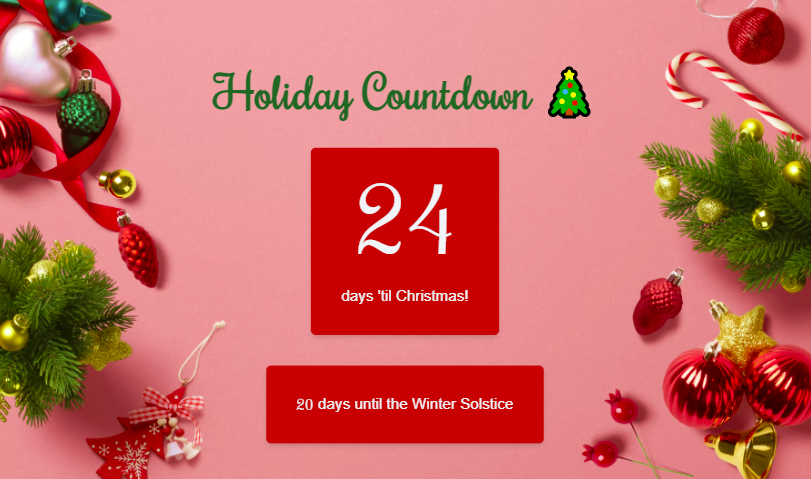

In addition to completing and creating extraordinary JavaScriptmas challenges, Debbie is documenting her [100 days of code](https://www.100daysofcode.com/).

---

Fellow Scrimba classmate **Illa Gold** (@Goldilla_Codes) followed the stretch goals of the "**Play a Christmas Song**" challenge by creating a radio with volume control!

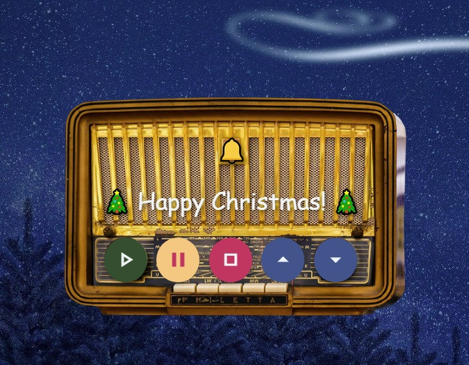

**Link to Illa Gold's radio:** [scrimba.com/scrim](https://scrimba.com/scrim/co850463a8cb904483e593a0a)

---

Using the stretch goals, **Muhammad Tahir** (@tahir_k) created a fantastic project with challenge 9.

Muhammad created a drop-down menu to choose which decorations to add and an "add button" that allows the user to select between adding the decoration to the left or the right of the initial home decoration. Well done!

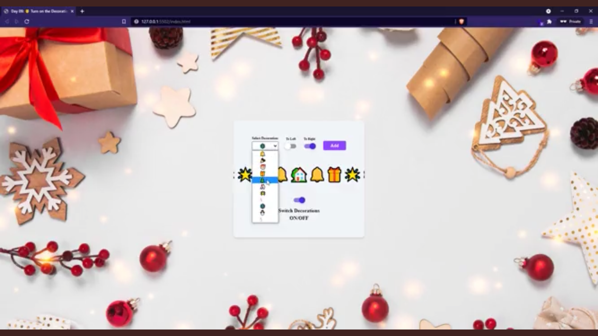

**Link to Muhammad Tahir scrim:** [scrimba.com/scrim](https://scrimba.com/scrim/co3204a449c041961eea448e4)

---

**Nour** (@nnourhamdyy) created an attractive guest list, which includes the ability to remove individual guests by clicking on the "x" next to their name.

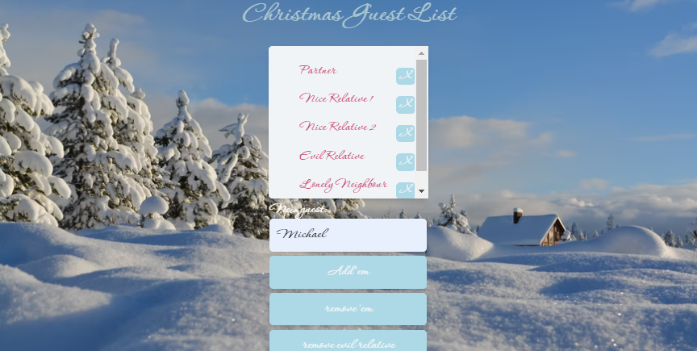

**Link to Nour's scrim:** [scrimba.com/scrim](https://scrimba.com/scrim/co9894c6992b6bcede5ddec6b)

---

**Joshua Cooper** (@jocoscript) created a theme changer that includes animated backgrounds! You can watch the snowfall, or you can watch the fireplace roar.

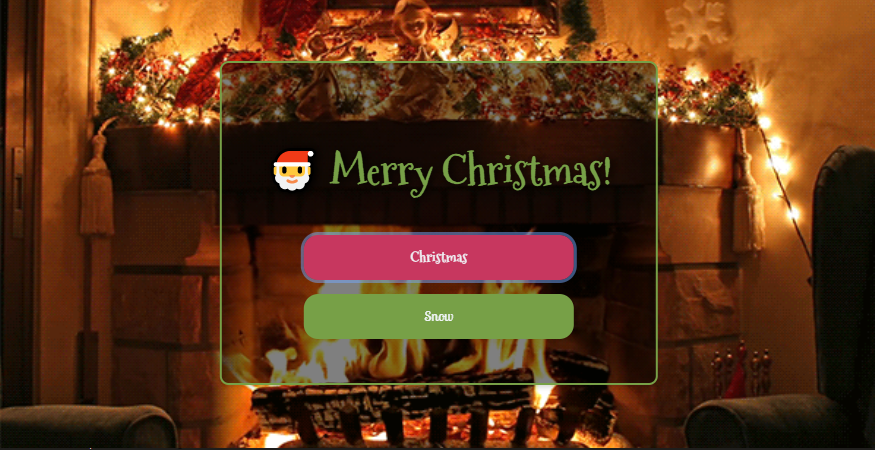

**Link to Joshua's scrim:** [scrimba.com/scrim](https://scrimba.com/scrim/co9354b8b8195037d0e2995ed)

---

*Be sure to check out the daily featured code submissions on Scrimba's [Weekly Web Dev Challenge website](https://weeklywebdevchallenge.scrimba.com/javascriptmas/javascriptmas.html)!*

---

Thank you, [Leanne](https://www.youtube.com/c/CodewithLeanne), for featuring my day seven solution!

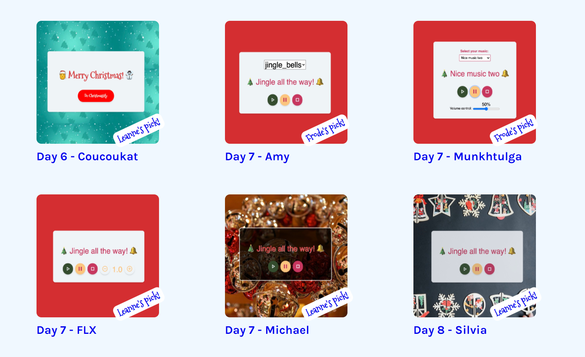

---

### Below are my coding solutions to the JavaScriptmas challenges 5 through 11!

---

### Challenge 5

#### Christmas Card Writer

**Task:** *Write a function to display a random greeting in the card.*

Okay, I tripped on this challenge right out of the starting gate. You may also receive this error, and I will explain why.

As I usually do, I started with a console log to see what I was dealing with; This time, the console log was for the greetings array.

```javascript
console.log(greetings);
```

**I immediately received this error message:**

```
Reference Error: writeGreeting is not defined (index.js:4)
```

**The error happened because Scrimba provided already written code for us to start with, including a call to a function that does not exist yet.**

---

*Debugging is an essential skill for a developer. Utilizing tools, including reading error logs, will help you resolve errors in the code.*  

---

Reading the "**Reference Error**," we know the error is in the **index.js on line 4**. The error message also informs us that "**writeGreeting**" is not defined.

Examining the prewritten code that Scrimba provided us, we can see that an event listener was created targeting a button. When the button is clicked, the function "**writeCreeting**" is called.

```javascript
btn.addEventListener("click", writeGreeting)
```

To resolve the error and move on with the challenge, I created a function called "**writeCreeting**" to write my code.

```javascript
function writeGreeting() {
    
}
```

---

**Now it's time to write the function.**

We need to create a random number generator that equals the length of the "**greetings**" array. With this method, we have the flexibility to add and take away messages from the array.

```javascript
const randomGreetingNumber = Math.floor(Math.random() * greetings.length);
```

---

*If you are new to creating random numbers in JavsScript, I recommend reading the information on [www.w3schools.com](https://www.w3schools.com/jsref/jsref_random.asp) on the topic.*

---

**Now that we have a random number in the range of the greetings array, we need to create a variable that sets a random greeting to a string.**

```javascript
const randomGreeting = greetings[randomGreetingNumber];
```

Finally, we need to display the random greeting string in the HTML paragraph with the id "**greetingDisplay**." 

```javascript
greetingDisplay.innerText = randomGreeting; 
```

---

**To style the page, I added:**

* Text shadow
* Box shadow
* Transparent background
* Background image (from pixabay.com)

---

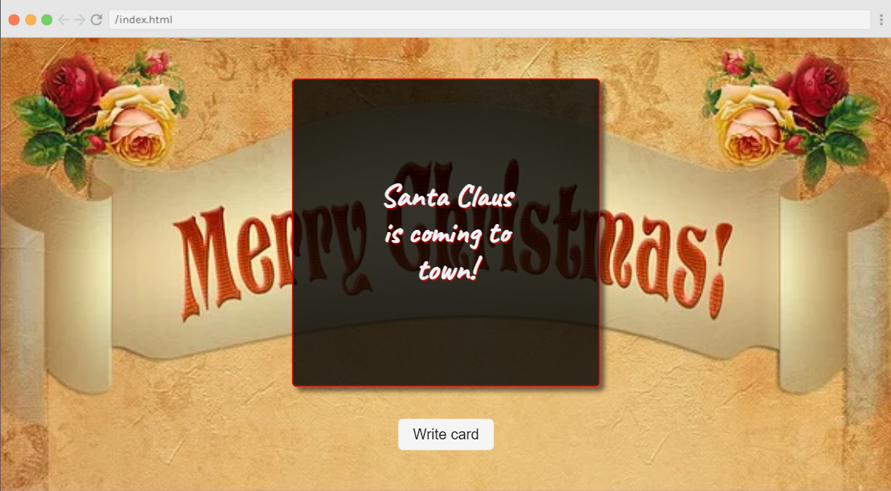

---

### Final code

#### Challenge 5

**Link to the solution:** [scrimba.com/scrim](https://scrimba.com/scrim/co7204e0b987eed3efa96a0ba)

```JavaScript
const greetingDisplay = document.getElementById("greeting-display")
const btn = document.getElementById("btn")

btn.addEventListener("click", writeGreeting)

const greetings = [
    "Santa Claus is coming to town!",
    "We wish you a Merry Christmas!",
    "Happy holidays!",
    "Ho, ho, ho! Merry Christmas!",
    "Jingle all the way!",
]

function writeGreeting() {
    const randomGreetingNumber = Math.floor(Math.random() * greetings.length);
    const randomGreeting = greetings[randomGreetingNumber];
    
    greetingDisplay.innerText = randomGreeting;  
}
```

---

### Challenge 6

#### Text Christmassifier

**Tasks:** 

1. *Add christmassify class to greeting.*
2. *Check whether christmassifierBtn has christmassify on it. If so, change text to "De-christmassify", if not, change text to "Christmassify"*

---

I worked with the JavaScript [classList property]([classList property](https://www.w3schools.com/jsref/prop_element_classlist.asp) ) to solve this challenge.

**classList property:**

* add
* remove
* contains

---

To "**Christmassify**" the greeting, I add and remove the "**christmassified**" class to the body of the HTML document with an **if/else** statement when the toggle button is clicked.

I include updating the text of the toggle button as well as changing the background color of the greeting.

```javascript
  if(!document.body.classList.contains("christmassified")){
    document.body.classList.add("christmassified");
    christmassifierBtn.innerText = "De-Christmassify";
    document.body.style.backgroundColor = "DarkRed";
  } else {
    document.body.classList.remove("christmassified");
    christmassifierBtn.innerText = "Christmassify";
    document.body.style.backgroundColor = "DarkGreen";
  }
```

---

**To style the page, I added:**

* Background color
* Text shadow

---

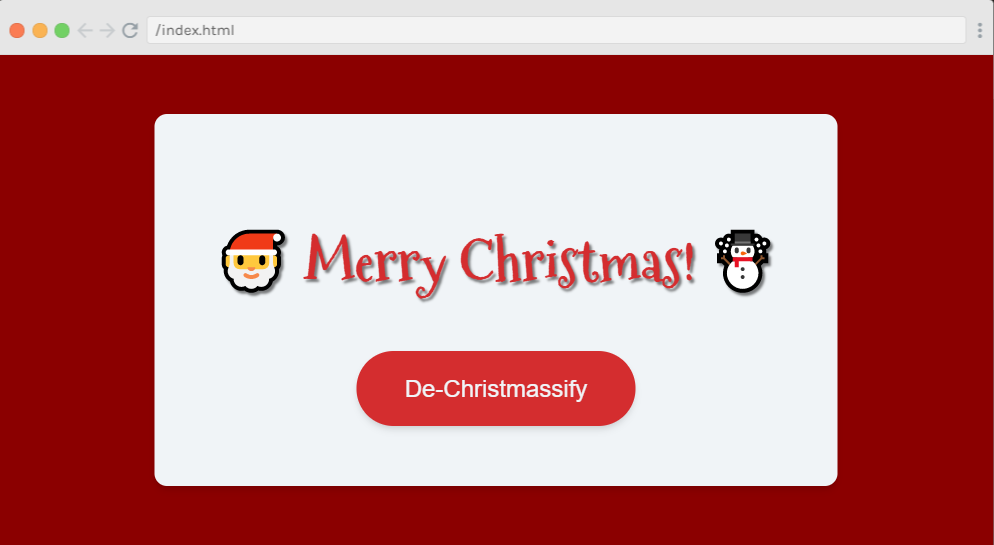

---

### Final code

#### Challenge 6

**Link to the solution:** [scrimba.com/scrim](https://scrimba.com/scrim/coa87417580e41f42970058b5)

```javascript
const christmassifierBtn = document.getElementById("christmassifierBtn")
christmassifierBtn.addEventListener("click", christmassifyName)

function christmassifyName() {
  
  if(!document.body.classList.contains("christmassified")){
    document.body.classList.add("christmassified");
    christmassifierBtn.innerText = "De-Christmassify";
    document.body.style.backgroundColor = "DarkRed";
  } else {
    document.body.classList.remove("christmassified");
    christmassifierBtn.innerText = "Christmassify";
    document.body.style.backgroundColor = "DarkGreen";
  }

}
```

---

### Challenge 7

#### Play a Christmas Song

**Task:** *Add the functionality to play, pause and stop the jingling bells (bells.mp3).*

---

To solve this challenge, I created an Audio element.

```javascript
const musicJingleBells = new Audio('bells.mp3');
```

[Definition from Mozilla:](https://developer.mozilla.org/en-US/docs/Web/API/HTMLAudioElement/Audio)

*"The Audio() constructor creates and returns a new HTMLAudioElement which can be either attached to a document for the user to interact with and/or listen to, or can be used offscreen to manage and play audio."*

---

**I used the following Audio Object Methods:**

* play()
* pause()

I wrote an event listener on the play button to start the music. When a user clicks the play button, the **playMusic** function I wrote executes.

```javascript
playBtn.addEventListener("click", playMusic);
```

The **playMusic** function calls the **play method** on the mp3.

```
function playMusic(){
    musicJingleBells.play();
}
```

I wrote a similar function for the pause button using the **pause method**.

```javascript
function pauseMusic(){
    musicJingleBells.pause();
}
```

However, there is no stop method for the HTML Audio Element. So I used the **pause method** again for the stop button.

I thought to myself, "So, what is the difference between the pause and the stop button?"

Researching online, I came across the **Audio currentTime Property**. Then I understood what I needed to do.

The music file provided is actually a sleigh bells sound, not the Jingle Bells song. But if the mp3 was the Jingle Bells song like I initially thought, using the **pause method** would pause the song and then resume the song at the timestamp the user paused it. So, to properly code the stop button, in addition to using the **pause method**, we also have to reset the song to the beginning using the **currentTime property**.

```javascript
function stopMusic(){
    musicJingleBells.pause();
    musicJingleBells.currentTime = 0;
}
```

---

**To style the page, I added:**

* Text shadow
* Transparent background
* Background image (from pixabay.com)

---

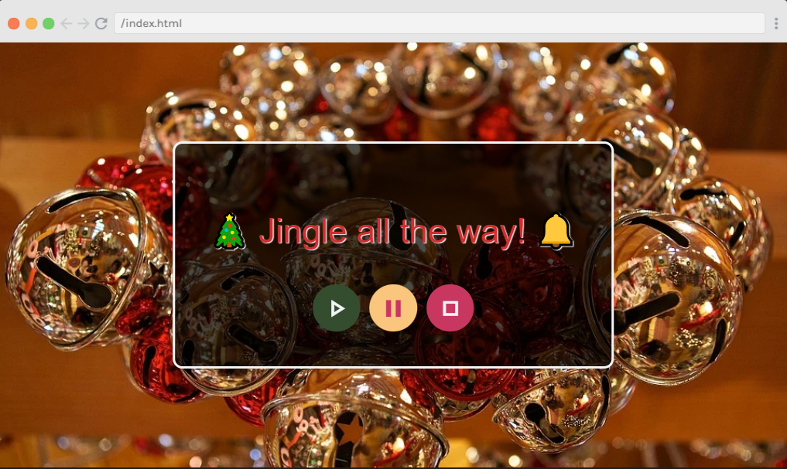

---

### Final code

#### Challenge 7

**Link to the solution:** [scrimba.com/scrim](https://scrimba.com/scrim/co5c24787b75a079234177e6d)

```javascript
const playBtn = document.getElementById("play-btn")
const pauseBtn = document.getElementById("pause-btn")
const stopBtn = document.getElementById("stop-btn")

const musicJingleBells = new Audio('bells.mp3');

playBtn.addEventListener("click", playMusic);
pauseBtn.addEventListener("click", pauseMusic);
stopBtn.addEventListener("click", stopMusic);

function playMusic(){
    musicJingleBells.play();
}

function pauseMusic(){
    musicJingleBells.pause();
}

function stopMusic(){
    musicJingleBells.pause();
    musicJingleBells.currentTime = 0;
}
```

---

### Challenge 8

#### Bell Animator

**Task:** *Animate the bell so that it looks like it is ringing when the music is playing, and stops when the music is paused or stopped.* 

---

For the JavaScript code, I adjusted the [animation play state](https://www.w3schools.com/cssref/css3_pr_animation-play-state.asp) accordingly.

Creating the bell movement I wanted was more challenging to develop than I thought.

After much trial and error, I came up with an 11 step keyframes animation close enough to the effect I wanted to achieve. I wanted the bell to swing all of the ways to the right and the left. However, right before the keyframe restarts, the end of the effect is still a little "jerky." 

```css
@keyframes ring {
  /* animation here */
  
  0%{
      transform: rotate(-45deg);
  }
  10% {
      transform: rotate(0deg);
  } 
  20%{
      transform: rotate(45deg);
  }
  30%{
      transform: rotate(0deg);
  }
  40%{
      transform: rotate(-45deg);
  }
  50% {
      transform: rotate(0deg);
  } 
  60%{
      transform: rotate(45deg);
  }
  70%{
      transform: rotate(0deg);
  }
  
  80%{
      transform: rotate(-45deg);
  }
  90% {
      transform: rotate(0deg);
  } 
  100%{
      transform: rotate(45deg);
  } 
  
}
```

---

**To style the page, I added:**

* Text shadow
* Transparent background
* Background image (from pixabay.com)

---

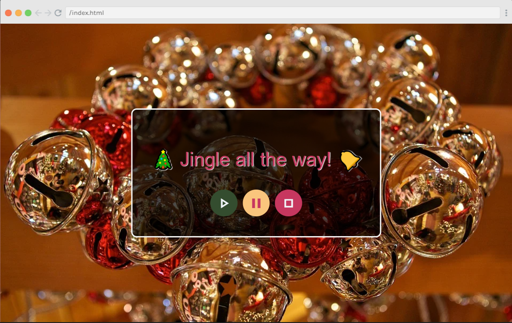

---

### Final code

#### Challenge 8

**Link to the solution:** [scrimba.com/scrim](https://scrimba.com/scrim/co2634920a12d1a428048aa66)

```javascript
const playBtn = document.getElementById("play-btn")
const pauseBtn = document.getElementById("pause-btn")
const stopBtn = document.getElementById("stop-btn")
const audio = new Audio('bells.mp3');
const bell = document.getElementById("bell");
playBtn.addEventListener("click", play)
pauseBtn.addEventListener("click", pause)
stopBtn.addEventListener("click", stop)

function play() {
    audio.play();
    bell.style.animationPlayState = "running";
}
 
 function pause() {
    audio.pause()
    bell.style.animationPlayState = "paused";
}

function stop() {
    audio.pause();
    audio.currentTime = 0;
    bell.style.animationPlayState = "paused";
}
```

---

### Challenge 9

#### Turn on the Decorations 

**Task:** *Write a function to add decorations (e.g. ☃️, 🎄, etc) next to the house when the switch is toggled.* 

---

To solve this challenge, I used the [CSS pseudo-elements](https://www.w3schools.com/css/css_pseudo_elements.asp) before and after.

Since all of the code for the toggle switch was prewritten, all I had to do was toggle the decorations class I created.

```javascript
house.classList.toggle("decorations");
```

---

**To style the page, I added:**

* Transparent gradient background
* Background image (from pixabay.com)
* 10px dotted white border

---

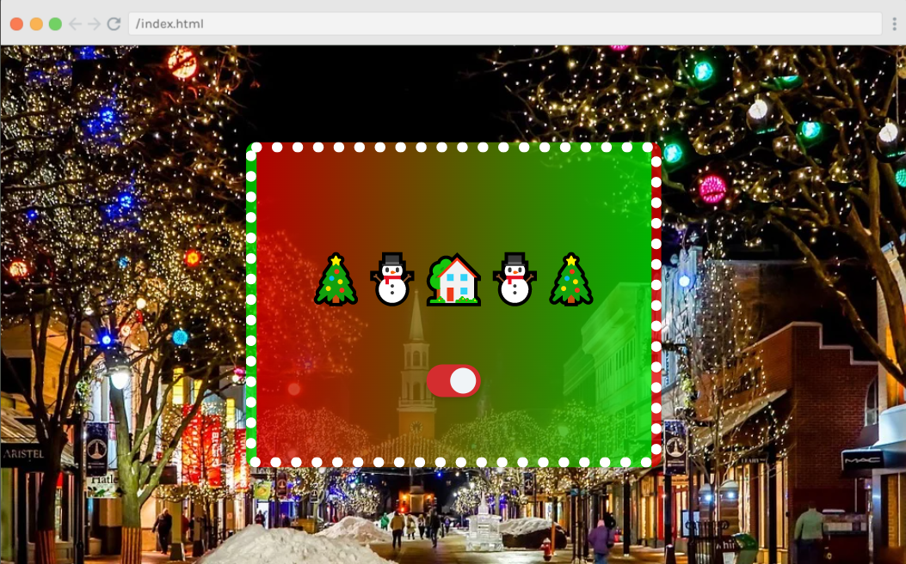

---

### Final code

#### Challenge 9

**Link to the solution:** [scrimba.com/scrim](https://scrimba.com/scrim/coea94082b722874a3fed1b40)

```javascript
function deckTheHalls() {
  house.classList.toggle("decorations");
}
```

```css
.decorations::before {
    content: "🎄⛄"
}

.decorations::after {
    content: "⛄🎄"
}
/* Added to the container */
.container {
    border: 10px dotted white;
    background: rgba(0,0,0,0.3);
    background-image: linear-gradient(to right, rgba(255,0,0,.7) , rgba(0,255,0,.7));
}
```

---


### Challenge 10

#### Festivity Loader

**Task:** *Write a function to wire up the festivity loader to reflect how many days are remaining until Christmas!*

---

This challenge revolves around the [HTML `<meter>` Tag](https://www.w3schools.com/tags/tag_meter.asp).

Solving the challenge requires us to update the "**value**" of the meter according to the current day of the month.

As in the very first JavaScript challenge this year, we will once again work with the [JavaScript Date Object](https://www.w3schools.com/js/js_dates.asp).

To solve the challenge, I wrote a function that sets the current day to a variable named "**day**" and then updated the meter value to the value of the "**day**" variable.

```javascript
function meterFestive() {
    const date = new Date();
    const day = date.getDate();
    meter.value = day;
}
```

**Now for the fun part, designing the HTML meter!**

I have already decided to create a "**candy cane**" style meter. However, I was having difficulty changing the color of the meter itself.

I went to a very resourceful website, css-tricks.com, and searched for [The HTML5 meter Element](https://css-tricks.com/html5-meter-element/).

To my pleasant surprise, I found code that already had the stripe effect I was looking for. 

The written code used a linear gradient to create the stripe effect on the background image, and thankfully, they used my favorite approach of using the [RGBA Value](https://www.w3schools.com/css/css_colors_rgb.asp).

**Their code created a gray striped background as follows:**

```css
rgba(0, 0, 0, 0.1) 33%, 
rgba(0, 0, 0, 0.1) 66%,
```

**So all I had to do to create the candy cane effect was set red to its highest value (255) on both lines of code.**

```css
rgba(255, 0, 0, 0.1) 33%, 
rgba(255, 0, 0, 0.1) 66%,
```

Although the stripes were on the background, not the meter itself, since the meter color was green, it did not clash with the background, and it still provided the user with a clear indication of the current percentage of the loading meter.

---

***( Code from css-tricks.com, adjusted by me to create the red stripes )***

```css
meter::-webkit-meter-bar { 
/* Let's animate this */ 
animation: animate-stripes 5s linear infinite; 
background-image: 
linear-gradient( 
135deg, 
transparent, 
transparent 33%, 
rgba(255, 0, 0, 0.1) 33%, 
rgba(255, 0, 0, 0.1) 66%, 
transparent 66% 
);
background-size: 50px 25px; 
} 

@keyframes animate-stripes { 
to { background-position: -50px 0; } 
}
```

---

**To style the page, I added:**

* Text shadow
* Transparent background
* Background image (from pixabay.com)

---

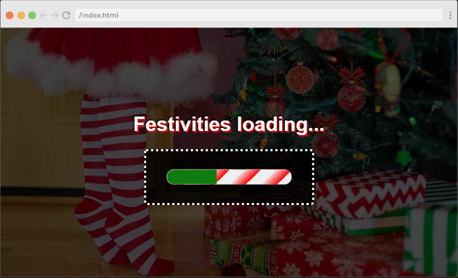

---

### Final code

#### Challenge 10

Link to the solution: [scrimba.com/scrim](https://scrimba.com/scrim/co6be476bbf1d964ffd055afb)

```javascript
function meterFestive() {
    const date = new Date();
    const day = date.getDate();
    meter.value = day;
}
meterFestive();
```

---

### Challenge 11

#### Christmas Carousel

**Task:**

1. Wire up the buttons to switch through the images in the imgs array.
2. Make sure that the gallery works no matter how many images are added.
3. Decide/implement what to do when you reach either end of the array - do nothing and disable buttons, loop back round to the other end, or something else?
4. Remember to also update the alt tags.

---

Two things in life make me extremely dizzy, riding on carousels and writing carousels in JavaScript.

I wrote the code to fulfill the four tasks required to pass the challenge with much trial and error.  

The code is regurgitating, fitting for a carousel, but it's my code, and it works.

---

**To style the page, I added:**

* Text shadow
* Background image (from pixabay.com)

---

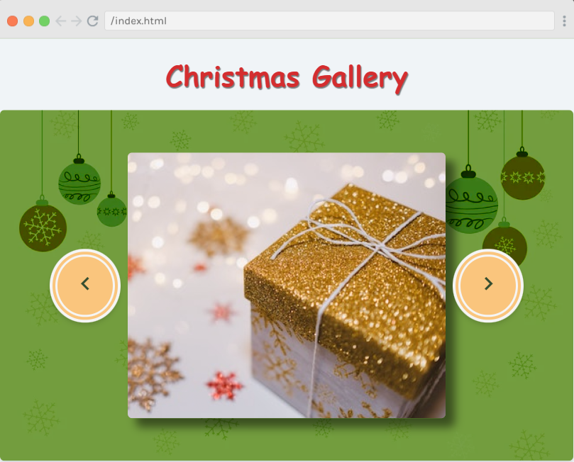

---

### Final code

#### Challenge 11

Link to the solution: [scrimba.com/scrim](https://scrimba.com/scrim/co2ae432c849fa2c68b22a2b0)

```javascript
let imgNum = 0
 
previous.classList.add("dis");
 
next.addEventListener("click", ()=> {

    if(imgNum >= 0 && imgNum <= imgs.length -2){
    // if(imgNum >= 0 && imgNum <= 4){
            // console.log(`imgNum: ${imgNum} ${imgs.length}`);
        imgNum++;
        img.src = imgs[imgNum].src;
        img.alt = imgs[imgNum].alt;
            console.log(`imgNum: ${imgNum}`);
            
        if(imgNum == 0) {
            previous.classList.add("dis");
            previous.disabled = true;        
        } else {
            previous.classList.remove("dis");
            previous.disabled = false;  
        } 
        if(imgNum == imgs.length -1) {
            next.classList.add("dis");
            next.disabled = true;        
        } else {
            next.classList.remove("dis");
            next.disabled = false;  
        }                    
    }
})

previous.addEventListener("click", ()=>{

    // if(imgNum > 0 & imgNum <=5){
    if(imgNum > 0 & imgNum <= imgs.length -1){    
            console.log(`imgNum: ${imgNum} ${imgs.length}`);
        imgNum--;
        img.src = imgs[imgNum].src;
        img.alt = imgs[imgNum].alt;
            console.log(`imgNum: ${imgNum} ${imgs.length}`);   
        if(imgNum == 0) {
        previous.classList.add("dis");
        previous.disabled = true;        
        } else {
        previous.classList.remove("dis");
        previous.disabled = false;  
        } 
        if(imgNum == imgs.length -1) {
            next.classList.add("dis");
            next.disabled = true;   
        } else {
            next.classList.remove("dis");
            next.disabled = false;  
        }                 
    }    
})
```

---

### JavaScriptmas Winners

A FREE full-year subscription to Scrimba!

* Day 6: Nacho Vasquez ( Discord )
* Day 7: [@Vanshsh2701](https://twitter.com/Vanshsh2701)
* Day 8: [@AmethystCodes](https://twitter.com/AmethystCodes)
* Day 9: Eldocbrown ( Discord )
* Day 10: [@Mare_Duci](https://twitter.com/Mare_Duci)

---

**Be sure to check out my related articles!**

* [Review: Scrimba's Weekly Web Dev Challenge](https://selftaughttxg.com/2021/01-21/ReviewScrimbaWebDevChallenge/)
* [Scrimba: JavaScriptmas 2020](https://selftaughttxg.com/2020/12-20/Scrimba-JavaScriptmas_2020/)
* [The Post-JavaScriptmas 2020 Post](https://selftaughttxg.com/2020/12-20/The_Post-JavaScriptmas_2020_Post/)

---

#### **Scrimba has once again impressed and inspired me! You can read my full [Scrimba review](https://selftaughttxg.com/2020/12-20/Review-Scrimba/) on my 12/13/2020 post.**


#### *"That&#39;s one of the best Scrimba reviews I&#39;ve ever read, <a href="https://twitter.com/MikeJudeLarocca?ref_src=twsrc%5Etfw">@MikeJudeLarocca</a>. Thank you! 🙏 "*
###### &mdash; Per Harald Borgen, CEO of Scrimba <a href="https://twitter.com/perborgen/status/1338462544143540227?ref_src=twsrc%5Etfw">December 14, 2020</a></blockquote>

---

### Advance your career with a 20% discount on Scrimba Pro using this [affiliate link](https://scrimba.com/?via=MichaelLarocca)!

Become a hireable developer with Scrimba Pro! Discover a world of coding knowledge with full access to all courses, hands-on projects, and a vibrant community. You can [read my article](https://selftaughttxg.com/2021/06-21/06-07-21/) to learn more about my exceptional experiences with Scrimba and how it helps many become confident, well-prepared web developers!

###### ***Important:*** *This discount is for new accounts only. If a higher discount is currently available, it will be applied automatically.*

**How to Claim Your Discount:**
1. Click [the link](https://scrimba.com/?via=MichaelLarocca) to explore the new Scrimba 2.0.
2. Create a new account.
3. Upgrade to Pro; the 20% discount will automatically apply.

##### ***Disclosure:*** *This article contains affiliate links. I will earn a commission from any purchases made through these links at no extra cost to you. Your support helps me continue creating valuable content. Thank you!*

---

### Conclusion

Scrimba's JavaScriptmas annual FREE event is a wonderful way to commit to coding daily and is a fun and festive event where all participants have an equal opportunity to win prizes, regardless of their skill level.

During the JavaScriptmas event, Scrimba offers new students a 20% discount code through a link provided at the end of each day's coding challenge.

By completing all 24 coding challenges, you will be awarded a certificate and an exclusive Discord badge, and since each submission acts as a raffle ticket, you will have 24 chances to win prizes!

---

###### *Are you now interested in participating in this year's Scrimba's JavaScriptmas? Have you already participated in last year's Scrimba's JavaScriptmas? Please share the article and comment!* 

---
