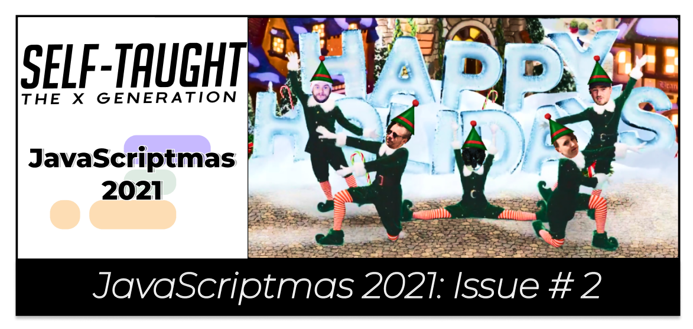

---



---


--- 

### Below are my coding solutions to the JavaScriptmas challenges 5 through 11!

---

### Challenge 5

#### Christmas Card Writer

**Task:** *Write a function to display a random greeting in the card.*

Okay, I tripped on this challenge right out of the starting gate. You may also receive this error, and I will explain why.

As I usually do, I started with a console log to see what I was dealing with; This time, the console log was for the greetings array.

```javascript
console.log(greetings);
```

**I immediately received this error message:**

```
Reference Error: writeGreeting is not defined (index.js:4)
```

**The error happened because Scrimba provided already written code for us to start with, including a call to a function that does not exist yet.**

---

*Debugging is an essential skill for a developer. Utilizing tools, including reading error logs, will help you resolve errors in the code.*  

---

Reading the "**Reference Error**," we know the error is in the **index.js on line 4**. The error message also informs us that "**writeGreeting**" is not defined.

Examining the prewritten code that Scrimba provided us, we can see that an event listener was created targeting a button. When the button is clicked, the function "**writeCreeting**" is called.

```javascript
btn.addEventListener("click", writeGreeting)
```

To resolve the error and move on with the challenge, I created a function called "**writeCreeting**" to write my code.

```javascript
function writeGreeting() {
    
}
```

---

**Now it's time to write the function.**

We need to create a random number generator that equals the length of the "**greetings**" array. With this method, we have the flexibility to add and take away messages from the array.

```javascript
const randomGreetingNumber = Math.floor(Math.random() * greetings.length);
```

---

*If you are new to creating random numbers in JavsScript, I recommend reading the information on [www.w3schools.com](https://www.w3schools.com/jsref/jsref_random.asp) on the topic.*

---

**Now that we have a random number in the range of the greetings array, we need to create a variable that sets a random greeting to a string.**

```javascript
const randomGreeting = greetings[randomGreetingNumber];
```

Finally, we need to display the random greeting string in the HTML paragraph with the id "**greetingDisplay**." 

```javascript
greetingDisplay.innerText = randomGreeting; 
```

---

**To style the page, I added:**

* Text shadow
* Box shadow
* Transparent background
* Background image (from pixabay.com)

---


---

### Final code

#### Challenge 5

**Link to the solution:** [scrimba.com/scrim](https://scrimba.com/scrim/co7204e0b987eed3efa96a0ba)

```JavaScript
const greetingDisplay = document.getElementById("greeting-display")
const btn = document.getElementById("btn")

btn.addEventListener("click", writeGreeting)

const greetings = [
    "Santa Claus is coming to town!",
    "We wish you a Merry Christmas!",
    "Happy holidays!",
    "Ho, ho, ho! Merry Christmas!",
    "Jingle all the way!",
]

function writeGreeting() {
    const randomGreetingNumber = Math.floor(Math.random() * greetings.length);
    const randomGreeting = greetings[randomGreetingNumber];
    
    greetingDisplay.innerText = randomGreeting;  
}
```

---

### Challenge 6

#### Text Christmassifier

**Tasks:** 

1. *Add christmassify class to greeting.*
2. *Check whether christmassifierBtn has christmassify on it. If so, change text to "De-christmassify", if not, change text to "Christmassify"*

---

I worked with the JavaScript [classList property]([classList property](https://www.w3schools.com/jsref/prop_element_classlist.asp) ) to solve this challenge.

**classList property:**

* add
* remove
* contains

---

To "**Christmassify**" the greeting, I add and remove the "**christmassified**" class to the body of the HTML document with an **if/else** statement when the toggle button is clicked.

I include updating the text of the toggle button as well as changing the background color of the greeting.

```javascript
  if(!document.body.classList.contains("christmassified")){
    document.body.classList.add("christmassified");
    christmassifierBtn.innerText = "De-Christmassify";
    document.body.style.backgroundColor = "DarkRed";
  } else {
    document.body.classList.remove("christmassified");
    christmassifierBtn.innerText = "Christmassify";
    document.body.style.backgroundColor = "DarkGreen";
  }
```

---

**To style the page, I added:**

* Background color
* Text shadow

---


---

### Final code

#### Challenge 6

**Link to the solution:** [scrimba.com/scrim](https://scrimba.com/scrim/coa87417580e41f42970058b5)

```javascript
const christmassifierBtn = document.getElementById("christmassifierBtn")
christmassifierBtn.addEventListener("click", christmassifyName)

function christmassifyName() {
  
  if(!document.body.classList.contains("christmassified")){
    document.body.classList.add("christmassified");
    christmassifierBtn.innerText = "De-Christmassify";
    document.body.style.backgroundColor = "DarkRed";
  } else {
    document.body.classList.remove("christmassified");
    christmassifierBtn.innerText = "Christmassify";
    document.body.style.backgroundColor = "DarkGreen";
  }

}
```

---

### Challenge 7

#### Play a Christmas Song

**Task:** *Add the functionality to play, pause and stop the jingling bells (bells.mp3).*

---

To solve this challenge, I created an Audio element.

```javascript
const musicJingleBells = new Audio('bells.mp3');
```

[Definition from Mozilla:](https://developer.mozilla.org/en-US/docs/Web/API/HTMLAudioElement/Audio)

*"The Audio() constructor creates and returns a new HTMLAudioElement which can be either attached to a document for the user to interact with and/or listen to, or can be used offscreen to manage and play audio."*

---

**I used the following Audio Object Methods:**

* play()
* pause()

I wrote an event listener on the play button to start the music. When a user clicks the play button, the **playMusic** function I wrote executes.

```javascript
playBtn.addEventListener("click", playMusic);
```

The **playMusic** function calls the **play method** on the mp3.

```
function playMusic(){
    musicJingleBells.play();
}
```

I wrote a similar function for the pause button using the **pause method**.

```javascript
function pauseMusic(){
    musicJingleBells.pause();
}
```

However, there is no stop method for the HTML Audio Element. So I used the **pause method** again for the stop button.

I thought to myself, "So, what is the difference between the pause and the stop button?"

Researching online, I came across the **Audio currentTime Property**. Then I understood what I needed to do.

The music file provided is actually a sleigh bells sound, not the Jingle Bells song. But if the mp3 was the Jingle Bells song like I initially thought, using the **pause method** would pause the song and then resume the song at the timestamp the user paused it. So, to properly code the stop button, in addition to using the **pause method**, we also have to reset the song to the beginning using the **currentTime property**.

```javascript
function stopMusic(){
    musicJingleBells.pause();
    musicJingleBells.currentTime = 0;
}
```

---

**To style the page, I added:**

* Text shadow
* Transparent background
* Background image (from pixabay.com)

---


---

### Final code

#### Challenge 7

**Link to the solution:** [scrimba.com/scrim](https://scrimba.com/scrim/co5c24787b75a079234177e6d)

```javascript
const playBtn = document.getElementById("play-btn")
const pauseBtn = document.getElementById("pause-btn")
const stopBtn = document.getElementById("stop-btn")

const musicJingleBells = new Audio('bells.mp3');

playBtn.addEventListener("click", playMusic);
pauseBtn.addEventListener("click", pauseMusic);
stopBtn.addEventListener("click", stopMusic);

function playMusic(){
    musicJingleBells.play();
}

function pauseMusic(){
    musicJingleBells.pause();
}

function stopMusic(){
    musicJingleBells.pause();
    musicJingleBells.currentTime = 0;
}
```

---

### Challenge 8

#### Bell Animator

**Task:** *Animate the bell so that it looks like it is ringing when the music is playing, and stops when the music is paused or stopped.* 

---

For the JavaScript code, I adjusted the [animation play state](https://www.w3schools.com/cssref/css3_pr_animation-play-state.asp) accordingly.

Creating the bell movement I wanted was more challenging to develop than I thought.

After much trial and error, I came up with an 11 step keyframes animation close enough to the effect I wanted to achieve. I wanted the bell to swing all of the ways to the right and the left. However, right before the keyframe restarts, the end of the effect is still a little "jerky." 

```css
@keyframes ring {
  /* animation here */
  
  0%{
      transform: rotate(-45deg);
  }
  10% {
      transform: rotate(0deg);
  } 
  20%{
      transform: rotate(45deg);
  }
  30%{
      transform: rotate(0deg);
  }
  40%{
      transform: rotate(-45deg);
  }
  50% {
      transform: rotate(0deg);
  } 
  60%{
      transform: rotate(45deg);
  }
  70%{
      transform: rotate(0deg);
  }
  
  80%{
      transform: rotate(-45deg);
  }
  90% {
      transform: rotate(0deg);
  } 
  100%{
      transform: rotate(45deg);
  } 
  
}
```

---

**To style the page, I added:**

* Text shadow
* Transparent background
* Background image (from pixabay.com)

---


---

### Final code

#### Challenge 8

**Link to the solution:** [scrimba.com/scrim](https://scrimba.com/scrim/co2634920a12d1a428048aa66)

```javascript
const playBtn = document.getElementById("play-btn")
const pauseBtn = document.getElementById("pause-btn")
const stopBtn = document.getElementById("stop-btn")
const audio = new Audio('bells.mp3');
const bell = document.getElementById("bell");
playBtn.addEventListener("click", play)
pauseBtn.addEventListener("click", pause)
stopBtn.addEventListener("click", stop)

function play() {
    audio.play();
    bell.style.animationPlayState = "running";
}
 
 function pause() {
    audio.pause()
    bell.style.animationPlayState = "paused";
}

function stop() {
    audio.pause();
    audio.currentTime = 0;
    bell.style.animationPlayState = "paused";
}
```

---

### Challenge 9

#### Turn on the Decorations 

**Task:** *Write a function to add decorations (e.g. ☃️, 🎄, etc) next to the house when the switch is toggled.* 

---

To solve this challenge, I used the [CSS pseudo-elements](https://www.w3schools.com/css/css_pseudo_elements.asp) before and after.

Since all of the code for the toggle switch was prewritten, all I had to do was toggle the decorations class I created.

```javascript
house.classList.toggle("decorations");
```

---

**To style the page, I added:**

* Transparent gradient background
* Background image (from pixabay.com)
* 10px dotted white border

---


---

### Final code

#### Challenge 9

**Link to the solution:** [scrimba.com/scrim](https://scrimba.com/scrim/coea94082b722874a3fed1b40)

```javascript
function deckTheHalls() {
  house.classList.toggle("decorations");
}
```

```css
.decorations::before {
    content: "🎄⛄"
}

.decorations::after {
    content: "⛄🎄"
}
/* Added to the container */
.container {
    border: 10px dotted white;
    background: rgba(0,0,0,0.3);
    background-image: linear-gradient(to right, rgba(255,0,0,.7) , rgba(0,255,0,.7));
}
```

---
